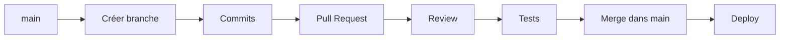
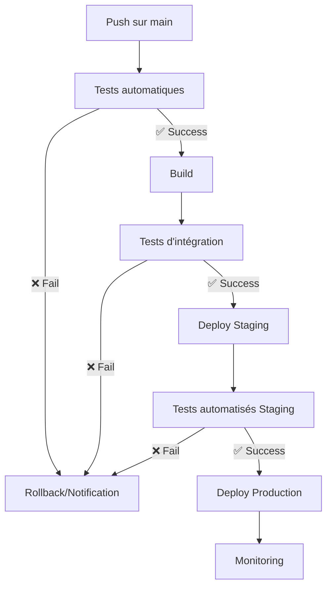
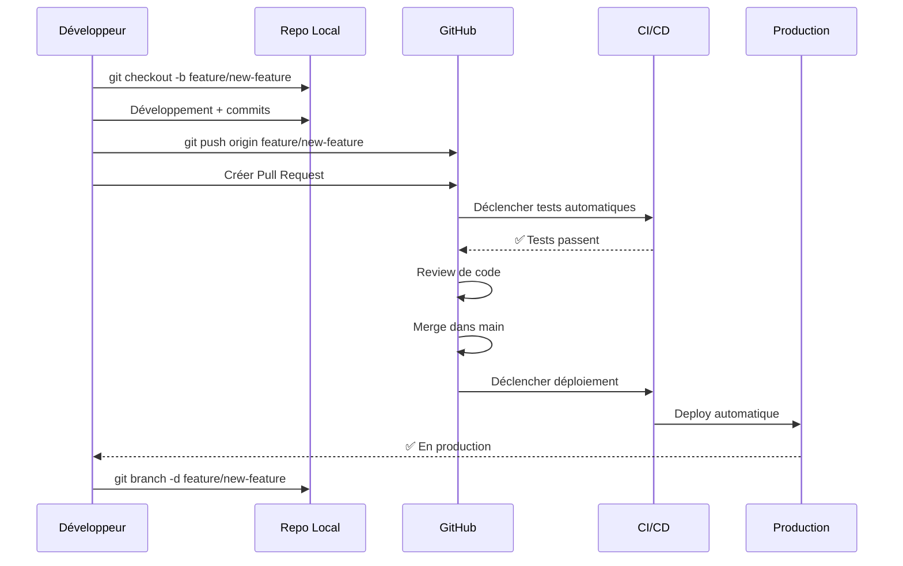

## 📑 Table des matières

```table-of-contents
title: 
style: nestedList # TOC style (nestedList|nestedOrderedList|inlineFirstLevel)
minLevel: 2 # Include headings from the specified level
maxLevel: 2 # Include headings up to the specified level
include: 
exclude: 
includeLinks: true # Make headings clickable
hideWhenEmpty: false # Hide TOC if no headings are found
debugInConsole: false # Print debug info in Obsidian console
```

---

## 🎯 Vue d'ensemble du GitHub Flow

> [!info] Qu'est-ce que le GitHub Flow ? Le GitHub Flow est un workflow Git léger et basé sur les branches, conçu par GitHub pour favoriser le déploiement continu et la collaboration. Contrairement à Git Flow qui utilise plusieurs branches permanentes, GitHub Flow repose sur une seule branche principale (`main`) et des branches de fonctionnalités éphémères.

**Pourquoi utiliser GitHub Flow ?**

- ✅ **Simplicité** : Un seul workflow à retenir
- ✅ **Déploiement rapide** : De la fonctionnalité à la production en quelques heures
- ✅ **Collaboration** : Pull requests au cœur du processus
- ✅ **Qualité** : Revue de code systématique avant merge

**Quand l'utiliser ?**

- Projets avec déploiement continu
- Applications web et SaaS
- Équipes pratiquant l'intégration continue
- Projets nécessitant des releases fréquentes

> [!warning] Limitation GitHub Flow n'est pas adapté aux projets nécessitant le maintien de plusieurs versions en production simultanément (logiciels desktop, bibliothèques avec versioning).

---

## ⚙️ Principe de fonctionnement

Le GitHub Flow repose sur **6 étapes simples** :



### Les règles fondamentales

|Règle|Description|
|---|---|
|🔒 **main est toujours déployable**|Chaque commit sur `main` doit être prêt pour la production|
|🌿 **Branches descriptives**|Nommage clair indiquant la fonctionnalité développée|
|💬 **Pull Request obligatoire**|Aucun commit direct sur `main`|
|👥 **Review systématique**|Au moins une revue avant merge|
|🚀 **Deploy après merge**|Déploiement automatique ou immédiat|
|🧪 **Tests automatisés**|CI/CD exécute les tests sur chaque PR|

### Cycle de vie complet

> [!example] Exemple de workflow complet
> 
> 1. Un développeur identifie une tâche (feature, bugfix)
> 2. Il crée une branche depuis `main`
> 3. Il développe et commit régulièrement
> 4. Il ouvre une Pull Request
> 5. L'équipe review le code
> 6. Les tests automatisés passent
> 7. La branche est mergée dans `main`
> 8. Le code est automatiquement déployé en production
> 9. La branche de feature est supprimée

---

## 🌿 Création de feature branches

### Principe

Chaque nouvelle fonctionnalité, correction de bug ou amélioration doit être développée dans une **branche dédiée** créée depuis `main`.

### Étape 1 : Synchroniser avec main

Avant de créer une branche, assurez-vous d'avoir la dernière version de `main` :

```bash
# Se placer sur main
git checkout main

# Récupérer les dernières modifications
git pull origin main
```

> [!tip] Astuce Prenez l'habitude de **toujours** synchroniser `main` avant de créer une nouvelle branche pour éviter les conflits futurs.

### Étape 2 : Créer la branche

```bash
# Créer et basculer sur la nouvelle branche
git checkout -b feature/nom-de-la-fonctionnalite

# Alternative moderne (Git 2.23+)
git switch -c feature/nom-de-la-fonctionnalite
```

### Conventions de nommage

> [!info] Nomenclature recommandée Utilisez des préfixes pour catégoriser vos branches :

|Préfixe|Usage|Exemple|
|---|---|---|
|`feature/`|Nouvelle fonctionnalité|`feature/user-authentication`|
|`fix/` ou `bugfix/`|Correction de bug|`fix/login-error`|
|`hotfix/`|Correction urgente en production|`hotfix/critical-security-patch`|
|`refactor/`|Refactoring sans changement fonctionnel|`refactor/database-queries`|
|`docs/`|Documentation|`docs/api-endpoints`|
|`test/`|Ajout de tests|`test/user-service`|

```bash
# Exemples concrets
git checkout -b feature/add-payment-gateway
git checkout -b fix/broken-navbar-mobile
git checkout -b hotfix/database-connection-timeout
git checkout -b refactor/authentication-service
```

### Étape 3 : Développer et commiter

Travaillez sur votre branche avec des commits **réguliers et descriptifs** :

```bash
# Faire des modifications
# ...

# Stager les changements
git add .

# Commiter avec un message clair
git commit -m "feat: add user registration form"

# Continuer le développement
# ...

git add .
git commit -m "feat: add email validation"

git add .
git commit -m "fix: correct password strength check"
```

> [!tip] Commits atomiques Faites des commits **petits et focalisés** sur une seule modification logique. Cela facilite la revue de code et le rollback si nécessaire.

### Étape 4 : Pousser la branche

```bash
# Première push : créer la branche distante
git push -u origin feature/add-payment-gateway

# Pushs suivants (après nouveaux commits)
git push
```

> [!info] Option `-u` (upstream) L'option `-u` configure le suivi automatique entre votre branche locale et distante. Vous n'aurez plus besoin de spécifier `origin nom-branche` pour les futurs `git push` et `git pull`.

### Maintenir la branche à jour

Si `main` évolue pendant votre développement, mettez à jour votre branche :

```bash
# Récupérer les dernières modifications de main
git checkout main
git pull origin main

# Retourner sur votre branche
git checkout feature/add-payment-gateway

# Intégrer les modifications de main
git merge main

# Ou en utilisant rebase (pour un historique linéaire)
git rebase main
```

> [!warning] Merge vs Rebase
> 
> - **Merge** : Conserve l'historique complet, crée un commit de merge
> - **Rebase** : Réécrit l'historique pour le rendre linéaire (⚠️ ne jamais rebaser une branche partagée)

---

## 🔀 Pull Requests

Les Pull Requests (PR) sont le **cœur du GitHub Flow**. Elles permettent de proposer des modifications, discuter du code et assurer la qualité avant l'intégration.

### Qu'est-ce qu'une Pull Request ?

> [!info] Définition Une Pull Request est une demande d'intégration de vos modifications dans la branche `main`. Elle ouvre un espace de discussion, de revue de code et de validation automatisée.

**Avantages des PR :**

- 👁️ **Revue de code** : Détection précoce des bugs
- 💬 **Discussion** : Échange sur les approches techniques
- 🤖 **Automatisation** : Tests, linting, déploiements de prévisualisation
- 📚 **Documentation** : Historique des décisions et contexte
- 🎓 **Apprentissage** : Partage de connaissances dans l'équipe

### Créer une Pull Request

#### Sur GitHub (interface web)

1. Pushez votre branche sur le dépôt distant :

```bash
git push -u origin feature/add-payment-gateway
```

2. Allez sur GitHub, vous verrez un bouton **"Compare & pull request"**
    
3. Remplissez les informations :
    
    - **Titre** : Résumé clair de la modification
    - **Description** : Contexte, changements, tests effectués
    - **Reviewers** : Assignez des collègues pour la revue
    - **Labels** : Catégorisez (feature, bug, enhancement...)
    - **Milestone** : Associez à un sprint/release si applicable

#### Via la ligne de commande (GitHub CLI)

```bash
# Installer GitHub CLI si nécessaire
# https://cli.github.com/

# Créer une PR depuis la branche courante
gh pr create

# Ou avec des options directes
gh pr create --title "Add payment gateway" \
             --body "Implements Stripe integration for checkout" \
             --reviewer john,jane \
             --label feature
```

### Anatomie d'une bonne Pull Request

> [!example] Template de description PR

```markdown
## 📋 Description
Brève explication de ce que fait cette PR.

## 🎯 Motivation et contexte
Pourquoi cette modification est-elle nécessaire ? 
Quel problème résout-elle ?

Fixes #123 (lien vers l'issue)

## 🔧 Type de changement
- [ ] Nouvelle fonctionnalité
- [ ] Correction de bug
- [ ] Breaking change
- [ ] Documentation

## ✅ Checklist
- [ ] Mon code suit les conventions du projet
- [ ] J'ai commenté les parties complexes
- [ ] J'ai mis à jour la documentation
- [ ] Mes changements ne génèrent pas de warnings
- [ ] J'ai ajouté des tests couvrant mes modifications
- [ ] Tous les tests passent localement
- [ ] J'ai vérifié mes modifications sur mobile/desktop

## 📸 Screenshots (si applicable)
Avant / Après

## 🧪 Comment tester ?
1. Checkout cette branche
2. Installer les dépendances
3. Lancer `npm run dev`
4. Tester le workflow suivant...
```

### Processus de revue

#### Demander une revue

```bash
# Via GitHub CLI
gh pr review --request john,jane

# Via l'interface web
# Utilisez la section "Reviewers" dans la sidebar
```

#### Effectuer une revue

Les reviewers peuvent :

- ✅ **Approuver** : Le code est bon, prêt à merger
- 💬 **Commenter** : Suggestions ou questions sans bloquer
- 🚫 **Demander des changements** : Modifications nécessaires avant merge

```bash
# Récupérer la branche de la PR pour tester localement
gh pr checkout 123

# Ou manuellement
git fetch origin
git checkout feature/add-payment-gateway

# Tester l'application
npm install
npm run dev

# Revenir à main
git checkout main
```

### Répondre aux commentaires

```bash
# Faire les modifications demandées
# ...

# Commiter les changements
git add .
git commit -m "refactor: apply review suggestions"

# Pusher (met à jour automatiquement la PR)
git push
```

> [!tip] Commits de revue Vous pouvez faire des commits supplémentaires en réponse aux commentaires. Ils seront automatiquement ajoutés à la PR. Certaines équipes préfèrent squash ces commits avant le merge final.

### Types de merge

Quand la PR est approuvée et les tests passent, vous pouvez merger :

|Type|Commande|Résultat|Quand l'utiliser|
|---|---|---|---|
|**Merge commit**|`git merge --no-ff`|Conserve tous les commits + commit de merge|Historique complet souhaité|
|**Squash and merge**|`git merge --squash`|Un seul commit regroupant toutes les modifications|Nettoyer l'historique, PR avec beaucoup de petits commits|
|**Rebase and merge**|`git rebase` puis `git merge --ff-only`|Historique linéaire sans commit de merge|Historique propre et linéaire|

```bash
# Merger une PR via GitHub CLI
gh pr merge 123

# Avec options
gh pr merge 123 --squash --delete-branch

# Ou via Git (après avoir récupéré la branche)
git checkout main
git merge --no-ff feature/add-payment-gateway
git push origin main
```

> [!warning] Choix du type de merge Définissez une stratégie d'équipe cohérente. Le squash est populaire pour garder un historique `main` propre, mais vous perdez le détail des commits individuels.

### Supprimer la branche après merge

```bash
# Supprimer la branche locale
git branch -d feature/add-payment-gateway

# Supprimer la branche distante
git push origin --delete feature/add-payment-gateway

# Ou via GitHub CLI (option --delete-branch lors du merge)
gh pr merge 123 --squash --delete-branch
```

> [!tip] Nettoyage automatique GitHub peut être configuré pour supprimer automatiquement les branches après merge. Activez cette option dans les paramètres du dépôt.

### Draft Pull Requests

```bash
# Créer une PR en mode brouillon
gh pr create --draft

# Marquer comme prête à review
gh pr ready 123
```

> [!info] Utilité des Draft PR Les Draft PR permettent de :
> 
> - Partager le travail en cours sans demander de revue formelle
> - Déclencher les CI/CD pour vérifier que tout fonctionne
> - Obtenir des retours préliminaires sur l'approche technique

---

## 🚀 Déploiement continu

Le GitHub Flow est conçu pour s'intégrer parfaitement avec le **déploiement continu** (Continuous Deployment - CD).

### Principe

> [!info] Déploiement continu Chaque merge dans `main` déclenche automatiquement un déploiement en production après validation des tests. Cela réduit le délai entre le développement et la mise en production.

**Avantages :**

- 🚀 **Rapidité** : De l'idée à la production en quelques heures
- 🐛 **Détection rapide** : Les bugs sont identifiés immédiatement
- 📦 **Petites releases** : Changements incrémentaux plus faciles à débugger
- 🔄 **Feedback rapide** : Les utilisateurs testent rapidement les nouvelles fonctionnalités

### Pipeline CI/CD typique

```yaml
# Exemple avec GitHub Actions (.github/workflows/deploy.yml)
name: Deploy to Production

on:
  push:
    branches: [main]

jobs:
  test:
    runs-on: ubuntu-latest
    steps:
      - uses: actions/checkout@v3
      - name: Install dependencies
        run: npm ci
      - name: Run tests
        run: npm test
      - name: Run linter
        run: npm run lint

  build:
    needs: test
    runs-on: ubuntu-latest
    steps:
      - uses: actions/checkout@v3
      - name: Build application
        run: npm run build
      - name: Upload artifacts
        uses: actions/upload-artifact@v3
        with:
          name: build
          path: dist/

  deploy:
    needs: build
    runs-on: ubuntu-latest
    steps:
      - name: Download artifacts
        uses: actions/download-artifact@v3
      - name: Deploy to production
        run: |
          # Script de déploiement (Vercel, Netlify, AWS, etc.)
          npm run deploy:prod
```

### Workflow de déploiement



### Stratégies de déploiement sécurisé

#### 1. Déploiement sur environnement de staging

```bash
# Exemple de configuration multi-environnements

# main → staging automatique
on:
  push:
    branches: [main]
  workflow_dispatch:  # Déploiement manuel en prod

# Staging (automatique)
- name: Deploy to Staging
  if: github.ref == 'refs/heads/main'
  run: npm run deploy:staging

# Production (manuel via GitHub UI)
- name: Deploy to Production
  if: github.event_name == 'workflow_dispatch'
  run: npm run deploy:prod
```

#### 2. Feature flags (déploiement découplé de la release)

> [!tip] Feature Flags Déployez le code en production mais gardez les fonctionnalités désactivées jusqu'à activation manuelle. Cela permet de déployer sans exposer immédiatement aux utilisateurs.

```javascript
// Exemple de feature flag
if (featureFlags.isEnabled('new-payment-gateway')) {
  // Nouveau code
  return <NewPaymentComponent />;
} else {
  // Ancien code stable
  return <LegacyPaymentComponent />;
}
```

#### 3. Déploiements progressifs (Canary, Blue-Green)

|Stratégie|Description|Avantage|
|---|---|---|
|**Canary**|Déploiement graduel : 5% → 25% → 100% des utilisateurs|Détection précoce des problèmes|
|**Blue-Green**|Deux environnements : bascule instantanée du trafic|Rollback immédiat possible|

### Rollback rapide

En cas de problème après déploiement :

```bash
# Option 1 : Revert du commit problématique
git revert <commit-sha>
git push origin main
# Déclenche un nouveau déploiement avec le code précédent

# Option 2 : Redéployer un commit spécifique
git checkout <commit-sha-stable>
git push origin main --force  # ⚠️ À utiliser avec précaution

# Option 3 : Via l'interface de votre plateforme (Vercel, Heroku, etc.)
# Rollback en un clic vers le déploiement précédent
```

> [!warning] Force push sur main Le force push sur `main` est généralement déconseillé. Préférez un `git revert` qui crée un nouveau commit annulant les changements problématiques.

### Monitoring et alertes

Configurez des alertes pour être notifié en cas de problème :

- 📊 **Métriques** : Temps de réponse, taux d'erreur
- 🚨 **Alertes** : Notifications Slack/Email en cas d'anomalie
- 📝 **Logs** : Centralisation (Sentry, LogRocket, DataDog)

```yaml
# Exemple d'alerte Slack après déploiement
- name: Notify Slack
  if: always()
  uses: 8398a7/action-slack@v3
  with:
    status: ${{ job.status }}
    text: |
      Deployment to production ${{ job.status }}
      Commit: ${{ github.sha }}
      Author: ${{ github.actor }}
```

### Protection de la branche main

> [!warning] Configuration essentielle Configurez les protections de branche sur `main` pour éviter les erreurs :

Dans les paramètres GitHub du dépôt :

- ✅ **Require pull request reviews** : Au moins 1 approbation
- ✅ **Require status checks to pass** : Tests obligatoires
- ✅ **Require branches to be up to date** : Branche synchronisée avec `main`
- ✅ **Include administrators** : Même les admins suivent ces règles
- ✅ **Restrict pushes** : Empêcher les pushs directs sur `main`

---

## ⚠️ Pièges courants

### 1. Branches de longue durée

> [!warning] Problème Les branches qui vivent plusieurs jours/semaines accumulent des conflits et retardent l'intégration.

**Solution :**

- Découpez les fonctionnalités en petites PR (< 400 lignes)
- Mergez fréquemment (idéalement plusieurs fois par jour)
- Synchronisez régulièrement avec `main`

```bash
# Bonne pratique : mise à jour quotidienne
git checkout main
git pull
git checkout feature/my-branch
git merge main  # Ou git rebase main
```

### 2. Commits directs sur main

> [!warning] Problème Contourner le processus de revue expose la production à des bugs non détectés.

**Solution :**

- Protégez la branche `main` (voir section précédente)
- Formez l'équipe au workflow
- Utilisez des hooks Git pour bloquer les pushs directs

```bash
# Hook pre-push pour bloquer les pushs directs sur main
# .git/hooks/pre-push

#!/bin/bash
protected_branch='main'
current_branch=$(git symbolic-ref HEAD | sed -e 's,.*/\(.*\),\1,')

if [ $current_branch = $protected_branch ]; then
    echo "🚫 Direct push to main is not allowed!"
    echo "Please create a feature branch and open a Pull Request."
    exit 1
fi
```

### 3. PR trop volumineuses

> [!warning] Problème Les grosses PR (> 500 lignes) sont difficiles à reviewer, augmentent les erreurs et ralentissent le processus.

**Solution :**

- Découpez en plusieurs PR successives
- Utilisez des feature flags pour livrer progressivement
- Objectif : PR de 200-300 lignes maximum

### 4. Manque de synchronisation avec main

> [!warning] Problème Ne pas mettre à jour sa branche régulièrement avec `main` crée des conflits massifs au moment du merge.

**Solution :**

```bash
# Routine quotidienne
git checkout main
git pull
git checkout feature/my-feature
git merge main  # Résoudre les conflits au fur et à mesure
```

### 5. Messages de commit non descriptifs

> [!warning] Problème Commits de type "fix", "wip", "test" rendent l'historique illisible.

**Solution :** Utilisez des conventions comme [Conventional Commits](https://www.conventionalcommits.org/) :

```bash
# Format : <type>(<scope>): <description>

git commit -m "feat(auth): add OAuth2 Google login"
git commit -m "fix(cart): correct total price calculation"
git commit -m "docs(readme): update installation instructions"
git commit -m "refactor(api): simplify user service methods"
```

Types communs : `feat`, `fix`, `docs`, `refactor`, `test`, `chore`

### 6. Négliger les tests automatisés

> [!warning] Problème Merger sans tests expose la production à des régressions.

**Solution :**

- Configurez une CI qui bloque le merge si les tests échouent
- Cible : 80%+ de couverture de code
- Tests unitaires + tests d'intégration

### 7. Ne pas supprimer les branches mergées

> [!warning] Problème L'accumulation de branches obsolètes pollue le dépôt et crée de la confusion.

**Solution :**

```bash
# Nettoyage manuel
git branch -d feature/old-feature
git push origin --delete feature/old-feature

# Nettoyage automatique (GitHub settings)
# "Automatically delete head branches" dans les paramètres du repo

# Script pour nettoyer toutes les branches locales mergées
git branch --merged main | grep -v "^\* main" | xargs -n 1 git branch -d
```

---

## ✅ Bonnes pratiques

### 1. Rythme soutenu de merge

> [!tip] Règle d'or **Mergez dans `main` au minimum une fois par jour** par développeur. Plus c'est fréquent, mieux c'est.

Bénéfices :

- Réduction drastique des conflits
- Feedback rapide de l'équipe
- Intégration continue effective

### 2. Revue de code constructive

**Pour le reviewer :**

- ✅ Soyez bienveillant et constructif
- ✅ Posez des questions plutôt que d'imposer
- ✅ Félicitez les bonnes pratiques
- ✅ Suggérez des alternatives avec explications

**Pour l'auteur :**

- ✅ Restez ouvert aux critiques
- ✅ Expliquez vos choix techniques
- ✅ Demandez des précisions si nécessaire

```markdown
# ❌ Mauvais commentaire
"Ce code est nul, refais-le."

# ✅ Bon commentaire
"Ce code fonctionne, mais il pourrait être simplifié. 
Que penses-tu d'utiliser un `reduce()` ici au lieu de cette boucle ? 
Cela rendrait l'intention plus claire."
```

### 3. Descriptions de PR détaillées

Une bonne PR documente :

- **Quoi** : Ce qui a été changé
- **Pourquoi** : La motivation derrière le changement
- **Comment** : L'approche technique choisie
- **Tests** : Comment vérifier que ça fonctionne

> [!example] Exemple de bonne description
> 
> ```markdown
> ## Contexte
> Les utilisateurs se plaignent de la lenteur du chargement 
> de la page d'accueil (5s en moyenne).
> 
> ## Solution
> - Mise en cache des appels API répétitifs (TTL: 5min)
> - Lazy loading des images below the fold
> - Compression gzip des assets
> 
> ## Résultats
> Temps de chargement réduit à 1.2s (78% d'amélioration)
> 
> ## Tests
> - [ ] Testé sur Chrome, Firefox, Safari
> - [ ] Vérifié sur mobile (iOS + Android)
> - [ ] Lighthouse score : 95/100
> ```

### 4. Branch protection et CI/CD obligatoires

Configuration minimale recommandée :

```yaml
# .github/workflows/ci.yml
name: CI

on:
  pull_request:
    branches: [main]

jobs:
  quality-checks:
    runs-on: ubuntu-latest
    steps:
      - uses: actions/checkout@v3
      
      - name: Install
        run: npm ci
      
      - name: Lint
        run: npm run lint
      
      - name: Tests
        run: npm test -- --coverage
      
      - name: Build
        run: npm run build
```

### 5. Communication proactive

> [!tip] Communication d'équipe
> 
> - Prévenez l'équipe avant de merger un changement impactant
> - Documentez les breaking changes
> - Utilisez les PR comments pour expliquer les décisions complexes
> - Partagez les learnings en rétrospective

### 6. Gestion des urgences (hotfix)

Pour les bugs critiques en production :

```bash
# 1. Créer une branche hotfix depuis main
git checkout main
git pull
git checkout -b hotfix/critical-bug-name

# 2. Fix rapide
# ... corrections ...

git add .
git commit -m "hotfix: fix critical payment processing bug"

# 3. Push et créer PR urgente
git push -u origin hotfix/critical-bug-name
gh pr create --title "URGENT: Fix payment bug" --label hotfix

# 4. Review accélérée mais obligatoire
# 5. Merge et deploy immédiat
# 6. Monitorer de près les métriques
```

> [!warning] Hotfix ≠ Contourner le processus Même en urgence, gardez la revue de code. Désignez un reviewer disponible immédiatement. La rapidité ne doit pas sacrifier la qualité.

### 7. Nommage cohérent des branches

Adoptez une convention d'équipe et respectez-la systématiquement :

```bash
# Convention recommandée
<type>/<ticket-id>-<short-description>

# Exemples
feature/JIRA-123-add-dark-mode
fix/JIRA-456-navbar-responsive
hotfix/payment-gateway-timeout
refactor/cleanup-auth-service
```

### 8. Utilisation intelligente des labels

Organisez vos PR avec des labels :

|Label|Usage|
|---|---|
|🆕 `feature`|Nouvelle fonctionnalité|
|🐛 `bug`|Correction de bug|
|🔥 `hotfix`|Urgence production|
|📚 `documentation`|Changements docs uniquement|
|🔧 `refactor`|Refactoring sans changement fonctionnel|
|⚡ `performance`|Optimisations de performance|
|🎨 `UI/UX`|Changements visuels|
|🧪 `tests`|Ajout/modification de tests|
|🚧 `WIP`|Work in Progress|

---

## 📊 Récapitulatif du workflow



### Checklist complète d'une itération GitHub Flow

> [!example] Checklist pour chaque fonctionnalité

**Avant de commencer :**

- [ ] Synchroniser `main` : `git checkout main && git pull`
- [ ] Créer une branche descriptive : `git checkout -b feature/ma-fonctionnalite`

**Pendant le développement :**

- [ ] Faire des commits atomiques et descriptifs
- [ ] Pousser régulièrement : `git push`
- [ ] Synchroniser avec `main` si elle évolue : `git merge main`
- [ ] Écrire/mettre à jour les tests
- [ ] Vérifier le code localement (tests, linting)

**Pull Request :**

- [ ] Ouvrir une PR avec une description détaillée
- [ ] Lier à l'issue/ticket correspondant
- [ ] Ajouter des reviewers appropriés
- [ ] Assigner des labels pertinents
- [ ] S'assurer que la CI passe ✅
- [ ] Répondre aux commentaires de review
- [ ] Obtenir l'approbation requise

**Après le merge :**

- [ ] Vérifier le déploiement automatique
- [ ] Monitorer les logs et métriques
- [ ] Supprimer la branche : `git branch -d feature/ma-fonctionnalite`
- [ ] Mettre à jour le ticket/issue
- [ ] Communiquer à l'équipe si nécessaire

---

## 🎯 Comparaison : GitHub Flow vs Git Flow

|Aspect|GitHub Flow|Git Flow|
|---|---|---|
|**Complexité**|Simple, une seule branche principale|Complexe, 5 types de branches|
|**Branches permanentes**|`main` uniquement|`main` + `develop`|
|**Releases**|Continues, chaque merge = release|Planifiées, branche `release/*`|
|**Hotfix**|Branche depuis `main`, merge direct|Branche `hotfix/*`, merge dans `main` et `develop`|
|**Idéal pour**|Web apps, SaaS, CD|Logiciels avec versions multiples|
|**Courbe d'apprentissage**|Facile|Moyenne à élevée|
|**Déploiement**|Automatique après chaque merge|Manuel, à la fin d'un cycle|

> [!info] Quand choisir GitHub Flow ?
> 
> - ✅ Vous déployez plusieurs fois par jour/semaine
> - ✅ Vous avez une seule version en production
> - ✅ Vous pratiquez l'intégration continue
> - ✅ Votre équipe privilégie la simplicité
> 
> **Quand préférer Git Flow ?**
> 
> - Vous maintenez plusieurs versions en production
> - Vous avez des cycles de release fixes (ex: v1.0, v2.0)
> - Vous développez des logiciels desktop ou des bibliothèques

---

## 🛠️ Outils complémentaires

### GitHub CLI (gh)

Installation et commandes utiles :

```bash
# Installation
# macOS
brew install gh

# Linux
sudo apt install gh

# Windows
winget install GitHub.cli

# Authentification
gh auth login

# Commandes essentielles pour GitHub Flow
gh pr create                    # Créer une PR
gh pr list                      # Lister les PR
gh pr view 123                  # Voir détails d'une PR
gh pr checkout 123              # Récupérer une PR localement
gh pr review 123 --approve      # Approuver une PR
gh pr merge 123 --squash        # Merger une PR
gh pr close 123                 # Fermer une PR
```

### Automatisation avec Git Hooks

Configurez des hooks locaux pour respecter le workflow :

```bash
# .git/hooks/pre-commit (vérification avant commit)
#!/bin/bash

echo "🔍 Running linter..."
npm run lint

if [ $? -ne 0 ]; then
    echo "❌ Linting failed. Commit aborted."
    exit 1
fi

echo "✅ Linting passed."
```

```bash
# .git/hooks/commit-msg (format des messages de commit)
#!/bin/bash

commit_msg=$(cat "$1")
pattern="^(feat|fix|docs|style|refactor|test|chore)(\(.+\))?: .{1,100}$"

if ! echo "$commit_msg" | grep -qE "$pattern"; then
    echo "❌ Invalid commit message format."
    echo "Format: <type>(scope): <description>"
    echo "Example: feat(auth): add OAuth login"
    exit 1
fi
```

> [!tip] Partager les hooks avec l'équipe Placez vos hooks dans un dossier `git-hooks/` à la racine du projet et documentez leur installation dans le README.

### Templates de PR

Créez un template par défaut pour standardiser les PR :

```markdown
# .github/pull_request_template.md

## 📋 Type de changement
- [ ] 🆕 Nouvelle fonctionnalité
- [ ] 🐛 Correction de bug
- [ ] 🔥 Hotfix
- [ ] 📚 Documentation
- [ ] 🔧 Refactoring
- [ ] 🧪 Tests

## 📝 Description
<!-- Décrivez vos changements en quelques phrases -->

## 🎯 Issue liée
Closes #

## 🧪 Comment tester
1. 
2. 
3. 

## 📸 Screenshots (si UI)
<!-- Avant / Après -->

## ✅ Checklist
- [ ] Mon code suit les conventions du projet
- [ ] J'ai ajouté/mis à jour les tests
- [ ] J'ai mis à jour la documentation
- [ ] Tous les tests passent localement
- [ ] J'ai testé sur les navigateurs cibles
- [ ] Pas de warnings dans la console
```

### Intégrations utiles

|Outil|Usage|Bénéfice|
|---|---|---|
|**Dependabot**|Mises à jour automatiques des dépendances|Sécurité, PR automatiques|
|**CodeCov**|Couverture de tests|Visualisation, gate de qualité|
|**SonarCloud**|Analyse de code statique|Détection bugs, code smells|
|**Vercel/Netlify**|Preview deployments|Tester la PR avant merge|
|**Linear/Jira**|Gestion de tickets|Lien automatique PR ↔ ticket|

---

## 📚 Vocabulaire clé

|Terme|Définition|
|---|---|
|**Feature branch**|Branche temporaire pour développer une fonctionnalité|
|**Pull Request (PR)**|Demande d'intégration de code avec revue|
|**Merge**|Intégration d'une branche dans une autre|
|**Squash**|Regrouper plusieurs commits en un seul|
|**Rebase**|Réécrire l'historique pour le linéariser|
|**CI/CD**|Intégration Continue / Déploiement Continu|
|**Reviewer**|Personne qui examine et valide le code|
|**Draft PR**|PR en brouillon, pas prête pour revue|
|**Merge conflict**|Modifications contradictoires à résoudre|
|**Protected branch**|Branche avec règles de protection (ex: `main`)|
|**Upstream**|Branche distante suivie par la branche locale|
|**Head branch**|Branche source dans une PR|
|**Base branch**|Branche cible dans une PR (généralement `main`)|

---

## 🎓 Cas d'usage concrets

### Cas 1 : Nouvelle fonctionnalité simple

```bash
# 1. Synchroniser
git checkout main
git pull origin main

# 2. Créer la branche
git checkout -b feature/add-search-bar

# 3. Développer
# ... modifications ...
git add .
git commit -m "feat(ui): add search bar component"

# 4. Pousser et créer PR
git push -u origin feature/add-search-bar
gh pr create --title "Add search bar" --body "Implements search functionality"

# 5. Après approbation et merge
git checkout main
git pull
git branch -d feature/add-search-bar
```

### Cas 2 : Correction de bug urgent

```bash
# 1. Identifier le problème en production
# Bug critique : les utilisateurs ne peuvent pas se connecter

# 2. Créer hotfix rapidement
git checkout main
git pull
git checkout -b hotfix/login-validation-error

# 3. Corriger le bug
# ... fix ...
git add .
git commit -m "hotfix: fix login validation regex"

# 4. PR urgente avec label
git push -u origin hotfix/login-validation-error
gh pr create --title "URGENT: Fix login validation" \
             --label hotfix \
             --reviewer tech-lead

# 5. Review express (mais obligatoire)
# 6. Merge et déploiement automatique
gh pr merge --squash --delete-branch

# 7. Monitorer les métriques post-déploiement
```

### Cas 3 : Refactoring important

```bash
# 1. Créer la branche
git checkout -b refactor/modernize-api-client

# 2. Développement par petits commits
git commit -m "refactor(api): extract API client to separate class"
git commit -m "refactor(api): add TypeScript types"
git commit -m "refactor(api): implement error handling"
git commit -m "test(api): add unit tests for API client"

# 3. Synchroniser régulièrement avec main (main a évolué)
git fetch origin
git merge origin/main
# Résoudre les conflits si nécessaire

# 4. Créer PR avec contexte détaillé
gh pr create --title "Refactor API client for better maintainability" \
             --body "$(cat <<EOF
## Motivation
L'ancien code API était difficile à maintenir et tester.

## Changements
- Extraction dans une classe dédiée
- Ajout de TypeScript
- Meilleure gestion d'erreurs
- Tests unitaires complets

## Migration
Aucun breaking change, rétrocompatible.
EOF
)"

# 5. Après revue et ajustements
git push  # Mise à jour automatique de la PR

# 6. Merge après approbation
```

### Cas 4 : Collaboration sur une même fonctionnalité

```bash
# Développeur A : crée la base
git checkout -b feature/payment-integration
git commit -m "feat(payment): add Stripe SDK"
git push -u origin feature/payment-integration

# Développeur B : contribue sur la même branche
git fetch origin
git checkout feature/payment-integration
git commit -m "feat(payment): add payment form UI"
git push

# Développeur A : récupère les changements de B
git pull origin feature/payment-integration
git commit -m "feat(payment): add payment confirmation"
git push

# Créer la PR quand la fonctionnalité est complète
gh pr create
```

---

## 🚨 Gestion des situations difficiles

### Conflit de merge dans une PR

```bash
# Votre PR a des conflits avec main

# 1. Récupérer les derniers changements de main
git checkout main
git pull origin main

# 2. Retourner sur votre branche
git checkout feature/my-feature

# 3. Merger main dans votre branche
git merge main

# 4. Résoudre les conflits
# Ouvrez les fichiers en conflit, recherchez les marqueurs <<<<<<<
# Éditez manuellement pour garder le bon code

# 5. Marquer comme résolu
git add .
git commit -m "merge: resolve conflicts with main"

# 6. Pousser (met à jour la PR automatiquement)
git push
```

### PR devenue obsolète

```bash
# Votre PR est ouverte depuis 2 semaines, main a beaucoup évolué

# Option 1 : Rebase (historique linéaire propre)
git checkout feature/old-feature
git fetch origin
git rebase origin/main

# Résoudre les conflits commit par commit
# Après chaque conflit :
git add .
git rebase --continue

# Force push (la branche est réécrite)
git push --force-with-lease

# Option 2 : Merge (plus sûr, conserve l'historique)
git merge origin/main
# Résoudre conflits
git push
```

> [!warning] Force push Utilisez `--force-with-lease` plutôt que `--force`. Cela évite d'écraser des changements que d'autres auraient poussés pendant votre rebase.

### Erreur dans un commit déjà poussé

```bash
# Vous avez commité un mot de passe par erreur

# Si pas encore mergé dans main :
git checkout feature/my-branch

# Modifier le dernier commit
git add .
git commit --amend -m "feat: correct commit without sensitive data"
git push --force-with-lease

# Si plusieurs commits concernés : rebase interactif
git rebase -i HEAD~3  # 3 derniers commits
# Marquez les commits à modifier avec "edit"
# Faites vos corrections, puis :
git rebase --continue
git push --force-with-lease
```

> [!warning] Données sensibles Si des secrets ont été poussés, changez-les immédiatement même après suppression du commit. L'historique Git peut être récupéré.

### Annuler un merge récent sur main

```bash
# Un merge problématique vient d'être fait sur main

# Option 1 : Revert (recommandé)
git checkout main
git pull
git revert -m 1 <commit-sha-du-merge>
# -m 1 signifie "garder les changements du parent 1 (main)"
git push origin main

# Option 2 : Reset (si personne n'a pullé)
git reset --hard <commit-avant-merge>
git push --force origin main  # ⚠️ Dangereux !
```

---

## 💡 Astuces avancées

### Alias Git pour GitHub Flow

Ajoutez ces alias dans `~/.gitconfig` :

```ini
[alias]
    # Synchroniser main
    sync = !git checkout main && git pull origin main
    
    # Créer et basculer sur une nouvelle branche
    feature = !git checkout main && git pull && git checkout -b feature/
    fix = !git checkout main && git pull && git checkout -b fix/
    hotfix = !git checkout main && git pull && git checkout -b hotfix/
    
    # Mettre à jour la branche courante avec main
    update = !git fetch origin && git merge origin/main
    
    # Nettoyer les branches locales mergées
    cleanup = !git branch --merged main | grep -v 'main' | xargs git branch -d
    
    # Squash les N derniers commits
    squash = "!f() { git reset --soft HEAD~$1 && git commit --edit -m\"$(git log --format=%B --reverse HEAD..HEAD@{1})\"; }; f"
    
    # Historique graphique
    graph = log --graph --oneline --decorate --all
```

Utilisation :

```bash
git sync                          # Synchronise main
git feature add-dark-mode         # Crée feature/add-dark-mode
git update                        # Merge main dans la branche courante
git cleanup                       # Nettoie les branches obsolètes
git squash 3                      # Squash les 3 derniers commits
git graph                         # Visualise l'historique
```

### Scripts utiles

**Script de création de PR avec template :**

```bash
#!/bin/bash
# create-pr.sh

BRANCH=$(git branch --show-current)
TICKET=$(echo $BRANCH | grep -oP '(?<=/).*?(?=-)')

gh pr create \
  --title "[$TICKET] $(echo $BRANCH | sed 's/.*-//' | tr '-' ' ')" \
  --body "## Issue
Closes #$TICKET

## Changes
- 

## Testing
- [ ] Tested locally
- [ ] Tests pass
- [ ] No console errors" \
  --web
```

**Script de synchronisation automatique :**

```bash
#!/bin/bash
# sync-with-main.sh

CURRENT_BRANCH=$(git branch --show-current)

if [ "$CURRENT_BRANCH" = "main" ]; then
    echo "✅ Already on main"
    git pull
else
    echo "📥 Syncing main..."
    git checkout main
    git pull
    
    echo "🔄 Returning to $CURRENT_BRANCH..."
    git checkout "$CURRENT_BRANCH"
    
    echo "🔀 Merging main into $CURRENT_BRANCH..."
    git merge main
    
    if [ $? -eq 0 ]; then
        echo "✅ Sync successful!"
    else
        echo "⚠️  Conflicts detected. Resolve them and commit."
    fi
fi
```

### Workflow avec VS Code

Extensions recommandées :

- **GitLens** : Visualisation avancée de l'historique
- **GitHub Pull Requests** : Gérer les PR depuis VS Code
- **Git Graph** : Vue graphique des branches

Commandes VS Code (Cmd/Ctrl+Shift+P) :

- `Git: Checkout to...` → Changer de branche
- `Git: Create Branch...` → Nouvelle branche
- `GitHub Pull Requests: Create Pull Request` → Créer PR
- `Git: Pull` / `Git: Push` → Synchroniser

---

## 🎯 Métriques de succès

Indicateurs pour évaluer l'efficacité de votre GitHub Flow :

|Métrique|Objectif|Signification|
|---|---|---|
|**Cycle time**|< 24h|Temps entre création branche et merge|
|**PR size**|< 400 lignes|Facilite la revue|
|**Time to review**|< 4h|Rapidité de feedback|
|**Merge frequency**|> 1/dev/jour|Intégration continue effective|
|**Revert rate**|< 2%|Qualité des merges|
|**CI success rate**|> 95%|Stabilité de la base de code|
|**Mean Time to Recovery**|< 1h|Rapidité de correction après incident|

**Outils de mesure :**

- GitHub Insights (onglet Insights du repo)
- LinearB, Velocity, Swarmia (plateformes dédiées)
- Scripts custom avec GitHub API

---

## 🏁 Conclusion

Le **GitHub Flow** est une approche puissante pour les équipes modernes pratiquant le déploiement continu. Sa force réside dans sa **simplicité** et son **efficacité**.

### Points clés à retenir

> [!tip] Les 5 piliers du GitHub Flow
> 
> 1. **main est sacré** : Toujours déployable, jamais de commit direct
> 2. **Branches courtes** : Créer, développer, merger rapidement
> 3. **Pull Request obligatoire** : Review systématique avant intégration
> 4. **CI/CD automatisé** : Tests et déploiement sans intervention manuelle
> 5. **Communication** : Collaboration transparente via les PR

### Adoption progressive

Si vous débutez avec GitHub Flow :

1. **Semaine 1-2** : Protégez `main`, créez vos premières feature branches
2. **Semaine 3-4** : Mettez en place les PR et la revue de code
3. **Semaine 5-6** : Configurez la CI (tests automatiques)
4. **Semaine 7-8** : Activez le déploiement continu
5. **Mois 2+** : Affinez, mesurez, optimisez

### Évolution du workflow

GitHub Flow peut évoluer avec vos besoins :

- Ajout de **feature flags** pour découpler déploiement et release
- Mise en place d'**environnements de staging**
- Intégration de **tests de performance** automatisés
- **Déploiements canary** progressifs

> [!info] Pour aller plus loin
> 
> - Documentation officielle : [GitHub Flow Guide](https://docs.github.com/en/get-started/quickstart/github-flow)
> - Livre : _Continuous Delivery_ par Jez Humble
> - Pratiquez : Plus vous mergez souvent, plus c'est facile !

**Le succès du GitHub Flow repose sur la discipline de l'équipe et l'automatisation. Commencez simple, itérez, et ajustez selon vos besoins !** 🚀>