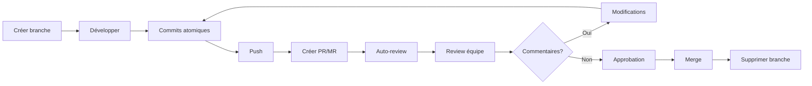

## 📋 Table des matières

```table-of-contents
title: 
style: nestedList # TOC style (nestedList|nestedOrderedList|inlineFirstLevel)
minLevel: 2 # Include headings from the specified level
maxLevel: 2 # Include headings up to the specified level
include: 
exclude: 
includeLinks: true # Make headings clickable
hideWhenEmpty: false # Hide TOC if no headings are found
debugInConsole: false # Print debug info in Obsidian console
```

---

## 🎯 Introduction

Les **Pull Requests** (GitHub) et **Merge Requests** (GitLab) sont des mécanismes essentiels de collaboration dans le développement moderne. Ils permettent de proposer des modifications, de les discuter, et de les intégrer de manière contrôlée dans la branche principale.

> [!info] Terminologie
> 
> - **Pull Request (PR)** : terme utilisé par GitHub, Bitbucket
> - **Merge Request (MR)** : terme utilisé par GitLab
> 
> Les deux concepts sont identiques dans leur fonctionnement.

### Pourquoi utiliser des PR/MR ?

- ✅ **Revue de code systématique** : plusieurs yeux sur chaque modification
- ✅ **Discussion contextuelle** : échanges directement sur le code concerné
- ✅ **Historique traçable** : documentation des décisions et changements
- ✅ **Qualité améliorée** : détection précoce des bugs et problèmes
- ✅ **Partage de connaissances** : apprentissage mutuel au sein de l'équipe
- ✅ **Protection de la branche principale** : évite les commits directs non vérifiés

---

## 🔍 Comprendre les PR/MR

### Workflow typique

```
Branche feature → PR/MR → Review → Approbation → Merge → Branche principale
```

### Cycle de vie d'une PR/MR

1. **Draft/WIP** : travail en cours, pas prêt pour review
2. **Open/Ready** : prêt pour la revue de code
3. **In Review** : en cours d'examen par les pairs
4. **Approved** : validé, prêt à être mergé
5. **Merged** : intégré dans la branche cible
6. **Closed** : fermé sans merge (abandonné)

> [!tip] Draft Pull Requests Utilisez les PR en mode "draft" pour partager votre travail tôt et obtenir des retours avant la finalisation. Cela évite de partir dans la mauvaise direction.

---

## 📝 Création d'une Pull Request / Merge Request

### Prérequis

Avant de créer une PR/MR, assurez-vous que :

```bash
# 1. Votre branche est à jour avec la branche cible
git checkout feature/ma-fonctionnalite
git fetch origin
git rebase origin/main  # ou git merge origin/main

# 2. Vos commits sont poussés sur le remote
git push origin feature/ma-fonctionnalite

# 3. Vos tests passent (si applicable)
npm test  # ou autre commande selon votre projet
```

### Création sur GitHub

**Via l'interface web :**

1. Accédez au repository sur GitHub
2. Cliquez sur l'onglet **"Pull requests"**
3. Cliquez sur **"New pull request"**
4. Sélectionnez :
    - **Base branch** : la branche cible (ex: `main`, `develop`)
    - **Compare branch** : votre branche de feature
5. Vérifiez les modifications dans l'aperçu
6. Cliquez sur **"Create pull request"**

**Via la ligne de commande (GitHub CLI) :**

```bash
# Installation de GitHub CLI (si nécessaire)
# macOS : brew install gh
# Windows : winget install GitHub.cli
# Linux : voir https://cli.github.com/

# Authentification
gh auth login

# Création d'une PR
gh pr create \
  --title "feat: ajout de l'authentification utilisateur" \
  --body "Cette PR ajoute le système d'authentification avec JWT..." \
  --base main \
  --head feature/auth

# Création d'une PR en mode draft
gh pr create --draft --title "WIP: nouvelle fonctionnalité"

# Création interactive (pose des questions)
gh pr create
```

### Création sur GitLab

**Via l'interface web :**

1. Accédez au projet sur GitLab
2. Menu **"Merge requests"** → **"New merge request"**
3. Sélectionnez la source branch et la target branch
4. Cliquez sur **"Compare branches and continue"**
5. Remplissez le formulaire

**Via la ligne de commande (GitLab CLI) :**

```bash
# Installation de glab
# macOS : brew install glab
# Autres : voir https://gitlab.com/gitlab-org/cli

# Création d'une MR
glab mr create \
  --title "feat: nouvelle API REST" \
  --description "Implémentation des endpoints pour..." \
  --source-branch feature/api \
  --target-branch main

# Création en mode draft
glab mr create --draft
```

### Rédiger un bon titre

> [!example] Conventions de nommage Utilisez des préfixes clairs :
> 
> - `feat:` nouvelle fonctionnalité
> - `fix:` correction de bug
> - `docs:` documentation
> - `style:` formatage, ponctuation
> - `refactor:` refactorisation sans changement fonctionnel
> - `test:` ajout ou modification de tests
> - `chore:` tâches de maintenance

**Exemples :**

```
✅ feat: ajouter l'export PDF des rapports
✅ fix: corriger le crash au démarrage sur iOS 16
✅ refactor: simplifier la logique de calcul des totaux
❌ Modifications
❌ Update
❌ Changes
```

### Rédiger une bonne description

Une description complète doit inclure :

```markdown
## 🎯 Objectif

Expliquer POURQUOI ce changement est nécessaire.

## 🔧 Modifications

Liste des changements principaux :
- Ajout de la fonction `calculateTotal()`
- Modification du composant `UserProfile`
- Suppression du code obsolète dans `utils.js`

## 🧪 Tests

Comment tester ces modifications :
1. Aller sur la page /profile
2. Cliquer sur "Calculer le total"
3. Vérifier que le résultat s'affiche correctement

## 📸 Screenshots (si applicable)

[Captures d'écran avant/après]

## ⚠️ Points d'attention

- Migration de base de données requise
- Nécessite la version 2.0 de la librairie XYZ
- Breaking change : l'API a changé

## 🔗 Références

- Issue #123
- Documentation : https://...
```

> [!warning] Erreurs courantes
> 
> - Description vide ou minimaliste ("Update")
> - Pas d'explication du contexte
> - Oublier de mentionner les breaking changes
> - Ne pas lier les issues associées

---

## 👀 Review de code

La review de code est un processus collaboratif où les membres de l'équipe examinent les modifications proposées.

### Rôles dans une review

|Rôle|Responsabilité|
|---|---|
|**Auteur**|Créateur de la PR/MR, répond aux commentaires|
|**Reviewer**|Examine le code, pose des questions, suggère des améliorations|
|**Approver**|Valide que le code peut être mergé|
|**Maintainer**|A les droits de merge final|

### Comment faire une bonne review

#### 1. Comprendre le contexte

```bash
# Récupérer la branche localement pour tester
git fetch origin
git checkout feature/nouvelle-fonctionnalite

# Ou créer une branche de review
git checkout -b review/feature-nouvelle-fonctionnalite origin/feature/nouvelle-fonctionnalite

# Lancer les tests
npm test
npm run lint

# Tester manuellement l'application
npm start
```

#### 2. Vérifier différents aspects

**Architecture et design :**

- La solution est-elle adaptée au problème ?
- Le code est-il dans le bon module/fichier ?
- Les responsabilités sont-elles bien séparées ?

**Qualité du code :**

- Le code est-il lisible et compréhensible ?
- Les noms de variables/fonctions sont-ils explicites ?
- Y a-t-il du code dupliqué ?
- Les fonctions sont-elles trop longues ou complexes ?

**Performance :**

- Y a-t-il des boucles inefficaces ?
- Les requêtes base de données sont-elles optimisées ?
- La mémoire est-elle bien gérée ?

**Sécurité :**

- Les données sensibles sont-elles protégées ?
- Les entrées utilisateur sont-elles validées ?
- Y a-t-il des failles potentielles (injection, XSS, etc.) ?

**Tests :**

- Les cas d'usage sont-ils couverts ?
- Les cas limites sont-ils testés ?
- Les tests sont-ils pertinents et maintenables ?

**Documentation :**

- Le code complexe est-il commenté ?
- La documentation est-elle à jour ?
- Les README sont-ils modifiés si nécessaire ?

> [!tip] Checklist de review Créez une checklist d'équipe pour standardiser vos reviews. Exemple :
> 
> ```markdown
> - [ ] Le code compile sans erreurs
> - [ ] Les tests passent
> - [ ] Pas de code commenté inutile
> - [ ] Les constantes magiques sont définies
> - [ ] La documentation est à jour
> ```

#### 3. Naviguer dans la PR/MR

**Sur GitHub :**

```
Files changed → Voir tous les fichiers modifiés
Split/Unified → Changer le mode d'affichage
Review changes → Ajouter une review globale
```

**Sur GitLab :**

```
Changes → Onglet principal des modifications
Commit → Voir commit par commit
Discussions → Threads de discussion
```

> [!info] Vues de diff
> 
> - **Split view** : ancien code à gauche, nouveau à droite (idéal pour gros changements)
> - **Unified view** : tout en une colonne (idéal pour petites modifications)

---

## 💬 Commentaires et suggestions

### Types de commentaires

#### 1. Commentaires de ligne

**Sur une ligne spécifique :**

- Cliquez sur le numéro de ligne dans le diff
- Ajoutez votre commentaire
- Soumettez

**Sur plusieurs lignes :**

- Cliquez sur le premier numéro de ligne
- Maintenez Shift et cliquez sur le dernier numéro
- Ajoutez votre commentaire

#### 2. Commentaires généraux

Commentaires sur la PR/MR dans son ensemble, pas liés à une ligne spécifique.

```markdown
# Exemple de commentaire général
Globalement très bon travail ! Quelques remarques :

1. Pensez à ajouter des tests pour le cas où l'utilisateur est null
2. La documentation pourrait être plus détaillée
3. Excellent travail sur la gestion des erreurs 👍
```

#### 3. Suggestions de code (GitHub/GitLab)

GitHub et GitLab permettent de suggérer directement des modifications :

**Sur GitHub :**

````markdown
```suggestion
const result = calculateTotal(items);
return result;
````

````

**Sur GitLab :**
```markdown
```suggestion:-0+2
const result = calculateTotal(items);
return result;
````

````

L'auteur peut alors accepter la suggestion en un clic, ce qui créera automatiquement un commit.

> [!tip] Suggestions efficaces
> Les suggestions sont idéales pour :
> - Corriger des typos
> - Améliorer le formatage
> - Proposer une alternative simple
> 
> Évitez-les pour des changements complexes nécessitant une discussion.

### Ton et formulation

> [!warning] Communication bienveillante
> La review de code est un exercice de communication. Un mauvais ton peut blesser et démotiver.

**❌ À éviter :**
```markdown
Ce code est nul.
Pourquoi tu as fait ça ?
C'est évident que ça ne marche pas.
Tout est à refaire.
````

**✅ À privilégier :**

```markdown
Je pense qu'on pourrait améliorer cette section. Que dirais-tu de... ?
J'ai une question sur cette approche : as-tu considéré... ?
Beau travail ! Une suggestion pour rendre cela encore plus clair...
Je ne suis pas sûr de comprendre cette logique, peux-tu m'expliquer ?
```

### Niveaux de criticité

Indiquez clairement la nature de votre commentaire :

```markdown
🔴 [BLOQUANT] Cette faille de sécurité doit être corrigée avant le merge.

🟡 [IMPORTANT] Ce code pourrait poser des problèmes de performance.

🟢 [NITPICK] Suggestion mineure : renommer `data` en `userData` pour plus de clarté.

💡 [SUGGESTION] On pourrait envisager d'utiliser un hook personnalisé ici.

❓ [QUESTION] Pourquoi as-tu choisi cette approche plutôt que X ?
```

### Exemples de commentaires constructifs

**Commentaire sur la performance :**

````markdown
⚠️ [IMPORTANT] Performance

Cette boucle imbriquée a une complexité O(n²). Pour de grandes listes, 
cela pourrait ralentir l'application.

Suggestion : utiliser un Map pour indexer les items et réduire à O(n).

```suggestion
const itemsMap = new Map(items.map(item => [item.id, item]));
const result = ids.map(id => itemsMap.get(id));
````

````

**Commentaire sur la lisibilité :**
```markdown
💡 [SUGGESTION] Clarté

Le nom `proc` n'est pas très explicite. Que dirais-tu de le renommer 
en `processUserData` pour clarifier son rôle ?

Cela rendrait le code plus facile à comprendre pour les nouveaux arrivants.
````

**Commentaire positif :**

```markdown
✨ Excellente gestion des erreurs ! L'utilisation de types d'erreur 
spécifiques facilite grandement le debugging. Merci pour cette attention 
aux détails.
```

---

## ✅ Approbation et merge

### Statuts de review

Une PR/MR peut avoir différents statuts selon les reviews :

|Statut|Signification|
|---|---|
|✅ **Approved**|Validé, peut être mergé|
|💬 **Comment**|Commentaires sans blocage|
|❌ **Request changes**|Modifications requises avant merge|
|👀 **Pending**|Review en attente|

### Process d'approbation

#### Règles typiques

```markdown
Exemples de règles d'approbation :

- ✅ Au moins 1 approbation requise
- ✅ Au moins 2 approbations pour les branches protégées
- ✅ Approbation d'un code owner obligatoire
- ✅ Pas de "Request changes" en cours
- ✅ Tous les threads de discussion résolus
- ✅ CI/CD passant (tests, linting, build)
```

> [!info] Code Owners Les fichiers `CODEOWNERS` (GitHub) ou `.gitlab/CODEOWNERS` (GitLab) définissent qui doit obligatoirement approuver les modifications de certains fichiers.
> 
> ```
> # Exemple CODEOWNERS
> /src/api/**  @backend-team
> /docs/**     @documentation-team
> *.sql        @database-team
> ```

#### Approuver une PR/MR

**Sur GitHub :**

```
1. Cliquer sur "Review changes"
2. Sélectionner :
   - "Comment" : juste un commentaire
   - "Approve" : approuver
   - "Request changes" : demander des modifications
3. Ajouter un commentaire (optionnel)
4. Cliquer sur "Submit review"
```

**Sur GitLab :**

```
1. Cliquer sur "Approve" (ou "Revoke approval" si déjà approuvé)
2. Les commentaires sont séparés de l'approbation
```

### Résoudre les conflits

Avant de merger, les conflits doivent être résolus :

```bash
# Méthode 1 : Rebase sur la branche cible
git checkout feature/ma-fonctionnalite
git fetch origin
git rebase origin/main

# Résoudre les conflits dans chaque fichier
# Ensuite :
git add .
git rebase --continue

# Pousser (force push car l'historique a changé)
git push --force-with-lease origin feature/ma-fonctionnalite

# Méthode 2 : Merge de la branche cible
git checkout feature/ma-fonctionnalite
git fetch origin
git merge origin/main

# Résoudre les conflits
git add .
git commit -m "Merge main into feature branch"
git push origin feature/ma-fonctionnalite
```

> [!warning] Force push Utilisez `--force-with-lease` plutôt que `-f` ou `--force`. Cela évite d'écraser des commits que quelqu'un d'autre aurait poussés.

**Résolution via l'interface web :**

GitHub et GitLab proposent aussi un éditeur de conflits intégré :

- Cliquez sur "Resolve conflicts" dans la PR/MR
- Choisissez la version à garder pour chaque conflit
- Validez la résolution

### Stratégies de merge

#### 1. Merge commit (défaut)

```bash
# Crée un commit de merge
git checkout main
git merge --no-ff feature/ma-fonctionnalite
```

**Historique :**

```
* Merge branch 'feature/ma-fonctionnalite'
|\
| * commit C (feature)
| * commit B (feature)
|/
* commit A (main)
```

✅ **Avantages :**

- Préserve l'historique complet
- Facile de voir quand une feature a été intégrée
- Facile de revert une feature entière

❌ **Inconvénients :**

- Historique plus complexe avec beaucoup de branches
- Commits de merge "parasites"

#### 2. Squash and merge

```bash
# Combine tous les commits en un seul
git checkout main
git merge --squash feature/ma-fonctionnalite
git commit -m "feat: nouvelle fonctionnalité complète"
```

**Historique :**

```
* feat: nouvelle fonctionnalité complète (squashed)
* commit A (main)
```

✅ **Avantages :**

- Historique linéaire et propre
- Un commit = une feature
- Facilite la navigation dans l'historique

❌ **Inconvénients :**

- Perd les détails des commits intermédiaires
- Difficile de revert partiellement

#### 3. Rebase and merge

```bash
# Réapplique les commits de la feature sur main
git checkout feature/ma-fonctionnalite
git rebase main
git checkout main
git merge --ff-only feature/ma-fonctionnalite
```

**Historique :**

```
* commit C (feature)
* commit B (feature)
* commit A (main)
```

✅ **Avantages :**

- Historique parfaitement linéaire
- Conserve tous les commits
- Pas de commits de merge

❌ **Inconvénients :**

- Réécrit l'historique (problématique si la branche est partagée)
- Peut être complexe avec beaucoup de commits

> [!tip] Quelle stratégie choisir ? **Squash and merge** : recommandé pour la plupart des projets
> 
> - Historique propre et lisible
> - Une PR = un commit logique
> 
> **Merge commit** : pour les grosses features
> 
> - Préserve l'historique détaillé
> - Facilite le rollback d'une feature complète
> 
> **Rebase and merge** : pour les équipes expérimentées
> 
> - Demande de la discipline
> - Commits atomiques bien formés requis

### Merger la PR/MR

**Sur GitHub :**

```
1. Vérifier que tous les checks sont verts
2. Cliquer sur "Merge pull request"
3. Choisir la stratégie de merge
4. Confirmer le merge
5. Optionnel : Supprimer la branche source
```

**Sur GitLab :**

```
1. Vérifier les approbations et la CI
2. Cliquer sur "Merge"
3. Options :
   - Delete source branch
   - Squash commits
   - Edit commit message
4. Confirmer
```

**Via CLI :**

```bash
# GitHub CLI
gh pr merge 123 --squash --delete-branch

# GitLab CLI
glab mr merge 42 --squash --remove-source-branch

# Manuellement
git checkout main
git pull origin main
git merge feature/ma-fonctionnalite
git push origin main
git branch -d feature/ma-fonctionnalite
git push origin --delete feature/ma-fonctionnalite
```

### Que faire après le merge ?

```bash
# 1. Mettre à jour votre branche locale
git checkout main
git pull origin main

# 2. Supprimer la branche locale (si pas déjà fait)
git branch -d feature/ma-fonctionnalite

# 3. Nettoyer les branches distantes supprimées
git fetch --prune

# 4. Vérifier les branches obsolètes
git branch -vv | grep ': gone]'

# 5. Supprimer toutes les branches locales obsolètes
git branch -vv | grep ': gone]' | awk '{print $1}' | xargs git branch -D
```

> [!warning] Attention Une fois mergée, ne poussez plus de commits sur la branche de feature. Créez une nouvelle branche si des modifications supplémentaires sont nécessaires.

---

## 🎯 Bonnes pratiques

### Pour l'auteur de la PR/MR

#### Avant de créer la PR/MR

```bash
# 1. Assurez-vous que votre branche est à jour
git fetch origin
git rebase origin/main  # ou merge selon votre stratégie

# 2. Vérifiez votre code
git diff origin/main...HEAD

# 3. Lancez les tests
npm test
npm run lint

# 4. Vérifiez vos commits
git log origin/main..HEAD --oneline

# 5. Nettoyez l'historique si nécessaire (rebase interactif)
git rebase -i origin/main
```

#### Structurer les commits

> [!tip] Commits atomiques Un commit = une modification logique et complète
> 
> ✅ Bon :
> 
> ```
> feat: ajouter la validation email
> feat: créer le composant UserForm
> fix: corriger le bug de validation
> ```
> 
> ❌ Mauvais :
> 
> ```
> WIP
> Update
> Fix stuff
> Final commit
> ```

#### Taille de la PR/MR

> [!warning] Principe de la petite PR **Une PR doit être reviewable en moins de 30 minutes**
> 
> - ✅ **Petite PR** : 1-200 lignes → Review facile et rapide
> - ⚠️ **Moyenne PR** : 200-500 lignes → Review possible mais longue
> - ❌ **Grosse PR** : 500+ lignes → Difficile à reviewer, risque d'erreurs
> 
> Si votre PR est trop grosse, découpez-la en plusieurs PRs successives.

#### Auto-review

Avant de marquer votre PR comme "Ready for review", faites votre propre review :

```markdown
✅ Checklist auto-review :
- [ ] J'ai relu tous mes changements dans l'interface GitHub/GitLab
- [ ] J'ai vérifié qu'il n'y a pas de code de debug/console.log
- [ ] J'ai supprimé le code commenté inutile
- [ ] Les noms de variables/fonctions sont clairs
- [ ] J'ai ajouté des commentaires sur les parties complexes
- [ ] La documentation est à jour
- [ ] Les tests passent
- [ ] J'ai testé manuellement les changements
```

### Pour le reviewer

#### Priorités de review

1. **🔴 Critique** : Bugs, sécurité, performance majeure
2. **🟡 Important** : Architecture, maintenabilité, tests
3. **🟢 Mineur** : Style, nommage, commentaires

#### Timing de la review

> [!tip] Réactivité
> 
> - Reviews urgentes : < 2h
> - Reviews normales : < 24h
> - Reviews complexes : < 48h
> 
> Une review rapide booste la productivité de toute l'équipe.

#### Approche de review

**1. Premier passage (vue d'ensemble) :**

- Lire la description et comprendre l'objectif
- Vérifier l'architecture générale
- Repérer les problèmes majeurs

**2. Deuxième passage (détails) :**

- Examiner chaque fichier ligne par ligne
- Vérifier la logique et les cas limites
- Suggérer des améliorations

**3. Troisième passage (tests) :**

- Tester localement si possible
- Vérifier la couverture de tests
- Valider le comportement attendu

### Gestion des discussions

#### Résoudre un thread

Les threads de discussion doivent être explicitement résolus :

```markdown
# L'auteur répond et résout
Reviewer : "Cette variable devrait être const"
Auteur : "Corrigé dans le commit abc123" [Resolve conversation]

# Ou le reviewer résout après vérification
Reviewer : "Cette variable devrait être const"
Auteur : "Corrigé dans le commit abc123"
Reviewer : "Parfait !" [Resolve conversation]
```

> [!info] Qui résout ? **GitHub** : n'importe qui peut résoudre **GitLab** : seul l'auteur du thread peut résoudre (configurable)

#### Gérer les désaccords

En cas de désaccord persistant :

1. **Expliquez votre raisonnement** avec des arguments techniques
2. **Demandez l'avis d'un tiers** (autre dev, lead technique)
3. **Documentez la décision** dans les commentaires pour référence future
4. **Acceptez les compromis** - la perfection est l'ennemi du bien

```markdown
# Exemple de résolution de désaccord
@dev1 : Je préfère utiliser une classe ici
@dev2 : Je pense qu'une fonction pure serait mieux car...
@dev1 : Tu as raison sur X, mais pour Y on a besoin de...
@lead : Après discussion, voici notre décision et pourquoi...
```

### Automatisation

#### CI/CD dans les PR/MR

```yaml
# Exemple GitHub Actions (.github/workflows/pr.yml)
name: PR Checks
on: [pull_request]

jobs:
  test:
    runs-on: ubuntu-latest
    steps:
      - uses: actions/checkout@v3
      - name: Run tests
        run: npm test
      - name: Run linter
        run: npm run lint
      - name: Check build
        run: npm run build
```

```yaml
# Exemple GitLab CI (.gitlab-ci.yml)
test:
  stage: test
  script:
    - npm install
    - npm test
    - npm run lint
  only:
    - merge_requests
```

#### Outils complémentaires

- **Danger** : Automatise les reviews de routine
- **CodeClimate** : Analyse de qualité de code
- **SonarQube** : Détection de bugs et vulnérabilités
- **Codecov** : Couverture de tests
- **Renovate/Dependabot** : Mises à jour de dépendances automatiques

### Templates de PR/MR

Créez des templates pour standardiser vos PR/MR :

**GitHub** : `.github/pull_request_template.md`

```markdown
## 🎯 Description

<!-- Décrivez les changements de cette PR -->

## 🔗 Ticket associé

Fixes #

## 📋 Type de changement

- [ ] 🐛 Bug fix
- [ ] ✨ Nouvelle fonctionnalité
- [ ] 💥 Breaking change
- [ ] 📝 Documentation

## ✅ Checklist

- [ ] Mon code suit le style du projet
- [ ] J'ai effectué une auto-review
- [ ] J'ai commenté les parties complexes
- [ ] J'ai mis à jour la documentation
- [ ] Mes changements ne génèrent pas de warnings
- [ ] J'ai ajouté des tests
- [ ] Tous les tests passent localement
- [ ] Les modifications dépendantes sont mergées

## 🧪 Comment tester

<!-- Étapes pour tester vos changements -->

## 📸 Screenshots (si applicable)

<!-- Captures d'écran avant/après -->
```

**GitLab** : `.gitlab/merge_request_templates/default.md`

---

## 🚀 Astuces avancées

### PR/MR en cascade

Pour les grosses features, créez des PR/MR en cascade :

```
main ← feature/part-3 ← feature/part-2 ← feature/part-1
```

Chaque PR/MR review et merge une partie, permettant des reviews plus courtes et ciblées.

### Re-request review

Après avoir appliqué les modifications demandées :

```bash
# GitHub CLI
gh pr ready 123  # Marquer comme ready après draft
gh pr review 123 --request @reviewer

# Via l'interface
Cliquer sur "Re-request review" à côté du reviewer
```

### Viewing options

```bash
# Voir les commits individuellement
Cliquez sur "Commits" dans la PR pour voir commit par commit

# Masquer les changements de whitespace
?w=1 dans l'URL GitHub
"Hide whitespace changes" dans GitLab

# Voir uniquement certains fichiers
Utilisez les filtres de fichiers dans l'interface
```

### Labels et milestones

Organisez vos PR/MR avec des labels :

```markdown
Exemples de labels utiles :
- 🐛 bug : Correction de bug
- ✨ enhancement : Amélioration
- 📝 documentation : Documentation
- 🚀 feature : Nouvelle fonctionnalité
- ⚡ performance : Optimisation
- 🔒 security : Sécurité
- 🧪 needs-testing : Nécessite des tests
- 🚧 work-in-progress : En cours
- ❓ question : Question ou discussion
- 🔥 urgent : Urgent
- ⏸️ on-hold : En attente
```

Associez aux milestones pour le suivi de version :

```bash
# GitHub CLI
gh pr create --milestone "v2.0.0" --label "feature,urgent"

# GitLab CLI
glab mr create --milestone "v2.0.0" --label "feature,urgent"
```

### Protected branches

Configurez des règles de protection pour vos branches importantes :

**GitHub - Settings → Branches → Branch protection rules :**

```markdown
Règles recommandées pour main/develop :

✅ Require pull request reviews before merging
   └─ Require approvals: 2
   └─ Dismiss stale reviews when new commits are pushed
   └─ Require review from Code Owners

✅ Require status checks to pass before merging
   └─ tests
   └─ lint
   └─ build

✅ Require conversation resolution before merging

✅ Require linear history (force squash/rebase)

✅ Include administrators (appliquer les règles aux admins aussi)

❌ Allow force pushes (JAMAIS sur main/develop)
```

**GitLab - Settings → Repository → Protected branches :**

```markdown
Allowed to merge: Maintainers
Allowed to push: No one
Allowed to force push: No one
Code owner approval: ✅
```

### Stacked PRs

Pour des features complexes nécessitant plusieurs PRs interdépendantes :

```bash
# Créer la première PR
git checkout -b feature/step-1 main
# ... travail ...
git push origin feature/step-1
gh pr create --base main

# Créer la deuxième PR basée sur la première
git checkout -b feature/step-2 feature/step-1
# ... travail ...
git push origin feature/step-2
gh pr create --base feature/step-1

# Une fois step-1 mergée dans main, changer la base de step-2
gh pr edit <number> --base main
```

> [!tip] Outils pour stacked PRs
> 
> - **GitHub Stack** : extension pour gérer les PR empilées
> - **Graphite** : outil dédié aux stacked PRs
> - **GitLab** : support natif avec les merge trains

### Code suggestions en masse

Proposer plusieurs modifications d'un coup :

```bash
# GitHub - Batch suggestions
# Dans un commentaire, utilisez plusieurs blocs suggestion

# GitLab - Apply multiple suggestions
Cochez plusieurs suggestions puis cliquez "Apply X suggestions"
```

### Draft PR pour partage anticipé

```bash
# Créer une draft PR pour feedback précoce
gh pr create --draft --title "WIP: nouvelle architecture API"

# Marquer comme ready quand terminé
gh pr ready <number>
```

> [!info] Avantages des Draft PR
> 
> - Obtenir des retours tôt dans le processus
> - Collaborer sur des solutions complexes
> - Montrer la progression sans polluer les reviews
> - Les CI/CD peuvent tourner même en draft

### Commandes utiles

```bash
# ============================================
# GITHUB CLI (gh)
# ============================================

# Lister toutes les PR
gh pr list
gh pr list --state all
gh pr list --author @me
gh pr list --label "bug"

# Voir les détails d'une PR
gh pr view 123
gh pr view 123 --web  # Ouvrir dans le navigateur
gh pr diff 123

# Checkout une PR localement
gh pr checkout 123

# Commenter une PR
gh pr comment 123 --body "Looks good!"

# Reviewer une PR
gh pr review 123 --approve
gh pr review 123 --request-changes --body "Please fix X"
gh pr review 123 --comment --body "Question about..."

# Merger une PR
gh pr merge 123 --squash --delete-branch
gh pr merge 123 --merge
gh pr merge 123 --rebase

# Fermer une PR sans merger
gh pr close 123

# Rouvrir une PR
gh pr reopen 123

# ============================================
# GITLAB CLI (glab)
# ============================================

# Lister toutes les MR
glab mr list
glab mr list --mine
glab mr list --label "bug"

# Voir les détails d'une MR
glab mr view 42
glab mr view 42 --web

# Checkout une MR localement
glab mr checkout 42

# Approuver une MR
glab mr approve 42
glab mr unapprove 42

# Merger une MR
glab mr merge 42 --squash --remove-source-branch

# Fermer une MR
glab mr close 42

# Créer une note
glab mr note 42 --message "Great work!"
```

---

## ⚠️ Pièges courants

### 1. PR trop grosse

**Problème :**

```
feature/refonte-complete : 47 fichiers, 3,421 lignes modifiées
```

**Solution :**

```bash
# Découpez en plusieurs PR logiques
feature/refonte-part1-models
feature/refonte-part2-controllers
feature/refonte-part3-views
```

### 2. Commits de merge dans la feature branch

**Problème :**

```
* Merge branch 'main' into feature
* feat: add feature
* Merge branch 'main' into feature
* fix: bug
```

**Solution :**

```bash
# Utilisez rebase au lieu de merge
git fetch origin
git rebase origin/main

# Ou configurez pour toujours rebase
git config pull.rebase true
```

### 3. Force push destructif

**Problème :**

```bash
# ❌ DANGEREUX
git push -f origin feature/ma-branche
# Écrase les commits que d'autres auraient poussés
```

**Solution :**

```bash
# ✅ SÉCURISÉ
git push --force-with-lease origin feature/ma-branche
# Échoue si quelqu'un d'autre a poussé entre temps
```

### 4. Ne pas répondre aux commentaires

**Problème :** Le reviewer attend une réponse ou une correction, la PR stagne.

**Solution :**

- Répondez à TOUS les commentaires, même avec "Corrigé ✅"
- Si vous n'êtes pas d'accord, expliquez pourquoi
- Résolvez les threads après avoir traité le commentaire

### 5. Merge sans vérification

**Problème :**

```bash
git merge feature --no-verify
# Bypass les hooks et les checks
```

**Solution :**

```bash
# Toujours vérifier avant de merger
git diff main...feature
npm test
npm run lint

# Puis merge normalement
git merge feature
```

### 6. Conflits non testés

**Problème :** Résoudre des conflits puis merger directement sans tester.

**Solution :**

```bash
# Après résolution de conflits
git add .
git rebase --continue  # ou git merge --continue

# TOUJOURS tester après résolution
npm test
npm run lint
npm start  # Test manuel

# Puis pusher
git push --force-with-lease origin feature
```

### 7. Description vague

**Problème :**

```markdown
Titre: Update
Description: Changes
```

**Solution :**

```markdown
Titre: feat: ajouter l'authentification à deux facteurs

Description:
## Objectif
Implémenter 2FA pour améliorer la sécurité des comptes utilisateurs.

## Modifications
- Ajout du modèle TwoFactorAuth
- Intégration avec Google Authenticator
- Nouveaux endpoints API : /auth/2fa/enable, /auth/2fa/verify
- Interface utilisateur pour la configuration

## Tests
- Tests unitaires pour les endpoints
- Tests E2E du flow complet
- Couverture : 87%
```

### 8. Oublier de supprimer les branches

**Problème :** Accumulation de branches obsolètes après merge.

**Solution :**

```bash
# Automatiser la suppression après merge
# Dans GitHub/GitLab : activer "Automatically delete head branches"

# Nettoyer manuellement
git branch -d feature/merged-branch  # Local
git push origin --delete feature/merged-branch  # Remote

# Nettoyer toutes les branches obsolètes
git fetch --prune
git branch -vv | grep ': gone]' | awk '{print $1}' | xargs git branch -D
```

### 9. Review superficielle

**Problème :**

```markdown
Reviewer: "LGTM 👍"
# Sans vraiment lire le code
```

**Solution :**

- Prenez le temps nécessaire
- Testez localement si possible
- Posez des questions sur les parties non claires
- Vérifiez les tests et la couverture
- Validez la logique métier

### 10. Ne pas utiliser les templates

**Problème :** Chaque PR a un format différent, informations manquantes.

**Solution :**

```bash
# Créer un template d'équipe
# .github/pull_request_template.md
# ou .gitlab/merge_request_templates/default.md

# Tout le monde suit le même format
# Moins d'oublis, reviews plus efficaces
```

---

## 📊 Métriques et KPIs

Suivez ces métriques pour améliorer votre processus de PR/MR :

### Métriques individuelles

|Métrique|Objectif|Interprétation|
|---|---|---|
|**Time to First Review**|< 4h|Rapidité de l'équipe à commencer les reviews|
|**Time to Merge**|< 2 jours|Efficacité du processus de review|
|**Number of Comments**|5-15|Qualité de la discussion (trop peu = superficiel, trop = problèmes)|
|**Number of Commits**|1-5|Atomicité des changements|
|**Lines Changed**|< 400|Taille de la PR|
|**Number of Files**|< 10|Portée de la PR|

### Métriques d'équipe

```markdown
📈 Dashboard de suivi :

- PR ouvertes : 12
- PR en review : 8
- PR approuvées en attente de merge : 2
- PR mergées cette semaine : 23
- Temps moyen de review : 6h
- Taux d'approbation premier essai : 45%
```

### Amélioration continue

```markdown
🔄 Rétrospective mensuelle :

Questions à se poser :
1. Nos PR sont-elles trop grosses ?
2. Les reviews sont-elles assez rapides ?
3. Y a-t-il trop d'allers-retours ?
4. Les commentaires sont-ils constructifs ?
5. La documentation est-elle à jour ?
6. Les tests sont-ils suffisants ?

Actions d'amélioration :
- Réduire la taille moyenne des PR
- Former aux bonnes pratiques de review
- Améliorer les templates
- Automatiser plus de checks
```

---

## 🎓 Récapitulatif

### Cycle complet d'une PR/MR



### Checklist de l'auteur

```markdown
Avant de créer la PR/MR :
- [ ] Ma branche est à jour avec main
- [ ] Mes commits sont atomiques et bien nommés
- [ ] Les tests passent
- [ ] Le linting passe
- [ ] J'ai fait une auto-review
- [ ] La description est complète
- [ ] Les screenshots sont ajoutés (si UI)
- [ ] La documentation est à jour

Pendant la review :
- [ ] Je réponds à tous les commentaires
- [ ] Je résous les threads après correction
- [ ] Je teste après résolution de conflits
- [ ] Je reste ouvert aux suggestions

Après le merge :
- [ ] Je supprime la branche distante
- [ ] Je supprime la branche locale
- [ ] Je mets à jour ma branche main locale
```

### Checklist du reviewer

```markdown
Lors de la review :
- [ ] Je comprends l'objectif de la PR
- [ ] J'ai vérifié l'architecture générale
- [ ] J'ai examiné chaque fichier modifié
- [ ] J'ai testé localement si nécessaire
- [ ] J'ai vérifié les tests et leur couverture
- [ ] Mes commentaires sont constructifs
- [ ] J'indique la criticité de mes remarques
- [ ] Je valide ou demande des changements clairement

Avant d'approuver :
- [ ] Tous les points bloquants sont résolus
- [ ] Les tests passent
- [ ] La CI est verte
- [ ] La documentation est à jour
- [ ] Les commentaires non bloquants sont notés
```

### Commandes essentielles

```bash
# ============================================
# WORKFLOW COMPLET
# ============================================

# 1. Créer une branche de feature
git checkout -b feature/nouvelle-fonctionnalite main

# 2. Développer et commiter
git add .
git commit -m "feat: ajouter la nouvelle fonctionnalité"

# 3. Pousser
git push -u origin feature/nouvelle-fonctionnalite

# 4. Créer la PR
gh pr create --title "feat: nouvelle fonctionnalité" --body "Description..."

# 5. Mettre à jour après commentaires
git add .
git commit -m "fix: corrections suite review"
git push origin feature/nouvelle-fonctionnalite

# 6. Merger (via interface ou CLI)
gh pr merge 123 --squash --delete-branch

# 7. Nettoyer localement
git checkout main
git pull origin main
git branch -d feature/nouvelle-fonctionnalite
```

---

## 🎯 Points clés à retenir

> [!tip] Les 10 règles d'or des PR/MR
> 
> 1. **Petites PR** : Plus c'est court, mieux c'est (< 400 lignes)
> 2. **Commits atomiques** : Un commit = une modification logique
> 3. **Description complète** : Expliquez le POURQUOI, pas seulement le QUOI
> 4. **Auto-review** : Relisez-vous avant de demander une review
> 5. **Review rapide** : Répondez dans les 24h
> 6. **Commentaires constructifs** : Soyez bienveillant et spécifique
> 7. **Tests obligatoires** : Pas de PR sans tests
> 8. **Résolution de threads** : Chaque commentaire mérite une réponse
> 9. **CI/CD verte** : Ne mergez jamais avec des checks échouées
> 10. **Nettoyage** : Supprimez les branches après merge

Les Pull Requests et Merge Requests sont bien plus qu'un simple mécanisme technique : ils représentent un **processus de collaboration** qui améliore la qualité du code, facilite le partage de connaissances, et renforce la cohésion d'équipe. Maîtriser ce processus est essentiel pour tout développeur travaillant en équipe.

---

_Cours créé pour Obsidian - Partie : Collaboration avec GitHub/GitLab - Pull Requests / Merge Requests_