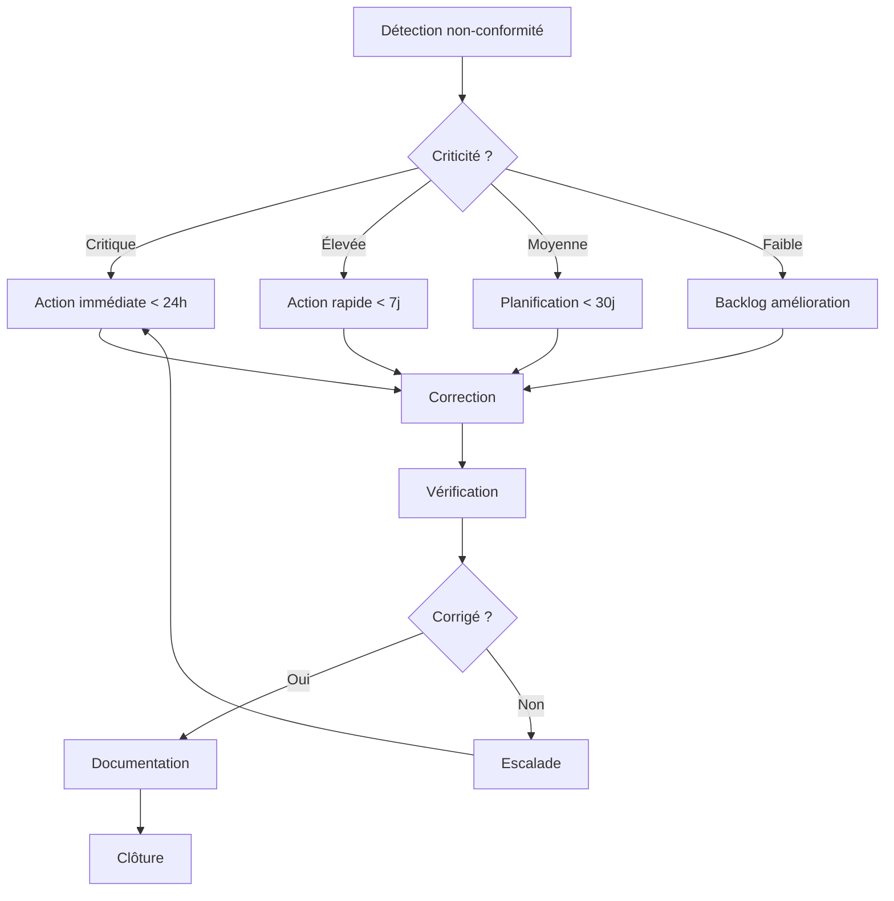

## 📑 Table des matières

```table-of-contents
title: 
style: nestedList # TOC style (nestedList|nestedOrderedList|inlineFirstLevel)
minLevel: 2 # Include headings from the specified level
maxLevel: 2 # Include headings up to the specified level
include: 
exclude: 
includeLinks: true # Make headings clickable
hideWhenEmpty: false # Hide TOC if no headings are found
debugInConsole: false # Print debug info in Obsidian console
```

---

## 🛡️ Standards de sécurité SSH

### Pourquoi des standards ?

Les standards SSH définissent les bonnes pratiques et configurations minimales pour garantir un niveau de sécurité homogène et élevé. Ils sont essentiels pour :

- Uniformiser les configurations dans l'organisation
- Faciliter les audits de sécurité
- Réduire la surface d'attaque
- Assurer l'interopérabilité sécurisée

### Standards internationaux principaux

#### RFC (Request for Comments)

Les RFC définissent les protocoles SSH au niveau technique :

|RFC|Titre|Description|
|---|---|---|
|**RFC 4251**|SSH Protocol Architecture|Architecture générale du protocole|
|**RFC 4252**|SSH Authentication Protocol|Méthodes d'authentification|
|**RFC 4253**|SSH Transport Layer Protocol|Couche transport et chiffrement|
|**RFC 4254**|SSH Connection Protocol|Gestion des canaux et connexions|
|**RFC 4256**|Generic Message Exchange Authentication|Authentification interactive|

> [!info] Importance des RFC Les RFC constituent la base technique officielle du protocole SSH. Toute implémentation conforme doit respecter ces spécifications.

#### Standards FIPS (Federal Information Processing Standards)

**FIPS 140-2/3** définit les exigences pour les modules cryptographiques :

```bash
# Vérifier si OpenSSH est compilé avec FIPS
ssh -V

# Activer le mode FIPS sur le système (RHEL/CentOS)
sudo fips-mode-setup --enable
sudo reboot

# Vérifier l'état FIPS
fips-mode-setup --check
```

> [!warning] Mode FIPS Le mode FIPS restreint les algorithmes utilisables aux seuls algorithmes validés FIPS. Cela peut causer des problèmes de compatibilité avec des systèmes plus anciens.

### Configuration selon les standards

#### Algorithmes recommandés (état de l'art 2025)

**Échange de clés (KEX)** :

```bash
# Recommandé
KexAlgorithms curve25519-sha256,curve25519-sha256@libssh.org,diffie-hellman-group16-sha512,diffie-hellman-group18-sha512

# À éviter (obsolètes)
# diffie-hellman-group1-sha1
# diffie-hellman-group14-sha1
```

**Chiffrement symétrique** :

```bash
# Recommandé
Ciphers chacha20-poly1305@openssh.com,aes256-gcm@openssh.com,aes128-gcm@openssh.com,aes256-ctr,aes192-ctr,aes128-ctr

# À éviter
# 3des-cbc, aes128-cbc, arcfour
```

**Codes d'authentification de message (MAC)** :

```bash
# Recommandé
MACs hmac-sha2-512-etm@openssh.com,hmac-sha2-256-etm@openssh.com,hmac-sha2-512,hmac-sha2-256

# À éviter
# hmac-md5, hmac-sha1
```

**Algorithmes de clés d'hôte** :

```bash
# Recommandé
HostKeyAlgorithms ssh-ed25519,rsa-sha2-512,rsa-sha2-256

# À éviter
# ssh-rsa (utilise SHA-1), ssh-dss
```

> [!example] Configuration complète sécurisée
> 
> ```bash
> # /etc/ssh/sshd_config - Configuration selon standards modernes
> 
> # Protocole et versions
> Protocol 2
> 
> # Algorithmes cryptographiques
> KexAlgorithms curve25519-sha256,curve25519-sha256@libssh.org,diffie-hellman-group16-sha512,diffie-hellman-group18-sha512
> Ciphers chacha20-poly1305@openssh.com,aes256-gcm@openssh.com,aes128-gcm@openssh.com,aes256-ctr,aes192-ctr,aes128-ctr
> MACs hmac-sha2-512-etm@openssh.com,hmac-sha2-256-etm@openssh.com,hmac-sha2-512,hmac-sha2-256
> HostKeyAlgorithms ssh-ed25519,rsa-sha2-512,rsa-sha2-256
> 
> # Clés d'hôte (ordre de préférence)
> HostKey /etc/ssh/ssh_host_ed25519_key
> HostKey /etc/ssh/ssh_host_rsa_key
> 
> # Authentification
> PubkeyAuthentication yes
> PasswordAuthentication no
> PermitEmptyPasswords no
> ChallengeResponseAuthentication no
> UsePAM yes
> 
> # Restrictions d'accès
> PermitRootLogin no
> MaxAuthTries 3
> MaxSessions 10
> LoginGraceTime 60
> 
> # Sécurité réseau
> X11Forwarding no
> AllowTcpForwarding no
> AllowAgentForwarding no
> PermitTunnel no
> GatewayPorts no
> 
> # Logging
> SyslogFacility AUTH
> LogLevel VERBOSE
> 
> # Autres
> StrictModes yes
> PermitUserEnvironment no
> Compression delayed
> ClientAliveInterval 300
> ClientAliveCountMax 2
> ```

#### Taille minimale des clés

|Type de clé|Taille minimale|Taille recommandée|
|---|---|---|
|**RSA**|2048 bits|4096 bits|
|**Ed25519**|256 bits (fixe)|256 bits|
|**ECDSA**|256 bits|384 bits ou 521 bits|

```bash
# Générer des clés conformes
ssh-keygen -t ed25519 -C "user@host-$(date +%Y%m%d)"
ssh-keygen -t rsa -b 4096 -C "user@host-$(date +%Y%m%d)"
ssh-keygen -t ecdsa -b 521 -C "user@host-$(date +%Y%m%d)"
```

> [!tip] Préférence Ed25519 Ed25519 est généralement préféré pour sa sécurité, sa performance et sa taille de clé compacte. RSA 4096 reste un bon choix pour la compatibilité.

---

## 📋 Exigences de conformité

### Recommandations ANSSI (Agence Nationale de la Sécurité des Systèmes d'Information)

L'ANSSI publie des guides de configuration pour sécuriser SSH selon les besoins français.

#### Points clés ANSSI

**1. Authentification forte obligatoire**

```bash
# Interdire l'authentification par mot de passe
PasswordAuthentication no
ChallengeResponseAuthentication no

# Exiger l'authentification par clé publique
PubkeyAuthentication yes
AuthenticationMethods publickey

# Option : ajouter une authentification à deux facteurs
AuthenticationMethods publickey,keyboard-interactive:pam
```

**2. Algorithmes cryptographiques**

L'ANSSI recommande d'utiliser uniquement des algorithmes avec un niveau de sécurité ≥ 128 bits :

```bash
# Échange de clés : uniquement courbes elliptiques ou DH > 3072 bits
KexAlgorithms curve25519-sha256,curve25519-sha256@libssh.org,diffie-hellman-group16-sha512,diffie-hellman-group18-sha512,diffie-hellman-group-exchange-sha256

# Chiffrement : AES ou ChaCha20
Ciphers chacha20-poly1305@openssh.com,aes256-gcm@openssh.com,aes128-gcm@openssh.com,aes256-ctr,aes192-ctr,aes128-ctr

# MAC : SHA-2 uniquement
MACs hmac-sha2-512-etm@openssh.com,hmac-sha2-256-etm@openssh.com
```

**3. Restrictions d'accès**

```bash
# Bloquer l'accès root
PermitRootLogin no

# Limiter les utilisateurs autorisés
AllowUsers user1 user2
AllowGroups ssh-users

# Désactiver les fonctionnalités non nécessaires
X11Forwarding no
AllowTcpForwarding no
PermitTunnel no
```

**4. Durée de vie des sessions**

```bash
# Timeout de connexion
LoginGraceTime 30

# Vérification de maintien en vie
ClientAliveInterval 300
ClientAliveCountMax 0
```

> [!warning] ClientAliveCountMax à 0 Avec `ClientAliveCountMax 0`, la connexion est coupée immédiatement si le client ne répond pas. Cela peut être trop strict pour certains usages.

### Recommandations NIST (National Institute of Standards and Technology)

Le NIST publie des guides de sécurité largement reconnus internationalement.

#### NIST SP 800-53 - Contrôles de sécurité

**IA-2 : Identification et authentification**

```bash
# Authentification multi-facteurs pour les comptes privilégiés
Match Group admins
    AuthenticationMethods publickey,keyboard-interactive:pam
```

**IA-5 : Gestion des authentifiants**

```bash
# Rotation régulière des clés d'hôte
# Script de rotation (à exécuter annuellement)
#!/bin/bash
# Générer nouvelles clés
ssh-keygen -t ed25519 -f /etc/ssh/ssh_host_ed25519_key_new -N ""
ssh-keygen -t rsa -b 4096 -f /etc/ssh/ssh_host_rsa_key_new -N ""

# Backup anciennes clés
mv /etc/ssh/ssh_host_ed25519_key /etc/ssh/backup/
mv /etc/ssh/ssh_host_rsa_key /etc/ssh/backup/

# Activer nouvelles clés
mv /etc/ssh/ssh_host_ed25519_key_new /etc/ssh/ssh_host_ed25519_key
mv /etc/ssh/ssh_host_rsa_key_new /etc/ssh/ssh_host_rsa_key

# Redémarrer SSH
systemctl restart sshd
```

**AC-17 : Accès à distance**

```bash
# Restreindre l'accès par IP source
Match Address 192.168.1.0/24,10.0.0.0/8
    PasswordAuthentication no
    PubkeyAuthentication yes

Match Address !192.168.1.0/24,!10.0.0.0/8
    DenyUsers *
```

**AU-2/AU-3 : Audit et responsabilité**

```bash
# Journalisation détaillée
LogLevel VERBOSE
SyslogFacility AUTH

# Centraliser les logs
# Configurer rsyslog pour envoyer vers SIEM
```

#### NIST SP 800-175B - Guide des algorithmes cryptographiques

|Catégorie|Algorithmes approuvés NIST|
|---|---|
|**Échange de clés**|DH (≥3072 bits), ECDH (P-256, P-384, P-521)|
|**Chiffrement**|AES-128, AES-256|
|**Hash**|SHA-256, SHA-384, SHA-512|
|**Signature**|RSA (≥2048 bits), ECDSA (P-256, P-384, P-521), EdDSA|

> [!info] Transition vers cryptographie post-quantique Le NIST travaille sur la standardisation d'algorithmes résistants aux ordinateurs quantiques. Surveiller les mises à jour pour SSH dans les années à venir.

### PCI-DSS (Payment Card Industry Data Security Standard)

Pour les environnements traitant des données de cartes bancaires :

**Exigence 2.3 : Chiffrer tous les accès administratifs non-console**

```bash
# SSH est conforme à cette exigence si correctement configuré
# Désactiver Telnet, rlogin, et autres protocoles non chiffrés
```

**Exigence 8.3 : Sécuriser tous les accès administratifs individuels**

```bash
# MFA obligatoire pour tous les administrateurs
Match Group pci-admins
    AuthenticationMethods publickey,keyboard-interactive:pam
```

**Exigence 10 : Tracer tous les accès**

```bash
# Journalisation complète
LogLevel VERBOSE

# Horodatage précis dans les logs
# Synchroniser avec NTP
```

### RGPD (Règlement Général sur la Protection des Données)

Bien que le RGPD ne spécifie pas directement SSH, il impose des mesures de sécurité pour protéger les données personnelles :

**Principe de sécurité renforcée**

```bash
# Chiffrement fort obligatoire
Ciphers chacha20-poly1305@openssh.com,aes256-gcm@openssh.com

# Authentification robuste
AuthenticationMethods publickey,keyboard-interactive:pam

# Traçabilité des accès aux données personnelles
LogLevel VERBOSE
```

> [!tip] Conformité multi-référentiels En pratique, respecter les recommandations ANSSI ou NIST couvre généralement les exigences des autres référentiels comme PCI-DSS ou RGPD pour SSH.

---

## 📝 Documentation et traçabilité

### Importance de la documentation

Une documentation complète et à jour est essentielle pour :

- **Conformité** : prouver le respect des standards lors d'audits
- **Continuité** : permettre la maintenance par différentes équipes
- **Sécurité** : identifier rapidement les configurations non conformes
- **Formation** : faciliter l'intégration de nouveaux administrateurs

### Documents essentiels à maintenir

#### 1. Politique de sécurité SSH

Document stratégique définissant les règles organisationnelles :

```markdown
# Politique de Sécurité SSH - Entreprise XYZ

## Objectif
Définir les règles de sécurité pour l'utilisation de SSH dans l'organisation.

## Périmètre
Tous les systèmes Linux/Unix de l'entreprise.

## Règles

### Authentification
- Authentification par clé publique obligatoire
- Mot de passe interdit sauf exception validée
- MFA obligatoire pour les comptes privilégiés
- Rotation des clés tous les 12 mois

### Algorithmes cryptographiques
- Suivre les recommandations ANSSI (mise à jour annuelle)
- Désactiver tous les algorithmes obsolètes
- Auditer trimestriellement la conformité

### Accès
- Principe du moindre privilège
- Accès root interdit, utiliser sudo
- Journalisation VERBOSE obligatoire
- Révision mensuelle des accès

### Responsabilités
- RSSI : validation de la politique
- Admins systèmes : implémentation
- Équipe sécu : audits trimestriels

## Exceptions
Toute exception doit être documentée et validée par le RSSI.

## Révision
Cette politique est révisée annuellement ou après incident de sécurité.
```

#### 2. Standards de configuration

Document technique précis :

```bash
# Standard de configuration SSH - v2.1 - 2025-01-15

# ============================================
# SERVEUR SSH (/etc/ssh/sshd_config)
# ============================================

# --- Protocole et écoute ---
Protocol 2
Port 22
AddressFamily inet  # IPv4 uniquement, ou 'any' pour IPv4+IPv6
ListenAddress 0.0.0.0

# --- Algorithmes cryptographiques (ANSSI 2025) ---
KexAlgorithms curve25519-sha256,curve25519-sha256@libssh.org,diffie-hellman-group16-sha512,diffie-hellman-group18-sha512
Ciphers chacha20-poly1305@openssh.com,aes256-gcm@openssh.com,aes128-gcm@openssh.com
MACs hmac-sha2-512-etm@openssh.com,hmac-sha2-256-etm@openssh.com
HostKeyAlgorithms ssh-ed25519,rsa-sha2-512,rsa-sha2-256

# --- Clés d'hôte ---
HostKey /etc/ssh/ssh_host_ed25519_key
HostKey /etc/ssh/ssh_host_rsa_key

# --- Authentification ---
PubkeyAuthentication yes
PasswordAuthentication no
PermitEmptyPasswords no
ChallengeResponseAuthentication no
AuthenticationMethods publickey
MaxAuthTries 3
LoginGraceTime 60

# --- Restrictions d'accès ---
PermitRootLogin no
AllowGroups ssh-users ssh-admins
DenyUsers guest test demo

# --- Fonctionnalités ---
X11Forwarding no
AllowTcpForwarding no
AllowAgentForwarding no
PermitTunnel no
GatewayPorts no
PermitUserEnvironment no

# --- Session ---
ClientAliveInterval 300
ClientAliveCountMax 2
MaxSessions 10
MaxStartups 10:30:60

# --- Logging ---
SyslogFacility AUTH
LogLevel VERBOSE

# --- Autres ---
UsePAM yes
StrictModes yes
Compression delayed
PrintMotd yes
Banner /etc/ssh/banner.txt

# ============================================
# CLIENT SSH (~/.ssh/config)
# ============================================

Host *
    # Algorithmes (alignés serveur)
    KexAlgorithms curve25519-sha256,curve25519-sha256@libssh.org,diffie-hellman-group16-sha512
    Ciphers chacha20-poly1305@openssh.com,aes256-gcm@openssh.com,aes128-gcm@openssh.com
    MACs hmac-sha2-512-etm@openssh.com,hmac-sha2-256-etm@openssh.com
    HostKeyAlgorithms ssh-ed25519,rsa-sha2-512,rsa-sha2-256
    
    # Sécurité
    HashKnownHosts yes
    StrictHostKeyChecking ask
    VerifyHostKeyDNS yes
    
    # Performance
    Compression yes
    ServerAliveInterval 60
    ServerAliveCountMax 3
    
    # Clés
    IdentitiesOnly yes
```

#### 3. Inventaire des systèmes et configurations

Tableau de suivi des serveurs SSH :

|Hostname|IP|Version SSH|Config conforme|Dernière MAJ|Responsable|Notes|
|---|---|---|---|---|---|---|
|prod-web-01|10.0.1.10|OpenSSH 9.6|✅ Oui|2025-01-10|admin1|-|
|prod-db-01|10.0.1.20|OpenSSH 9.6|✅ Oui|2025-01-10|admin1|-|
|dev-app-01|10.0.2.10|OpenSSH 9.5|⚠️ Partielle|2024-12-15|admin2|Password auth actif|
|legacy-01|10.0.3.10|OpenSSH 7.4|❌ Non|2023-06-01|admin3|Système legacy, décom. prévue Q2|

> [!example] Script de génération automatique d'inventaire
> 
> ```bash
> #!/bin/bash
> # inventory-ssh.sh - Générer inventaire SSH
> 
> echo "Hostname,IP,SSH_Version,Config_Status,Last_Check" > ssh_inventory.csv
> 
> for host in $(cat hosts.txt); do
>     ip=$(getent hosts "$host" | awk '{print $1}')
>     version=$(ssh -o ConnectTimeout=5 "$host" "ssh -V" 2>&1 | awk '{print $1}')
>     
>     # Vérifier conformité (exemple simplifié)
>     ssh "$host" "grep -q '^PasswordAuthentication no' /etc/ssh/sshd_config" 2>/dev/null
>     if [ $? -eq 0 ]; then
>         status="Conforme"
>     else
>         status="Non-conforme"
>     fi
>     
>     echo "$host,$ip,$version,$status,$(date +%Y-%m-%d)" >> ssh_inventory.csv
> done
> ```

#### 4. Registre des clés SSH

Suivi des clés publiques déployées :

|Utilisateur|Type clé|Empreinte SHA256|Date création|Date expiration|Systèmes|Statut|
|---|---|---|---|---|---|---|
|admin1|ed25519|SHA256:abc123...|2024-01-15|2025-01-15|prod-*|✅ Actif|
|admin2|rsa-4096|SHA256:def456...|2024-03-20|2025-03-20|dev-_, test-_|✅ Actif|
|user1|ed25519|SHA256:ghi789...|2024-06-10|2025-06-10|dev-app-01|✅ Actif|
|exuser|rsa-2048|SHA256:jkl012...|2023-01-01|2024-01-01|tous|❌ Révoqué|

```bash
# Script pour lister toutes les clés autorisées
#!/bin/bash
# list-authorized-keys.sh

for user in $(awk -F: '$3>=1000 {print $1}' /etc/passwd); do
    authkeys="/home/$user/.ssh/authorized_keys"
    if [ -f "$authkeys" ]; then
        echo "=== $user ==="
        while read -r key; do
            # Extraire l'empreinte
            echo "$key" | ssh-keygen -lf - 2>/dev/null
        done < "$authkeys"
    fi
done
```

#### 5. Procédures opérationnelles

Documents détaillant les procédures courantes :

**Procédure de déploiement d'un nouveau serveur SSH**

```markdown
1. Installation
   - Installer OpenSSH-server version ≥ 9.0
   - Vérifier : `ssh -V`

2. Configuration initiale
   - Copier le template standard : `cp /templates/sshd_config /etc/ssh/`
   - Adapter AllowGroups selon les besoins
   - Vérifier syntaxe : `sshd -t`

3. Clés d'hôte
   - Générer Ed25519 : `ssh-keygen -t ed25519 -f /etc/ssh/ssh_host_ed25519_key -N ""`
   - Générer RSA : `ssh-keygen -t rsa -b 4096 -f /etc/ssh/ssh_host_rsa_key -N ""`
   - Permissions : `chmod 600 /etc/ssh/ssh_host_*_key`

4. Démarrage
   - Activer : `systemctl enable sshd`
   - Démarrer : `systemctl start sshd`
   - Vérifier : `systemctl status sshd`

5. Validation
   - Test connexion : `ssh -T user@new-host`
   - Vérifier logs : `journalctl -u sshd -n 50`
   - Scan conformité : `./check-ssh-compliance.sh new-host`

6. Documentation
   - Ajouter à l'inventaire
   - Documenter les empreintes des clés d'hôte
   - Notifier l'équipe
```

### Journalisation et audit trail

#### Configuration de la journalisation

**Niveau de détail optimal** :

```bash
# /etc/ssh/sshd_config
LogLevel VERBOSE

# VERBOSE enregistre :
# - Tentatives de connexion (réussies et échouées)
# - Méthode d'authentification utilisée
# - Clé publique utilisée (empreinte)
# - Commandes exécutées (avec certaines configs)
# - Déconnexions

# Pour encore plus de détails (debug) :
# LogLevel DEBUG
# ⚠️ Génère beaucoup de logs, à utiliser temporairement
```

**Centralisation des logs** :

```bash
# /etc/rsyslog.d/50-ssh.conf
# Envoyer les logs SSH vers un serveur SIEM

# Logs SSH locaux + serveur distant
auth,authpriv.*  /var/log/auth.log
auth,authpriv.*  @@siem.company.com:514

# Format avec hostname pour identification
$ActionFileDefaultTemplate RSYSLOG_TraditionalFileFormat
```

#### Logs essentiels à surveiller

**Connexions réussies** :

```bash
# Exemple de log
Jan 15 10:23:45 prod-web-01 sshd[12345]: Accepted publickey for admin1 from 192.168.1.100 port 54321 ssh2: ED25519 SHA256:abc123...
```

**Tentatives échouées** :

```bash
# Échec d'authentification
Jan 15 10:25:12 prod-web-01 sshd[12346]: Failed publickey for invalid from 203.0.113.50 port 45678 ssh2: RSA SHA256:xyz789...

# Trop de tentatives
Jan 15 10:26:30 prod-web-01 sshd[12347]: Disconnecting authenticating user admin2 203.0.113.51 port 40000: Too many authentication failures [preauth]
```

**Actions administratives** :

```bash
# Avec sudo configuré pour logger
Jan 15 10:30:00 prod-web-01 sudo: admin1 : TTY=pts/0 ; PWD=/home/admin1 ; USER=root ; COMMAND=/bin/systemctl restart nginx
```

> [!example] Script de monitoring des connexions SSH
> 
> ```bash
> #!/bin/bash
> # monitor-ssh.sh - Alerter sur événements SSH suspects
> 
> LOG_FILE="/var/log/auth.log"
> ALERT_EMAIL="security@company.com"
> THRESHOLD=5  # Échecs max avant alerte
> 
> # Compter les échecs par IP dans la dernière heure
> failed_ips=$(grep "Failed password" "$LOG_FILE" | \
>              grep "$(date '+%b %e %H')" | \
>              awk '{print $(NF-3)}' | \
>              sort | uniq -c | \
>              awk -v t="$THRESHOLD" '$1 >= t {print $2,$1}')
> 
> if [ -n "$failed_ips" ]; then
>     echo "ALERTE SSH : Tentatives de connexion suspectes" | \
>     mail -s "[SSH ALERT] Failed login attempts" "$ALERT_EMAIL" <<< "$failed_ips"
>     
>     # Option : bloquer automatiquement
>     while read -r ip count; do
>         iptables -A INPUT -s "$ip" -j DROP
>         echo "$(date): Blocked $ip after $count failed attempts" >> /var/log/ssh-blocks.log
>     done <<< "$failed_ips"
> fi
> ```

#### Tableau de bord de surveillance

Indicateurs clés à suivre :

|Métrique|Seuil alerte|Action|
|---|---|---|
|Tentatives échouées/heure|> 10|Investigation|
|Connexions depuis IP inhabituelle|Toute|Notification immédiate|
|Connexions hors horaires|Toute (00h-06h)|Vérification|
|Utilisation de clés obsolètes|Toute|Révocation|
|Modifications de configuration|Toute|Audit|
|Connexions root|Toute|Alerte critique|

> [!tip] Outils de visualisation Utiliser des outils comme Grafana + Loki ou ELK Stack pour visualiser les métriques SSH en temps réel et créer des dashboards personnalisés.

### Conservation des preuves

**Durées de rétention recommandées** :

|Type de donnée|Durée minimale|Justification|
|---|---|---|
|Logs de connexion|12 mois|Audit, investigation|
|Configurations|24 mois|Traçabilité des changements|
|Registre des clés|Durée de vie + 12 mois|Prouver la révocation|
|Rapports d'audit|36 mois|Conformité réglementaire|
|Incidents de sécurité|60 mois|Légal, apprentissage|

```bash
# Archivage automatique des logs
# /etc/logrotate.d/ssh-archive

/var/log/auth.log {
    weekly
    rotate 52        # 52 semaines = ~1 an
    compress
    delaycompress
    missingok
    notifempty
    create 0640 root adm
    postrotate
        # Copier vers stockage long terme
        cp /var/log/auth.log.1.gz /archive/ssh-logs/$(date +%Y)/
    endscript
}
```

---

## 🔍 Revues de sécurité

### Objectifs des revues de sécurité

Les revues périodiques permettent de :

- **Détecter les dérives** : configurations non conformes apparues avec le temps
- **Anticiper les risques** : identifier les failles avant qu'elles soient exploitées
- **Maintenir la conformité** : vérifier le respect des standards
- **Améliorer continuellement** : capitaliser sur les retours d'expérience

### Types de revues

#### 1. Revue quotidienne (automatisée)

**Surveillance en continu** :

```bash
#!/bin/bash
# daily-ssh-check.sh - Vérifications quotidiennes automatiques

REPORT_FILE="/var/log/ssh-daily-check-$(date +%Y%m%d).log"
ALERT_EMAIL="security@company.com"

echo "=== Revue SSH quotidienne - $(date) ===" > "$REPORT_FILE"

# 1. Vérifier le statut du service
echo -e "\n[1] Statut du service SSH" >> "$REPORT_FILE"
if systemctl is-active --quiet sshd; then
    echo "✅ Service SSH actif" >> "$REPORT_FILE"
else
    echo "❌ ALERTE : Service SSH inactif !" >> "$REPORT_FILE"
    mail -s "[CRITIQUE] SSH down sur $(hostname)" "$ALERT_EMAIL" < "$REPORT_FILE"
fi

# 2. Vérifier les tentatives de connexion échouées
echo -e "\n[2] Tentatives échouées (dernières 24h)" >> "$REPORT_FILE"
failed_count=$(grep "Failed password\|Failed publickey" /var/log/auth.log | \
               grep "$(date '+%b %e')" | wc -l)
echo "Nombre total : $failed_count" >> "$REPORT_FILE"

if [ "$failed_count" -gt 50 ]; then
    echo "⚠️ ALERTE : Trop de tentatives échouées" >> "$REPORT_FILE"
    grep "Failed password\|Failed publickey" /var/log/auth.log | \
    grep "$(date '+%b %e')" | \
    awk '{print $(NF-3)}' | sort | uniq -c | sort -rn | head -10 >> "$REPORT_FILE"
fi

# 3. Vérifier les nouvelles connexions depuis des IPs inconnues
echo -e "\n[3] Nouvelles adresses IP" >> "$REPORT_FILE"
known_ips="/etc/ssh/known_ips.txt"
grep "Accepted publickey" /var/log/auth.log | \
grep "$(date '+%b %e')" | \
awk '{print $(NF-3)}' | sort -u | while read -r ip; do
    if ! grep -q "^$ip$" "$known_ips" 2>/dev/null; then
        echo "⚠️ Nouvelle IP détectée : $ip" >> "$REPORT_FILE"
    fi
done

# 4. Vérifier l'intégrité de la configuration
echo -e "\n[4] Intégrité configuration" >> "$REPORT_FILE"
sshd -t 2>> "$REPORT_FILE"
if [ $? -eq 0 ]; then
    echo "✅ Configuration valide" >> "$REPORT_FILE"
else
    echo "❌ ALERTE : Configuration invalide !" >> "$REPORT_FILE"
    mail -s "[CRITIQUE] Config SSH invalide sur $(hostname)" "$ALERT_EMAIL" < "$REPORT_FILE"
fi

# 5. Vérifier les modifications de fichiers
echo -e "\n[5] Modifications de fichiers" >> "$REPORT_FILE"
find /etc/ssh -type f -mtime -1 -ls >> "$REPORT_FILE"

# Envoyer rapport si anomalies détectées
if grep -q "ALERTE\|❌" "$REPORT_FILE"; then
    mail -s "[SSH] Anomalies détectées sur $(hostname)" "$ALERT_EMAIL" < "$REPORT_FILE"
fi
```

> [!tip] Automatisation avec cron
> 
> ```bash
> # Ajouter au crontab root
> 0 6 * * * /usr/local/bin/daily-ssh-check.sh
> ```

#### 2. Revue hebdomadaire (semi-automatisée)

**Points à vérifier chaque semaine** :

```bash
#!/bin/bash
# weekly-ssh-review.sh - Revue hebdomadaire

REPORT="/var/log/ssh-weekly-$(date +%Y-W%W).log"

echo "=== Revue SSH hebdomadaire - Semaine $(date +%W) ===" > "$REPORT"

# 1. Analyser les patterns de connexion
echo -e "\n[1] Top 10 utilisateurs SSH" >> "$REPORT"
grep "Accepted publickey" /var/log/auth.log | \
awk '{print $9}' | sort | uniq -c | sort -rn | head -10 >> "$REPORT"

# 2. Top 10 IPs source
echo -e "\n[2] Top 10 adresses IP source" >> "$REPORT"
grep "Accepted publickey" /var/log/auth.log | \
awk '{print $(NF-3)}' | sort | uniq -c | sort -rn | head -10 >> "$REPORT"

# 3. Horaires de connexion inhabituels (nuit)
echo -e "\n[3] Connexions nocturnes (00h-06h)" >> "$REPORT"
grep "Accepted publickey" /var/log/auth.log | \
awk '$3 >= "00:00:00" && $3 <= "06:00:00" {print}' >> "$REPORT"

# 4. Utilisation des fonctionnalités
echo -e "\n[4] Utilisation port forwarding" >> "$REPORT"
grep -i "forwarding" /var/log/auth.log | wc -l >> "$REPORT"

# 5. Vérifier les clés obsolètes
echo -e "\n[5] Clés RSA < 4096 bits ou anciennes" >> "$REPORT"
for user_home in /home/*; do
    authkeys="$user_home/.ssh/authorized_keys"
    if [ -f "$authkeys" ]; then
        while read -r key; do
            key_info=$(echo "$key" | ssh-keygen -lf - 2>/dev/null)
            if echo "$key_info" | grep -q "RSA.*[0-9][0-9][0-9] "; then
                bits=$(echo "$key_info" | awk '{print $1}')
                if [ "$bits" -lt 4096 ]; then
                    echo "⚠️ Clé RSA faible : $(basename "$user_home") - $bits bits" >> "$REPORT"
                fi
            fi
        done < "$authkeys"
    fi
done

# 6. Comparer avec baseline de configuration
echo -e "\n[6] Différences avec baseline" >> "$REPORT"
diff -u /etc/ssh/baseline/sshd_config /etc/ssh/sshd_config >> "$REPORT" 2>&1

cat "$REPORT"
```

#### 3. Revue mensuelle (approfondie)

**Checklist complète** :

- [ ] **Conformité algorithmique**
    
    ```bash
    # Vérifier les algorithmes utilisés réellement
    # (nécessite activation LogLevel VERBOSE)
    grep "kex:" /var/log/auth.log | \
    awk -F'kex: ' '{print $2}' | sort | uniq -c
    
    grep "cipher:" /var/log/auth.log | \
    awk -F'cipher: ' '{print $2}' | sort | uniq -c
    ```
    
- [ ] **Audit des comptes et accès**
    
    ```bash
    # Lister tous les utilisateurs avec accès SSH
    getent group ssh-users ssh-admins
    
    # Vérifier les comptes sans activité depuis 90 jours
    lastlog -b 90 | grep -v "Never"
    
    # Comparer avec la liste officielle des utilisateurs autorisés
    ```
    
- [ ] **Revue des clés publiques**
    
    ```bash
    # Inventaire complet des clés déployées
    for user in $(awk -F: '$3>=1000 {print $1}' /etc/passwd); do
        authkeys="/home/$user/.ssh/authorized_keys"
        if [ -f "$authkeys" ]; then
            echo "=== $user ==="
            ssh-keygen -lf "$authkeys"
        fi
    done
    
    # Identifier les clés expirées (commentaire avec date)
    # Identifier les clés en double
    ```
    
- [ ] **Analyse des logs avancée**
    
    ```bash
    # Rechercher les patterns suspects
    
    # Tentatives de brute force
    grep "Failed password" /var/log/auth.log* | \
    awk '{print $(NF-3)}' | sort | uniq -c | sort -rn
    
    # Tentatives d'énumération d'utilisateurs
    grep "Invalid user" /var/log/auth.log* | \
    awk '{print $8}' | sort | uniq -c | sort -rn
    
    # Scans de ports (connexions sans authentification)
    grep "Connection closed by" /var/log/auth.log* | \
    grep "preauth" | awk '{print $(NF-2)}' | sort | uniq -c
    ```
    
- [ ] **Test de pénétration léger**
    
    ```bash
    # Scanner les algorithmes faibles (si autorisé)
    nmap --script ssh2-enum-algos -p 22 localhost
    
    # Tester avec ssh-audit (outil externe recommandé)
    ssh-audit localhost
    ```
    
- [ ] **Revue des configurations systèmes liés**
    
    ```bash
    # Permissions des fichiers SSH
    find /etc/ssh -ls
    find /home/*/.ssh -ls 2>/dev/null
    
    # Configuration PAM
    grep -r "pam_unix\|pam_sss" /etc/pam.d/sshd
    
    # SELinux/AppArmor
    sestatus  # ou aa-status
    ```
    

> [!example] Template de rapport mensuel
> 
> ```markdown
> # Rapport d'audit SSH - Mois de [MOIS ANNÉE]
> 
> ## Résumé exécutif
> - Nombre de serveurs audités : X
> - Nombre de non-conformités détectées : Y
> - Niveau de risque global : [Faible/Moyen/Élevé]
> 
> ## Statistiques de connexion
> - Connexions totales : XXX
> - Tentatives échouées : YYY (Z%)
> - Nouvelles IPs : N
> - Utilisateurs actifs : M
> 
> ## Conformité
> ### Algorithmes
> - ✅ Tous conformes ANSSI/NIST
> - ⚠️ 2 systèmes utilisent encore DH-1024 (legacy-*)
> 
> ### Authentification
> - ✅ 95% des systèmes en clé publique uniquement
> - ⚠️ 5% autorisent encore password auth (liste en annexe)
> 
> ### Accès
> - ✅ Aucun accès root direct
> - ✅ Principe du moindre privilège respecté
> 
> ## Incidents et anomalies
> 1. [Date] - Tentative de brute force depuis 203.0.113.50
>    - Action : IP bloquée automatiquement
>    - Suivi : Aucune compromission détectée
> 
> ## Actions requises
> | Priorité | Action | Responsable | Échéance |
> |----------|--------|-------------|----------|
> | 🔴 Haute | Migrer legacy-01 vers OpenSSH 9.x | Équipe infra | 2025-03-01 |
> | 🟡 Moyenne | Révoquer 15 clés expirées | Admins | 2025-02-15 |
> | 🟢 Basse | Mettre à jour documentation | Doc team | 2025-02-28 |
> 
> ## Recommandations
> - Planifier migration vers Ed25519 pour tous les utilisateurs
> - Implémenter MFA pour les comptes admin
> - Augmenter fréquence des audits à bi-mensuel
> 
> ## Annexes
> [Listes détaillées, logs, configurations...]
> ```

#### 4. Revue trimestrielle (stratégique)

**Focus sur la gouvernance et l'évolution** :

**Points à aborder** :

1. **Évolution des menaces**
    
    - Nouvelles vulnérabilités SSH découvertes
    - Tendances des attaques observées
    - Mise à jour de la matrice de risques
2. **Conformité réglementaire**
    
    - Vérification du respect des standards (ANSSI, NIST...)
    - Préparation des audits externes
    - Revue des exceptions accordées
3. **Indicateurs de performance sécurité (KPI)**
    
    |KPI|Objectif|Réalisé|Tendance|
    |---|---|---|---|
    |% serveurs conformes|100%|95%|↗️|
    |Temps moyen de détection incident|< 1h|45min|↗️|
    |Temps moyen de remédiation|< 24h|18h|↗️|
    |Tentatives d'intrusion bloquées|-|1247|→|
    |Clés obsolètes révoquées|100%|85%|↗️|
    
4. **Évolution technologique**
    
    - Nouvelles versions d'OpenSSH disponibles
    - Nouveaux algorithmes recommandés
    - Outils de sécurité émergents
5. **Plan d'amélioration**
    
    - Projets de sécurisation pour le trimestre suivant
    - Budget nécessaire
    - Formation des équipes

> [!info] Comité de pilotage La revue trimestrielle doit impliquer :
> 
> - RSSI ou responsable sécurité
> - Architecte infrastructure
> - Responsable des opérations
> - Représentant compliance/audit

#### 5. Revue annuelle (complète)

**Audit exhaustif et planification stratégique** :

**Éléments clés** :

1. **Audit de sécurité complet**
    
    - Audit externe par cabinet spécialisé (recommandé)
    - Test d'intrusion ciblé SSH
    - Revue de code des scripts d'automatisation
    - Validation de l'architecture globale
2. **Mise à jour des politiques**
    
    - Révision de la politique de sécurité SSH
    - Adaptation aux nouvelles réglementations
    - Incorporation des leçons apprises
3. **Certification et attestation**
    
    - Génération des attestations de conformité
    - Préparation des certifications (ISO 27001, etc.)
    - Documentation pour audits réglementaires
4. **Planification stratégique**
    
    - Roadmap de sécurisation pour l'année suivante
    - Investissements nécessaires
    - Objectifs et métriques

### Outils d'audit automatisés

#### ssh-audit

Outil open-source d'audit de configuration SSH :

```bash
# Installation
pip3 install ssh-audit

# Audit basique
ssh-audit localhost

# Audit avec sortie JSON
ssh-audit -j localhost > ssh-audit-report.json

# Audit avec niveau de sécurité ciblé
ssh-audit --level=strict localhost

# Exemple de sortie
# [INFO] OpenSSH 9.6
# [PASS] Key exchange algorithms
#   curve25519-sha256           -- [info] available since OpenSSH 7.4
# [FAIL] Encryption algorithms
#   aes128-cbc                  -- [warn] using weak cipher
# [RECOMMENDATIONS]
#   Remove weak ciphers: aes128-cbc
```

> [!tip] Automatisation avec ssh-audit
> 
> ```bash
> #!/bin/bash
> # Auditer tous les serveurs de l'inventaire
> 
> while read -r host; do
>     echo "=== Audit de $host ==="
>     ssh-audit "$host" -j > "reports/ssh-audit-$host-$(date +%Y%m%d).json"
>     
>     # Vérifier si des problèmes critiques
>     if grep -q '"level":"critical"' "reports/ssh-audit-$host-$(date +%Y%m%d).json"; then
>         echo "⚠️ Problèmes critiques sur $host !"
>         mail -s "[CRITIQUE] SSH audit failed on $host" security@company.com
>     fi
> done < hosts.txt
> ```

#### Lynis

Outil d'audit de sécurité système incluant SSH :

```bash
# Installation (Debian/Ubuntu)
apt install lynis

# Audit système complet
lynis audit system

# Audit SSH uniquement
lynis audit system --tests "SSH"

# Générer rapport
lynis audit system --report-file /var/log/lynis-report.txt

# Examiner les recommandations SSH
grep "SSH" /var/log/lynis-report.dat
```

#### Script personnalisé de conformité

```bash
#!/bin/bash
# check-ssh-compliance.sh - Vérifier conformité aux standards

CONFIG="/etc/ssh/sshd_config"
ERRORS=0
WARNINGS=0

echo "=== Vérification de conformité SSH - $(date) ==="
echo "Serveur : $(hostname)"
echo "Version : $(ssh -V 2>&1)"
echo ""

# Fonction de test
check_config() {
    param="$1"
    expected="$2"
    severity="$3"  # ERROR ou WARNING
    
    actual=$(grep "^$param" "$CONFIG" | awk '{print $2}')
    
    if [ "$actual" = "$expected" ]; then
        echo "✅ $param = $expected"
    else
        if [ "$severity" = "ERROR" ]; then
            echo "❌ ERREUR : $param = $actual (attendu: $expected)"
            ((ERRORS++))
        else
            echo "⚠️ AVERTISSEMENT : $param = $actual (recommandé: $expected)"
            ((WARNINGS++))
        fi
    fi
}

# Tests critiques
echo "[Tests critiques]"
check_config "Protocol" "2" "ERROR"
check_config "PermitRootLogin" "no" "ERROR"
check_config "PasswordAuthentication" "no" "ERROR"
check_config "PermitEmptyPasswords" "no" "ERROR"
check_config "PubkeyAuthentication" "yes" "ERROR"

echo ""
echo "[Tests recommandés]"
check_config "X11Forwarding" "no" "WARNING"
check_config "AllowTcpForwarding" "no" "WARNING"
check_config "MaxAuthTries" "3" "WARNING"
check_config "LogLevel" "VERBOSE" "WARNING"

echo ""
echo "[Algorithmes cryptographiques]"
# Vérifier absence d'algorithmes faibles
if grep -q "Ciphers.*cbc" "$CONFIG"; then
    echo "❌ ERREUR : Algorithmes CBC détectés (faibles)"
    ((ERRORS++))
else
    echo "✅ Pas d'algorithmes CBC"
fi

if grep -q "MACs.*md5\|MACs.*sha1[^-]" "$CONFIG"; then
    echo "❌ ERREUR : MAC MD5 ou SHA1 détectés (faibles)"
    ((ERRORS++))
else
    echo "✅ Pas de MAC MD5/SHA1"
fi

echo ""
echo "[Permissions des fichiers]"
# Vérifier permissions
for key in /etc/ssh/ssh_host_*_key; do
    perms=$(stat -c "%a" "$key")
    if [ "$perms" != "600" ]; then
        echo "❌ ERREUR : $key a les permissions $perms (attendu: 600)"
        ((ERRORS++))
    else
        echo "✅ $key : permissions correctes"
    fi
done

echo ""
echo "================================"
echo "Résultat : $ERRORS erreurs, $WARNINGS avertissements"

if [ $ERRORS -gt 0 ]; then
    echo "❌ ÉCHEC - Corrections nécessaires"
    exit 1
elif [ $WARNINGS -gt 0 ]; then
    echo "⚠️ SUCCÈS PARTIEL - Améliorations recommandées"
    exit 0
else
    echo "✅ SUCCÈS - Totalement conforme"
    exit 0
fi
```

### Gestion des non-conformités

#### Processus de traitement



#### Registre des non-conformités

|ID|Date|Serveur|Type|Criticité|Description|Action|Responsable|Statut|Date clôture|
|---|---|---|---|---|---|---|---|---|---|
|NC-001|2025-01-15|prod-db-01|Config|🔴 Critique|Password auth actif|Désactivation|admin1|✅ Fermé|2025-01-15|
|NC-002|2025-01-20|dev-app-05|Algo|🟡 Moyen|CBC cipher actif|Mise à jour config|admin2|🔄 En cours|-|
|NC-003|2025-01-22|legacy-01|Version|🔴 Critique|OpenSSH 7.4 (EOL)|Migration serveur|admin3|📋 Planifié|-|

### Documentation des changements

**Change log des modifications** :

```markdown
# Changelog - Configuration SSH

## [2025-01-20] - Renforcement algorithmes
### Modifié
- Retrait des algorithmes CBC de tous les serveurs production
- Migration vers ChaCha20-Poly1305 comme cipher par défaut
### Systèmes impactés
- prod-web-* (10 serveurs)
- prod-app-* (15 serveurs)
### Validation
- Tests de connectivité : OK
- Tests de performance : Amélioration de 5%
### Rollback
- Backup configs : /backup/ssh-configs-20250120/

## [2025-01-15] - Désactivation password auth
### Modifié
- PasswordAuthentication no sur tous les serveurs
### Systèmes impactés
- Tous (45 serveurs)
### Prérequis
- Déploiement clés publiques complété (phase 1-3)
### Validation
- Tests connexion tous utilisateurs : OK
- Procédure de secours testée : OK
```

> [!warning] Traçabilité obligatoire Toute modification de configuration SSH, même mineure, doit être documentée avec :
> 
> - Date et heure
> - Personne responsable
> - Justification (ticket, demande, audit)
> - Systèmes impactés
> - Procédure de rollback testée

### Formation et sensibilisation

La sécurité SSH dépend autant des utilisateurs que de la configuration technique.

**Programme de formation recommandé** :

1. **Utilisateurs finaux** (1h)
    
    - Génération et gestion des clés SSH
    - Bonnes pratiques (passphrase, protection clé privée)
    - Utilisation du ssh-agent
    - Que faire en cas de compromission
2. **Administrateurs systèmes** (4h)
    
    - Configuration sécurisée sshd
    - Gestion des accès et permissions
    - Surveillance et réaction aux incidents
    - Procédures d'audit
3. **Équipe sécurité** (8h)
    
    - Standards et conformité
    - Audit et tests de pénétration
    - Réponse aux incidents SSH
    - Veille sur les vulnérabilités

> [!tip] Sensibilisation continue
> 
> - Newsletter sécurité mensuelle avec actualités SSH
> - Exercices de simulation d'incidents (tabletop)
> - Partage des retours d'expérience post-incident
> - Campagnes de rappel des bonnes pratiques

---

## 🎯 Points clés à retenir

### Standards essentiels

✅ **Algorithmes modernes uniquement**

- Courbes elliptiques (Ed25519, Curve25519)
- AES-GCM ou ChaCha20-Poly1305
- SHA-2 pour les hash et MAC

✅ **Authentification forte**

- Clés publiques obligatoires
- MFA pour les comptes privilégiés
- Rotation régulière des clés

✅ **Restrictions d'accès**

- Principe du moindre privilège
- Pas d'accès root direct
- Limitation des fonctionnalités (forwarding, tunnel)

### Conformité

✅ **Respecter les référentiels applicables**

- ANSSI pour les organisations françaises
- NIST pour les standards internationaux
- Référentiels métiers (PCI-DSS, RGPD...)

✅ **Documentation obligatoire**

- Politique de sécurité SSH
- Standards de configuration
- Inventaire des systèmes et clés
- Registre des accès et changements

✅ **Prouver la conformité**

- Logs détaillés conservés
- Audits réguliers documentés
- Traçabilité des corrections

### Audits et revues

✅ **Surveillance continue**

- Automatiser les vérifications quotidiennes
- Alerter sur les anomalies en temps réel
- Centraliser les logs

✅ **Revues périodiques**

- Hebdomadaire : patterns et tendances
- Mensuelle : conformité détaillée
- Trimestrielle : gouvernance et stratégie
- Annuelle : audit complet externe

✅ **Amélioration continue**

- Traiter les non-conformités rapidement
- Documenter les leçons apprises
- Former les équipes régulièrement
- Adapter aux évolutions des menaces

---

> [!quote] Principe fondamental _"La sécurité SSH n'est pas un état mais un processus continu d'amélioration, de surveillance et d'adaptation aux menaces émergentes."_

La conformité aux standards et la rigueur des revues de sécurité sont les garants d'une infrastructure SSH robuste et résiliente face aux cybermenaces.