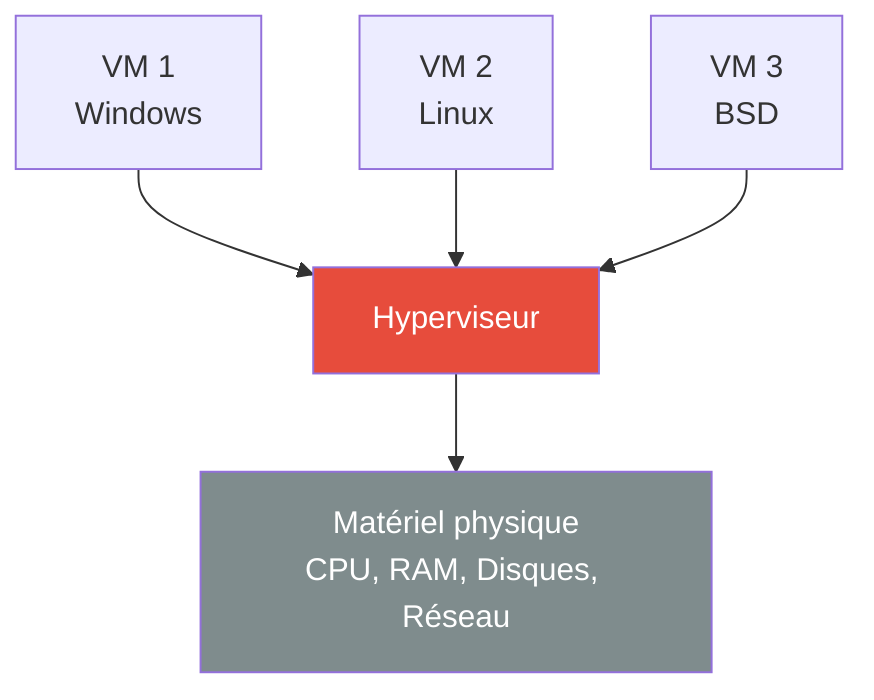
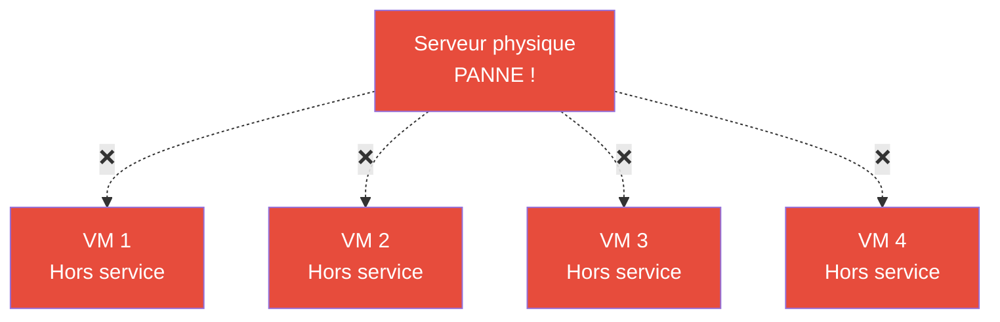
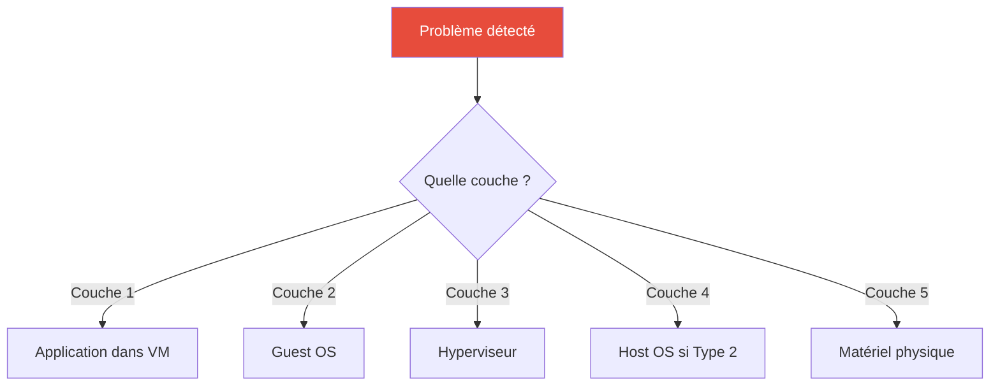
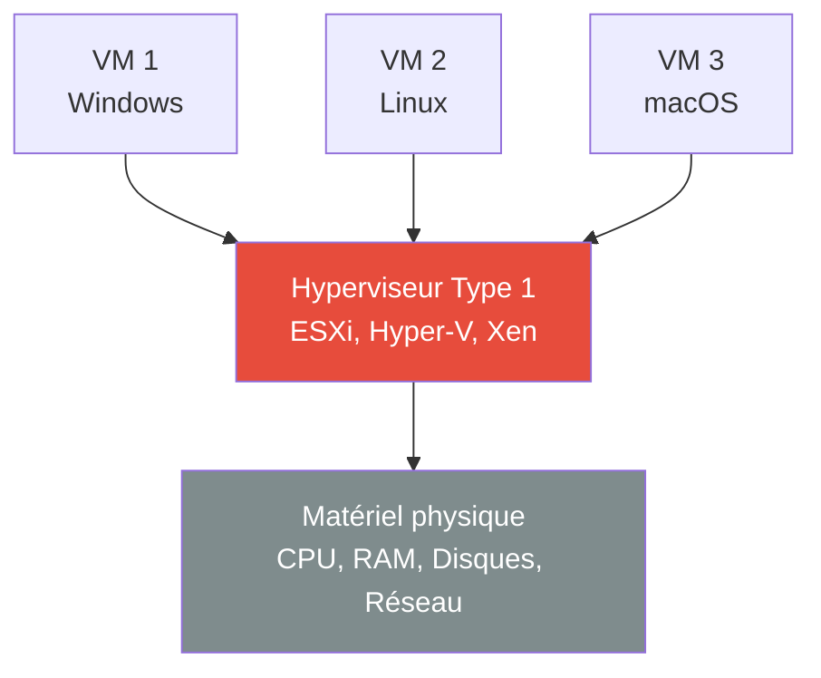
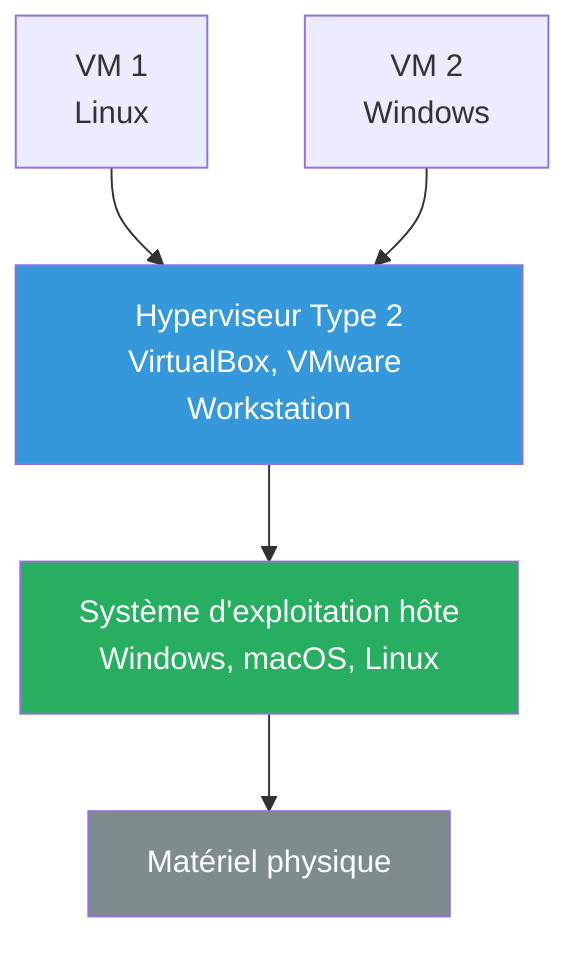
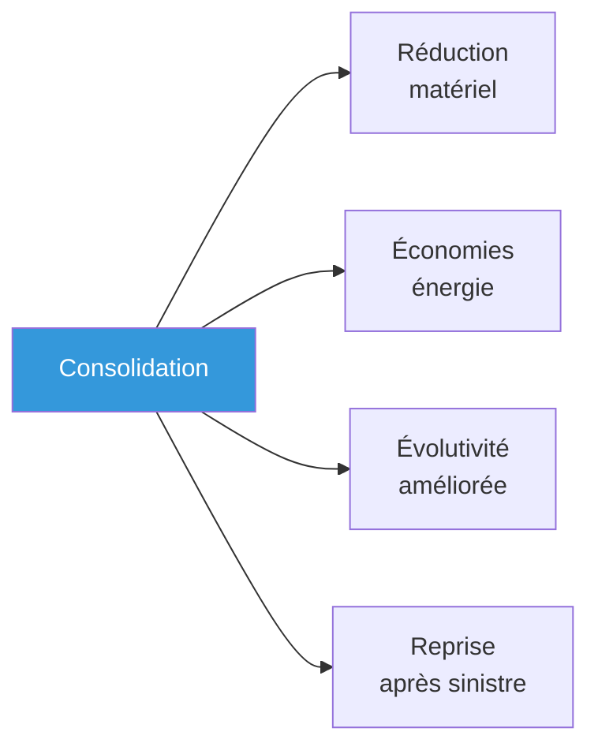
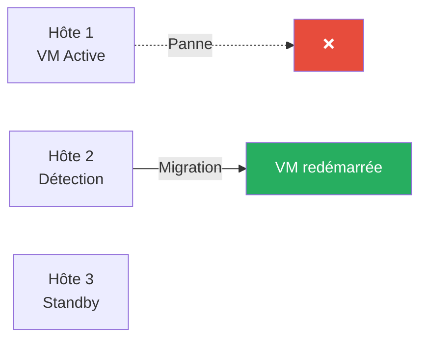

# La virtualisation - Découverte
## Document de révision TSSR - Titre RNCP

---

**Formation** : Technicien Supérieur Systèmes et Réseaux (TSSR)  
**Sujet** : La virtualisation  
**Date** : Novembre 2024  
**Type** : Synthèse de cours complète

---

## 📋 Sommaire

1. [[#Introduction|Introduction]]
   - [[#Glossaire fondamental|Glossaire]]
   - [[#Simulation vs Émulation vs Virtualisation|Différences]]
   - [[#Paravirtualisation|Paravirtualisation]]
2. [[#Avantages de la virtualisation|Avantages]]
   - [[#Optimisation ressources|Optimisation]]
   - [[#Installation et déploiement facilités|Déploiement]]
   - [[#Isolation|Isolation]]
3. [[#Inconvénients de la virtualisation|Inconvénients]]
   - [[#Point de défaillance unique|SPOF]]
   - [[#Besoin machines puissantes|Ressources]]
   - [[#Dégradation performances|Performances]]
   - [[#Complexité analyse|Complexité]]
4. [[#Les types de virtualisation|Types de virtualisation]]
   - [[#Hyperviseur de type 1|Type 1 - Bare Metal]]
   - [[#Hyperviseur de type 2|Type 2 - Hébergé]]
   - [[#Virtualisation du stockage|Stockage]]
   - [[#Virtualisation de réseau|Réseau]]
5. [[#Dans le milieu professionnel|Milieu professionnel]]
   - [[#Consolidation serveurs|Consolidation]]
   - [[#Haute disponibilité|HA]]
   - [[#Solutions entreprise|Solutions]]
6. [[#Points clés à retenir|Points clés]]
7. [[#Glossaire technique|Glossaire]]
8. [[#Ressources complémentaires|Ressources]]

---

## Introduction

> [!abstract] Vue d'ensemble
> La **virtualisation** est une technologie fondamentale en informatique moderne qui permet de créer des versions virtuelles de ressources informatiques (ordinateurs, serveurs, stockage, réseau). Elle est au cœur des infrastructures IT et du cloud computing.

### Pourquoi étudier la virtualisation ?

En tant que **TSSR**, maîtriser la virtualisation est **essentiel** car :

- Les entreprises utilisent massivement la virtualisation (serveurs, postes, réseau)
- Vous installerez et administrerez des **hyperviseurs** (VMware, Hyper-V, Proxmox)
- La virtualisation optimise les **ressources** et réduit les **coûts**
- C'est la base du **cloud computing** et de l'infrastructure moderne
- Tests, développement et déploiement sont **facilités**

---

## Glossaire fondamental

> [!info] Terminologie essentielle

### Termes de base

| Terme | Définition | Exemple |
|-------|------------|---------|
| **Système hôte (Host OS)** | Système d'exploitation principal de l'ordinateur physique | Windows Server, Linux, ESXi |
| **Système invité (Guest OS)** | Système installé à l'intérieur d'une VM | Windows 10 dans VirtualBox |
| **Machine virtuelle (VM)** | Ordinateur virtuel hébergé par un système hôte | VM Ubuntu sur serveur physique |
| **Hyperviseur** | Couche logicielle gérant plusieurs VM simultanément | VMware ESXi, Hyper-V, Proxmox |

### L'hyperviseur en détail

> [!important] Hyperviseur - Définition complète
> L'**hyperviseur** (ou VMM - Virtual Machine Monitor) est une **couche logicielle très légère** qui permet à plusieurs machines virtuelles de fonctionner **simultanément** sur une même machine physique.

**Rôles de l'hyperviseur** :
- **Partage** des ressources physiques entre les VM
- **Isolation** des VM les unes des autres
- **Ordonnancement** du temps CPU
- **Allocation** dynamique de la RAM
- **Gestion** du stockage virtuel
- **Virtualisation** du réseau



---

## Simulation vs Émulation vs Virtualisation

> [!warning] Distinctions importantes
> Ces trois concepts sont souvent confondus mais ont des différences fondamentales.

### La simulation

> [!note] Simulation

**Définition** :
La **simulation** est une **représentation numérique** d'un système réel (ou fictif) basée sur un **modèle abstrait** (simple ou complexe).

**Caractéristiques** :
- Basée sur un **modèle mathématique**
- **Simplifie** la réalité
- Reproduit le **comportement** sans reproduire le système

**Exemple simple** :
```
Calcul heure d'arrivée = f(vitesse, distance, heure_départ)
→ Modèle simplifié (ne tient pas compte du trafic, météo, etc.)
```

**Avantages** :
- Système difficile, coûteux ou dangereux à réaliser
- Parfois la **seule stratégie** pour systèmes très complexes
- Tests sans risque (ex : simulation vol spatial)

**Exemples concrets** :
- **Packet Tracer** : Simule le comportement d'interfaces réseaux
- Simulateurs de vol
- Modèles météorologiques
- Simulations financières

### L'émulation

> [!note] Émulation

**Définition** :
L'**émulation** est le processus de création d'un système qui **reproduit exactement** la manière dont fonctionne ce système.

**Différences avec simulation** :
- ✅ **Toutes les variables** sont connues
- ✅ **Reproduit à l'identique** le système émulé
- ✅ On peut faire **tout** ce qu'on peut faire avec l'original
- ❌ Plus lent (traduction nécessaire)

**Émulateur** :
Programme conçu pour **imiter les propriétés** d'un système "invité" à l'intérieur d'un système "hôte".

**Exemples** :
- **Console de jeu** : Émuler PlayStation sur PC
- **Architecture CPU** : Émuler ARM sur x86
- **Équipements réseau** : Émuler routeur Cisco (Dynamips, IOU)
- Émulateurs GameBoy, NES, etc.

**Cas d'usage** :
```
Développeur veut tester app Android
→ Utilise émulateur Android sur PC Windows
→ L'émulateur reproduit complètement le comportement Android
```

### La virtualisation

> [!important] Virtualisation - Définition complète

**Définition** :
La **virtualisation** est le processus de création d'une **version virtuelle** des ressources informatiques, qu'elles soient matérielles ou logicielles (ordinateur, périphériques de stockage, ressources réseau, OS, etc.).

**Principe clé** :
- Reprend le concept de l'**émulation**
- **MAIS** avec utilisation de l'**architecture du système hôte**
  - Processeur hôte
  - Mémoire hôte
  - Ressources réelles

**Avantage majeur** :
→ **Performances proches du natif** (pas de traduction d'architecture)

**Exemples** :
- **VirtualBox** : Virtualise un OS complet
- **VMware ESXi** : Virtualise des serveurs
- **Hyper-V** : Virtualisation Microsoft

### Comparaison Émulation vs Virtualisation

> [!example] Tableau comparatif

| Aspect | Émulation | Virtualisation |
|--------|-----------|----------------|
| **Performance** | ⚠️ Plus lente (traduction instructions) | ✅ Plus rapide (exécution directe) |
| **Compatibilité** | ✅ Grande (architectures différentes) | ⚠️ Même type de processeur requis |
| **Utilisation** | Vieux logiciels, dev cross-platform | Consolidation serveurs, cloud |
| **Overhead** | ❌ Élevé | ✅ Faible |
| **Exemple** | Émuler ARM sur x86 | Linux VM sur serveur Linux x86 |

**En résumé** :
```
Simulation → Modèle simplifié du comportement
Émulation  → Reproduction exacte (architecture différente)
Virtualisation → Reproduction avec architecture identique
```

### La paravirtualisation

> [!tip] Optimisation avancée

**Définition** :
Dans la **virtualisation classique**, l'hyperviseur émule **entièrement** le matériel pour chaque VM et isole chaque VM de l'hyperviseur.

Dans la **paravirtualisation** :
- Les VM (et donc les guest OS) **"savent"** qu'elles sont virtualisées
- Les VM peuvent faire des **appels spécifiques** à l'hyperviseur (hypercalls)
- Permet une interaction plus **efficace** et **performante**
- **Réduction de l'overhead**

**Avantages** :
- ✅ Meilleures performances
- ✅ Moins de ressources consommées
- ✅ Communication optimisée VM ↔ Hyperviseur

**Inconvénient** :
- ❌ Le guest OS doit être **modifié** pour supporter la paravirtualisation

**Exemples** :
- **Xen** avec guests paravirtualisés
- **VMware Tools** / **Guest Additions** (hybride)
- **Hyper-V Integration Services**

### Relation avec les outils TSSR

> [!example] Outils de la formation

| Outil | Type | Description |
|-------|------|-------------|
| **Packet Tracer** | Simulation | Simulation comportement interfaces réseau connectées |
| **GNS3** | Émulation | Émulation de routeurs, switches, ordinateurs |
| **VirtualBox** | Virtualisation | Virtualisation routeurs, switches, PC (VM + conteneurs) |
| **Proxmox** | Virtualisation | Virtualisation professionnelle (VM + conteneurs) |

---

## Avantages de la virtualisation

> [!success] Bénéfices majeurs

### Optimisation des ressources matérielles

#### État des lieux sur l'utilisation des serveurs

> [!warning] Problème traditionnel
> **Sans virtualisation** :
> - Un serveur physique = Un service système/réseau
> - But : Sécurisation et isolation
> - Résultat : **Sous-utilisation massive** des ressources

**Statistiques typiques** :
```
Serveur physique non virtualisé :
├─ CPU : 5-15% d'utilisation moyenne
├─ RAM : 30-40% utilisée
├─ Stockage : 20-50% utilisé
└─ Coût : 100% du matériel, énergie, espace

→ GASPILLAGE de 70-85% des ressources !
```

> [!success] Solution avec virtualisation
> **Avec virtualisation** :
> - Plusieurs OS et applications sur le **même serveur physique**
> - **Maximise** l'utilisation des ressources
> - **Réduit drastiquement** les coûts

**Exemple concret** :
```
1 serveur physique peut héberger :
├─ VM 1 : Contrôleur de domaine AD
├─ VM 2 : Serveur DHCP
├─ VM 3 : Serveur DNS
├─ VM 4 : Serveur Web (IIS/Apache)
├─ VM 5 : Serveur de fichiers
└─ VM 6 : Serveur de base de données

→ Utilisation CPU : 60-80%
→ 6 serveurs physiques → 1 seul
→ Économies massives !
```

#### Exemples d'architecture

**Virtualisation de serveurs AD** :
```
Serveur physique
└─ Hyperviseur
   ├─ VM 1 : DC avec rôle FSMO Schema Master
   ├─ VM 2 : DC avec rôle FSMO Domain Naming Master
   ├─ VM 3 : DC avec rôle FSMO PDC Emulator
   ├─ VM 4 : DC avec rôle FSMO RID Master
   └─ VM 5 : DC avec rôle FSMO Infrastructure Master
```

**Virtualisation infrastructure** :
```
Serveur physique 1            Serveur physique 2
└─ ESXi                       └─ ESXi
   ├─ VM DHCP                    ├─ VM DNS secondaire
   ├─ VM DNS primaire            ├─ VM Serveur Web
   ├─ VM Serveur fichiers        ├─ VM Serveur mail
   └─ VM Monitoring              └─ VM Backup
```

#### Avantages économiques

| Aspect | Sans virtualisation | Avec virtualisation |
|--------|---------------------|---------------------|
| **Nombre serveurs** | 10 serveurs physiques | 2-3 serveurs physiques |
| **Coût acquisition** | 10 × 3000€ = 30 000€ | 3 × 5000€ = 15 000€ |
| **Consommation électrique** | 10 × 300W = 3000W | 3 × 500W = 1500W |
| **Espace datacenter** | 10 U (racks) | 3 U |
| **Coût refroidissement** | Élevé | Réduit de moitié |
| **Maintenance** | 10 machines à gérer | 3 machines physiques |

**Économies annuelles estimées** : 40-60% sur TCO (Total Cost of Ownership)

### Installation et déploiement facilités

> [!tip] Flexibilité et rapidité

#### Problème traditionnel

**Sans virtualisation** :
1. Acheter serveur physique (délai : semaines)
2. Installer dans datacenter (câblage, config)
3. Installer OS (1-2 heures)
4. Configurer réseau, sécurité
5. Installer applications
6. Tests et mise en production

→ **Temps total : 1-4 semaines**
→ **Complexité : Élevée**

#### Solution avec virtualisation

**Avec virtualisation** :
1. Utiliser un **template** (modèle pré-configuré)
2. **Cloner** la VM (5-10 minutes)
3. Personnaliser (nom, IP, etc.)
4. Démarrer la VM
5. Tests et mise en production

→ **Temps total : 30 minutes - 2 heures**
→ **Complexité : Faible**

#### Fonctionnalités avancées

**Templates (Modèles)** :
- VM pré-installée et configurée
- Base propre et optimisée
- Déploiement rapide de nouvelles instances

**Clonage** :
- Copie exacte d'une VM existante
- Reproduction d'environnements précis
- Tests en environnements identiques

**Snapshots** :
- "Photo" de l'état d'une VM à un instant T
- Retour arrière instantané en cas de problème
- Idéal pour tests et mises à jour

**Migration** :
- Migration à chaud (VM reste active)
- Changement de serveur physique sans interruption
- Facilite la maintenance hardware

**Exemples d'utilisation** :
```
Scénario 1 : Nouveau serveur web nécessaire
→ Clone du template "ServeurWeb_Template"
→ 10 minutes plus tard : serveur opérationnel

Scénario 2 : Mise à jour Windows risquée
→ Snapshot avant mise à jour
→ Si problème : retour snapshot (30 secondes)
→ Si OK : suppression snapshot

Scénario 3 : Maintenance serveur physique
→ Migration à chaud des VM vers autre serveur
→ Maintenance sans interruption de service
→ Migration retour après maintenance
```

### Isolation

> [!success] Sécurité et stabilité

**Principe** :
Dans un environnement virtualisé, chaque système ou application fonctionne dans sa **propre machine virtuelle**, **complètement isolée** des autres.

#### Avantages de l'isolation

**1. Protection contre les pannes** :
```
VM 1 (Serveur Web) plante
└─ Les autres VM ne sont PAS affectées
   ├─ VM 2 (Base de données) → Continue
   ├─ VM 3 (Serveur mail) → Continue
   └─ VM 4 (Serveur fichiers) → Continue
```

**2. Sécurité renforcée** :
- Une faille dans VM1 **n'affecte pas** VM2
- Cloisonnement des données sensibles
- Tests de sécurité sans risque

**3. Environnements hétérogènes** :
```
Même serveur physique :
├─ VM 1 : Windows Server 2022
├─ VM 2 : Ubuntu 22.04
├─ VM 3 : Debian 12
└─ VM 4 : CentOS 8

→ Cohabitation pacifique !
```

**4. Tests et développement** :
- Environnement de test isolé de la production
- Possibilité de "casser" sans conséquence
- Réplication d'environnements clients

**Exemple pratique** :
```
Développeur veut tester nouvelle version logiciel :
1. Clone VM production → VM test
2. Isole VM test du réseau production
3. Installe et teste nouvelle version
4. Si OK : déploiement production
5. Si KO : supprime VM test sans impact
```

---

## Inconvénients de la virtualisation

> [!danger] Limitations et risques

### Point de défaillance unique (SPOF)

> [!warning] Single Point of Failure

**Problème** :
Dans un environnement virtualisé, si la **machine physique tombe en panne**, **toutes** les machines virtuelles hébergées seront **affectées**.



**Impacts** :
- Arrêt de **multiples services** simultanément
- Perte potentielle de données
- Temps de récupération élevé

#### Solutions : Résilience et redondance

> [!success] Stratégies de mitigation

**1. Clustering (Haute disponibilité)** :
```
Serveur physique 1 (Production)    Serveur physique 2 (Standby)
├─ VM 1 Active                     ├─ VM 1 Clone (veille)
├─ VM 2 Active                     ├─ VM 2 Clone (veille)
└─ VM 3 Active                     └─ VM 3 Clone (veille)

Si Serveur 1 tombe :
→ Bascule automatique vers Serveur 2
→ VM clonées activées (temps : 30s - 2min)
```

**2. Réplication continue** :
- Synchronisation temps réel des VM
- Basculement quasi-instantané

**3. Sauvegarde et Disaster Recovery** :
- Backups réguliers des VM
- Plan de reprise d'activité (PRA/PCA)
- Tests réguliers de restauration

**Architecture HA professionnelle** :
```
┌─────────────────────────────────────────────┐
│         Cluster HA (3 serveurs)             │
│                                              │
│  Serveur 1        Serveur 2        Serveur 3│
│  ├─ VM 1          ├─ VM 4          ├─ VM 7  │
│  ├─ VM 2          ├─ VM 5          ├─ VM 8  │
│  └─ VM 3          └─ VM 6          └─ VM 9  │
│                                              │
│  Si 1 serveur tombe :                       │
│  → VM redistribuées sur 2 serveurs restants │
└─────────────────────────────────────────────┘
```

### Besoin de machines puissantes

> [!warning] Overhead et dimensionnement

**Overhead** :
L'**overhead** (surcharge) est la capacité de calcul **supplémentaire** nécessaire pour exécuter l'hyperviseur, c'est-à-dire le **coût en ressources** (CPU, RAM, etc.) pour gérer la virtualisation elle-même.

#### Calcul des ressources

**Exemple de dimensionnement** :
```
Machine physique : 32 cœurs CPU, 128 Go RAM

Overhead hyperviseur : ~10-15%
├─ CPU réservé hyperviseur : 3-5 cœurs
└─ RAM réservée hyperviseur : 12-19 Go

Ressources disponibles pour VM :
├─ CPU : 27-29 cœurs
└─ RAM : 109-116 Go

Si 10 VM à héberger :
├─ Chaque VM : ~3 cœurs CPU
└─ Chaque VM : ~11 Go RAM
```

**Configuration minimale serveur virtualisation** :
```
CPU : 8+ cœurs (16+ recommandé)
RAM : 32 Go minimum (64-128 Go recommandé)
Stockage : SSD/NVMe (performances critiques)
Réseau : 1 Gbps minimum (10 Gbps recommandé)
Redondance : Alimentation, disques (RAID)
```

**Coût initial élevé mais ROI positif** :
- Serveur puissant : 8 000 - 15 000€
- Mais remplace 10-20 serveurs classiques
- Amortissement : 2-3 ans

### Dégradation des performances

> [!warning] Impact sur les performances

**Facteurs de dégradation** :
- Overhead de l'hyperviseur
- Partage des ressources entre VM
- Contention (VM en compétition pour ressources)

**Performance relative** :
```
Application native (serveur physique) : 100%
Application VM (Type 1) : 90-98%
Application VM (Type 2) : 80-90%
Application émulée (différente arch) : 20-50%
```

**Cas où la virtualisation pose problème** :
- Applications très gourmandes en CPU
- Bases de données haute performance
- Traitement vidéo temps réel
- Applications temps réel strict

**Bonnes pratiques** :
- ✅ Dimensionner correctement (ne pas sur-allouer)
- ✅ Utiliser paravirtualisation quand possible
- ✅ SSD/NVMe pour stockage
- ✅ Surveiller les métriques de performance

### Complexité de l'analyse d'erreurs

> [!danger] Dépannage complexe

**Problème** :
En cas d'incident, l'erreur peut provenir de **multiples couches** :



**Exemple de diagnostic** :
```
Symptôme : VM lente

Causes possibles :
1. Application mal optimisée (guest)
2. Guest OS surchargé (trop de processus)
3. Contention ressources (plusieurs VM)
4. Hyperviseur mal configuré
5. Host OS problème (si Type 2)
6. Disque dur physique défaillant
7. RAM défectueuse
8. Réseau saturé
```

**Compétences requises** :
- ✅ Maîtrise des **OS invités** (Windows, Linux)
- ✅ Connaissance de l'**hyperviseur** (ESXi, Hyper-V)
- ✅ Compréhension **matériel** serveur
- ✅ Outils de **monitoring** et logs
- ✅ Analyse **réseau** virtuel

**Outils de diagnostic** :
- Logs hyperviseur
- Monitoring (CPU, RAM, I/O par VM)
- Outils réseau (capture de trafic)
- Logs système des VM

### Inadaptation possible (I/O spécifiques)

> [!warning] Cas où la virtualisation n'est pas adaptée

**Situations problématiques** :

**1. Applications haute performance** :
- Bases de données transactionnelles critiques
- Applications financières (trading haute fréquence)
- Rendering graphique intensif
- Calcul scientifique (HPC)

**2. Accès matériel spécifique** :
```
Exemple : Application nécessitant :
├─ Carte d'acquisition vidéo spécialisée
├─ Dongle USB de licence (protection)
├─ Carte accélératrice GPU spécifique
└─ Interface série RS-232 industrielle

→ Difficile ou impossible à virtualiser
```

**3. Latence critique** :
- Systèmes temps réel strict
- Contrôle industriel
- Télécommunications

**Solutions alternatives** :
- Serveur physique dédié
- Passthrough PCIe (si supporté)
- Conteneurs (moins d'overhead)

---

## Les types de virtualisation

> [!abstract] Classification

### Hyperviseur de type 1 (Bare Metal)

> [!important] Virtualisation matérielle native

#### Définition

**Hyperviseur de type 1** (aussi appelé **bare metal** ou **natif**) :
- Logiciel qui s'exécute **directement** sur la plateforme matérielle
- **Pas de système d'exploitation** sous-jacent
- Premier logiciel chargé au démarrage
- Les VM partagent les ressources physiques directement



#### Caractéristiques

**Avantages** :
- ✅ **Performances maximales** : Accès direct au matériel
- ✅ **Efficacité** : Maximum de ressources pour les VM
- ✅ **Noyau léger** : OS optimisé uniquement pour virtualisation
- ✅ **Stabilité** : Moins de couches logicielles
- ✅ **Sécurité** : Surface d'attaque réduite

**Inconvénients** :
- ❌ **Un seul hyperviseur** à la fois sur la machine
- ❌ **Coût** : Matériel dédié et licences (selon solution)
- ❌ **Complexité** : Installation et configuration
- ❌ **Compatibilité** : Matériel supporté limité

#### Utilisation

**Environnements** :
- **Datacenters d'entreprise**
- **Serveurs de production**
- **Infrastructure cloud** (AWS, Azure, GCP)
- **Centres de calcul**

**Cas d'usage professionnels** :
```
1. Datacenter entreprise :
   └─ Serveurs ESXi
      ├─ VM Exchange Server
      ├─ VM SQL Server
      ├─ VM SharePoint
      └─ VM Serveurs web

2. Cloud provider :
   └─ Milliers de serveurs
      └─ Chacun héberge 10-50 VM clients
```

#### Exemples de solutions Type 1

| Solution | Éditeur | Type | Coût | Marché |
|----------|---------|------|------|--------|
| **VMware ESXi (vSphere)** | VMware (Broadcom) | Propriétaire | Payant | Leader entreprise |
| **Microsoft Hyper-V** | Microsoft | Propriétaire | Inclus Windows Server | Entreprise Windows |
| **Xen** | Linux Foundation | Open Source | Gratuit | Cloud, AWS |
| **KVM** | Linux | Open Source | Gratuit | Linux, Proxmox |
| **Proxmox VE** | Proxmox | Open Source | Gratuit | PME, formation |
| **Citrix Hypervisor (XenServer)** | Citrix | Propriétaire/Open | Payant | Entreprise |
| **Oracle VM** | Oracle | Propriétaire | Payant | Entreprise Oracle |

**Parts de marché (entreprise)** :
```
VMware vSphere : ~65%
Microsoft Hyper-V : ~20%
KVM/Proxmox : ~10%
Autres : ~5%
```

### Hyperviseur de type 2 (Hébergé)

> [!info] Architecture hébergée

#### Définition

**Hyperviseur de type 2** (aussi appelé **hébergé**) :
- Logiciel qui s'exécute **à l'intérieur** d'un autre OS
- Les VM s'exécutent dans un **environnement virtuel**
- "Comme un émulateur" - installé sur un OS, démarré comme application



#### Caractéristiques

**Avantages** :
- ✅ **Facilité d'utilisation** : Installation simple
- ✅ **Flexibilité** : Plusieurs hyperviseurs simultanés possibles
- ✅ **Étanchéité** : Isolation entre VM
- ✅ **Coût** : Solutions gratuites disponibles
- ✅ **Accessibilité** : Sur PC standard

**Inconvénients** :
- ❌ **Performances** : Moins bonnes que Type 1
- ❌ **Overhead** : Double couche OS
- ❌ **Ressources** : Partagées avec host OS
- ❌ **Stabilité** : Dépend du host OS

#### Utilisation

**Environnements** :
- **Postes de travail** développeurs
- **Environnements de test**
- **Formations et TP**
- **Usage personnel**
- **Démonstrations**

**Cas d'usage** :
```
1. Développeur web :
   Windows 10 host
   └─ VirtualBox
      ├─ VM Ubuntu (backend)
      ├─ VM Debian (BDD)
      └─ VM CentOS (test)

2. Étudiant TSSR :
   Windows 11 host
   └─ VirtualBox
      ├─ VM Windows Server
      ├─ VM Linux Ubuntu
      └─ VM pfSense (pare-feu)

3. Formateur :
   macOS host
   └─ Parallels Desktop
      └─ VM Windows (démos Office)
```

#### Exemples de solutions Type 2

| Solution | Éditeur | Plateformes | Coût | Public |
|----------|---------|-------------|------|--------|
| **VirtualBox** | Oracle | Win, Mac, Linux | Gratuit | Grand public, formation |
| **VMware Workstation** | VMware | Windows, Linux | Payant | Professionnels, dev |
| **VMware Fusion** | VMware | macOS | Payant | Professionnels Mac |
| **Parallels Desktop** | Corel | macOS | Payant | Utilisateurs Mac |
| **QEMU** | Open Source | Multi-plateforme | Gratuit | Développeurs, avancé |
| **Virtual Desktop** | Microsoft | Windows | Gratuit | Entreprise Microsoft |

**Note sur Hyper-V** :
> [!note] Cas particulier : Hyper-V
> Hyper-V s'installe comme **rôle** sur Windows mais est en réalité un **hyperviseur Type 1** !
> - Windows est modifié pour s'exécuter **au-dessus** d'Hyper-V
> - Accès direct au matériel
> - Performances Type 1 malgré apparence Type 2

### Comparaison Type 1 vs Type 2

> [!example] Tableau récapitulatif

| Critère | Type 1 (Bare Metal) | Type 2 (Hébergé) |
|---------|---------------------|-------------------|
| **Installation** | Direct sur matériel | Sur OS existant |
| **Performance** | ⭐⭐⭐⭐⭐ Excellente | ⭐⭐⭐ Bonne |
| **Overhead** | Faible (5-10%) | Moyen (15-25%) |
| **Sécurité** | ⭐⭐⭐⭐⭐ Très élevée | ⭐⭐⭐ Moyenne |
| **Stabilité** | ⭐⭐⭐⭐⭐ Très stable | ⭐⭐⭐ Dépend host |
| **Coût** | Élevé | Faible/Gratuit |
| **Complexité** | Élevée | Faible |
| **Usage** | Production, cloud | Test, dev, formation |
| **Exemples** | ESXi, Hyper-V, Xen | VirtualBox, Workstation |

**Choisir Type 1 si** :
- Infrastructure de production
- Performances critiques
- Datacenter / cloud
- Consolidation serveurs
- Budget suffisant

**Choisir Type 2 si** :
- Tests et développement
- Formation / apprentissage
- Usage personnel
- Pas de serveur dédié
- Budget limité

### Virtualisation du stockage

> [!info] Abstraction du stockage

#### Définition

La **virtualisation du stockage** permet de créer des **unités de stockage virtuelles** à partir de ressources physiques existantes.

**Exemples** :
- Fusion de volumes en ressource unique
- Création de disques durs virtuels :
  - **VMDK** (VMware)
  - **VHD/VHDX** (Microsoft)
  - **QCOW2** (QEMU/KVM)
  - **VDI** (VirtualBox)

#### Technologies

**1. Disques virtuels** :
```
VM Linux
└─ Disque virtuel : linux.vmdk (50 Go)
   └─ Stocké sur : /datastore/linux.vmdk
      └─ Datastore : SAN iSCSI 10 To
```

**2. Stockage partagé** :
- **SAN** (Storage Area Network) : Fibre Channel, iSCSI
- **NAS** (Network Attached Storage) : NFS, CIFS/SMB
- **Distributed Storage** : Ceph, GlusterFS

**3. Thin Provisioning** :
```
Disque virtuel déclaré : 100 Go
Espace réellement utilisé : 25 Go
Espace réservé physiquement : 25 Go (croît à la demande)

→ Optimisation de l'espace !
```

#### Avantages

- ✅ **Flexibilité** : Migration à chaud (Storage vMotion)
- ✅ **Indépendance** : Moins d'adhérence aux fournisseurs
- ✅ **Optimisation** : Thin provisioning, déduplication
- ✅ **Snapshots** : Sauvegarde état instantanée

#### Inconvénients

- ❌ **Compatibilité** : Matrices constructeurs strictes
- ❌ **Performance** : Latence réseau (SAN/NAS)
- ❌ **Complexité** : Configuration avancée
- ❌ **Coût** : Solutions SAN coûteuses

### Virtualisation de réseau

> [!info] Réseaux virtuels

#### Définition

La **virtualisation de réseau** permet de créer des **réseaux virtuels** entre VM avec des **cartes réseau virtuelles**.

**Principe** :
```
VM 1 (192.168.1.10)     VM 2 (192.168.1.20)
   |                          |
   └─────── vSwitch 1 ────────┘
              |
         (Isolé ou bridgé vers réseau physique)
```

#### Types de réseaux virtuels

**1. Réseau NAT** :
```
VM ─→ NAT virtuel ─→ Réseau physique ─→ Internet
     (Traduction adresses)
```
- VM accède à internet via l'hôte
- VM non visible depuis l'extérieur

**2. Réseau Bridge (Pont)** :
```
VM ─→ Switch virtuel ─→ Switch physique ─→ Réseau
```
- VM directement sur le réseau physique
- Obtient IP du réseau local (DHCP)

**3. Réseau Interne/Privé** :
```
VM 1 ←→ vSwitch ←→ VM 2
         (Isolé)
```
- Communication uniquement entre VM
- Aucune sortie vers l'extérieur

**4. Réseau Host-Only** :
```
VM ←→ vSwitch ←→ Host (mais pas réseau externe)
```
- Communication VM ↔ Host uniquement

#### Avantages

- ✅ **Isolation** : Réseaux virtuels séparés (sécurité)
- ✅ **Flexibilité** : Reconfigurations sans câblage
- ✅ **Ressources** : Meilleure utilisation bande passante
- ✅ **Tests** : Simulations de topologies complexes

#### Inconvénients

- ❌ **Complexité** : Configuration réseau virtuel
- ❌ **Performance** : Overhead si mal configuré
- ❌ **Dépannage** : Plus difficile à diagnostiquer

#### Exemples d'utilisation

**Formation TSSR** :
```
VirtualBox / Proxmox
├─ Réseau interne "LAN1"
│  ├─ VM Serveur DHCP
│  ├─ VM Client Windows
│  └─ VM Client Linux
│
├─ Réseau interne "DMZ"
│  ├─ VM Serveur Web
│  └─ VM Serveur Mail
│
└─ VM Pare-feu (2 cartes réseau)
   ├─ eth0 → LAN1
   └─ eth1 → DMZ
```

**GNS3** :
- Émulation/virtualisation équipements réseau
- Connexions réseaux virtuelles entre VM et émulateurs

### Exemples de logiciels

> [!example] Solutions par type

| Type | Logiciels | Licence |
|------|-----------|---------|
| **Type 1** | VMware ESXi | Payant |
| | Microsoft Hyper-V | Inclus Windows Server |
| | Xen | Gratuit (Open Source) |
| | KVM | Gratuit (Open Source) |
| | Proxmox VE | Gratuit (Open Source) |
| **Type 2** | Oracle VirtualBox | Gratuit |
| | VMware Workstation | Payant |
| | Parallels Desktop | Payant |
| | QEMU | Gratuit (Open Source) |
| **Réseau** | GNS3 | Gratuit (Open Source) |

---

## Dans le milieu professionnel

> [!success] Applications en entreprise

### Consolidation de serveurs

> [!abstract] Optimisation infrastructure

#### Définition

**Consolidation de serveurs** :
Approche consistant à utiliser efficacement les ressources des serveurs dans le but de **réduire le nombre total** de serveurs physiques dont une entreprise a besoin.

#### Objectifs



#### Exemple : Optimisation temps CPU

**Problème** :
```
3 serveurs physiques séparés :

Serveur messagerie     │ Serveur web         │ Serveur applications
CPU utilisé : 40%       │ CPU utilisé : 40%    │ CPU utilisé : 40%
Reste : 60% GASPILLÉ   │ Reste : 60% GASPILLÉ │ Reste : 60% GASPILLÉ

→ 3 serveurs × 5000€ = 15 000€
→ 3 × 300W = 900W consommation
→ 180% de ressources gaspillées !
```

**Solution** :
```
1 serveur physique avec 3 VM :

VM Messagerie (40%)
VM Applications (40%)
VM Web (40%)
─────────────────────
TOTAL : 120% mais pics décalés !

→ 1 serveur × 6000€ = 6 000€
→ 1 × 400W = 400W consommation
→ Économie : 9 000€ + 500W
```

> [!warning] Attention aux pics communs !
> Il faut analyser les **pics de charge** :
> - Si tous les services ont leur pic **simultanément** → Surcharge
> - Si les pics sont **décalés** → Consolidation possible
>
> **Exemple** :
> ```
> 08h00 : Messagerie pic (utilisateurs arrivent)
> 12h00 : Web pic (pause déjeuner e-commerce)
> 18h00 : Applications pic (fin journée, rapports)
> 
> → Pics décalés = Consolidation OK !
> ```

#### Bénéfices mesurables

| Indicateur | Avant | Après | Gain |
|------------|-------|-------|------|
| **Serveurs physiques** | 20 | 4 | -80% |
| **Coût matériel** | 60 000€ | 25 000€ | -58% |
| **Consommation (kWh/an)** | 26 280 | 7 008 | -73% |
| **Facture électricité (/an)** | 3 942€ | 1 051€ | -73% |
| **Espace datacenter** | 20 U | 4 U | -80% |
| **Temps maintenance** | 100h/mois | 30h/mois | -70% |

**ROI** (Return On Investment) : 18-24 mois typiquement

### Haute disponibilité (HA)

> [!success] High Availability

#### Définition

La **haute disponibilité** (HA - High Availability) est un ensemble de fonctionnalités automatiques conçues pour **planifier** et **récupérer** en toute sécurité les problèmes qui rendent inaccessibles les serveurs.

**Objectif** : Disponibilité maximale des services (99,9% → 99,999%)

#### Niveaux de disponibilité

| Niveau | Disponibilité | Downtime/an | Usage |
|--------|---------------|-------------|-------|
| **99%** | Deux neufs | 3,65 jours | Acceptable |
| **99,9%** | Trois neufs | 8,76 heures | Standard |
| **99,99%** | Quatre neufs | 52,56 minutes | Production critique |
| **99,999%** | Cinq neufs | 5,26 minutes | Mission critique |

#### Mécanismes HA en virtualisation

**1. Clustering** :
```
Cluster HA (3 nœuds minimum)
├─ Nœud 1 (Serveur physique 1)
│  ├─ VM A (Active)
│  └─ VM B (Active)
│
├─ Nœud 2 (Serveur physique 2)
│  ├─ VM C (Active)
│  └─ VM D (Active)
│
└─ Nœud 3 (Serveur physique 3)
   ├─ Capacité réserve
   └─ Prend le relais si panne
```

**2. Reprise sur incident (exemple)** :



**Séquence automatique** :
1. Hôte 1 tombe en panne
2. Cluster détecte la panne (heartbeat)
3. VM automatiquement redémarrée sur Hôte 2 ou 3
4. Temps d'interruption : 30 secondes - 2 minutes

**3. vMotion / Live Migration** :
```
Migration à chaud :
VM Active ───────────┐
(Hôte 1)             │ Migration
                     │ (VM reste active)
                     ↓
                 VM Active
                 (Hôte 2)

→ Temps downtime : 0 seconde !
→ Utilisateurs ne remarquent rien
```

**Cas d'usage** :
- Maintenance matérielle sans interruption
- Équilibrage de charge entre serveurs
- Évacuation d'un serveur pour réparation

#### Solutions professionnelles

| Solution | Éditeur | Fonctionnalités HA |
|----------|---------|---------------------|
| **VMware vSphere HA** | VMware | vMotion, DRS, FT (Fault Tolerance) |
| **Microsoft Hyper-V** | Microsoft | Live Migration, Failover Clustering |
| **Proxmox HA** | Proxmox | Live Migration, Fencing, HA Manager |
| **Red Hat Virtualization** | Red Hat | Live Migration, HA Services |

### Solutions entreprise

> [!example] Les 3 leaders + Formation

#### VMware vSphere

**Caractéristiques** :
- ✅ **Leader du marché** (~65% parts de marché)
- ✅ **Robustesse** et stabilité éprouvées
- ✅ **Fonctionnalités** les plus avancées
- ✅ **Écosystème** riche (intégrations, certifications)

**Composants** :
- **ESXi** : Hyperviseur Type 1
- **vCenter Server** : Gestion centralisée
- **vMotion** : Migration à chaud
- **DRS** : Équilibrage automatique de charge
- **HA** : Haute disponibilité
- **vSAN** : Stockage software-defined

**Public** :
- Grandes entreprises
- Datacenters
- Cloud providers

**Coût** : Élevé (licences par CPU)

#### Microsoft Hyper-V

**Caractéristiques** :
- ✅ **Intégration** parfaite écosystème Microsoft
- ✅ **Inclus** dans Windows Server (Standard/Datacenter)
- ✅ **Familier** pour administrateurs Windows
- ✅ **Coût** attractif si déjà sous licence Microsoft

**Composants** :
- **Hyper-V** : Hyperviseur Type 1
- **System Center Virtual Machine Manager** : Gestion centralisée
- **Live Migration** : Migration à chaud
- **Failover Clustering** : Haute disponibilité
- **Replica** : Réplication VM

**Public** :
- Entreprises Windows
- Infrastructures Microsoft (AD, Exchange, SQL)

**Coût** : Inclus (licences Windows Server nécessaires)

#### Citrix Hypervisor (XenServer)

**Caractéristiques** :
- ✅ Basé sur **Xen** (open source)
- ✅ **Haute performance**
- ✅ Utilisé par **cloud providers**
- ✅ Intégration **Citrix Virtual Apps and Desktops**

**Public** :
- Entreprises
- Fournisseurs cloud
- VDI (Virtual Desktop Infrastructure)

**Coût** : Payant (licences par socket)

#### Proxmox VE (Formation TSSR)

**Caractéristiques** :
- ✅ **Open source** et **gratuit**
- ✅ **Interface web** intuitive
- ✅ Support **VM** (KVM) et **conteneurs** (LXC)
- ✅ **Clustering** et **HA** intégrés
- ✅ Idéal **formation** et **PME**

**Fonctionnalités** :
```
Proxmox VE :
├─ Virtualisation KVM (VM complètes)
├─ Conteneurs LXC (légers)
├─ Interface web (port 8006)
├─ Clustering (plusieurs nœuds)
├─ Haute disponibilité
├─ Sauvegarde/Restauration
├─ Migration à chaud
└─ Support multiples stockages
```

**Avantages pour TSSR** :
- Gratuit (parfait pour labs)
- Complet (fonctionnalités pro)
- Interface moderne
- Documentation riche
- Communauté active

**Public** :
- **Formations** (écoles, TSSR)
- PME/TPE
- Labs personnels
- Environnements de test

**Coût** : Gratuit (support payant optionnel)

---

## Points clés à retenir

> [!success] Synthèse pour le titre RNCP

### Concepts fondamentaux

**Différences essentielles** :
```
Simulation     : Modèle simplifié du comportement
Émulation      : Reproduction exacte (peut changer arch)
Virtualisation : Reproduction avec même architecture
Paravirtualisation : Virtualisation optimisée (guest modifié)
```

**Glossaire crucial** :
- **Host OS** : Système hôte (serveur physique)
- **Guest OS** : Système invité (dans la VM)
- **VM** : Machine virtuelle
- **Hyperviseur** : Gestionnaire de VM
- **Overhead** : Surcharge liée à la virtualisation

### Avantages de la virtualisation

> [!success] Les 3 piliers

1. **Optimisation ressources** :
   - Consolidation serveurs (10 serveurs → 2)
   - Réduction coûts 40-60%
   - Économies énergie massive

2. **Flexibilité déploiement** :
   - Templates et clonage
   - Snapshots (retour arrière)
   - Migration à chaud

3. **Isolation** :
   - Sécurité renforcée
   - Tests sans risque
   - Environnements multiples

### Inconvénients et limites

> [!danger] À ne pas oublier

- **SPOF** : Point de défaillance unique → **HA obligatoire**
- **Ressources** : Serveurs puissants nécessaires
- **Performances** : Overhead 5-25% selon type
- **Complexité** : Dépannage plus difficile
- **Inadaptation** : Pas pour tout (temps réel, I/O spécifiques)

### Types d'hyperviseurs

> [!important] Distinction Type 1 vs Type 2

**Type 1 (Bare Metal)** :
```
VM → Hyperviseur → Matériel
```
- ✅ Performances maximales
- ✅ Production, datacenter
- ❌ Coût élevé
- Exemples : **ESXi, Hyper-V, Proxmox**

**Type 2 (Hébergé)** :
```
VM → Hyperviseur → OS hôte → Matériel
```
- ✅ Facile à utiliser
- ✅ Formation, tests, dev
- ❌ Performances moindres
- Exemples : **VirtualBox, VMware Workstation**

### Autres types virtualisation

- **Stockage** : Disques virtuels (VMDK, VHDX)
- **Réseau** : Switches virtuels, isolation réseaux

### En milieu professionnel

**Consolidation** :
```
20 serveurs physiques → 4 serveurs avec 20 VM
Économie : 60 000€ → 25 000€ (-58%)
```

**Haute disponibilité** :
```
Cluster HA → Panne détectée → VM redémarrée ailleurs
Downtime : 30s - 2min
```

**Solutions majeures** :
1. **VMware vSphere** : Leader, le plus complet
2. **Microsoft Hyper-V** : Intégration Windows
3. **Proxmox VE** : Open source, formation TSSR

### Pour l'examen TSSR

> [!tip] Points essentiels

**À maîtriser** :
- Différence **Type 1** vs **Type 2**
- Avantages : **consolidation, flexibilité, isolation**
- Inconvénients : **SPOF, overhead, complexité**
- Solutions : **ESXi, Hyper-V, Proxmox, VirtualBox**
- **HA** : Haute disponibilité, clustering
- Calcul **overhead** et dimensionnement

**Vocabulaire clé** :
- Hyperviseur, VM, Host/Guest OS
- Bare metal, hébergé
- Snapshot, clone, template
- vMotion / Live Migration
- SPOF, HA, clustering

---

## Glossaire technique

> [!note] Définitions complètes pour le TSSR

| Terme | Définition |
|-------|------------|
| **Virtualisation** | Création de versions virtuelles de ressources informatiques |
| **Simulation** | Représentation numérique basée sur modèle abstrait simplifié |
| **Émulation** | Reproduction exacte du fonctionnement d'un système |
| **Paravirtualisation** | Virtualisation optimisée où le guest OS sait qu'il est virtualisé |
| **Hyperviseur** | Couche logicielle gérant plusieurs VM simultanément (VMM) |
| **Hyperviseur Type 1** | S'exécute directement sur le matériel (bare metal) |
| **Hyperviseur Type 2** | S'exécute sur un système d'exploitation hôte |
| **Machine Virtuelle (VM)** | Ordinateur virtuel complet avec OS et applications |
| **Host OS** | Système d'exploitation de la machine physique |
| **Guest OS** | Système d'exploitation tournant dans une VM |
| **Bare Metal** | Installation directe sur matériel sans OS intermédiaire |
| **Overhead** | Surcharge en ressources nécessaire pour la virtualisation |
| **Snapshot** | Capture de l'état d'une VM à un instant T |
| **Clone** | Copie complète d'une VM |
| **Template** | Modèle de VM pré-configuré pour déploiement rapide |
| **vMotion / Live Migration** | Migration de VM à chaud sans interruption |
| **SPOF** | Single Point Of Failure (point de défaillance unique) |
| **HA** | High Availability (haute disponibilité) |
| **Clustering** | Groupe de serveurs travaillant ensemble pour HA |
| **Consolidation** | Regroupement de plusieurs serveurs physiques en VM |
| **Thin Provisioning** | Allocation dynamique du stockage (croît à la demande) |
| **Thick Provisioning** | Allocation fixe du stockage (réservé d'avance) |
| **vSwitch** | Switch réseau virtuel pour interconnecter VM |
| **VMDK** | Format disque virtuel VMware |
| **VHD/VHDX** | Format disque virtuel Microsoft |
| **QCOW2** | Format disque virtuel QEMU/KVM |
| **Datastore** | Espace de stockage pour VM et disques virtuels |
| **Heartbeat** | Signal de vie entre nœuds d'un cluster |
| **Failover** | Basculement automatique vers système de secours |
| **DRS** | Distributed Resource Scheduler (équilibrage charge VMware) |
| **vSAN** | Virtual Storage Area Network (stockage défini par logiciel) |
| **Conteneur** | Virtualisation légère au niveau OS (Docker, LXC) |
| **KVM** | Kernel-based Virtual Machine (hyperviseur Linux) |
| **ESXi** | Hyperviseur VMware bare metal |

---

## Ressources complémentaires

### Documentation officielle

**Hyperviseurs** :
- Alibaba Cloud - Hyperviseur : https://www.alibabacloud.com/fr/knowledge/what-is-hypervisor
- AWS - Type 1 vs Type 2 : https://aws.amazon.com/fr/compare/the-difference-between-type-1-and-type-2-hypervisors/
- VMware vSphere : https://www.vmware.com/products/vsphere.html
- Microsoft Hyper-V : https://learn.microsoft.com/fr-fr/windows-server/virtualization/hyper-v/
- Proxmox VE : https://www.proxmox.com/en/proxmox-ve

**Outils formation** :
- Dynamips (émulation Cisco) : https://github.com/GNS3/dynamips
- IOU (IOS on Unix) : https://www.802101.com/getting-started-cisco-iou-ios-unix/
- GNS3 : https://www.gns3.com/
- VirtualBox : https://www.virtualbox.org/

### Articles et tutoriels

**Concepts** :
- IT-Connect - Types hyperviseurs : https://www.it-connect.fr/les-types-dhyperviseurs/
- IONOS - Type 1 vs Type 2 : https://www.ionos.fr/digitalguide/serveur/know-how/hyperviseurs-de-type-1-et-2/
- Wikipédia - Hyperviseur : https://fr.wikipedia.org/wiki/Hyperviseur

**Comparatifs solutions** :
- Nutanix - Guide hyperviseurs : https://www.nutanix.com/fr/info/hypervisor
- Lenovo - Hyperviseurs : https://techtoday.lenovo.com/fr/fr/solutions/smb/hyperviseur

### Livres recommandés

**Pour TSSR** :
- "Virtualisation VMware vSphere" - ENI Éditions
- "Hyper-V - Guide d'administration" - ENI Éditions
- "Proxmox VE - Administration d'un système de virtualisation" - ENI Éditions

**Avancés** :
- "Mastering VMware vSphere" - Nick Marshall
- "Windows Server 2022 Hyper-V" - Microsoft Press

### Certifications

**VMware** :
- VCP-DCV (VMware Certified Professional - Data Center Virtualization)
- VCTA-DCV (Associate level)

**Microsoft** :
- AZ-800 : Administering Windows Server Hybrid Core Infrastructure
- AZ-801 : Configuring Windows Server Hybrid Advanced Services

**Linux** :
- RHCVA (Red Hat Certified Virtualization Administrator)
- LPI-202 (Linux Professional Institute)

### Labs et pratique

**Environnements gratuits** :
- VMware Hands-on Labs (HOL) : Labs gratuits en ligne
- Microsoft Learn : Labs Hyper-V gratuits
- Proxmox : Installation sur machine personnelle

**Matériel minimal pour lab TSSR** :
```
PC / Serveur :
├─ CPU : 4+ cœurs avec VT-x/AMD-V
├─ RAM : 16 Go minimum (32 Go recommandé)
├─ Stockage : SSD 250 Go minimum
└─ Réseau : 1 Gbps

→ Permet 3-5 VM simultanées
```

---

## Conclusion

> [!success] Résumé final

Ce document couvre l'essentiel de la **virtualisation** pour le titre RNCP TSSR :

1. ✅ **Concepts fondamentaux** : Simulation, émulation, virtualisation, paravirtualisation
2. ✅ **Avantages** : Optimisation, flexibilité, isolation
3. ✅ **Inconvénients** : SPOF, overhead, complexité
4. ✅ **Types** : Hyperviseur Type 1 vs Type 2, stockage, réseau
5. ✅ **Professionnel** : Consolidation, HA, solutions entreprise
6. ✅ **Solutions** : VMware, Hyper-V, Proxmox, VirtualBox

**Pour réussir l'examen** :
- Maîtriser la **distinction Type 1/Type 2**
- Comprendre les **avantages** (consolidation, flexibilité)
- Connaître les **inconvénients** (SPOF, overhead)
- Savoir expliquer la **haute disponibilité**
- Connaître les **solutions** principales

> [!quote] Citation clé
> **"La virtualisation n'est pas une option, c'est une nécessité dans l'IT moderne. Elle permet d'optimiser les ressources, de réduire les coûts et d'améliorer l'agilité de l'infrastructure."**

**En tant que TSSR** :
- Vous installerez et configurerez des **hyperviseurs**
- Vous créerez et gérerez des **VM** (Windows Server, Linux)
- Vous mettrez en place la **haute disponibilité**
- Vous optimiserez les **ressources** des datacenters
- La virtualisation est au **cœur** de votre métier

**Technologies à maîtriser** :
- **Proxmox VE** : Formation, labs personnels
- **VMware ESXi** : Standard entreprise
- **Hyper-V** : Écosystème Microsoft
- **VirtualBox** : Tests rapides, développement

---

**Document créé pour la formation TSSR - Titre RNCP**  
**Synthèse complète du cours : La virtualisation**

*Bon courage pour vos révisions !* 🚀
