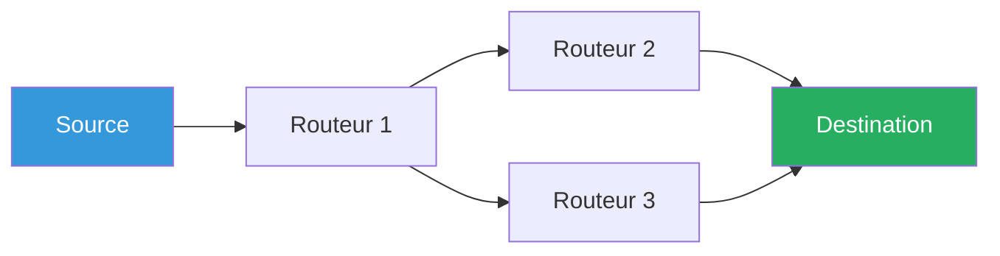

# Principe des Réseaux - Bien débuter
## Document de révision TSSR - Titre RNCP

---

**Formation** : Technicien Supérieur Systèmes et Réseaux (TSSR)  
**Sujet** : Principe des réseaux informatiques  
**Date** : Novembre 2025  
**Type** : Synthèse de cours complète

---

## 📋 Sommaire

1. [[#Introduction|Introduction]]
2. [[#Le réseau informatique|Le réseau informatique]]
   - [[#Définition|Définition]]
   - [[#Types de réseaux|Types de réseaux]]
   - [[#Déploiement et commutation|Déploiement]]
   - [[#Le datagramme et le routage|Datagramme et routage]]
3. [[#La notion de protocole|La notion de protocole]]
   - [[#Organismes de standardisation|Organismes]]
   - [[#Définition et rôle|Définition]]
   - [[#Protocoles courants|Protocoles courants]]
4. [[#Modèle en couches et encapsulation|Modèle en couches]]
   - [[#Approche en couches|Approche]]
   - [[#Protocol Data Unit|PDU]]
   - [[#Encapsulation|Encapsulation]]
5. [[#Le modèle OSI|Le modèle OSI]]
   - [[#Historique OSI|Historique]]
   - [[#Les 7 couches OSI|7 couches]]
   - [[#Critique du modèle|Critique]]
6. [[#Le modèle TCP IP|Le modèle TCP/IP]]
   - [[#Historique TCP IP|Historique]]
   - [[#Les 4 couches TCP IP|4 couches]]
   - [[#Correspondance OSI TCP IP|Correspondance]]
7. [[#Les équipements réseaux|Les équipements réseaux]]
   - [[#Topologies|Topologies]]
   - [[#Équipements par couche|Équipements]]
   - [[#Architecture réseau|Architecture]]
8. [[#Points clés à retenir|Points clés]]
9. [[#Glossaire technique|Glossaire]]

---

## Introduction

> [!abstract] Vue d'ensemble
> Les **réseaux informatiques** sont au cœur de notre société numérique. Comprendre leur fonctionnement, leur architecture et leurs protocoles est **essentiel** pour un Technicien Supérieur Systèmes et Réseaux.

### Pourquoi étudier les réseaux ?

En tant que **TSSR**, vous devez :

- **Concevoir et déployer** des infrastructures réseau
- **Configurer** switches, routeurs, pare-feu
- **Diagnostiquer** les problèmes de connectivité
- **Sécuriser** les communications
- **Optimiser** les performances réseau
- Comprendre les modèles **OSI** et **TCP/IP**

---

## Le réseau informatique

### Définition

> [!quote] Définition fondamentale
> Un **réseau informatique** est un ensemble d'éléments reliés les uns aux autres entre lesquels circulent des informations.

> [!info] Composition d'un réseau

Un réseau est constitué de **quatre éléments essentiels** :

#### 1. Supports physiques (médium)
- **Câbles** : Paires torsadées (RJ45), coaxial, fibre optique
- **Ondes radio** : WiFi, Bluetooth, 4G/5G

#### 2. Équipements d'interconnexion
- Hub, Switch, Routeur, Pont, Pare-feu
- Points d'accès WiFi, Modems

#### 3. Protocoles réseaux
- Règles de communication (TCP/IP, HTTP, DNS, etc.)
- Standards définis par IETF, IEEE, UIT

#### 4. Hôtes
- Ordinateurs, serveurs, smartphones
- Équipements qui profitent des services du réseau

---

### Types de réseaux

> [!important] Classification selon la portée géographique

Les réseaux sont classés selon leur **taille et portée** :

| Type | Acronyme | Échelle | Description | Exemples |
|------|----------|---------|-------------|----------|
| **Personal Area Network** | **PAN** | Personne | Réseau personnel proche | Bluetooth, NFC, USB |
| **Local Area Network** | **LAN** | Bâtiment | Réseau local | Réseau entreprise, domicile |
| **Metropolitan Area Network** | **MAN** | Ville | Réseau métropolitain | Réseau urbain, campus |
| **Wide Area Network** | **WAN** | Pays/Continent | Réseau étendu | Réseau inter-sites, régional |
| **Global Area Network** | **GAN** | Mondial | Réseau planétaire | **Internet** |

> [!example] Exemples concrets
> - **PAN** : Connexion casque Bluetooth avec smartphone
> - **LAN** : WiFi de votre domicile, réseau d'entreprise
> - **MAN** : Réseau fibre optique d'une ville
> - **WAN** : Réseau inter-agences d'une entreprise
> - **GAN** : Internet

---

### Déploiement et commutation

> [!question] Problématique
> Comment déployer un réseau pour relier tous les habitants d'un pays sans câbler chaque logement entre eux ?

**Solution historique** : S'inspirer du **Réseau Téléphonique Commuté (RTC)** avec une architecture hiérarchique et arborescente.

---

#### Commutation de circuit

> [!note] Principe (ancien modèle RTC)

**Fonctionnement** :
- Établissement d'un **canal de communication dédié** de bout en bout
- Réservation de câbles pour la durée de la communication
- Circuit physique entre émetteur et récepteur

**✅ Avantages** :
- Charge réduite aux interconnexions (simple brancher/débrancher)
- **Qualité de service garantie** (canal complet dédié)
- Pas de contention pendant la communication

**❌ Inconvénients** :
- Utilisation du circuit **même en l'absence de communication** (gaspillage)
- En cas de panne → nécessité de **ré-établir la connexion**
- Pas de partage des ressources (inefficace)

---

#### De la nature de l'information

> [!info] Représentation de l'information sur le réseau

**Question** : Comment transporter l'information sur le support physique ?

**Représentation** :
- **Analogique** : Signal continu (ancien, téléphone)
- **Numérique** : Bits 0 et 1 → **Solution des réseaux informatiques**

**Codage de l'information** :
- Comment représenter 1 ? Comment représenter 0 ?
- Dépend des contraintes du support :
  - Atténuation du signal
  - Résistance aux interférences
  - Bande passante disponible
  - Débit souhaité

---

### Le datagramme et le routage

#### Le datagramme

> [!success] Concept clé des réseaux modernes

**Idée générale** :
- Découper l'information en **petits morceaux** → **datagrammes**
- Chaque datagramme peut être **acheminé séparément**
- Un même lien peut transporter des datagrammes de **plusieurs communications simultanément**

**✅ Avantages** :
- **Meilleure utilisation du réseau** (multiplexage)
- **Meilleure robustesse** (chemins alternatifs possibles)
- Pas de gaspillage de ressources
- Résilience en cas de panne

**❌ Inconvénient** :
- Charge des équipements d'interconnexion **supérieure** (traitement de chaque paquet)

> [!example] Analogie
> Imaginez envoyer un livre par courrier :
> - **Commutation de circuit** : Réserver un camion entier pour un seul livre
> - **Datagramme** : Découper le livre en pages et les envoyer séparément, chaque page peut prendre un chemin différent

---

#### Le routage

> [!important] Stratégie d'acheminement des datagrammes

**Définition** :
Le **routage** est la stratégie d'acheminement où, **à chaque interconnexion** du réseau, un **choix de chemin** est effectué pour chaque datagramme.

**Caractéristiques** :
- Les datagrammes d'une même communication peuvent prendre des **chemins différents**
- Décision prise **à chaque nœud** (routeur) du réseau
- Basé sur des **tables de routage** (statiques ou dynamiques)

**Avantages** :
- Adaptation en temps réel aux conditions réseau
- Contournement des pannes automatique
- Équilibrage de charge (load balancing)



---

## La notion de protocole

### Organismes de standardisation

> [!info] Les autorités de normalisation des protocoles réseaux

Les protocoles réseaux sont définis par des **organismes internationaux** :

| Organisme | Nom Complet | Domaine | Publications |
|-----------|-------------|---------|--------------|
| **IETF** | Internet Engineering Task Force | Protocoles Internet (TCP/IP, HTTP, DNS...) | **RFC** (Request For Comments) |
| **IEEE** | Institute of Electrical and Electronics Engineers | Réseaux locaux | **IEEE 802** (Ethernet, WiFi, VLAN) |
| **UIT/ITU** | Union Internationale des Télécommunications | Télécommunications | Normes X, Y, H, G, V |

> [!tip] À retenir pour l'examen
> - **IETF** → TCP/IP, RFC
> - **IEEE** → 802.3 (Ethernet), 802.11 (WiFi), 802.1Q (VLAN)
> - **UIT** → Télécom, fibre optique, codecs

---

### Définition et rôle

> [!quote] Définition officielle
> Un **protocole réseau** est une **norme de communication** mise en œuvre sur un réseau informatique ou un réseau de télécommunications.

> [!important] Rôle d'un protocole

**Objectif principal** : Rendre un ou plusieurs **service(s)**

**Un protocole définit** :

1. **Le format des messages** : Le langage utilisé pour communiquer
   - Structure des données
   - En-têtes, champs, taille
   
2. **Le scénario de communication** : Ordre et conditions des échanges
   - Qui parle en premier ?
   - Quand envoyer un accusé de réception ?
   - Comment gérer les erreurs ?

**Caractéristiques** :
- En général **ouvert** (norme ou standard public)
- Permet l'**interopérabilité** entre équipements de différents constructeurs
- Documenté (RFC, IEEE, ISO)

---

### Protocoles courants

> [!example] Protocoles que vous utiliserez quotidiennement

| Protocole | Port(s) | Transport | Rôle | Couche OSI |
|-----------|---------|-----------|------|------------|
| **HTTP** | 80 | TCP | Protocole de communication du Web | 7 |
| **HTTPS** | 443 | TCP | HTTP sécurisé (avec TLS/SSL) | 7 |
| **FTP** | 21 (+ 20) | TCP | Transfert de fichiers | 7 |
| **DNS** | 53 | UDP (+ TCP) | Résolution de noms de domaine | 7 |
| **SMTP** | 25 | TCP | Envoi d'emails | 7 |
| **POP3** | 110 | TCP | Réception emails (téléchargement) | 7 |
| **IMAP** | 143 | TCP | Réception emails (synchronisation) | 7 |
| **SSH** | 22 | TCP | Administration à distance sécurisée | 7 |
| **Telnet** | 23 | TCP | Administration à distance (non sécurisé) | 7 |
| **DHCP** | 67/68 | UDP | Attribution automatique d'adresses IP | 7 |
| **SNMP** | 161 | UDP | Supervision réseau | 7 |

> [!warning] Attention examen !
> - **FTP** utilise **2 ports** : 21 (contrôle) et 20 (données)
> - **DNS** utilise principalement **UDP 53**, mais aussi **TCP 53** pour les transferts de zones
> - **HTTP** = port 80, **HTTPS** = port 443

---

#### Relation entre port et protocole

> [!info] Comprendre la différence

**Port** :
- **Numéro** utilisé pour identifier une application/service réseau sur une machine
- Représente la **"porte d'entrée"** de l'application/du service
- Plage : **0 à 65535**
  - 0-1023 : **Well-Known Ports** (ports bien connus)
  - 1024-49151 : **Registered Ports** (ports enregistrés)
  - 49152-65535 : **Dynamic/Private Ports** (ports dynamiques)

**Protocole** :
- Définit **comment dialoguer** (format, règles, scénario)
- Utilise un ou plusieurs **ports** pour communiquer

> [!example] Analogie
> - **Port** = Numéro d'appartement dans un immeuble
> - **Adresse IP** = Adresse de l'immeuble
> - **Protocole** = Langue et règles pour parler avec l'occupant

```
┌─────────────────────────────────────┐
│   Machine (Adresse IP: 192.168.1.10) │
│                                      │
│   Port 80  ← Serveur Web (HTTP)     │
│   Port 443 ← Serveur Web (HTTPS)    │
│   Port 22  ← Serveur SSH             │
│   Port 53  ← Serveur DNS             │
└─────────────────────────────────────┘
```

---

## Modèle en couches et encapsulation

### Le problème du réseau

> [!question] Problématique de complexité

Pour faire communiquer tous les équipements réseaux, un protocole unique devrait contenir **l'ensemble des règles** pour gérer tous les aspects → **Problème trop difficile !**

**Solution informatique** :
Face à un problème difficile, on le **découpe en sous-problèmes plus simples** (et si possible indépendants).

**Dans le monde des réseaux** :
Plutôt qu'un unique protocole monolithique → **Approche en couches**

---

### Approche en couches

> [!success] Principe de décomposition

**Idée générale** :

1. Fournir un **service de base simple** qui résout une partie des problèmes
2. À partir de ce service, en construire un **autre plus complexe** qui s'appuie sur le précédent
3. **Répéter** les étapes 1 et 2 jusqu'à résolution du **problème global**

**Avantages** :
- ✅ **Modularité** : Changer une couche sans impacter les autres
- ✅ **Réutilisabilité** : Services utilisables par plusieurs couches supérieures
- ✅ **Abstraction** : Chaque couche cache sa complexité
- ✅ **Maintenance facilitée** : Correction de bugs isolée
- ✅ **Évolution** : Remplacement d'une technologie sans tout changer

**Principe** :
```
┌──────────────────────────────────┐
│  Service COMPLEXE (Couche N+2)   │  ← Utilise le service de la couche N+1
└──────────────────────────────────┘
              ↓
┌──────────────────────────────────┐
│  Service MOYEN (Couche N+1)      │  ← Utilise le service de la couche N
└──────────────────────────────────┘
              ↓
┌──────────────────────────────────┐
│  Service SIMPLE (Couche N)       │  ← Service de base
└──────────────────────────────────┘
```

---

### Protocol Data Unit (PDU)

> [!important] Concepts fondamentaux

**Objectif principal des protocoles réseaux** : Transmettre des informations

**Composants d'un PDU** :

1. **Charge utile (Payload)** ou **SDU (Service Data Unit)** :
   - L'information principale à transmettre
   - Les données utiles

2. **En-tête protocolaire (Header)** :
   - Informations de gestion supplémentaires
   - Transmises **avant** la charge utile
   - Métadonnées nécessaires au protocole

**Formule clé** :
```
PDU = En-tête protocolaire + Payload
```

> [!example] Analogie postale
> Pour envoyer une lettre :
> - **Payload** = Contenu de la lettre (message)
> - **En-tête** = Adresse destinataire, adresse expéditeur, timbre
> - **PDU** = Enveloppe complète avec son contenu

```
┌────────────────────────────────────────┐
│  En-tête  │      Payload (Données)     │  = PDU
└────────────────────────────────────────┘
```

---

### Encapsulation

> [!success] Mécanisme central des modèles en couches

**Définition** :
L'**encapsulation** est le processus par lequel chaque couche ajoute son propre en-tête au PDU de la couche supérieure.

**Fonctionnement** :

Dans un modèle en couches, chaque couche :

1. **Produit un PDU** à destination de la même couche chez le destinataire
2. **Transmet ce PDU** à la couche inférieure qui le traite comme **payload**
3. La couche inférieure **ajoute son propre en-tête**
4. **Répète** jusqu'à la couche physique qui transmet sur le medium

**Formule clé** :
```
PDU de la couche N+1 = Payload de la couche N
```

---

#### Visualisation de l'encapsulation

```
ÉMETTEUR                                    RÉCEPTEUR
========                                    ==========

Données applicatives                        Données applicatives
        ↓                                           ↑
┌───────────────────┐                      ┌───────────────────┐
│     DONNÉES       │                      │     DONNÉES       │
└───────────────────┘                      └───────────────────┘
        ↓                                           ↑
┌─────────┬─────────┐                      ┌─────────┬─────────┐
│ En-tête │ DONNÉES │ = SEGMENT            │ En-tête │ DONNÉES │
│   TCP   │         │   (Couche 4)         │   TCP   │         │
└─────────┴─────────┘                      └─────────┴─────────┘
        ↓                                           ↑
┌─────────┬─────────┬─────────┐            ┌─────────┬─────────┬─────────┐
│ En-tête │ En-tête │ DONNÉES │ = PAQUET   │ En-tête │ En-tête │ DONNÉES │
│   IP    │   TCP   │         │ (Couche 3) │   IP    │   TCP   │         │
└─────────┴─────────┴─────────┘            └─────────┴─────────┴─────────┘
        ↓                                           ↑
┌─────────┬─────────┬─────────┬─────────┬─────┐  ┌─────────┬─────────┬─────────┬─────────┬─────┐
│ En-tête │ En-tête │ En-tête │ DONNÉES │ FCS │  │ En-tête │ En-tête │ En-tête │ DONNÉES │ FCS │
│   ETH   │   IP    │   TCP   │         │     │  │   ETH   │   IP    │   TCP   │         │     │
└─────────┴─────────┴─────────┴─────────┴─────┘  └─────────┴─────────┴─────────┴─────────┴─────┘
        ↓              = TRAME (Couche 2)                 ↑
        ↓                                           ↑
    BITS (0 et 1)                               BITS (0 et 1)
    Transmission physique                       Réception physique
    sur le medium                               depuis le medium
```

> [!tip] Points clés
> - Chaque couche communique **logiquement** avec son homologue distant
> - Chaque couche ne voit que **son propre en-tête** et la payload
> - Le destinataire effectue la **désencapsulation** (opération inverse)
> - La couche N+1 ne connaît pas les détails de la couche N

---

## Le modèle OSI

### Historique OSI

> [!note] Contexte historique

| Année | Événement |
|-------|-----------|
| **Années 70** | 3 architectures propriétaires **incompatibles** (Bull, DEC, IBM) |
| **1971** | Développement du concept de **datagramme** |
| **1978** | Présentation du **modèle OSI** fonctionnel en 7 couches |
| **1983** | Adoption du modèle **TCP/IP** par le réseau ARPANET |
| **1984** | Le modèle OSI devient une **norme ISO 7498** |

---

### Le modèle OSI

> [!quote] Définition
> Le modèle **OSI** (Open Systems Interconnection) est un **modèle théorique** composé de **7 couches** qui sert de **grille d'analyse** des protocoles réseaux.

**Caractéristiques** :
- Modèle **conceptuel** et **pédagogique**
- **Référence** pour comprendre les communications réseau
- Pas toujours appliqué strictement en pratique
- Le modèle **TCP/IP** (4 couches) est plus utilisé en production

---

### Les 7 couches OSI

> [!important] Architecture du modèle OSI

```
┌────────────────────────────────────────────────┐
│ 7 - APPLICATION    │ Données applicatives      │  ┐
├────────────────────────────────────────────────┤  │
│ 6 - PRÉSENTATION   │ Données                   │  │ COUCHES HAUTES
├────────────────────────────────────────────────┤  │
│ 5 - SESSION        │ Données                   │  ┘
├────────────────────────────────────────────────┤
│ 4 - TRANSPORT      │ Segment / Datagramme      │  COUCHE MOYENNE
├────────────────────────────────────────────────┤
│ 3 - RÉSEAU         │ Paquet                    │  ┐
├────────────────────────────────────────────────┤  │ COUCHES BASSES
│ 2 - LIAISON        │ Trame                     │  │
├────────────────────────────────────────────────┤  │
│ 1 - PHYSIQUE       │ Bit                       │  ┘
└────────────────────────────────────────────────┘
```

> [!tip] Mnémotechnique pour l'examen
> **P**lease **D**o **N**ot **T**hrow **S**ausage **P**izza **A**way
> 
> (Physique - Data Link - Network - Transport - Session - Presentation - Application)

---

#### Couche 7 : Application

> [!note] La couche la plus proche de l'utilisateur

| Attribut | Valeur |
|----------|--------|
| **PDU** | Données applicatives |
| **Rôle** | Définit le type ou la signification des informations à échanger |
| **Protocoles** | HTTP, HTTPS, FTP, DNS, SMTP, POP3, IMAP, SSH, Telnet, SNMP |
| **Interaction** | Interface directe avec les applications utilisateur |

**Responsabilités** :
- Services réseau pour les applications
- Formats de données applicatifs
- Gestion des sessions applicatives

> [!example] Exemples concrets
> - Navigateur web → **HTTP/HTTPS**
> - Client email → **SMTP/IMAP/POP3**
> - Client FTP → **FTP**
> - Client DNS → **DNS**

---

#### Couche 6 : Présentation

> [!note] Traduction et formatage des données

| Attribut | Valeur |
|----------|--------|
| **PDU** | "Données" (potentiellement transformées) |
| **Rôle** | Gère la syntaxe et le format des données |
| **Fonctions** | Compression, chiffrement, encodage, conversion |
| **Protocoles** | TLS/SSL, JPEG, MPEG, ASCII, EBCDIC |

**Responsabilités** :
- **Traduction** entre formats de données
- **Chiffrement/déchiffrement** (via TLS/SSL)
- **Compression/décompression**
- Conversion d'encodage (UTF-8, ASCII, etc.)

> [!example] Exemples
> - **TLS/SSL** : Chiffrement HTTPS
> - **JPEG** : Compression d'images
> - **ASCII/Unicode** : Encodage texte

---

#### Couche 5 : Session

> [!note] Gestion du dialogue

| Attribut | Valeur |
|----------|--------|
| **PDU** | Données |
| **Rôle** | Gère l'ouverture/fermeture du dialogue et la reprise après coupure |
| **Protocoles** | SIP (VoIP), RPC, NetBIOS, PPTP |

**Responsabilités** :
- Établissement, maintien et fermeture des **sessions**
- Gestion des **points de reprise** en cas d'interruption
- Contrôle du dialogue (half-duplex, full-duplex)
- Synchronisation

> [!warning] Note importante
> Cette couche est **peu utilisée** en pratique. Ses fonctions sont souvent intégrées dans la couche application.

---

#### Couche 4 : Transport

> [!important] Communication de bout en bout

| Attribut | Valeur |
|----------|--------|
| **PDU** | **Segment** (TCP) ou **Datagramme** (UDP) |
| **Rôle** | Transfert de bout en bout des informations |
| **Protocoles** | **TCP**, **UDP**, SCTP, DCCP |
| **Adressage** | **Ports** (0-65535) |

**Responsabilités** :
- Segmentation et réassemblage des données
- Gestion des **ports** (source et destination)
- Contrôle de flux et de congestion
- Fiabilité (TCP) ou rapidité (UDP)
- Multiplexage des connexions

---

##### TCP vs UDP

> [!example] Deux protocoles, deux philosophies

**TCP (Transmission Control Protocol)** :
- ✅ Orienté **connexion** (3-way handshake)
- ✅ **Fiable** : accusés de réception, retransmission
- ✅ Ordre garanti des données
- ✅ Contrôle de flux et de congestion
- ❌ Plus lent, plus d'overhead
- **Usages** : HTTP, HTTPS, FTP, SSH, SMTP

**UDP (User Datagram Protocol)** :
- ✅ **Sans connexion**
- ✅ **Rapide** et léger
- ✅ Faible latence
- ❌ **Non fiable** : pas d'accusé de réception
- ❌ Pas de garantie d'ordre
- **Usages** : DNS, DHCP, streaming vidéo, VoIP, jeux en ligne

| Critère | TCP | UDP |
|---------|-----|-----|
| **Connexion** | Oui (3-way handshake) | Non |
| **Fiabilité** | Garantie | Non garantie |
| **Ordre** | Garanti | Non garanti |
| **Vitesse** | Plus lent | Plus rapide |
| **Overhead** | Élevé | Faible |
| **Usage** | Transferts fiables | Temps réel |

---

#### Couche 3 : Réseau

> [!important] Routage et adressage IP

| Attribut | Valeur |
|----------|--------|
| **PDU** | **Paquet** |
| **Rôle** | Routage et interconnexion de réseaux hétérogènes |
| **Protocoles** | **IP** (IPv4/IPv6), ICMP, ARP, OSPF, BGP |
| **Adressage** | **Adresses IP** (logiques) |

**Responsabilités** :
- **Routage** : Choix du meilleur chemin
- **Adressage logique** : Adresses IP
- Fragmentation et réassemblage des paquets
- Gestion de la qualité de service (QoS)

> [!example] Adressage IP
> - **IPv4** : 192.168.1.10 (32 bits)
> - **IPv6** : 2001:0db8:85a3::8a2e:0370:7334 (128 bits)

**Protocoles associés** :
- **IP** : Protocole principal de routage
- **ICMP** : Messages d'erreur et diagnostic (ping, traceroute)
- **ARP** : Résolution adresse IP → MAC
- **OSPF, BGP** : Protocoles de routage dynamique

---

#### Couche 2 : Liaison de données

> [!important] Accès au média et détection d'erreurs

| Attribut | Valeur |
|----------|--------|
| **PDU** | **Trame** |
| **Rôle** | Gestion de l'accès au média et détection d'erreurs |
| **Protocoles** | Ethernet (802.3), WiFi (802.11), PPP, HDLC |
| **Adressage** | **Adresses MAC** (physiques) |
| **Contrôle** | CRC/FCS (Frame Check Sequence) |

**Sous-couches** :
- **LLC** (Logical Link Control) : Contrôle de liaison logique
- **MAC** (Medium Access Control) : Contrôle d'accès au média

**Responsabilités** :
- Encapsulation des paquets en **trames**
- **Adressage physique** (adresses MAC)
- Détection d'erreurs (CRC/FCS)
- Contrôle d'accès au média (CSMA/CD, CSMA/CA)

> [!example] Adresse MAC
> Format : 48 bits (6 octets) en hexadécimal
> 
> Exemple : `00:1A:2B:3C:4D:5E`
> - 3 premiers octets = Constructeur (OUI)
> - 3 derniers octets = Numéro unique

---

#### Couche 1 : Physique

> [!note] La couche matérielle

| Attribut | Valeur |
|----------|--------|
| **PDU** | **Bit** (0 et 1) |
| **Rôle** | Définit l'interface physique, les connecteurs et le câblage |
| **Aspects** | Électrique, mécanique, fonctionnel, procédural |

**Responsabilités** :
- Transmission des **bits** sur le support physique
- Codage et modulation du signal
- Définition des caractéristiques électriques (tension, débit)
- Spécifications mécaniques (connecteurs, câbles)

> [!example] Exemples de supports
> - **Ethernet** : Câbles RJ45 catégorie 5e/6/6a
> - **Fibre optique** : Monomode, multimode
> - **WiFi** : Ondes radio 2.4 GHz / 5 GHz / 6 GHz
> - **Bluetooth** : Ondes radio 2.4 GHz

---

### Tableau récapitulatif OSI

> [!success] Vue d'ensemble complète

| Couche | Nom | PDU | Rôle Principal | Protocoles Exemples | Équipements |
|--------|-----|-----|----------------|---------------------|-------------|
| **7** | Application | Données applicatives | Interface utilisateur | HTTP, FTP, DNS, SMTP | - |
| **6** | Présentation | Données | Format, chiffrement, compression | TLS/SSL, JPEG, ASCII | - |
| **5** | Session | Données | Gestion de session | SIP, RPC, NetBIOS | - |
| **4** | Transport | Segment/Datagramme | Bout-en-bout, ports | TCP, UDP | Pare-feu L4 |
| **3** | Réseau | Paquet | Routage, adressage IP | IP, ICMP, OSPF, BGP | Routeur, Switch L3 |
| **2** | Liaison | Trame | Accès média, MAC | Ethernet, WiFi, PPP | Switch L2, Pont |
| **1** | Physique | Bit | Transmission physique | RJ45, fibre, radio | Hub, Répéteur |

---

### Critique du modèle OSI

> [!warning] Limites du modèle théorique

**Modèle théorique** :
- OSI est un modèle **pédagogique** et d'**analyse**
- Le modèle **TCP/IP** est mis en pratique dans les réseaux réels
- OSI reste essentiel pour **comprendre** et **analyser** les protocoles

**Couches rarement utilisées** :
- **Couche 5 (Session)** : Fonctionnalités souvent intégrées dans l'application
- **Couche 6 (Présentation)** : Fusion fréquente avec couche application

**Redondance** :
- Contrôle de flux et d'erreurs présent dans :
  - **Couche 2 (Liaison)** : Détection d'erreurs locales (CRC)
  - **Couche 4 (Transport)** : Contrôle bout-en-bout (TCP)

> [!tip] Conclusion
> Le modèle OSI est **essentiel pour comprendre** les réseaux, mais le **modèle TCP/IP** (4 couches) est plus utilisé en pratique.

---

## Le modèle TCP/IP

### Historique TCP/IP

> [!note] Naissance d'Internet

| Année | Événement |
|-------|-----------|
| **1974** | Vinton Cerf et Bob Kahn publient leurs premiers travaux sur **IP** |
| **1983** | Adoption de **TCP/IP** comme suite de protocoles du réseau **ARPANET** |
| **Aujourd'hui** | TCP/IP est la **base d'Internet** |

> [!quote] Les pères d'Internet
> **Vinton Cerf** et **Bob Kahn** sont considérés comme les "pères d'Internet" pour leur contribution fondamentale à TCP/IP.

---

### Les 4 couches TCP/IP

> [!important] Architecture pratique d'Internet

Le modèle TCP/IP est un **modèle pratique** en **4 couches** basé sur des protocoles réellement implémentés.

```
┌──────────────────────────────────────────────┐
│ 4 - APPLICATION                              │  HTTP, FTP, DNS, SMTP
├──────────────────────────────────────────────┤  (+ TLS optionnel)
│ 3 - TRANSPORT                                │  TCP, UDP
├──────────────────────────────────────────────┤
│ 2 - INTERNET (Réseau)                        │  IP, ICMP, ARP
├──────────────────────────────────────────────┤
│ 1 - ACCÈS RÉSEAU (Liaison + Physique)       │  Ethernet, WiFi
└──────────────────────────────────────────────┘
```

---

### Correspondance OSI ↔ TCP/IP

> [!example] Mapping entre les deux modèles

| Modèle OSI | Modèle TCP/IP | Protocoles Principaux |
|------------|---------------|----------------------|
| 7 - Application | | HTTP, HTTPS, FTP, DNS, SMTP |
| 6 - Présentation | **4 - Application** | TLS/SSL (optionnel) |
| 5 - Session | | |
| 4 - Transport | **3 - Transport** | TCP, UDP |
| 3 - Réseau | **2 - Internet** | IP (IPv4/IPv6), ICMP, ARP |
| 2 - Liaison | **1 - Accès Réseau** | Ethernet, WiFi (802.11) |
| 1 - Physique | | Câbles, connecteurs |

> [!tip] À retenir
> - Couches OSI **7, 6, 5** → Couche TCP/IP **4** (Application)
> - Couche OSI **4** → Couche TCP/IP **3** (Transport)
> - Couche OSI **3** → Couche TCP/IP **2** (Internet)
> - Couches OSI **2, 1** → Couche TCP/IP **1** (Accès réseau)

---

#### Couche 1 : Accès Réseau

> [!note] Communication locale (Liaison + Physique)

**Correspond aux couches OSI 1 et 2**

Le modèle IP s'appuie sur des **réseaux physiques** définis par les normes IEEE :

| Élément | Description |
|---------|-------------|
| **Couche Physique** | Câbles, connecteurs, spécifications électriques |
| **Couche Liaison** | Gestion du média, adressage MAC |
| **Sous-couche MAC** | Medium Access Control - Adresses matérielles MAC |
| **Sous-couche LLC** | Logical Link Control - Encapsulation, détection d'erreur (optionnel) |

**Technologies** :
- **Ethernet** (IEEE 802.3) : Réseaux câblés (10/100/1000 Mbps, 10 Gbps...)
- **WiFi** (IEEE 802.11) : Réseaux sans fil (802.11a/b/g/n/ac/ax)
- **Fibre optique** : Longue distance, très haut débit
- **Bluetooth**, **Zigbee**, **LoRa** : Autres technologies

---

#### Couche 2 : Internet (Réseau)

> [!important] Interconnexion des réseaux

**Correspond à la couche OSI 3**

**Rôle d'IP (Internet Protocol)** :
Interconnexion de réseaux physiques différents pour former un **réseau logique** unique.

**Caractéristiques** :
- Chaque machine possède un **identifiant IP unique**
- Les paquets transitent par des **passerelles (routeurs)**
- Protocoles standardisés par **l'IETF**

**Protocoles de la couche Internet** :

| Protocole | Nom Complet | Rôle |
|-----------|-------------|------|
| **IP** | Internet Protocol | Routage et adressage (IPv4, IPv6) |
| **ICMP** | Internet Control Message Protocol | Messages d'erreur et diagnostic (ping, traceroute) |
| **ARP** | Address Resolution Protocol | Résolution adresse IP → MAC |
| **IGMP** | Internet Group Management Protocol | Gestion du multicast |

---

#### Couche 3 : Transport

> [!important] Communication de bout en bout

**Correspond à la couche OSI 4**

Sur IP, on ajoute une couche transport qui offre des services de communication entre applications.

**Deux protocoles principaux** :

##### TCP (Transmission Control Protocol)

| Caractéristique | Description |
|-----------------|-------------|
| **Type** | Orienté connexion |
| **Fiabilité** | Garantie de livraison (accusés de réception) |
| **Ordre** | Les données arrivent dans l'ordre d'envoi |
| **Contrôle de flux** | Régule le débit pour éviter la saturation |
| **Usages** | HTTP/HTTPS, FTP, SMTP, SSH |

**Phases d'une connexion TCP** :
1. **Établissement** : Three-way handshake (SYN, SYN-ACK, ACK)
2. **Transfert de données** : Avec acquittements (ACK)
3. **Fermeture** : Four-way handshake (FIN, ACK, FIN, ACK)

##### UDP (User Datagram Protocol)

| Caractéristique | Description |
|-----------------|-------------|
| **Type** | Sans connexion |
| **Fiabilité** | Non garanti (pas d'accusé de réception) |
| **Ordre** | Pas de garantie d'ordre |
| **Performance** | Rapide, faible latence, peu d'overhead |
| **Usages** | DNS, DHCP, streaming vidéo, VoIP, jeux en ligne |

**Avantages d'UDP** :
- Faible latence (pas d'établissement de connexion)
- Idéal pour applications temps réel
- Moins de surcharge réseau

---

#### Couche 4 : Application

> [!note] Protocoles applicatifs

**Correspond aux couches OSI 5, 6, 7**

La couche application regroupe tous les protocoles utilisés par les applications finales.

**Sous-couche optionnelle : TLS (Transport Layer Security)** :
- Chiffrement des communications
- Confidentialité et intégrité
- Exemples : HTTPS (HTTP over TLS), FTPS, SMTPS

**Protocoles courants** :

| Protocole | Port | Transport | Fonction |
|-----------|------|-----------|----------|
| **HTTP** | 80 | TCP | Navigation web |
| **HTTPS** | 443 | TCP | Navigation web sécurisée |
| **FTP** | 21 | TCP | Transfert de fichiers |
| **SMTP** | 25 | TCP | Envoi d'emails |
| **POP3** | 110 | TCP | Réception d'emails |
| **IMAP** | 143 | TCP | Réception d'emails (avancé) |
| **DNS** | 53 | UDP (TCP) | Résolution de noms |
| **DHCP** | 67/68 | UDP | Attribution automatique d'IP |
| **SSH** | 22 | TCP | Administration à distance |
| **Telnet** | 23 | TCP | Administration (non sécurisé) |
| **SNMP** | 161 | UDP | Supervision réseau |

---

### Structure complète d'une communication TCP/IP

> [!example] Du clic utilisateur aux bits

```
┌───────────────────────────────────────────────────────┐
│ Couche 4 : APPLICATION                                │
│ Exemple : Requête HTTP "GET /index.html HTTP/1.1"    │
└───────────────────────────────────────────────────────┘
                        ↓
         (Optionnel : Chiffrement TLS)
                        ↓
┌───────────────────────────────────────────────────────┐
│ Couche 3 : TRANSPORT                                  │
│ En-tête TCP :                                         │
│   - Port source : 54321                               │
│   - Port destination : 80                             │
│   - Flags, Numéro de séquence, Acquittement          │
└───────────────────────────────────────────────────────┘
                        ↓
┌───────────────────────────────────────────────────────┐
│ Couche 2 : INTERNET                                   │
│ En-tête IP :                                          │
│   - IP source : 192.168.1.10                          │
│   - IP destination : 93.184.216.34                    │
│   - TTL, Protocole (6=TCP), Checksum                  │
└───────────────────────────────────────────────────────┘
                        ↓
┌───────────────────────────────────────────────────────┐
│ Couche 1 : ACCÈS RÉSEAU                               │
│ En-tête Ethernet :                                    │
│   - MAC source : AA:BB:CC:DD:EE:FF                    │
│   - MAC destination : (du routeur)                    │
│   - Type (0x0800 = IPv4)                              │
│   - FCS (Frame Check Sequence)                        │
└───────────────────────────────────────────────────────┘
                        ↓
              TRANSMISSION PHYSIQUE
              (Bits sur le câble)
```

---

### Synthèse TCP/IP

> [!success] Tableau récapitulatif

| Couche TCP/IP | Équivalent OSI | PDU | Adressage | Exemples |
|---------------|----------------|-----|-----------|----------|
| **4 - Application** | 5-6-7 | Données | Aucun (ou URL) | HTTP, DNS, FTP |
| **3 - Transport** | 4 | Segment/Datagramme | **Ports** (0-65535) | TCP, UDP |
| **2 - Internet** | 3 | Paquet | **Adresses IP** | IPv4, IPv6, ICMP |
| **1 - Accès Réseau** | 1-2 | Trame/Bits | **Adresses MAC** | Ethernet, WiFi |

---

## Les équipements réseaux

### Topologies

> [!quote] Définition
> Une **topologie de réseau** correspond à l'**architecture** (physique, logicielle ou logique) du réseau, définissant les liaisons entre équipements et leur hiérarchie éventuelle.

**Deux types** :
- **Topologie physique** : Interconnexion réelle (câblage)
- **Topologie logique** : Façon dont les données transitent

---

#### Types de topologies

> [!example] Les principales architectures

| Topologie | Description | Avantages | Inconvénients |
|-----------|-------------|-----------|---------------|
| **Bus** | Tous les nœuds sur un câble unique | Simple, économique | Point unique de défaillance |
| **Étoile** | Tous les nœuds reliés à un hub central | Facile à gérer, panne isolée | Hub = point de défaillance |
| **Anneau** | Nœuds reliés en boucle fermée | Équitable, pas de collision | Panne d'un nœud problématique |
| **Maillée** | Chaque nœud relié à plusieurs autres | Très robuste, redondance | Coûteux, complexe |
| **Arbre** | Hiérarchie (comme branches) | Extensible, structuré | Point de défaillance au sommet |
| **Hybride** | Combinaison de topologies | Flexible, adaptable | Complexe à gérer |

> [!tip] En pratique
> La topologie **étoile** (avec switch central) est la plus répandue dans les réseaux locaux modernes (LAN).

---

### Matériel d'interconnexion

> [!important] Catégorisation par couche OSI

Les équipements d'interconnexion sont les **briques constitutives** des réseaux informatiques physiques.

Ils permettent de :
- Réaliser un réseau physique
- Interconnecter des réseaux

On les catégorise selon la **couche du modèle OSI** sur laquelle ils opèrent.

---

#### Équipements de Couche 1 (Physique)

##### Le Répéteur

> [!note] Amplification du signal

| Attribut | Description |
|----------|-------------|
| **Type** | Matériel **passif** (électronique) |
| **Couche OSI** | 1 - Physique |
| **Rôle** | Amplifier un signal électrique ou optique |
| **Fonction** | Augmente la distance d'un réseau |
| **Limite** | N'analyse pas les données, ne filtre pas |

**Utilisation** :
- Régénération du signal électrique/optique
- Extension de portée d'un segment réseau
- Combat l'atténuation du signal

> [!example] Cas d'usage
> Répéteur Ethernet : permet d'étendre un réseau au-delà de 100m (limite du câble catégorie 5e/6).

---

##### Le Concentrateur/Hub

> [!note] Concentration du trafic (obsolète)

| Attribut | Description |
|----------|-------------|
| **Type** | Matériel **passif** |
| **Couche OSI** | 1 - Physique |
| **Rôle** | Concentrer le trafic de plusieurs hôtes |
| **Fonction** | Recopie les données reçues vers **TOUS les autres ports** (broadcast) |
| **Limite** | Crée un domaine de collision unique |

**Caractéristiques** :
- Topologie physique : **étoile**
- Topologie logique : **bus**
- Tous les ports partagent la bande passante
- **Obsolète aujourd'hui** (remplacé par le switch)

> [!warning] Problèmes de sécurité
> Avec un hub, tous les équipements reçoivent toutes les trames → **Problème de sécurité** (sniffing facile) et de **performance** (collisions, partage de bande passante).

---

#### Équipements de Couche 2 (Liaison)

##### Le Pont (Bridge)

> [!note] Interconnexion de segments

| Attribut | Description |
|----------|-------------|
| **Type** | Matériel **actif** |
| **Couche OSI** | 2 - Liaison |
| **Rôle** | Relier des réseaux physiques différents |
| **Fonction** | Filtrage et transfert basé sur **adresses MAC** |
| **Avantage** | Segmente les domaines de collision |

**Utilisation** :
- Interconnexion de segments Ethernet
- Division d'un grand réseau en segments plus petits
- Moins utilisé aujourd'hui (fonction intégrée aux switches)

---

##### Le Commutateur/Switch L2

> [!important] Équipement central des réseaux modernes

| Attribut | Description |
|----------|-------------|
| **Type** | Matériel **actif** |
| **Couche OSI** | 2 - Liaison |
| **Rôle** | Pont multiports intelligent |
| **Fonction** | Recopie les données vers le **port destinataire uniquement** (selon MAC) |
| **Mode** | Half-duplex ou **Full-duplex** |
| **Fonctionnalités** | Gestion de **VLANs** (IEEE 802.1Q) |

> [!success] Fonctionnement intelligent

**Apprentissage** :
Le switch **apprend** les adresses MAC connectées à chaque port et construit une **table MAC** (CAM table).

```
┌────────────────────────────────┐
│      TABLE MAC (CAM)           │
├──────────┬─────────────────────┤
│ Port     │ Adresse MAC         │
├──────────┼─────────────────────┤
│ 1        │ AA:BB:CC:DD:EE:01   │
│ 2        │ AA:BB:CC:DD:EE:02   │
│ 3        │ AA:BB:CC:DD:EE:03   │
│ 4        │ AA:BB:CC:DD:EE:04   │
└──────────┴─────────────────────┘
```

**Avantages** :
- ✅ Chaque port = **domaine de collision séparé**
- ✅ **Full-duplex** : Communication bidirectionnelle simultanée
- ✅ Augmentation significative des performances
- ✅ Sécurité accrue (unicast vers destinataire)
- ✅ Gestion de **VLANs** (segmentation logique)

**VLANs (Virtual LANs)** :
- Segmentation **logique** du réseau
- Isolation du trafic entre VLANs
- Norme : **IEEE 802.1Q**

> [!example] Prix indicatif
> Switch Cisco 2960 (24 ports) : ~1000 € HT

---

#### Équipements de Couche 3 (Réseau)

##### Le Routeur

> [!important] Interconnexion de réseaux IP

| Attribut | Description |
|----------|-------------|
| **Type** | Matériel **actif** |
| **Couche OSI** | 3 - Réseau |
| **Rôle** | Interconnexion de réseaux IP différents |
| **Fonction** | **Routage** des paquets IP entre réseaux |
| **Décision** | Basée sur la **table de routage** |
| **Protocoles** | RIP, OSPF, BGP, EIGRP |

> [!success] Fonction principale

Le routeur **détermine le meilleur chemin** qu'un paquet IP doit emprunter pour atteindre sa destination.

**Responsabilités** :
- Routage inter-réseaux (interconnexion de LANs)
- **Segmentation des domaines de broadcast**
- Traduction d'adresses (**NAT/PAT**)
- Filtrage basique (**ACL** - Access Control Lists)
- Passerelle par défaut pour les hôtes

**Types de routage** :
- **Statique** : Routes configurées manuellement
- **Dynamique** : Routes apprises automatiquement (OSPF, BGP, RIP)

**Exemple de table de routage** :
```
┌────────────────┬──────────────┬─────────────┬─────────┐
│ Réseau Dest.   │ Masque       │ Passerelle  │ Métrique│
├────────────────┼──────────────┼─────────────┼─────────┤
│ 192.168.1.0    │ /24          │ Connected   │ 0       │
│ 10.0.0.0       │ /8           │ 192.168.1.1 │ 10      │
│ 0.0.0.0        │ /0 (défaut)  │ 203.0.113.1 │ 1       │
└────────────────┴──────────────┴─────────────┴─────────┘
```

> [!example] Prix indicatifs
> - **Cisco ASR-9901** : ~70 000 € HT (haute capacité)
> - **Juniper ACX7100-48L** : ~40 000 € HT

---

##### Le Switch L2/L3 (Multicouche)

> [!important] Commutation et routage combinés

| Attribut | Description |
|----------|-------------|
| **Type** | Matériel **actif** |
| **Couche OSI** | 2 **et** 3 |
| **Rôle** | Commutation L2 + routage L3 intégré |
| **Fonction** | Switch + routeur dans un seul boîtier |
| **Avantage** | Routage **inter-VLAN** haute performance |

**Caractéristiques** :
- Fonctionne comme un switch L2 classique (table MAC)
- Intègre des fonctions de routage IP (couche 3)
- Gère les **VLANs** (IEEE 802.1Q)
- Assure le routage **inter-VLAN** à vitesse matérielle (ASIC)
- Moins de latence qu'un routeur externe

**Utilisation typique** :
- **Cœur de réseau** d'entreprise
- **Distribution/agrégation** de trafic
- Routage inter-VLAN haute performance

> [!example] Prix indicatif
> Switch L2/L3 FS S5860-48XMG (48 ports) : ~5 000 € HT

---

#### Équipements de Couche 3-7

##### La Passerelle (Gateway)

> [!note] Point d'entrée vers un autre réseau

| Attribut | Description |
|----------|-------------|
| **Type** | Matériel **actif** |
| **Couche OSI** | 3 à 7 (selon le type) |
| **Rôle** | Point d'entrée vers un autre réseau ou VLAN |
| **Fonction** | Traduction de protocoles, interconnexion |

**Exemples** :
- **Passerelle par défaut** : Routeur (couche 3)
- **Passerelle applicative** : Proxy (couche 7)
- **Passerelle VoIP** : Conversion SIP ↔ RTC

---

##### Le Pare-feu (Firewall)

> [!important] Sécurité du réseau

| Attribut | Description |
|----------|-------------|
| **Type** | Matériel **actif** (ou logiciel) |
| **Couche OSI** | 3 à 7 (selon le type) |
| **Rôle** | Contrôle et filtrage du trafic réseau |
| **Fonction** | Application de **règles de sécurité** |

**Types de pare-feu** :
- **Filtrage de paquets** (L3-L4) : Basé sur IP, ports, protocoles
- **Stateful** : Suivi des connexions établies
- **Application** (L7) : Inspection approfondie (DPI - Deep Packet Inspection)
- **Next-Gen (NGFW)** : IPS, antivirus, détection d'intrusion intégrés

**Règles de filtrage** :
- Source, destination (adresse IP, port)
- Protocole (TCP, UDP, ICMP)
- Actions : **Autoriser**, **Bloquer**, **Journaliser**

> [!warning] À approfondir
> Le pare-feu sera étudié plus en détail dans un cours ultérieur de sécurité réseau.

---

### Architecture réseau

> [!important] Rôles des équipements selon leur emplacement

Les équipements ont des **rôles différents** selon leur **position dans l'architecture** réseau :

| Emplacement | Nom Anglais | Rôle | Équipements Typiques |
|-------------|-------------|------|----------------------|
| **Cœur de réseau** | Core / Backbone | Interconnexion très haut débit | Routeurs L3, Switches L3 haute capacité |
| **Distribution** | Aggregation | Agrégation du trafic | Switches L2/L3, routeurs |
| **Accès** | Access | Connexion des terminaux utilisateurs | Switches L2, points d'accès WiFi |
| **Périphérique** | Edge | Frontière du réseau interne | Routeurs, pare-feu, passerelles |

---

#### Architecture hiérarchique typique

```
                    [INTERNET]
                        │
              ┌─────────┴─────────┐
              │   PÉRIPHÉRIQUE    │  Pare-feu, Routeur Edge
              │   (Edge)          │  Filtrage, NAT
              └─────────┬─────────┘
                        │
              ┌─────────┴─────────┐
              │   CŒUR            │  Switches L3 haute capacité
              │   (Core)          │  Routage ultra-rapide
              └─────────┬─────────┘  Redondance
                        │
        ┌───────────────┼───────────────┐
        │               │               │
   ┌────┴────┐     ┌────┴────┐    ┌────┴────┐
   │ DISTRI- │     │ DISTRI- │    │ DISTRI- │  Switches L2/L3
   │ BUTION  │     │ BUTION  │    │ BUTION  │  Agrégation
   └────┬────┘     └────┬────┘    └────┬────┘  Routage inter-VLAN
        │               │               │
   ┌────┴────┐     ┌────┴────┐    ┌────┴────┐
   │ ACCÈS   │     │ ACCÈS   │    │ ACCÈS   │  Switches L2
   │ Switch  │     │ Switch  │    │ + WiFi  │  Connexion terminaux
   └────┬────┘     └────┬────┘    └────┬────┘  VLANs
        │               │               │
    [Postes]        [Postes]        [Postes]
```

---

### Synthèse : Équipements et modèles

> [!success] Tableau récapitulatif complet

| Équipement | Couche OSI | Couche TCP/IP | Type | Fonction Principale |
|------------|------------|---------------|------|---------------------|
| **Répéteur** | 1 | 1 | Passif | Amplification du signal |
| **Hub** | 1 | 1 | Passif | Concentration (broadcast) |
| **Pont** | 2 | 1 | Actif | Interconnexion de segments |
| **Switch L2** | 2 | 1 | Actif | Commutation par MAC, VLANs |
| **Routeur** | 3 | 2 | Actif | Routage IP inter-réseaux |
| **Switch L3** | 2-3 | 1-2 | Actif | Commutation + routage inter-VLAN |
| **Passerelle** | 3-7 | 2-4 | Actif | Traduction, interconnexion |
| **Pare-feu** | 3-7 | 2-4 | Actif | Filtrage, sécurité |

---

### Exemple de communication réseau complète

> [!example] Du clic au serveur

**Scénario** : Ordinateur A (192.168.1.10) envoie une requête HTTP vers un serveur web B (93.184.216.34)

```
1. COUCHE APPLICATION (OSI 7 / TCP-IP 4)
   └─ Données : "GET /index.html HTTP/1.1"

2. COUCHE TRANSPORT (OSI 4 / TCP-IP 3)
   └─ SEGMENT TCP
      ├─ Port source : 54321 (aléatoire)
      ├─ Port destination : 80 (HTTP)
      └─ Données applicatives

3. COUCHE RÉSEAU (OSI 3 / TCP-IP 2)
   └─ PAQUET IP
      ├─ IP source : 192.168.1.10 (PC A)
      ├─ IP destination : 93.184.216.34 (Serveur B)
      └─ Segment TCP

4. COUCHE LIAISON (OSI 2 / TCP-IP 1)
   └─ TRAME Ethernet
      ├─ MAC source : AA:BB:CC:DD:EE:FF (PC A)
      ├─ MAC destination : (du routeur par défaut)
      └─ Paquet IP

5. COUCHE PHYSIQUE (OSI 1 / TCP-IP 1)
   └─ BITS transmis sur le câble
```

**Chemin des données** :
1. **PC A** → Switch L2 (accès) → Décision par MAC
2. Switch accès → Switch L3 (distribution) → Routage inter-VLAN
3. Switch distribution → Routeur (cœur) → Routage vers Internet
4. Routeur → Pare-feu (périphérie) → Filtrage
5. Pare-feu → Internet → **Multiples routeurs**
6. Internet → **Serveur B**

---

## Points clés à retenir

> [!success] Synthèse pour le titre RNCP

### Définition réseau informatique

1. **Réseau** = Ensemble d'éléments reliés entre lesquels circulent des informations
2. **Composants** = Supports + Équipements + Protocoles + Hôtes
3. **Types** : PAN < LAN < MAN < WAN < GAN (Internet)

### Commutation et routage

```
Commutation de circuit  → Canal dédié (ancien RTC)
Datagramme             → Petits paquets indépendants
Routage                → Choix du chemin à chaque nœud
```

### Protocoles réseaux

**Définition** : Norme de communication (format + scénario)

**Organismes** :
- **IETF** → TCP/IP, RFC
- **IEEE** → Ethernet (802.3), WiFi (802.11), VLAN (802.1Q)
- **UIT** → Télécommunications

**Protocoles courants** :

| Protocole | Port | Transport |
|-----------|------|-----------|
| HTTP | 80 | TCP |
| HTTPS | 443 | TCP |
| FTP | 21 (+ 20) | TCP |
| DNS | 53 | UDP (TCP) |
| SSH | 22 | TCP |

### Encapsulation

```
Données → Segment → Paquet → Trame → Bits
   ↓         ↓         ↓        ↓       ↓
 App.    Transport  Réseau  Liaison  Physique
```

**Règle** : PDU couche N+1 = Payload couche N

### Modèle OSI (7 couches)

```
7 - APPLICATION      : HTTP, FTP, DNS, SMTP
6 - PRÉSENTATION     : TLS/SSL, encodage, compression
5 - SESSION          : Gestion sessions
4 - TRANSPORT        : TCP (fiable), UDP (rapide)
3 - RÉSEAU           : IP, routage, adresses IP
2 - LIAISON          : Ethernet, MAC, trames, VLANs
1 - PHYSIQUE         : Câbles, bits, connecteurs
```

**Mnémotechnique** : **P**lease **D**o **N**ot **T**hrow **S**ausage **P**izza **A**way

### Modèle TCP/IP (4 couches)

```
4 - APPLICATION      : HTTP, DNS, FTP (+ TLS optionnel)
3 - TRANSPORT        : TCP, UDP, ports
2 - INTERNET         : IP, ICMP, ARP, routage
1 - ACCÈS RÉSEAU     : Ethernet, WiFi, MAC
```

### PDU par couche

| Couche OSI | Nom | PDU |
|------------|-----|-----|
| 7-6-5 | Application | **Données** |
| 4 | Transport | **Segment** (TCP) / **Datagramme** (UDP) |
| 3 | Réseau | **Paquet** |
| 2 | Liaison | **Trame** |
| 1 | Physique | **Bit** |

### TCP vs UDP

| Caractéristique | TCP | UDP |
|-----------------|-----|-----|
| Connexion | Oui (3-way handshake) | Non |
| Fiabilité | Garantie | Non garantie |
| Ordre | Garanti | Non garanti |
| Vitesse | Plus lent | Plus rapide |
| Usage | HTTP, FTP, SSH | DNS, streaming, VoIP |

### Équipements par couche

| Équipement | Couche OSI | Fonction |
|------------|------------|----------|
| **Hub/Répéteur** | 1 | Amplification, broadcast |
| **Switch L2** | 2 | Commutation par MAC, VLANs |
| **Routeur** | 3 | Routage IP inter-réseaux |
| **Switch L3** | 2-3 | Commutation + routage inter-VLAN |
| **Pare-feu** | 3-7 | Filtrage, sécurité |

### Adressages

| Type | Couche | Format | Exemple |
|------|--------|--------|---------|
| **MAC** | 2 | 48 bits (6 octets hexa) | `00:1A:2B:3C:4D:5E` |
| **IPv4** | 3 | 32 bits (4 octets décimaux) | `192.168.1.10` |
| **IPv6** | 3 | 128 bits (8 groupes hexa) | `2001:0db8::1` |
| **Port** | 4 | 16 bits (0-65535) | `80`, `443`, `22` |

### Architecture réseau

```
CORE (Cœur)         : Routeurs/Switches L3 très haut débit
  ↓
DISTRIBUTION        : Switches L2/L3 agrégation
  ↓
ACCÈS              : Switches L2, WiFi, connexion utilisateurs
  ↓
EDGE (Périphérie)  : Pare-feu, routeur frontière Internet
```

---

## Glossaire technique

> [!note] Définitions essentielles pour le TSSR

| Terme | Définition |
|-------|------------|
| **ACL (Access Control List)** | Liste de règles de filtrage appliquée sur routeur/pare-feu |
| **ARP (Address Resolution Protocol)** | Protocole de résolution adresse IP → MAC |
| **BGP (Border Gateway Protocol)** | Protocole de routage externe (Internet) |
| **Broadcast** | Diffusion d'un message à tous les équipements du réseau |
| **Commutation** | Action de diriger les trames vers le port approprié |
| **Datagramme** | Paquet de données indépendant pouvant être routé séparément |
| **DHCP** | Dynamic Host Configuration Protocol - Attribution auto d'IP |
| **Domaine de collision** | Zone où les trames peuvent entrer en collision (hub) |
| **Domaine de broadcast** | Zone où les broadcasts sont propagés (VLAN, réseau IP) |
| **Encapsulation** | Ajout d'en-têtes successifs par chaque couche |
| **FCS (Frame Check Sequence)** | Somme de contrôle pour détecter erreurs dans trame |
| **Full-duplex** | Communication bidirectionnelle simultanée |
| **Gateway (Passerelle)** | Point d'entrée vers un autre réseau |
| **Half-duplex** | Communication bidirectionnelle alternée |
| **ICMP** | Internet Control Message Protocol - Messages contrôle (ping) |
| **IEEE 802.1Q** | Norme de marquage des VLANs |
| **IEEE 802.3** | Norme Ethernet |
| **IEEE 802.11** | Norme WiFi |
| **IETF** | Internet Engineering Task Force - Organisme standardisation |
| **IP (Internet Protocol)** | Protocole de routage couche réseau |
| **LAN (Local Area Network)** | Réseau local |
| **LLC** | Logical Link Control - Sous-couche liaison |
| **MAC** | Medium Access Control - Sous-couche liaison + adresse matérielle |
| **MAN** | Metropolitan Area Network - Réseau métropolitain |
| **NAT** | Network Address Translation - Traduction d'adresses |
| **OSI** | Open Systems Interconnection - Modèle 7 couches |
| **OSPF** | Open Shortest Path First - Protocole routage interne |
| **PAN** | Personal Area Network - Réseau personnel |
| **Paquet** | PDU de la couche réseau (couche 3) |
| **Payload** | Charge utile, données transportées |
| **PDU (Protocol Data Unit)** | En-tête + payload |
| **Port** | Numéro identifiant application/service (0-65535) |
| **Protocole** | Norme de communication (format + scénario) |
| **QoS (Quality of Service)** | Qualité de service, priorisation trafic |
| **RFC (Request For Comments)** | Documents standardisation IETF |
| **Routage** | Choix du chemin pour acheminer paquet IP |
| **SDU (Service Data Unit)** | Charge utile, données de service |
| **Segment** | PDU couche transport (TCP) |
| **Switch** | Commutateur L2 (MAC) ou L2/L3 |
| **Table de routage** | Table contenant routes connues par routeur |
| **Table MAC (CAM)** | Association adresses MAC ↔ ports sur switch |
| **TCP** | Transmission Control Protocol - Fiable, orienté connexion |
| **TLS** | Transport Layer Security - Chiffrement (ex-SSL) |
| **Topologie** | Architecture physique ou logique réseau |
| **Trame** | PDU couche liaison (couche 2) |
| **TTL (Time To Live)** | Durée de vie paquet IP (nombre sauts) |
| **UDP** | User Datagram Protocol - Rapide, non fiable |
| **Unicast** | Envoi message à un seul destinataire |
| **VLAN** | Virtual LAN - Réseau local virtuel, segmentation logique |
| **WAN** | Wide Area Network - Réseau étendu |

---

**Document créé le** : 21 novembre 2025  
**Version** : 1.0  
**Source** : Cours "Principe des réseaux" - Formation TSSR

> [!success] ✅ BON COURAGE POUR VOTRE TITRE RNCP TSSR !

---
