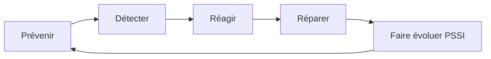

# Introduction à la Cybersécurité
## Document de révision TSSR - Titre RNCP

---

**Formation** : Technicien Supérieur Systèmes et Réseaux (TSSR)  
**Sujet** : Introduction à la cybersécurité  
**Date** : Novembre 2024  
**Type** : Synthèse de cours complète

---

## 📋 Sommaire

1. [[#Introduction|Introduction]]
2. [[#Le Système d'Information|Le Système d'Information]]
3. [[#Les menaces et vulnérabilités|Les menaces et vulnérabilités]]
4. [[#Ingénierie sociale|Ingénierie sociale]]
5. [[#Les logiciels malveillants|Les logiciels malveillants]]
6. [[#Les mots de passe|Les mots de passe]]
7. [[#Points clés à retenir|Points clés à retenir]]
8. [[#Glossaire technique|Glossaire technique]]
9. [[#📖 Références externes|Références externes]]

---

## Introduction

> [!abstract] Vue d'ensemble
> Ce cours présente les **concepts fondamentaux de la cybersécurité** : système d'information, menaces, vulnérabilités, ingénierie sociale, logiciels malveillants et authentification. Tu découvriras les bonnes pratiques pour protéger un SI et comprendre les enjeux de sécurité dans un contexte professionnel.

> [!quote] Définition - Cybersécurité (Wikipédia)
> La **cybersécurité** est un néologisme désignant le rôle de l'ensemble des lois, politiques, outils, dispositifs, concepts et mécanismes de sécurité, méthodes de gestion des risques, actions, formations, bonnes pratiques et technologies qui peuvent être utilisés pour **protéger les personnes et les actifs informatiques** matériels et immatériels (connectés directement ou indirectement à un réseau) des États et des organisations (avec un objectif de disponibilité, intégrité, authenticité, confidentialité, preuve et non-répudiation).

### Pourquoi étudier la cybersécurité ?

En tant que **TSSR**, tu dois :
- Comprendre les **risques** pesant sur les systèmes d'information
- Identifier les **vulnérabilités** et les **menaces**
- Mettre en œuvre des **mesures de protection**
- Sensibiliser les utilisateurs aux **bonnes pratiques**
- Participer à la **Politique de Sécurité du SI (PSSI)**

> [!important] Compétences RNCP visées
> - Identifier et analyser les menaces sur un SI
> - Mettre en œuvre des solutions de protection
> - Sensibiliser les utilisateurs à la sécurité
> - Appliquer une politique de sécurité
> - Gérer les mots de passe et l'authentification

---

## Le Système d'Information

### Définition du SI

> [!quote] Système d'Information (SI)
> Le **système d'information** est un ensemble organisé de ressources qui permet de **collecter, stocker, traiter et distribuer de l'information**, en général grâce à un réseau d'ordinateurs.

**En bref** : Le SI permet et facilite la **mission de l'organisation**.

**Composants typiques d'un SI** :
- **Matériel** : serveurs, postes de travail, équipements réseau
- **Logiciels** : systèmes d'exploitation, applications, bases de données
- **Données** : informations traitées et stockées
- **Procédures** : processus et règles d'utilisation
- **Personnes** : utilisateurs, administrateurs, développeurs

### Cybersécurité et sécurité du SI

> [!important] Objectif de la cybersécurité
> La **sécurité du SI** (ou cybersécurité) consiste à **protéger le système d'information**.

#### Sécurité vs Sûreté

| Concept | Définition | Exemples |
|---------|------------|----------|
| **Sécurité** | Protection contre les **actions malveillantes** | Attaques, piratages, virus |
| **Sûreté** | Protection contre les **dysfonctionnements et accidents** | Pannes, erreurs, catastrophes naturelles |

### Besoins D.I.C.P (C.I.A. en anglais)

> [!important] Les 4 piliers de la sécurité
> **D.I.C.P** représente les besoins fondamentaux en sécurité :

#### Disponibilité (Availability)

> [!quote] Définition
> Le service doit être **accessible aux personnes autorisées quand elles en ont besoin**.

**Exemples** :
- Un site web doit être disponible 24/7
- Les serveurs critiques doivent avoir une haute disponibilité (99,9%)
- Protection contre les attaques DDoS

**Menaces** : Déni de service (DoS/DDoS), pannes, sabotage

---

#### Intégrité (Integrity)

> [!quote] Définition
> Garantir l'**exactitude et la complétude des informations**, des processus et des moyens.

**Exemples** :
- Les données ne doivent pas être modifiées sans autorisation
- Les transactions bancaires doivent être exactes
- Les logs système ne doivent pas être altérés

**Menaces** : Modification non autorisée, corruption de données, malwares

---

#### Confidentialité (Confidentiality)

> [!quote] Définition
> Les informations doivent être **accessibles uniquement aux personnes autorisées**.

**Exemples** :
- Dossiers médicaux accessibles uniquement au personnel soignant
- Données clients protégées
- Secrets commerciaux chiffrés

**Menaces** : Vol de données, écoute réseau, accès non autorisé

---

#### Preuve (Accountability)

> [!quote] Définition
> Retrouver avec une **confiance suffisante les circonstances des évolutions du SI**.

**Composantes de la preuve** :

| Élément | Description |
|---------|-------------|
| **Traçabilité** | Historique des modifications |
| **Authentification** | Reconnaître les utilisateurs |
| **Imputabilité** | Qui a fait quoi et quand |

**Exemples** :
- Logs d'accès aux serveurs
- Journalisation des modifications de configurations
- Audit trail des transactions

> [!note] Chaque SI a ses propres besoins D.I.C.P
> Selon le contexte, certains besoins peuvent être prioritaires :
> - **Banque** : Intégrité et confidentialité prioritaires
> - **Site d'actualités** : Disponibilité prioritaire
> - **Hôpital** : Disponibilité et confidentialité critiques

---

### Politique de Sécurité du SI (PSSI)

> [!important] PSSI - Document de référence
> La **Politique de Sécurité du Système d'Information** définit les règles, procédures et mesures pour protéger le SI.

#### Qu'est-ce qu'on fait ?

**Concevoir une PSSI nécessite** :

1. **Analyse de risques** :
   - Cartographier le SI (inventaire des actifs)
   - Identifier et évaluer les risques
   - Définir son modèle de menace
   - Décider des solutions à déployer

2. **Mise en œuvre** :
   - Déployer les solutions techniques
   - Former les utilisateurs
   - Établir les procédures

3. **Suivi et amélioration continue** :
   - Audit régulier
   - Veille sécurité
   - Mise à jour de la PSSI

> [!note] Le RSSI (CISO)
> Le **Responsable de la Sécurité des Systèmes d'Information** (RSSI) ou **Chief Information Security Officer** (CISO) est généralement en charge d'établir et de faire appliquer la PSSI.

**Rôles du RSSI** :
- Définir la stratégie de sécurité
- Analyser les risques
- Piloter les projets sécurité
- Sensibiliser et former
- Gérer les incidents de sécurité

---

## Les menaces et vulnérabilités

### Concepts clés

> [!important] Trio fondamental de l'analyse de risques

#### Vulnérabilité

> [!quote] Définition
> Une **vulnérabilité** est une faiblesse de conception, réalisation, installation, configuration ou utilisation d'un système.

**Exemples** :
- Logiciel non mis à jour (failles de sécurité connues)
- Mot de passe faible
- Port réseau ouvert inutilement
- Mauvaise configuration firewall
- Absence de chiffrement

---

#### Menace

> [!quote] Définition
> Une **menace** est une cause potentielle d'un dommage sur tous les éléments du SI.

**Types de menaces** :
- **Humaines** : pirates, employés malveillants, erreur humaine
- **Techniques** : pannes matérielles, bugs logiciels
- **Environnementales** : incendies, inondations, coupures électriques

---

#### Attaque

> [!quote] Définition
> Une **attaque** est une action malveillante, la **concrétisation d'une menace exploitant une vulnérabilité**.

**Formule** :
```
Attaque = Menace + Vulnérabilité
```

**Exemple concret** :
- **Vulnérabilité** : Serveur web non mis à jour avec faille SQL injection
- **Menace** : Pirate cherchant à voler des données
- **Attaque** : Exploitation de la faille SQL pour accéder à la base de données

---

### Traiter les vulnérabilités

> [!important] Cycle de gestion de la sécurité

Le traitement des vulnérabilités suit un cycle continu :



#### 1. Prévenir

> [!tip] Prévention
> **Éviter** l'apparition de vulnérabilités.

**Actions** :
- Développement sécurisé
- Configuration robuste
- Principe de moindre privilège
- Défense en profondeur

---

#### 2. Détecter

> [!tip] Détection
> **Savoir si et quand** une attaque a lieu.

**Outils** :
- IDS/IPS (Intrusion Detection/Prevention System)
- SIEM (Security Information and Event Management)
- Analyse des logs
- Surveillance réseau

---

#### 3. Réagir

> [!tip] Réaction
> **Décider de la réponse appropriée** à l'attaque.

**Actions** :
- Isolement du système compromis
- Blocage de l'attaquant
- Activation du plan de continuité
- Communication de crise

---

#### 4. Réparer

> [!tip] Réparation
> **Remettre le SI en état opérationnel**.

**Actions** :
- Correction des vulnérabilités
- Restauration des données
- Renforcement de la sécurité
- Tests de validation

---

#### 5. Faire évoluer la PSSI

> [!tip] Amélioration continue
> Tirer les leçons de l'incident pour améliorer la sécurité.

**Actions** :
- Retour d'expérience (REX)
- Mise à jour des procédures
- Formation complémentaire
- Ajustement des mesures

---

### Étude des vulnérabilités

> [!info] Méthodologie d'analyse
> L'étude des vulnérabilités nécessite une approche méthodique.

#### Critères de classification

**Classement en fonction de** :

| Critère | Exemples |
|---------|----------|
| **Sources** | Niveau de compétence/moyens, interne/externe, motivations (financière, idéologique, etc.) |
| **Cibles** | Logiciel, matériel, personnes, données, processus |
| **Nature des atteintes** | D.I.C.P (quelle pilier est touché) |

#### Méthodologie EBIOS RM

> [!note] EBIOS Risk Manager
> **EBIOS RM** (Expression des Besoins et Identification des Objectifs de Sécurité - Risk Manager) est une méthode d'analyse et de gestion des risques cyber, développée par l'ANSSI (Agence Nationale de la Sécurité des Systèmes d'Information).

**Les 5 ateliers EBIOS RM** :
1. Cadrage et socle de sécurité
2. Sources de risque
3. Scénarios stratégiques
4. Scénarios opérationnels
5. Traitement du risque

---

## Ingénierie sociale

### Définition

> [!quote] Ingénierie sociale (Social Engineering)
> L'**ingénierie sociale** consiste à **influencer des utilisateurs légitimes** pour qu'ils agissent dans l'intérêt du cybercriminel.

**Principe** : Exploiter le facteur humain plutôt que les failles techniques.

**Canaux utilisés** :
- 📞 Téléphone
- 📧 E-mail
- 💬 Réseaux sociaux
- 👤 En personne
- 💻 Sites web frauduleux

> [!warning] Le maillon faible
> L'ingénierie sociale cible souvent le **maillon le plus faible** : l'être humain. Les utilisateurs sont plus faciles à tromper que les systèmes techniques bien configurés.

### Techniques courantes

#### Hameçonnage (Phishing)

> [!important] Phishing - La pêche au chalut
> Le **hameçonnage** consiste à **mimer un site web ou un e-mail légitime** pour tenter d'obtenir des informations sensibles (identifiants, mots de passe, numéros de carte bancaire...).

**Caractéristiques** :
- Attaque de **masse** (envoi à des milliers de victimes)
- Imitation de sites connus (banques, administrations, réseaux sociaux)
- Sens de l'urgence pour pousser à l'action
- URL frauduleuses très proches de l'original

**Exemple d'e-mail de phishing** :
```
De : service-client@amaz0n.com  ← Attention au "0" !
Objet : Votre compte sera suspendu !

Cher client,

Nous avons détecté une activité suspecte sur votre compte.
Cliquez ici pour vérifier votre identité : http://amaz0n-verify.tk

Si vous ne répondez pas sous 24h, votre compte sera suspendu.

L'équipe Amazon
```

> [!warning] Signaux d'alerte phishing
> - Fautes d'orthographe et de grammaire
> - Sens de l'urgence excessif
> - Demande d'informations sensibles
> - Lien vers un site suspect
> - Adresse e-mail douteuse
> - Pièce jointe inattendue

---

#### Harponnage (Spear Phishing)

> [!important] Spear Phishing - Attaque ciblée
> Le **harponnage** est une variante du phishing, mais **ciblée** sur une personne ou une organisation spécifique.

**Différences avec le phishing** :

| Critère | Phishing | Spear Phishing |
|---------|----------|----------------|
| **Cible** | Masse (milliers) | Individu/groupe spécifique |
| **Personnalisation** | Générique | Très personnalisé |
| **Recherche préalable** | Aucune | Renseignements approfondis |
| **Taux de réussite** | Faible (~3%) | Élevé (~30-50%) |
| **Difficulté** | Faible | Élevée |

**Exemple** :
```
De : directeur@entreprise.com (usurpation d'identité)
À : responsable.comptabilite@entreprise.com

Bonjour Marie,

Je suis en déplacement chez un client. J'ai besoin que tu effectues
un virement urgent de 50 000€ vers ce compte :
IBAN : FR76...

Envoie-moi la confirmation dès que c'est fait.

Merci,
Pierre Dupont
Directeur Général
```

---

#### Autres techniques d'ingénierie sociale

| Technique | Description |
|-----------|-------------|
| **Pretexting** | Créer un scénario fictif crédible pour obtenir des infos |
| **Baiting** | Laisser un appât (clé USB, lien) pour attirer la victime |
| **Quid pro quo** | Promettre un service en échange d'informations |
| **Tailgating** | Suivre quelqu'un pour accéder à un lieu protégé |
| **Vishing** | Phishing par téléphone (voice phishing) |
| **Smishing** | Phishing par SMS |

---

### Prévention de l'ingénierie sociale

> [!success] Des utilisateurs éclairés
> La meilleure défense contre l'ingénierie sociale est la **formation et la sensibilisation** des utilisateurs.

#### Mesures de prévention

**Formation et sensibilisation** :
- ✅ Former **tous les utilisateurs** (pas seulement l'IT)
- ✅ Campagnes de sensibilisation régulières
- ✅ Simulations d'attaques (phishing tests)
- ✅ Affiches et rappels visuels

**Bonnes pratiques utilisateur** :

> [!tip] Vérifications essentielles
> **Avant de cliquer ou de communiquer des informations** :

1. **Vérifier les URL** avant connexion :
   - ✅ `https://mabanque.com`
   - ❌ `http://mabanque.tk`
   - ❌ `https://mabанque.com` (caractères unicode)

2. **Vérifier les métadonnées** :
   - Adresse e-mail de l'expéditeur
   - En-têtes du message
   - Propriétés du fichier

3. **Adopter un regard critique** :
   - Vérifier les sources
   - Se méfier de l'urgence
   - Confirmer par un autre canal

4. **Utiliser des canaux de communication sécurisés** :
   - Communications authentifiées
   - Chiffrement des échanges
   - Double validation pour actions sensibles

**Mesures techniques** :

| Mesure | Description |
|--------|-------------|
| **Antivirus/Antispam** | Filtrage messagerie |
| **Formation continue** | Sensibilisation régulière |
| **Politique stricte** | Mots de passe privés, pas de partage |
| **Authentification forte** | MFA (Multi-Factor Authentication) |
| **Filtrage URL** | Blocage sites malveillants |

> [!warning] Pas de mauvaises pratiques
> - ❌ Ne jamais partager ses mots de passe
> - ❌ Ne pas cliquer sur des liens suspects
> - ❌ Ne pas ouvrir de pièces jointes inattendues
> - ❌ Ne pas donner d'informations sensibles par téléphone/mail

---

## Les logiciels malveillants

### Définition des Malwares

> [!quote] Malware (Malicious Software)
> Un **logiciel malveillant** (malware) est un programme s'installant dans un système d'information pour **porter atteinte** à la **disponibilité, l'intégrité ou la confidentialité** du système.

**Objectifs des malwares** :
- Vol de données (identifiants, documents, données bancaires)
- Espionnage (surveillance, écoute)
- Destruction (suppression de données, sabotage)
- Extorsion (rançongiciels)
- Utilisation de ressources (cryptominage, botnet)

---

### Classification des malwares

> [!important] Tentative de classification
> Les malwares peuvent être classés selon leur **nature** (mode de propagation) et leur **charge** (action malveillante).

#### Classification par nature (propagation)

##### Programmes simples

> [!note] Programmes malveillants de base
> Programmes malveillants qui ne se répliquent pas.

**Exemples** : Chevaux de Troie simples, keyloggers, backdoors

---

##### Virus

> [!quote] Virus informatique
> Programme qui **contamine d'autres programmes** en s'y insérant. Nécessite une action de l'utilisateur pour se propager.

**Types de virus** :

| Type | Description | Exemple |
|------|-------------|---------|
| **Virus exécutable** | Infecte les fichiers .exe, .com | Virus de fichier |
| **Virus macro** | Infecte les documents Office | Melissa |
| **Virus de boot** | Infecte le secteur de démarrage | Brain |

**Propagation** : Par copie de fichiers infectés (clés USB, partage réseau)

---

##### Vers (Worms)

> [!quote] Ver informatique
> Programme capable d'**autoréplication à travers le réseau** en exploitant des vulnérabilités. Ne nécessite pas d'action utilisateur.

**Modes de propagation** :

| Mode | Description |
|------|-------------|
| **Exploitation de failles** | Vulnérabilités réseau (SMB, RDP, etc.) |
| **Macros malveillantes** | Documents infectés |
| **E-mail** | Pièces jointes auto-exécutées |

**Exemples célèbres** : WannaCry, Conficker, SQL Slammer

**Différence Virus vs Ver** :

| Critère | Virus | Ver |
|---------|-------|-----|
| **Action utilisateur** | Nécessaire | Pas nécessaire |
| **Propagation** | Fichier à fichier | Réseau |
| **Autonomie** | Faible | Élevée |
| **Vitesse propagation** | Lente | Très rapide |

---

#### Classification par charge utile (action)

##### Bombes logiques (Wipers)

> [!quote] Bombe logique
> Programme qui **détruit des données** ou rend le système inutilisable.

**Caractéristiques** :
- Déclenchement par condition (date, événement)
- Destruction massive de données
- Objectif : sabotage

**Exemples** : NotPetya, Shamoon

---

##### Rançongiciels (Ransomware)

> [!important] Ransomware - Extorsion numérique
> Programme qui **chiffre les données** de la victime et exige une **rançon** pour les déchiffrer.

**Fonctionnement** :
1. Infection du système
2. Chiffrement des fichiers utilisateur
3. Affichage d'une demande de rançon
4. Paiement exigé (généralement en cryptomonnaie)

**Variantes** :
- **Crypto-ransomware** : Chiffre les fichiers
- **Locker-ransomware** : Bloque l'accès au système
- **Double extorsion** : Chiffrement + menace de publication

**Exemples** : WannaCry, Locky, REvil, Ryuk

> [!warning] Ne jamais payer la rançon
> - Aucune garantie de récupération
> - Finance les cybercriminels
> - Encourage les futures attaques
> - Peut être illégal (financement du terrorisme)

---

##### Chevaux de Troie (Trojans)

> [!quote] Cheval de Troie
> Programme qui **se fait passer pour un logiciel légitime** mais contient une fonction malveillante cachée.

**Types de Trojans** :

| Type | Description |
|------|-------------|
| **Trojan classique** | Fonctionnalité malveillante cachée |
| **Keylogger** | Enregistre les frappes clavier |
| **Backdoor** | Ouvre une porte dérobée pour accès distant |
| **Trojan bancaire** | Vole identifiants bancaires |
| **Trojan RAT** | Remote Access Trojan - contrôle total |

---

##### Mouchards (Spyware)

> [!quote] Spyware
> Programme qui **espionne** l'activité de l'utilisateur et transmet les informations à un tiers.

**Informations collectées** :
- Historique de navigation
- Frappes clavier
- Captures d'écran
- Fichiers personnels
- Identifiants et mots de passe

**Types** :
- **Adware** : Affiche publicités ciblées
- **Tracking cookies** : Suivi navigation web
- **Stalkerware** : Espionnage conjoint/enfants

---

##### Robots (Bots/Botnets)

> [!important] Botnet - Armée de zombies
> Un **bot** est un programme qui transforme un ordinateur en **zombie** contrôlé à distance. Un **botnet** est un réseau de milliers de bots contrôlés par un attaquant.

**Utilisations des botnets** :
- **Attaques DDoS** : Saturation de serveurs
- **Spam** : Envoi massif d'e-mails
- **Cryptominage** : Minage de cryptomonnaies
- **Proxy** : Anonymisation d'attaques
- **Vol de données** : Collecte d'informations

**Exemples** : Mirai, Emotet, Zeus

---

### Prévention des logiciels malveillants

> [!success] Fermer les portes
> La prévention contre les malwares repose sur plusieurs couches de défense.

#### Mesures de prévention

**1. Antivirus et antimalware** :

> [!tip] Protection en temps réel
> - ✅ Déployer des **antivirus à jour** sur tous les postes
> - ✅ Signatures mises à jour quotidiennement
> - ✅ Analyse comportementale (heuristique)
> - ✅ Scan régulier complet du système

---

**2. Principe de moindre privilège** :

> [!tip] Limiter les droits
> - ✅ **Limiter les droits** des utilisateurs au strict nécessaire
> - ✅ Pas de droits administrateur par défaut
> - ✅ UAC (User Account Control) activé
> - ✅ Séparation compte admin / compte utilisateur

---

**3. Contrôle des logiciels** :

> [!tip] N'installer que du logiciel de confiance
> - ✅ **Sources officielles uniquement** (stores, sites éditeurs)
> - ✅ Vérifier les **signatures numériques**
> - ✅ Contrôler les **empreintes** (hash MD5/SHA)
> - ✅ Whitelisting des applications (si possible)

---

**4. Sécurisation des entrées** :

> [!tip] Limiter les vecteurs d'infection
> - ✅ **Limiter les périphériques d'entrée** (USB désactivés)
> - ✅ Filtrage e-mail (antispam, antivirus)
> - ✅ Proxy web avec filtrage
> - ✅ Segmentation réseau

---

**5. Mise à jour et patch management** :

| Élément | Action |
|---------|--------|
| **OS** | Patches de sécurité automatiques |
| **Applications** | Mises à jour régulières |
| **Firmware** | Actualisation matériel |
| **Antivirus** | Signatures quotidiennes |

---

**6. Sauvegarde et récupération** :

> [!warning] Plan de sauvegarde critique
> **Règle 3-2-1** :
> - **3** copies des données
> - **2** supports différents
> - **1** copie hors site (offline)

---

## Les mots de passe

### Une solution simple

> [!quote] Définition - Mot de passe
> Un **mot de passe** est un moyen d'authentification se basant sur la **connaissance d'une information secrète**.

**Terminologie** :
- **Mot de passe** : courte chaîne de caractères
- **Phrase de passe** (passphrase) : longue séquence (plus sécurisée)

#### Mot de passe vs Clé cryptographique

| Critère | Mot de passe | Clé cryptographique |
|---------|--------------|---------------------|
| **Création** | Choisi par l'utilisateur | Générée aléatoirement |
| **Stockage** | En mémoire (mémorisé) | Fichier (stocké) |
| **Longueur** | Court (8-20 caractères) | Long (128-256 bits) |
| **Entropie** | Faible | Élevée |
| **Usage** | Authentification | Chiffrement |

#### Limites intuitives

> [!warning] Problème fondamental
> **Pour vérifier un mot de passe, il faut le connaître** (ou son équivalent).
> 
> → Risque si la base de données est compromise.

---

### Mauvaises pratiques courantes

> [!warning] À ne JAMAIS faire

**Les erreurs fréquentes** :
- ❌ Mot de passe trop court (`azerty`, `123456`)
- ❌ Mots du dictionnaire (`password`, `football`)
- ❌ Informations personnelles (`prenom1990`)
- ❌ Réutilisation sur plusieurs sites
- ❌ Partage du mot de passe
- ❌ Stockage en clair (post-it, fichier texte)
- ❌ Envoi par e-mail ou SMS
- ❌ Utilisation de variations simples (`password1`, `password2`)

**Mots de passe les plus courants (à éviter !)** :
1. `123456`
2. `password`
3. `123456789`
4. `qwerty`
5. `abc123`

---

### Les attaques contre les mots de passe

> [!important] Méthodes d'attaque
> Plusieurs techniques existent pour compromettre les mots de passe.

#### 1. Force brute

> [!quote] Principe
> Essayer **toutes les possibilités** de manière exhaustive.

**Complexité** :

| Mot de passe | Possibilités | Temps (1M essais/sec) |
|--------------|--------------|----------------------|
| **4 chiffres** | 10^4 = 10 000 | 0,01 seconde |
| **8 caractères alphanumériques** | 62^8 ≈ 2×10^14 | ~7 ans |
| **16 caractères ASCII** | 95^16 ≈ 10^31 | ~10^18 ans |

**Formule générale** :
```
Nombre de possibilités = Alphabet^Longueur
```

> [!tip] Contre-mesures force brute
> - ✅ **Augmenter la complexité** : taille et variété des caractères
> - ✅ **Limiter les tentatives** : blocage après N échecs
> - ✅ **Ralentir les tentatives** : délai entre essais (rate limiting)
> - ✅ **CAPTCHA** : vérification humaine

---

#### 2. Attaque par dictionnaire

> [!quote] Principe
> Essayer les **mots de passe les plus probables** en priorité (mots courants, dates, prénoms...).

**Efficacité** :
- Beaucoup plus rapide que la force brute
- Exploite les habitudes humaines
- Dictionnaires spécialisés (prénoms, dates, passwords courants)

**Contre-mesures** :

> [!tip] Protection contre dictionnaire
> - ✅ **Limiter ou ralentir les tentatives**
> - ✅ **Interdire les mots de passe courants** (blacklist)
> - ✅ **Politique de complexité** (pas de mots du dictionnaire)
> - ✅ **Sensibiliser les utilisateurs**

---

#### 3. Capture en clair

> [!quote] Principe
> **Lire le mot de passe** directement, sans le deviner.

**Méthodes de capture** :

| Méthode | Description | Contre-mesure |
|---------|-------------|---------------|
| **Écoute réseau** | Interception transmission | Chiffrer communications (TLS/SSL) |
| **Vol BDD** | Accès base de données | Ne pas stocker en clair |
| **Lecture fichiers** | Accès système de fichiers | Sécuriser le poste |
| **Frappe publique** | Observation visuelle | Ne pas taper en public |
| **Post-it** | Mot de passe écrit | Sensibilisation |

> [!warning] Contre-mesures capture
> - ✅ **Chiffrer les communications réseau** → TLS/HTTPS
> - ✅ **Ne JAMAIS stocker les mots de passe en clair**
> - ✅ **Sécuriser son poste de travail** (antivirus, mises à jour)
> - ✅ **Ne pas taper ses mots de passe en public**

---

#### 4. Enregistreur de frappes (Keylogger)

> [!quote] Keylogger
> Programme malveillant qui **enregistre toutes les frappes clavier** et les transmet à un attaquant.

**Types** :
- **Logiciel** : Malware installé sur le système
- **Matériel** : Dispositif physique entre clavier et PC

**Protection** :
- Antivirus et antimalware
- Clavier virtuel (pour opérations sensibles)
- Authentification multifacteur (MFA)

---

#### 5. Ingénierie sociale

> [!quote] Social engineering
> Manipuler l'utilisateur pour qu'il **révèle son mot de passe** volontairement.

**Techniques** :
- Phishing (faux site de connexion)
- Appel téléphonique (usurpation d'identité support)
- Pretexting (scénario inventé)

**Protection** :
- Formation et sensibilisation
- Ne jamais communiquer son mot de passe
- Vérifier l'URL avant de se connecter

---

### Quelques constats

> [!warning] Problèmes réels des mots de passe

**Constat 1 : Multiplication des services**
- Dizaines de comptes en ligne (réseaux sociaux, e-commerce, banque...)
- → **Réutilisation massive** des mots de passe
- → Si un site est compromis, tous les comptes sont à risque

**Constat 2 : Compromis complexité/mémorisation**
- Mots de passe sont un **compromis** entre :
  - **Complexité** (sécurité)
  - **Mémorisable** (praticité)
- → Tendance à choisir des mots de passe faibles

**Constat 3 : Fuites de données**
- Base de données **sera** compromise un jour
- Voir : actualité des fuites (Have I Been Pwned)
- → Importance du stockage sécurisé

> [!question] Sondage de réflexion
> **Qui n'utilise que des mots de passe longs, aléatoires et uniques ?**
> 
> (Spoiler : presque personne !)

---

### Stockage sécurisé des mots de passe

#### Ne pas stocker les mots de passe en clair

> [!warning] Règle absolue
> **JAMAIS** stocker les mots de passe en clair dans une base de données !

#### Solution : Fonctions de hachage

> [!important] Hachage de mot de passe
> **Principe** : Utiliser des **fonctions de hachage** pour stocker une empreinte plutôt que le mot de passe lui-même.

**Fonctionnement** :
```
Utilisateur tape : "MonMotDePasse123"
          ↓
     Hachage (ex: SHA-256)
          ↓
Stocké : "5e884898da28047151d0e56f8dc6292..."
```

**Vérification** :
- Utilisateur se connecte → tape son mot de passe
- Système calcule le hash du mot de passe tapé
- Compare avec le hash stocké
- Si identiques → authentification réussie

**Avantage** :
- Même si la BDD est volée, l'attaquant n'a pas les mots de passe
- Impossible de retrouver le mot de passe depuis le hash (fonction à sens unique)

---

#### Problème : Tables arc-en-ciel

> [!warning] Attaque par rainbow tables
> **Même mot de passe = même empreinte**
> 
> → Création de **tables arc-en-ciel** (rainbow tables) : tables pré-calculées mot de passe → hash.

**Exemple** :
```
password     → 5f4dcc3b5aa765d61d8327deb882cf99
123456       → e10adc3949ba59abbe56e057f20f883e
qwerty       → d8578edf8458ce06fbc5bb76a58c5ca4
```

→ L'attaquant peut retrouver les mots de passe courants instantanément !

---

#### Solution : Salage (Salt)

> [!important] Sel cryptographique
> **Salage** : Ajout d'un **sel** (valeur aléatoire mais non secrète) au mot de passe avant le calcul de l'empreinte.

**Principe** :
```
Mot de passe : "password"
Sel (aléatoire) : "3k9d2mf8"

Hash = SHA-256("password" + "3k9d2mf8")
     = "a7b3c9e2f1d5..."

Stockage en BDD :
- Hash : "a7b3c9e2f1d5..."
- Sel : "3k9d2mf8"
```

**Avantages** :
- ✅ **Mots de passe identiques** → **empreintes différentes**
- ✅ Tables arc-en-ciel **inutiles** (il faudrait une table par sel)
- ✅ Force le recalcul pour chaque mot de passe

**Vérification** :
1. Récupérer le sel de l'utilisateur
2. Calculer Hash(mot_de_passe_tapé + sel)
3. Comparer avec le hash stocké

---

#### Calcul coûteux

> [!tip] Ralentir les attaques
> Pour contrer les pré-calculs et la force brute, il faut **un calcul d'empreinte lent**.

**Objectif** :
- Authentification normale : 100-500 ms → acceptable
- Attaque force brute : millions de tentatives → temps prohibitif

**Fonctions adaptées** :

| Fonction | Caractéristiques |
|----------|------------------|
| **bcrypt** | Standard, largement supporté |
| **scrypt** | Résistant aux GPU/ASIC (utilise beaucoup de mémoire) |
| **argon2** | Gagnant concours 2015, recommandé actuellement |
| **PBKDF2** | Standard NIST, compatible |

> [!success] Bonnes pratiques de hachage
> - ✅ Utiliser **argon2**, **bcrypt** ou **scrypt**
> - ✅ **Sel unique** par utilisateur (généré aléatoirement)
> - ✅ **Coût de calcul élevé** (ajustable selon la puissance des serveurs)
> - ❌ Ne jamais utiliser MD5, SHA-1, SHA-256 seuls (trop rapides)

---

### Gestionnaire de mots de passe

> [!success] La solution pour l'utilisateur
> Un **gestionnaire de mots de passe** est un outil qui stocke tous les mots de passe de manière sécurisée.

#### Fonctionnalités

**1. Stockage chiffré** :
- Tous les mots de passe chiffrés dans un coffre-fort
- **Clé de chiffrement** dérivée d'une **phrase de passe maître**
- Un seul mot de passe à retenir

**2. Génération de mots de passe** :
- Création de mots de passe **longs, aléatoires et uniques**
- Personnalisation (longueur, caractères spéciaux, etc.)

**3. Auto-remplissage** :
- Insertion automatique des identifiants
- Reconnaissance du site web
- Gain de temps et prévention du phishing

**4. Synchronisation** :
- Accès depuis tous les appareils
- Chiffrement de bout en bout

#### Gestionnaires populaires

| Gestionnaire | Type | Caractéristiques |
|--------------|------|------------------|
| **KeePass** | Local | Open source, gratuit, hautement personnalisable |
| **Bitwarden** | Cloud | Open source, gratuit (premium payant) |
| **1Password** | Cloud | Payant, interface élégante |
| **LastPass** | Cloud | Freemium, très populaire |
| **Dashlane** | Cloud | Payant, fonctionnalités avancées |

> [!tip] Recommandations
> - ✅ Choisir un gestionnaire **réputé et audité**
> - ✅ Utiliser une **phrase de passe maître longue** et unique
> - ✅ Activer l'**authentification multifacteur** (MFA) si disponible
> - ✅ Faire des **sauvegardes** du coffre-fort

> [!note] Plus d'informations
> Pour en savoir plus sur les gestionnaires de mots de passe, consulte la [page Wikipédia dédiée](https://fr.wikipedia.org/wiki/Gestionnaire_de_mots_de_passe).

---

## Points clés à retenir

> [!success] Synthèse pour le titre RNCP

### Concepts fondamentaux

**Système d'Information (SI)** :
- Ensemble organisé de ressources (matériel, logiciel, données, personnes)
- Permet de collecter, stocker, traiter et distribuer l'information
- Mission : faciliter les activités de l'organisation

**Cybersécurité** :
- Protéger le SI contre les actions malveillantes
- Sûreté : protection contre dysfonctionnements

**D.I.C.P** - Les 4 piliers :
- **D**isponibilité : service accessible quand nécessaire
- **I**ntégrité : exactitude et complétude des informations
- **C**onfidentialité : accessible uniquement aux autorisés
- **P**reuve : traçabilité, authentification, imputabilité

### Menaces et vulnérabilités

**Trio fondamental** :
- **Vulnérabilité** : faiblesse du système
- **Menace** : cause potentielle de dommage
- **Attaque** : menace exploitant une vulnérabilité

**Cycle de traitement** :
1. **Prévenir** : éviter les vulnérabilités
2. **Détecter** : savoir quand une attaque a lieu
3. **Réagir** : décider de la réponse
4. **Réparer** : remettre en état
5. **Évoluer** : améliorer la PSSI

**PSSI** :
- Politique de Sécurité du SI
- Définie par le RSSI (CISO)
- Basée sur une analyse de risques
- Méthodologie : EBIOS RM

### Ingénierie sociale

**Principe** :
- Exploiter le **facteur humain**
- Influencer utilisateurs légitimes
- Plus facile que failles techniques

**Techniques** :
- **Phishing** : attaque de masse, imitation sites légitimes
- **Spear phishing** : attaque ciblée et personnalisée
- Autres : pretexting, baiting, vishing, smishing

**Prévention** :
- ✅ Formation et sensibilisation
- ✅ Vérifier URL et métadonnées
- ✅ Regard critique sur les demandes
- ✅ Antivirus et filtrage

### Logiciels malveillants

**Classification par nature** :
- **Programmes simples** : pas de réplication
- **Virus** : contamine d'autres programmes
- **Vers** : autoréplication réseau

**Classification par charge** :
- **Bombes logiques** : destruction
- **Rançongiciels** : chiffrement + extorsion
- **Chevaux de Troie** : fonction cachée
- **Mouchards** : espionnage
- **Robots** : contrôle à distance (botnet)

**Prévention** :
- ✅ Antivirus à jour
- ✅ Moindre privilège
- ✅ Sources de confiance uniquement
- ✅ Vérifier signatures/empreintes
- ✅ Limiter périphériques

### Mots de passe

**Attaques** :
- **Force brute** : toutes possibilités
- **Dictionnaire** : mots probables
- **Capture** : écoute, vol BDD
- **Keylogger** : enregistrement frappes
- **Ingénierie sociale** : phishing

**Stockage sécurisé** :
- ❌ JAMAIS en clair
- ✅ Hachage avec sel
- ✅ Fonctions lentes : **argon2, bcrypt, scrypt**
- ✅ Sel unique par utilisateur

**Pour l'utilisateur** :
- ✅ Gestionnaire de mots de passe
- ✅ Mots de passe longs, aléatoires, uniques
- ✅ Authentification multifacteur (MFA)
- ❌ Pas de réutilisation

### Pièges à éviter

> [!warning] Erreurs courantes

1. ❌ Sous-estimer l'ingénierie sociale
2. ❌ Négliger la formation des utilisateurs
3. ❌ Stocker mots de passe en clair
4. ❌ Utiliser MD5/SHA-256 pour mots de passe
5. ❌ Oublier le salage
6. ❌ Pas de politique de mise à jour
7. ❌ Donner trop de droits aux utilisateurs
8. ❌ Négliger les sauvegardes
9. ❌ Ouvrir pièces jointes suspectes
10. ❌ Cliquer sur liens sans vérifier

### Bonnes pratiques TSSR

> [!tip] Recommandations professionnelles

**Sécurité système** :
1. Appliquer le **principe de moindre privilège**
2. Maintenir tous les systèmes **à jour**
3. Déployer des **antivirus** sur tous les postes
4. Configurer des **sauvegardes** régulières (3-2-1)
5. Segmenter le réseau (VLAN)

**Sensibilisation** :
1. Former **tous les utilisateurs** (pas juste l'IT)
2. Campagnes de sensibilisation régulières
3. Simulations d'attaques (phishing tests)
4. Communication claire sur les menaces

**Gestion des mots de passe** :
1. Imposer une **politique de complexité**
2. Encourager les **gestionnaires de mots de passe**
3. Mettre en place **MFA** partout où possible
4. Ne jamais stocker en clair
5. Utiliser **argon2/bcrypt** pour le hachage

**Réponse aux incidents** :
1. Avoir un **plan de réponse** documenté
2. Tester régulièrement le plan
3. Isoler rapidement les systèmes compromis
4. Conserver les preuves (logs)
5. Faire un REX après chaque incident

---

## Glossaire technique

> [!note] Définitions essentielles pour le TSSR

| Terme | Définition |
|-------|------------|
| **Cybersécurité** | Ensemble des moyens pour protéger les systèmes d'information |
| **SI (Système d'Information)** | Ensemble organisé de ressources pour gérer l'information |
| **D.I.C.P** | Disponibilité, Intégrité, Confidentialité, Preuve |
| **PSSI** | Politique de Sécurité du Système d'Information |
| **RSSI (CISO)** | Responsable de la Sécurité des Systèmes d'Information |
| **Vulnérabilité** | Faiblesse exploitable d'un système |
| **Menace** | Cause potentielle d'un dommage |
| **Attaque** | Action malveillante exploitant une vulnérabilité |
| **EBIOS RM** | Méthode d'analyse de risques de l'ANSSI |
| **Ingénierie sociale** | Manipulation d'utilisateurs pour obtenir des informations |
| **Phishing** | Hameçonnage, imitation de sites légitimes |
| **Spear phishing** | Harponnage, phishing ciblé |
| **Malware** | Logiciel malveillant |
| **Virus** | Programme contaminant d'autres programmes |
| **Ver (Worm)** | Programme autoréplicatif via réseau |
| **Ransomware** | Rançongiciel, chiffre les données et demande rançon |
| **Trojan** | Cheval de Troie, fonction malveillante cachée |
| **Keylogger** | Enregistreur de frappes clavier |
| **Spyware** | Mouchard, espionne l'activité utilisateur |
| **Botnet** | Réseau de machines zombies contrôlées |
| **DDoS** | Déni de service distribué |
| **Backdoor** | Porte dérobée, accès caché au système |
| **Authentification** | Vérification de l'identité |
| **MFA (2FA)** | Authentification Multifacteur (à 2 facteurs) |
| **Hachage** | Fonction à sens unique créant une empreinte |
| **Sel (Salt)** | Valeur aléatoire ajoutée avant hachage |
| **Rainbow table** | Table arc-en-ciel, pré-calculs mot de passe → hash |
| **bcrypt/argon2** | Fonctions de hachage sécurisées pour mots de passe |
| **TLS/SSL** | Protocoles de chiffrement des communications |
| **Moindre privilège** | Donner uniquement les droits nécessaires |
| **Défense en profondeur** | Multiples couches de sécurité |
| **IDS/IPS** | Intrusion Detection/Prevention System |
| **SIEM** | Security Information and Event Management |
| **Patch** | Correctif de sécurité |
| **CVE** | Common Vulnerabilities and Exposures |
| **Zero-day** | Vulnérabilité inconnue de l'éditeur |

---

## 📖 Références externes

> [!note] Liens mentionnés dans le cours
> Ces ressources ont été référencées dans le PowerPoint original pour approfondir certains sujets.

| Section du cours | Ressource | Description | Lien |
|------------------|-----------|-------------|------|
| **Définition cybersécurité** | Wikipédia - Cybersécurité | Article complet sur la définition, les enjeux et les domaines de la cybersécurité | [Wikipédia - Cybersécurité](https://fr.wikipedia.org/wiki/Cybers%C3%A9curit%C3%A9) |
| **Définition Système d'Information** | Wikipédia - SI | Explication détaillée du concept de système d'information | [Wikipédia - Système d'information](https://fr.wikipedia.org/wiki/Syst%C3%A8me_d%27information) |
| **Gestionnaires de mots de passe** | Wikipédia - Gestionnaires | Présentation des gestionnaires de mots de passe, comparaisons et recommandations | [Wikipédia - Gestionnaire de mots de passe](https://fr.wikipedia.org/wiki/Gestionnaire_de_mots_de_passe) |

> [!tip] Comment utiliser ces ressources
> Ces liens ont été mentionnés dans le cours original. Tu peux les consulter pour :
> - **Approfondir** les concepts fondamentaux de cybersécurité
> - **Comprendre** en détail les systèmes d'information
> - **Choisir** un gestionnaire de mots de passe adapté
> - **Compléter** tes connaissances avec des exemples concrets
> - Obtenir des **informations à jour** (évolution des menaces)

### Autres ressources utiles recommandées

> [!info] Ressources complémentaires pour aller plus loin

| Organisme | Ressource | Lien |
|-----------|-----------|------|
| **ANSSI** | Agence Nationale de la Sécurité des Systèmes d'Information | [cyber.gouv.fr](https://cyber.gouv.fr) |
| **CNIL** | Commission Nationale de l'Informatique et des Libertés | [cnil.fr](https://www.cnil.fr) |
| **CERT-FR** | Centre gouvernemental de veille, d'alerte et de réponse aux attaques informatiques | [cert.ssi.gouv.fr](https://www.cert.ssi.gouv.fr) |
| **Cybermalveillance** | Assistance et prévention du risque numérique | [cybermalveillance.gouv.fr](https://www.cybermalveillance.gouv.fr) |
| **Have I Been Pwned** | Vérifier si vos comptes ont été compromis | [haveibeenpwned.com](https://haveibeenpwned.com) |

---

> [!success] Document de révision complet
> Ce document couvre l'intégralité du cours d'**introduction à la cybersécurité**. Tu as maintenant tous les éléments pour :
> - Comprendre les enjeux de la cybersécurité
> - Identifier les menaces et vulnérabilités
> - Reconnaître les techniques d'ingénierie sociale
> - Classifier les logiciels malveillants
> - Gérer la sécurité des mots de passe
> - Appliquer les bonnes pratiques de sécurité
> 
> **Bon courage pour la préparation de ton titre RNCP TSSR !** 🎓🔒✨

---

**Fin du document de révision**
