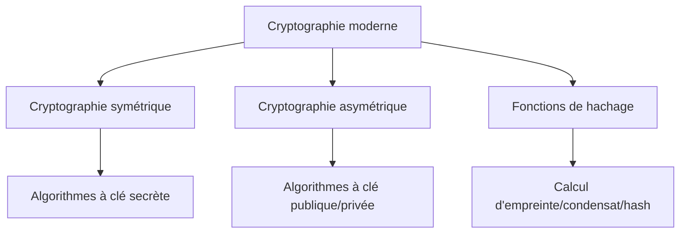
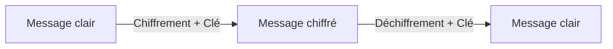
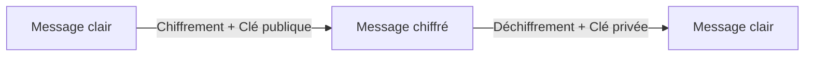
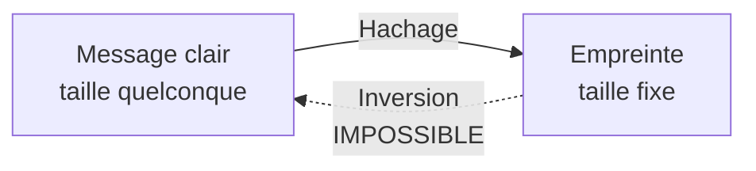
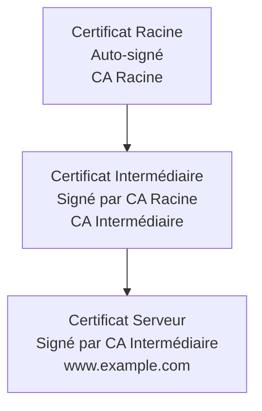

# Cryptographie - Notions fondamentales
## Document de révision TSSR - Titre RNCP

---

**Formation** : Technicien Supérieur Systèmes et Réseaux (TSSR)  
**Sujet** : Cryptographie - Concepts et applications  
**Date** : Novembre 2024  
**Type** : Synthèse de cours complète

---

## 📋 Sommaire

1. [[#Introduction|Introduction]]
2. [[#Cryptographie symétrique|Cryptographie symétrique]]
3. [[#Cryptographie asymétrique|Cryptographie asymétrique]]
4. [[#Fonctions de hachage|Fonctions de hachage]]
5. [[#Authentification cryptographique|Authentification cryptographique]]
6. [[#Les certificats|Les certificats]]
7. [[#Points clés à retenir|Points clés à retenir]]
8. [[#Glossaire technique|Glossaire technique]]
9. [[#📖 Références externes|Références externes]]

---

## Introduction

> [!abstract] Vue d'ensemble
> Ce cours présente les **notions fondamentales de la cryptographie moderne** : chiffrement symétrique et asymétrique, fonctions de hachage, authentification, signatures numériques et certificats. Tu découvriras les algorithmes standards, leurs usages pratiques et les bonnes pratiques en sécurité.

### Définitions essentielles

> [!quote] Cryptographie
> Partie de la **cryptologie** s'attachant à rendre un message **incompréhensible** sauf pour son destinataire légitime. S'oppose à la **cryptanalyse**.

**Termes fondamentaux** :

| Terme | Définition |
|-------|------------|
| **Clé** | Un secret (séquence binaire) |
| **Chiffrer** | Production d'un message chiffré à partir du message clair et d'une clé |
| **Déchiffrer** | Récupération du message clair à partir du message chiffré **à l'aide de la clé** |
| **Décrypter** | Récupération du message clair **sans la clé** de déchiffrement (attaque) |

> [!warning] Attention au vocabulaire
> - ✅ **Chiffrer** : avec la clé
> - ✅ **Déchiffrer** : avec la clé
> - ⚠️ **Décrypter** : sans la clé (= casser le chiffrement)
> - ❌ **Crypter** : ce mot n'existe pas en français !

---

### Histoire de la cryptologie

> [!note] Évolution de la cryptographie

**Antiquité → Moderne** :

1. **Antiquité** : Cryptographie commence (César, Spartiate...)
2. **Lutte incessante** : Cryptographie vs Cryptanalyse
3. **Principe de Kerckhoffs** : Basculement progressif de cryptosystèmes secrets → cryptosystèmes publics à **clé secrète**
4. **Automatisation** : Machines de chiffrement (ex: **Enigma** durant WWII)
5. **Cryptographie moderne** (~1950) :
   - **Cryptographie mathématique** (Claude Shannon)
   - **Passage au numérique** (informations binaires)
   - **Utilisation de l'ordinateur**

> [!important] Principe de Kerckhoffs (1883)
> **"La sécurité d'un système de chiffrement ne doit reposer que sur le secret de la clé"**
> 
> → L'algorithme peut être public, seule la clé doit rester secrète.

---

### Objectifs cryptographiques

> [!important] Buts de la cryptographie

**Les principaux objectifs** :

| Objectif | Description |
|----------|-------------|
| **Confidentialité** | Empêcher la lecture par des tiers non autorisés |
| **Authenticité** | Vérifier l'identité de l'expéditeur |
| **Intégrité** | Garantir que le message n'a pas été modifié |

**Mais aussi** :

- **Non-répudiation** : Impossible de nier avoir envoyé un message
- **Déni plausible** : Pouvoir nier de manière crédible
- **Confidentialité persistante** (Forward Secrecy) : Compromission d'une clé ne compromet pas les communications passées
- **Protection contre le rejeu** : Empêcher la réutilisation de messages
- **Anonymat** : Masquer l'identité des participants
- **Preuve à divulgation nulle de connaissance** : Prouver sans révéler l'information

---

### Les trois piliers de la cryptographie moderne

> [!important] Classification des techniques cryptographiques



| Type | Caractéristique | Usage |
|------|-----------------|-------|
| **Symétrique** | Une seule clé partagée | Chiffrement rapide de données |
| **Asymétrique** | Paire de clés publique/privée | Échange de clés, signatures |
| **Hachage** | Fonction à sens unique | Intégrité, empreintes |

---

## Cryptographie symétrique

> [!abstract] Cryptographie à clé secrète
> Utilise **une seule clé** pour chiffrer et déchiffrer. La clé doit être **partagée secrètement** entre l'émetteur et le destinataire.

### Principe de fonctionnement



**2 fonctions - 1 seule clé** :

| Fonction | Entrée | Sortie |
|----------|--------|--------|
| **Chiffrement** | Message clair + Clé | Message chiffré |
| **Déchiffrement** | Message chiffré + Clé | Message clair d'origine |

> [!important] Clé symétrique
> La **même clé** sert à chiffrer et à déchiffrer. Elle doit donc être **connue et secrète** pour les deux correspondants.

---

### Que chiffre-t-on ?

**Messages clairs** :
- N'importe quelle séquence binaire (fichier, paquet réseau, texte...)
- Deux approches principales :

| Type | Description |
|------|-------------|
| **Chiffrement par blocs** | Traite les données par blocs de taille fixe (ex: 128 bits) |
| **Chiffrement de flux** | Chiffre les données bit par bit ou octet par octet |

---

### Résultat du chiffrement

**Messages chiffrés** :

> [!info] Propriétés d'un bon chiffrement
> - Séquence binaire de **taille équivalente** au message clair
> - **Ressemble à une séquence aléatoire** (indistinguable du bruit)
> - **Confusion** : Lien clé ⟺ chiffré complexe
> - **Bonne diffusion** : 2 messages clairs proches engendrent des messages chiffrés **très différents**

**Exemple de diffusion** :
```
Message 1 : "Hello World"
Chiffré 1 : a7f3e9c2d1b8...

Message 2 : "Hello Worlp"  (une seule lettre change)
Chiffré 2 : 9d2c8f1a4e7b...  (complètement différent)
```

---

### Les clés symétriques

> [!important] Caractéristiques d'une bonne clé symétrique

Une clé symétrique doit être :

| Propriété | Description |
|-----------|-------------|
| **Séquence binaire** | Taille donnée (128, 192, 256 bits...) |
| **Aléatoire** | Imprévisible, impossible à deviner |
| **Longue** | Rendre la force brute trop coûteuse |
| **Secrète** | Partagée le moins possible (une clé par paire de correspondants) |

#### Les 3 problèmes de gestion des clés

> [!warning] Défis de la gestion des clés

1. **Génération des clés**
   - Générateurs **pseudo-aléatoires** cryptographiquement sûrs
   - Source d'entropie de qualité

2. **Stockage sécurisé des clés**
   - **HSM** (Hardware Security Module) : module matériel sécurisé
   - Chiffrement des clés stockées
   - Protection physique et logique

3. **Partage de clé**
   - Comment transmettre la clé de manière sécurisée ?
   - Problème résolu par la crypto asymétrique (Diffie-Hellman)

---

### Chiffrement par blocs

> [!info] Traitement par blocs de taille fixe
> Gestion de messages de taille quelconque en les découpant en **blocs de taille fixe** (128 bits pour AES).

#### Padding (Bourrage)

**Problème** : Le dernier bloc est rarement de la taille exacte.

**Solution** : **Padding** → Combler le dernier bloc jusqu'à la bonne taille.

**Exemple** :
```
Message : "HELLO" (5 octets)
Bloc    : 16 octets (128 bits)
Padding : 11 octets ajoutés
Résultat: "HELLO" + 11 octets de remplissage
```

---

#### Modes opératoires

> [!important] Liaison entre les blocs
> Les **modes opératoires** définissent comment les blocs sont liés entre eux lors du chiffrement.

| Mode | Nom complet | Description | Recommandé |
|------|-------------|-------------|------------|
| **ECB** | Electronic Codebook | Blocs chiffrés **indépendamment** | ❌ Non recommandé |
| **CBC** | Cipher Block Chaining | Bloc chiffré dépend du bloc clair ET du bloc chiffré précédent | ✅ Oui |
| **CTR** | Counter | Mode compteur, chiffrement de flux | ✅ Oui |
| **GCM** | Galois/Counter Mode | CTR + authentification | ✅ Très recommandé |
| **CFB** | Cipher Feedback | Chiffrement de flux | ✅ Oui |
| **OFB** | Output Feedback | Chiffrement de flux | ✅ Oui |

> [!warning] Pourquoi ECB est déconseillé
> En mode ECB, des blocs identiques du message clair produisent des blocs chiffrés identiques. Cela révèle des **motifs** dans le message chiffré.
> 
> Exemple célèbre : L'image du pingouin Linux chiffrée en ECB conserve sa forme visible !

---

#### Vecteur d'initialisation (IV)

> [!quote] IV - Initialization Vector
> Bloc de données **aléatoire** utilisé comme "bloc précédent" pour le premier bloc.

**Caractéristiques** :

| Propriété | Valeur |
|-----------|--------|
| **Secret ?** | Non (peut être transmis/stocké avec le chiffré) |
| **Aléatoire ?** | Oui (doit être imprévisible) |
| **Réutilisable ?** | **NON** - Jamais réutilisé avec la même clé |

**Importance** :
- Même message + même clé + **IV différent** = chiffrés différents
- Empêche les attaques par analyse de motifs

---

### Chiffrement de flux

> [!info] Chiffrement bit par bit
> Chiffrement du message clair **bit par bit** (ou octet par octet).

**Principe** :
```
Message clair     : 01101001 01100101...
Flux pseudo-aléa  : 10110101 11001010...
                    ⊕ (XOR)
Message chiffré   : 11011100 10101111...
```

**Fonctionnement** :
- Chiffrement par **XOR** avec un flux pseudo-aléatoire
- Flux généré par un **générateur pseudo-aléatoire** initialisé par :
  - **La clé**
  - **Un nonce** : nombre arbitraire utilisé **une seule fois**

> [!warning] Risque de réutilisation
> **Même clé + même nonce = même séquence**
> 
> → Réutiliser un nonce avec la même clé permet de casser le chiffrement !

---

### Algorithmes symétriques standards

> [!success] Algorithmes recommandés

#### Chiffrement par bloc

| Algorithme | Créateurs | Taille de clé | Statut |
|------------|-----------|---------------|--------|
| **AES** (Rijndael) | Daemen & Rijmen | 128/192/256 bits | ✅ **Standard actuel** |
| Twofish | Bruce Schneier | 128/192/256 bits | ✅ Acceptable |
| Serpent | Anderson, Biham, Knudsen | 128/192/256 bits | ✅ Acceptable |

> [!note] AES - Advanced Encryption Standard
> **AES** est le standard de chiffrement symétrique actuel, adopté par le NIST en 2001. Il remplace le DES obsolète.
> 
> - **AES-128** : Sécurité élevée, rapide
> - **AES-256** : Sécurité maximale (résistant aux ordinateurs quantiques pour force brute)

**Algorithmes obsolètes** :
- ❌ **DES** (Data Encryption Standard) : Clé trop courte (56 bits)
- ❌ **3DES** (Triple DES) : Lent, remplacé par AES
- ❌ **Blowfish** : Remplacé par Twofish

---

#### Chiffrement de flux

| Algorithme | Créateur | Taille de clé | Statut |
|------------|----------|---------------|--------|
| **ChaCha20** | Daniel J. Bernstein | 256 bits | ✅ **Recommandé** |
| Salsa20 | Daniel J. Bernstein | 256 bits | ✅ Acceptable |

**Algorithmes obsolètes** :
- ❌ **RC4** (Arcfour) : Failles découvertes, déconseillé

> [!info] Recommandations officielles
> - **NIST** (National Institute of Standards and Technology)
> - **FIPS** (Federal Information Processing Standards)
> - **ANSSI** (Agence Nationale de la Sécurité des Systèmes d'Information)

---

### Dérivation de clés à partir de mots de passe

> [!important] KDF - Key Derivation Function
> Une **fonction de dérivation de clés** permet de calculer des clés cryptographiques à partir d'un **secret maître** (comme un mot de passe).

**Principe** :
```
Mot de passe utilisateur
        ↓
    PBKDF2 / Argon2
        ↓
Clé cryptographique robuste (256 bits)
```

**Algorithme standard** :

| Fonction | Description | Usage |
|----------|-------------|-------|
| **PBKDF2** | Password-Based Key Derivation Function 2 (RFC 8018) | Dérivation de clés depuis mots de passe |

> [!warning] Prérequis
> Suppose l'utilisation de **mots de passe robustes** (ou phrases de passe) !
> 
> Un mot de passe faible ("123456") → Clé dérivée faible, même avec PBKDF2.

---

### Utilisation pratique de la crypto symétrique

#### Chiffrement de messages (communications)

**Contexte** : Communication réseau (HTTPS, VPN, SSH...)

> [!info] Clés de session
> **Clé de session** : Clé symétrique à **usage unique**, limitée dans le temps.

**Avantages** :
- ✅ **Rapide** : Chiffrement/déchiffrement performant (trafic réseau)
- ✅ **Sûr** : Jusqu'à preuve du contraire (AES-256)
- ✅ **Éphémère** : Compromission d'une clé ne compromet qu'une session

**Problème** : Comment partager la clé de session de manière sécurisée ?

**Solution** :
- **Protocole d'échange de clés de Diffie-Hellman** (crypto asymétrique)
- Permet de créer un secret partagé même sur canal non sécurisé

---

#### Chiffrement de fichiers (stockage)

**Contexte** : Chiffrement de disque, coffre-fort logiciel

**Exemples d'outils** :
- **VeraCrypt** : Conteneurs chiffrés, chiffrement de disque complet
- **LUKS** (Linux) : Chiffrement de partitions
- **BitLocker** (Windows) : Chiffrement de disque intégré
- **FileVault** (macOS) : Chiffrement de disque

**Principe** :
```
Mot de passe utilisateur
    ↓
Dérivation de clé (PBKDF2)
    ↓
Clé de chiffrement (AES-256)
    ↓
Chiffrement des fichiers
```

---

## Cryptographie asymétrique

> [!abstract] Cryptographie à clé publique
> Utilise **deux clés différentes** : une clé publique (distribuée) et une clé privée (secrète). Ce qui est chiffré avec l'une ne peut être déchiffré qu'avec l'autre.

### Principe de fonctionnement



**2 clés générées par paire** :

| Clé | Rôle | Diffusion |
|-----|------|-----------|
| **Clé publique** | Chiffrement (ou vérification signature) | Publique, distribuée à tous |
| **Clé privée** | Déchiffrement (ou signature) | **Secrète**, jamais partagée |

> [!important] Concept révolutionnaire
> Attribué à **Whitfield Diffie** et **Martin Hellman** (1976).
> 
> Permet d'échanger des messages chiffrés **sans avoir partagé de secret au préalable** !

---

### Les clés asymétriques

> [!info] Nature des clés

**Une paire de clés asymétriques est** :

| Propriété | Description |
|-----------|-------------|
| **Construction mathématique** | Impliquant de l'aléatoire (mais pas complètement) |
| **Exemple** | Produit de grands nombres premiers aléatoires (RSA) |
| **Lien mathématique** | Les deux clés sont liées par une relation mathématique |

#### Distribution des clés

> [!important] Clé publique / Clé privée

| Clé | Caractéristique | Usage |
|-----|-----------------|-------|
| **Clé publique** | Distribuée aux correspondants (pas secrète) | Chiffrer pour moi, vérifier ma signature |
| **Clé privée** | Conservée secrètement (**jamais partagée !**) | Déchiffrer mes messages, signer |

**Organisation** :
- **Une paire de clés par personne** (ou entité)
- Clé publique accessible à tous
- Clé privée protégée avec soin

---

### Limitations de la crypto asymétrique

> [!warning] Problèmes

**Trois défis majeurs** :

1. **Algorithmes lents**
   - Chiffrement/déchiffrement beaucoup plus lent que symétrique
   - Facteur 100 à 1000 fois plus lent

2. **Taille clé ≠ Puissance de chiffrement**
   - RSA-2048 ≈ AES-128 en sécurité
   - RSA-4096 ≈ AES-192
   - Clés beaucoup plus longues pour sécurité équivalente

3. **Vulnérabilité théorique**
   - **Ordinateur quantique** : pourrait casser RSA et ECC classiques
   - → **Cryptographie post-quantique** en développement

---

### Les deux usages principaux

> [!important] Objectifs de la crypto asymétrique

#### 1. Confidentialité

**Principe** : Publication de la **clé de chiffrement** (clé publique)

```
Alice veut envoyer un message confidentiel à Bob :
1. Alice récupère la clé publique de Bob
2. Alice chiffre le message avec la clé publique de Bob
3. Seul Bob peut déchiffrer (avec sa clé privée)
```

**Propriétés** :
- ✅ **Tout le monde peut chiffrer** pour Bob
- ✅ **Seul Bob peut déchiffrer**
- ✅ **Unidirectionnel** : envoi vers le propriétaire de la clé

---

#### 2. Authentification (Signature numérique)

**Principe** : Publication de la **clé de déchiffrement** (clé publique pour signature)

```
Bob veut prouver qu'il est l'auteur d'un message :
1. Bob "chiffre" (signe) avec sa clé privée
2. Tout le monde peut "déchiffrer" (vérifier) avec la clé publique de Bob
3. Seul Bob pouvait créer cette signature
```

**Propriétés** :
- ✅ **Seul Bob peut signer** (clé privée)
- ✅ **Tout le monde peut vérifier** (clé publique)
- ❌ **Plus de confidentialité** (clé publique disponible)
- ✅ **Authentification de l'expéditeur**

> [!note] Signature numérique
> En pratique, on ne signe pas directement le message (trop lent), mais son **empreinte** (hash). Voir section [[#Authentification cryptographique]].

---

### Algorithmes asymétriques standards

> [!success] Algorithmes recommandés

#### RSA

> [!quote] RSA - Rivest, Shamir, Adleman (1977)
> Algorithme asymétrique le plus utilisé, basé sur la difficulté de la **factorisation en nombres premiers**.

**Caractéristiques** :

| Paramètre | Valeur |
|-----------|--------|
| **Taille de clé** | 1024 à 4096 bits |
| **Recommandation** | ≥ 3072 bits (ANSSI) |
| **Principe** | Produit de deux grands nombres premiers |
| **Usage** | Signature, chiffrement, échange de clés |

**Sécurité** :
- RSA-2048 : Sécurisé actuellement
- RSA-3072 : Recommandé pour usage à long terme
- RSA-4096 : Sécurité maximale (mais plus lent)

---

#### ECC - Cryptographie sur courbes elliptiques

> [!important] ECC - Elliptic Curve Cryptography
> Algorithmes basés sur les propriétés mathématiques des **courbes elliptiques**.

**Avantages** :
- ✅ **Clés plus courtes** pour sécurité équivalente
  - ECC-256 ≈ RSA-3072
- ✅ **Plus rapide** que RSA
- ✅ **Moins gourmand** en ressources

**Courbes principales** :

| Courbe | Description | Usage |
|--------|-------------|-------|
| **Curve25519** | Courbe de Bernstein | Échange de clés (ECDH) |
| **Ed25519** | Courbe de Bernstein | Signatures (EdDSA) |
| **NIST P-256** | Courbe NIST | Usage général |
| **secp256k1** | Courbe Bitcoin | Cryptomonnaies |

**Cryptosystème de ElGamal** :
- Basé sur le problème du logarithme discret
- Utilisé dans DSA, Diffie-Hellman

---

### Sécurité et performance

> [!warning] Compromis à considérer

#### Comparaison symétrique vs asymétrique

| Critère | Symétrique | Asymétrique |
|---------|------------|-------------|
| **Vitesse** | Très rapide | Lent |
| **Taille de clé** | Courte (128-256 bits) | Longue (2048-4096 bits) |
| **Partage de clé** | Difficile (problème) | Facile (clé publique) |
| **Usage** | Chiffrement de données | Échange de clés, signatures |

---

#### Menace quantique

> [!warning] Ordinateur quantique
> **Avec un calculateur quantique** :

**Résultats théoriques** :
- **Algorithme de Shor** : Casse RSA et ECC en temps polynomial
- **Algorithme de Grover** : Réduit la sécurité de moitié

**Conséquences** :
- RSA, DSA, ECDSA : **Cassables** par ordinateur quantique
- AES-256 : Sécurité réduite à AES-128 (mais toujours sûr)

**Solution** :
- **Cryptographie post-quantique** : Nouveaux algorithmes résistants
  - Lattice-based (NTRU, Kyber)
  - Hash-based (SPHINCS+)
  - Code-based (McEliece)

---

### Cryptographie hybride

> [!success] Meilleur des deux mondes
> Combiner **symétrique** (rapide) + **asymétrique** (partage de clé sécurisé).

**Principe** :
```
1. Génération d'une clé de session symétrique (AES)
2. Chiffrement de la clé de session avec crypto asymétrique (RSA/ECC)
3. Transmission de la clé de session chiffrée
4. Chiffrement des données avec la clé de session (symétrique)
```

**Avantages** :
- ✅ **Performance** : Chiffrement symétrique pour les données
- ✅ **Sécurité** : Échange de clé sécurisé (asymétrique)
- ✅ **Clé de session éphémère** : Compromission limitée

**Utilisation** :
- HTTPS/TLS
- VPN (OpenVPN, IPsec)
- S/MIME (e-mail chiffré)
- SSH

---

### Échange de clés Diffie-Hellman

> [!important] DH - Diffie-Hellman Key Exchange
> Protocole permettant la **construction d'un secret partagé** entre deux parties, même sur un **canal non sécurisé**.

**Principe** :
```
Alice                          Bob
  ↓                             ↓
Clé privée a              Clé privée b
  ↓                             ↓
Calcul g^a                Calcul g^b
  ↓                             ↓
  └───→ Échange public ←────┘
  ↓                             ↓
Calcul (g^b)^a            Calcul (g^a)^b
  ↓                             ↓
Secret = g^(a×b)          Secret = g^(a×b)
```

**Variantes** :

| Variante | Base mathématique |
|----------|-------------------|
| **DH classique** | Logarithme discret |
| **ECDH** | Courbes elliptiques (plus rapide, clés courtes) |

**Propriétés** :
- ✅ Écoute du canal ne révèle pas le secret
- ✅ Pas besoin de secret prépartagé
- ⚠️ Vulnérable à l'attaque de l'homme du milieu (MITM)
  - → Nécessite authentification (certificats)

---

## Fonctions de hachage

> [!abstract] Fonctions à sens unique
> Les **fonctions de hachage** calculent une **empreinte** (hash/condensat) d'un message de taille quelconque, produisant une sortie de **taille fixe**.

### Principe de fonctionnement



**Fonctionnement** :

| Élément | Caractéristique |
|---------|-----------------|
| **Entrée** | Message quelconque (fichier, texte, données...) |
| **Sortie** | Empreinte / Condensat / Hash (taille fixe : 256, 512 bits) |
| **Inversion** | **Impossible** (fonction à sens unique) |

---

### Propriétés d'une fonction de hachage

> [!important] Caractéristiques essentielles

#### 1. Fonction à sens unique

**Calcul message → empreinte** :
- ✅ Simple
- ✅ Rapide
- ✅ Déterministe (même entrée = même sortie)

**Calcul empreinte → message** :
- ❌ **Impossible en pratique** (computationnellement infaisable)

---

#### 2. Taille fixe de sortie

**Exemples** :

| Algorithme | Taille empreinte |
|------------|------------------|
| **MD5** | 128 bits (obsolète) |
| **SHA-1** | 160 bits (obsolète) |
| **SHA-256** | 256 bits ✅ |
| **SHA-512** | 512 bits ✅ |
| **SHA3-256** | 256 bits ✅ |

---

#### 3. Effet avalanche

**Propriété** : Une petite modification de l'entrée change **complètement** l'empreinte.

**Exemple** :
```
Message 1 : "Bonjour"
SHA-256   : 8c20...94f3

Message 2 : "Bonjourr" (un seul caractère ajouté)
SHA-256   : 3a91...28e7  (complètement différent)
```

---

#### 4. Résistance aux collisions

> [!quote] Collision
> Deux messages **différents** produisant la **même empreinte**.

**Propriétés recherchées** :

| Type de résistance | Description |
|-------------------|-------------|
| **Résistance faible aux collisions** | Étant donné un message M1, impossible de trouver M2 avec hash(M1) = hash(M2) |
| **Résistance forte aux collisions** | Impossible de trouver M1 ≠ M2 tels que hash(M1) = hash(M2) |

> [!warning] Collisions connues
> - **MD5** : Collisions trouvées (2004) → Obsolète
> - **SHA-1** : Collisions pratiques (2017) → Obsolète
> - **SHA-2** (SHA-256/512) : Aucune collision connue ✅
> - **SHA-3** : Aucune collision connue ✅

---

### Algorithmes de hachage standards

> [!success] Fonctions recommandées

#### SHA-2 (Secure Hash Algorithm 2)

| Variante | Taille empreinte | Statut |
|----------|------------------|--------|
| **SHA-224** | 224 bits | ✅ Acceptable |
| **SHA-256** | 256 bits | ✅ **Recommandé** |
| **SHA-384** | 384 bits | ✅ Acceptable |
| **SHA-512** | 512 bits | ✅ Acceptable |

> [!note] SHA-256
> **SHA-256** est le standard actuel pour les fonctions de hachage à usage général (intégrité, signatures...).

---

#### SHA-3 (Keccak)

**Remplaçant de SHA-2** :
- Algorithme différent (éponge cryptographique)
- Plus récent (2015)
- Sécurité équivalente à SHA-2

---

#### Fonctions spécialisées pour mots de passe

> [!important] Hachage de mots de passe
> Pour les mots de passe, on utilise des fonctions **lentes** avec **salage**.

| Fonction | Usage | Statut |
|----------|-------|--------|
| **Argon2** | Hachage mot de passe | ✅ **Recommandé** (vainqueur PHC 2015) |
| **bcrypt** | Hachage mot de passe | ✅ Acceptable |
| **scrypt** | Hachage mot de passe | ✅ Acceptable |
| **yescrypt** | Hachage mot de passe | ✅ Défaut sur Debian |
| **PBKDF2** | Dérivation de clé | ✅ Acceptable |

> [!note] Voir cours mot de passe
> Détails dans le cours "Introduction à la cybersécurité" - section mots de passe.

---

#### Fonctions obsolètes

> [!warning] À ne plus utiliser

| Fonction | Taille | Problème |
|----------|--------|----------|
| **MD5** | 128 bits | Collisions trouvées (2004) |
| **SHA-1** | 160 bits | Collisions pratiques (2017) |
| **RIPEMD-160** | 160 bits | Considéré faible |
| **Whirlpool** | 512 bits | Peu utilisé, non standardisé |

---

### Utilisations pratiques du hachage

#### 1. Contrôle d'intégrité de messages

> [!info] Vérifier qu'un message n'a pas été modifié

**Processus** :

**Envoi** :
```
1. Calcul de l'empreinte du message à envoyer
2. Transmission : message + empreinte
```

**Réception** :
```
1. Calcul de l'empreinte du message reçu
2. Comparaison avec l'empreinte reçue
   - Identique → message non modifié ✅
   - Différent → message modifié ❌
```

**Limites** :
- ⚠️ Ne protège que contre les **erreurs** (modification accidentelle)
- ❌ N'authentifie pas l'expéditeur
- ❌ Un attaquant peut modifier message ET empreinte

**Solution** : Utiliser HMAC ou signature numérique (voir [[#Authentification cryptographique]]).

---

#### 2. Vérification d'intégrité de fichiers

> [!info] Comparer des fichiers sans les dupliquer

**Usage** :
- Téléchargement de logiciels (vérifier l'intégrité)
- Détection de modifications de fichiers système
- Comparaison de grandes quantités de données

**Exemple** :
```bash
# Calcul de l'empreinte d'un fichier
sha256sum fichier.iso
# Résultat : a3f9c82d...

# Comparer avec l'empreinte officielle du site
# Identique → Fichier intègre ✅
```

**Avantages** :
- ✅ Empreintes identiques = Fichiers identiques (avec très haute probabilité)
- ✅ Pas besoin de transmettre le fichier complet
- ✅ Rapide

---

#### 3. Empreintes de mots de passe

> [!important] Bonne pratique : Stocker les empreintes, pas les mots de passe

**Principe** :
```
Inscription :
Mot de passe → Hash + Sel → Empreinte stockée en BDD

Connexion :
Mot de passe saisi → Hash + Sel → Comparaison avec empreinte
```

**Problèmes et solutions** :

| Problème | Solution |
|----------|----------|
| **Rainbow tables** | **Salage** : Sel aléatoire par utilisateur |
| **Force brute rapide** | **Augmentation du coût** : Itérations multiples |

**Fonctions spécialisées** :

> [!success] Fonctions de hachage pour mots de passe

**Bcrypt** :
- Basé sur Blowfish
- Paramètre de coût ajustable
- Salage intégré

**Argon2** :
- Vainqueur de la Password Hashing Competition (2015)
- Résistant aux GPU/ASIC (gourmand en mémoire)
- Recommandé actuellement

**Yescrypt** :
- Utilisé par défaut sur Debian
- Évolution de scrypt

**Détails** : Voir cours [[#📖 Références externes|Introduction à la cybersécurité]].

---

## Authentification cryptographique

> [!abstract] Utiliser la cryptographie pour vérifier à qui on parle
> L'authentification cryptographique combine chiffrement et hachage pour garantir l'**identité de l'expéditeur** et l'**intégrité du message**.

### HMAC - Code d'authentification

> [!important] HMAC - Keyed-Hash Message Authentication Code
> **Code d'authentification de message** (MAC) basé sur un **secret partagé** (clé) + **fonction de hachage**.

#### Principe de fonctionnement

**Envoi** :
```
1. Mélange : Message + Clé secrète
2. Calcul de l'empreinte → HMAC
3. Transmission : Message + HMAC
```

**Réception** :
```
1. Mélange : Message reçu + Clé secrète
2. Calcul de l'empreinte
3. Comparaison avec HMAC reçu
   - Identique → Message authentique et intègre ✅
   - Différent → Rejeté ❌
```

---

#### Objectifs du HMAC

> [!success] Garanties fournies

| Garantie | Description |
|----------|-------------|
| **Authentification** | Seul quelqu'un possédant la clé a pu créer le HMAC |
| **Intégrité** | Modification du message détectée |
| ❌ **Pas de confidentialité** | Le message n'est pas chiffré |

**Usage typique** :
- Authentification dans les protocoles réseau
- Vérification d'intégrité avec authentification
- Souvent combiné avec chiffrement (Encrypt-then-MAC)

---

### Chiffrement authentifié (AE/AEAD)

> [!important] Authenticated Encryption
> Combine **chiffrement symétrique** + **authentification** pour obtenir :
> - **Confidentialité** (chiffrement)
> - **Authentification** (HMAC ou équivalent)
> - **Intégrité** (détection de modification)

#### Approches de combinaison

| Approche | Description | Sécurité |
|----------|-------------|----------|
| **Encrypt-then-MAC (EtM)** | Chiffrer puis calculer MAC du chiffré | ✅ **Recommandé** |
| **Encrypt-and-MAC (E&M)** | Chiffrer et calculer MAC du clair | ⚠️ Problèmes possibles |
| **MAC-then-Encrypt (MtE)** | Calculer MAC puis chiffrer tout | ⚠️ Vulnérable à certaines attaques |

---

#### Modes de chiffrement authentifié

> [!success] Modes standards AE/AEAD

**AEAD** : Authenticated Encryption with Associated Data
- Permet d'authentifier des données **non chiffrées** en plus du chiffré

| Mode | Description | Statut |
|------|-------------|--------|
| **GCM** (Galois/Counter Mode) | Mode compteur + authentification Galois | ✅ **Très recommandé** |
| **CCM** (Counter with CBC-MAC) | Mode compteur + CBC-MAC | ✅ Acceptable |
| **EAX** | Mode CTR + OMAC | ✅ Acceptable |
| **ChaCha20-Poly1305** | ChaCha20 + Poly1305 MAC | ✅ **Recommandé** |

> [!note] AES-GCM
> **AES-GCM** est le mode de chiffrement authentifié le plus utilisé actuellement (TLS 1.3, VPN, etc.).

**Avantages** :
- ✅ Un seul algorithme (plus simple)
- ✅ Performance (parallélisation possible)
- ✅ Sécurité prouvée

> [!warning] Clés différentes
> Utiliser des **clés différentes** pour authentification et confidentialité (ou modes AEAD qui gèrent cela automatiquement).

---

### Signature numérique

> [!important] Authentification asymétrique
> **Hachage + Cryptographie asymétrique** pour garantir l'authenticité de l'expéditeur.

#### Principe de fonctionnement

**Signature** (Envoi) :
```
1. Calcul empreinte du message (SHA-256)
2. Chiffrement de l'empreinte avec clé privée → Signature
3. Transmission : Message + Signature
```

**Vérification** (Réception) :
```
1. Calcul empreinte du message reçu
2. Déchiffrement de la signature avec clé publique → Empreinte signée
3. Comparaison des deux empreintes
   - Identiques → Signature valide ✅
   - Différentes → Signature invalide ❌
```

---

#### Objectifs de la signature

> [!success] Garanties fournies

| Garantie | Description |
|----------|-------------|
| **Authentification** | Prouve l'identité de l'expéditeur |
| **Intégrité** | Détecte toute modification du message |
| **Non-répudiation** | L'expéditeur ne peut nier avoir signé |
| ❌ **Pas de confidentialité** | Le message n'est pas chiffré |

---

#### Mécanismes de signature standards

> [!success] Algorithmes recommandés

| Algorithme | Base | Taille de clé | Statut |
|------------|------|---------------|--------|
| **RSA-PSS** | RSA | 3072-4096 bits | ✅ Recommandé |
| **ECDSA** | Courbes elliptiques NIST | 256-521 bits | ✅ Acceptable |
| **EdDSA (Ed25519)** | Courbes elliptiques (Curve25519) | 256 bits | ✅ **Très recommandé** |

**Mécanisme obsolète** :
- ❌ **DSA** (Digital Signature Algorithm) : Remplacé par ECDSA/EdDSA

> [!note] EdDSA (Ed25519)
> **EdDSA** avec la courbe **Ed25519** est le mécanisme de signature le plus moderne et recommandé :
> - Plus rapide que RSA et ECDSA
> - Sécurité élevée avec clés courtes
> - Résistant aux attaques par canal auxiliaire

---

## Les certificats

> [!abstract] Le passeport numérique
> Un **certificat électronique** associe une **clé publique** à une **identité** (personne, serveur, organisation), validé par un **tiers de confiance**.

### Problème : Association clé ⟷ identité

> [!warning] Limite des signatures seules
> Les signatures numériques permettent de vérifier que l'expéditeur **possède bien la clé privée** correspondant à la clé publique.
> 
> **Mais** : Comment s'assurer que la clé publique correspond à la **bonne identité** ?

**Exemple du problème** :
```
Alice reçoit un message signé avec la clé publique "ABC123"
→ La signature est valide
→ Mais qui est le propriétaire de "ABC123" ?
→ Est-ce vraiment Bob ou un imposteur ?
```

**Solution** : **Certificats électroniques**

---

### Le principe des certificats

> [!quote] Certificat électronique
> Un certificat contient :
> - **Clés publiques** (chiffrement, signature)
> - **Informations d'identification** (nom, organisation, domaine...)
> - **Dates de validité** (début, fin)
> - **Autres métadonnées** (usages autorisés, extensions...)
> - **Signature numérique d'un tiers de confiance** (certificateur)

**Analogie** : Comme une carte d'identité ou un passeport
- Informations personnelles
- Photo (ici : clé publique)
- Validé par une autorité (gouvernement ↔ CA)

---

### Deux formats principaux

| Format | Description | Usage |
|--------|-------------|-------|
| **X.509** | Standard ITU, approche centralisée | HTTPS, VPN, S/MIME, Code signing |
| **OpenPGP** | Approche décentralisée (toile de confiance) | E-mail chiffré (PGP/GPG) |

---

### Créer un certificat

> [!info] Processus de demande de certificat

#### 1. Créer une demande de certificat (CSR)

**CSR** : Certificate Signing Request

**Étapes** :
```
1. Créer une/des paire(s) de clé(s) (publique/privée)
2. Conserver précieusement les clés privées (JAMAIS partagées)
3. Créer le CSR contenant :
   - Informations d'identité (nom, organisation, pays...)
   - Clés publiques
   - Métadonnées (usages souhaités...)
```

**Exemple (OpenSSL)** :
```bash
# Générer clé privée + CSR
openssl req -new -newkey rsa:4096 -nodes \
  -keyout private.key -out request.csr

# Infos demandées :
# - Country Name (C)
# - Organization (O)
# - Common Name (CN) - ex: www.example.com
```

---

#### 2. Certification par un tiers de confiance

**Process de certification** :
```
1. Envoi du CSR à un tiers de confiance (CA)
2. Vérification d'identité par la CA
   - Validation domaine (e-mail, DNS...)
   - Validation organisation (documents officiels)
   - Validation étendue (vérifications approfondies)
3. Signature du certificat par la CA
4. Récupération du certificat signé
```

---

### Vérifier un certificat

> [!important] Processus de vérification

**À réception d'un certificat inconnu** :

```
1. Vérifier que l'identité dans le certificat correspond
   - Ex: certificat pour "www.example.com" sur le site visité

2. Vérifier la signature du certificat
   - Nécessite la clé publique du tiers qui a signé (CA)

3. Récupération du certificat de la CA...
   - Vérifier ce certificat (signature par une CA supérieure)

4. Chaîne de certification
   - Remonter jusqu'à un certificat racine (auto-signé)
```

**Problème circulaire** :
- Pour vérifier un certificat, il faut un autre certificat
- Pour vérifier ce certificat, il faut encore un autre...

**Solution** : **Certificats racines**
- Certificats de départ (**auto-signés**)
- Pré-installés dans les systèmes d'exploitation et navigateurs
- Considérés de confiance par défaut

---

### Chaîne de certification



**Exemple** :
```
1. Certificat de "www.example.com"
   ↓ signé par
2. Certificat de "Let's Encrypt Authority X3"
   ↓ signé par
3. Certificat racine "ISRG Root X1"
   → Pré-installé dans le navigateur ✅
```

---

### Tiers de confiance

> [!quote] Tiers de confiance
> Entité qui **vérifie l'identité** pour nous et **signe des certificats**.

#### Approche X.509 : Autorité de certification (CA)

**CA** : Certificate Authority

**Caractéristiques** :
- Organisme supposé **connu de tous** et **de confiance**
- Souvent : **entreprises spécialisées** (DigiCert, GlobalSign, Sectigo...)
- Ou : **organisations** (Let's Encrypt, gouvernements...)

**Processus centralisé** :
- La CA est l'**autorité centrale**
- Vérifications d'identité strictes
- Certificats racines distribués avec les OS/navigateurs

**Exemples de CA** :
- **Let's Encrypt** : Gratuit, automatisé (ACME)
- **DigiCert** : Commercial, validation étendue
- **Sectigo** (ex-Comodo) : Commercial
- **GlobalSign** : Commercial

---

#### Approche OpenPGP : Toile de confiance

**Web of Trust** :

**Caractéristiques** :
- Approche **décentralisée** : Tout le monde peut certifier
- Pas de CA centrale
- Confiance basée sur le réseau social

**Fonctionnement** :
```
1. Alice signe la clé de Bob (après vérification)
2. Bob signe la clé de Carol
3. Si je fais confiance à Alice, je peux faire confiance à Bob
4. Si je fais confiance à Bob, je peux faire confiance à Carol
   (confiance transitive avec niveaux)
```

**Outils** :
- **GPG** (GNU Privacy Guard) : Implémentation libre
- **Serveurs de clés** : Distribution publique des clés
- **Key signing parties** : Rencontres pour signer mutuellement les clés

---

### Révocation de certificats

> [!warning] Parce que tout ne se passe pas toujours comme prévu
> En cas de **perte** ou **compromission** de la clé privée, le certificat doit être **révoqué**.

#### Mécanismes de révocation

**1. CRL - Certificate Revocation List**

> [!info] Liste de révocations

**Principe** :
- CA maintient une **liste de certificats révoqués**
- Liste signée et distribuée périodiquement
- Client télécharge la CRL et vérifie

**Inconvénients** :
- ❌ Liste peut être volumineuse
- ❌ Mise à jour lente (périodique)
- ❌ Téléchargement complet nécessaire

---

**2. OCSP - Online Certificate Status Protocol**

> [!info] Vérification en ligne

**Principe** :
- Client interroge le **serveur OCSP** de la CA
- Réponse : Valide / Révoqué / Inconnu
- Vérification en **temps réel**

**Avantages** :
- ✅ Information à jour
- ✅ Requête légère (un certificat à la fois)

**Inconvénients** :
- ❌ Requête réseau supplémentaire (latence)
- ❌ Problème de confidentialité (CA sait quels sites vous visitez)
- ❌ Point de défaillance (si serveur OCSP indisponible)

---

**3. OCSP Stapling (Agrafage OCSP)**

> [!success] Solution optimale

**Principe** :
- Le **serveur** interroge régulièrement le serveur OCSP
- Le serveur **agrafe** (staple) la réponse OCSP au certificat
- Client reçoit certificat + réponse OCSP signée

**Avantages** :
- ✅ Pas de requête OCSP du client (plus rapide)
- ✅ Confidentialité préservée
- ✅ Réponse signée par la CA (authentique)

---

### X.509 en détail

> [!quote] X.509
> **Norme UIT** (Union Internationale des Télécommunications) pour les certificats numériques.

**Composants** :
- **Format de certificats** : Structure standardisée
- **Principe d'autorité de certification** : Hiérarchie de CA
- **Certificats racines** : Auto-signés, pré-installés

**Structure d'un certificat X.509** :

| Champ | Description |
|-------|-------------|
| **Version** | Version X.509 (v1, v2, v3) |
| **Numéro de série** | Identifiant unique du certificat |
| **Algorithme de signature** | RSA, ECDSA, EdDSA... |
| **Émetteur (Issuer)** | CA qui a signé |
| **Validité** | Date début/fin |
| **Sujet (Subject)** | Identité du propriétaire |
| **Clé publique** | Clé publique du sujet |
| **Extensions** | Usages, contraintes, alternatives... |
| **Signature** | Signature de la CA |

---

### Let's Encrypt

> [!success] Exemple d'autorité de certification gratuite

**Let's Encrypt** :
- **CA gratuite** et **automatisée**
- Mission : Sécuriser le Web (HTTPS partout)
- Utilise le protocole **ACME**

**Caractéristiques** :
- ✅ Gratuit
- ✅ Automatisé (renouvellement automatique)
- ✅ Certificats à **courte durée** (90 jours)
- ✅ Validation domaine uniquement (DV)

**Impact** :
- Adoption massive de HTTPS
- Passage de ~40% à ~95% de sites HTTPS

---

### PKI - Public Key Infrastructure

> [!important] Infrastructure à clés publiques
> **Ensemble d'éléments** permettant d'émettre, gérer et révoquer des certificats.

**Composants d'une PKI** :

| Composant | Description |
|-----------|-------------|
| **CA** | Autorité de certification (émission) |
| **RA** | Registration Authority (vérification identité) |
| **Serveur de publication** | Distribution des certificats et CRL |
| **Serveur OCSP** | Vérification en ligne |
| **HSM** | Hardware Security Module (protection clés racine) |
| **Logiciels** | Outils de gestion |
| **Procédures** | Politique de certification (CP/CPS) |

**Mise en place d'une CA interne** :
- Entreprises peuvent créer leur propre PKI
- Certificats pour usage interne
- Contrôle total

---

### ACME - Protocole d'automatisation

> [!success] L'approche Let's Encrypt

**ACME** : Automated Certificate Management Environment

**Objectifs** :
- **Automatiser** la certification (pas d'intervention manuelle)
- Faciliter le déploiement de certificats HTTPS
- Permettre des **durées de validité courtes** (renouvellement facile)
- Éviter les problèmes de certificats expirés

**Fonctionnement** :
```
1. Client ACME demande un certificat
2. CA ACME envoie un défi (challenge)
   - HTTP-01 : Placer un fichier sur le serveur web
   - DNS-01 : Ajouter un enregistrement DNS
3. Client prouve contrôle du domaine
4. CA émet le certificat
5. Renouvellement automatique avant expiration
```

**Implémentation** : **Certbot**
```bash
# Installation
sudo apt install certbot

# Obtenir un certificat
sudo certbot certonly --webroot -w /var/www/html -d example.com

# Renouvellement automatique
sudo certbot renew
```

---

### OpenPGP

> [!info] L'alternative décentralisée

**OpenPGP** :
- **Protocole IETF** (RFC 4880)
- Version ouverte du **PGP** (Pretty Good Privacy) de Philip Zimmermann
- Concept de **toile de confiance** (Web of Trust)

**Différences avec X.509** :

| Critère | X.509 | OpenPGP |
|---------|-------|---------|
| **Architecture** | Centralisée (CA) | Décentralisée (toile) |
| **Confiance** | CA racines | Réseau de signatures |
| **Distribution** | CA publie | Serveurs de clés |
| **Vérification** | Chaîne vers racine | Chemin de confiance |
| **Usage principal** | Web, VPN, Code | E-mail, fichiers |

**Composants** :
- **Serveurs de clés** : Distribution publique (keys.openpgp.org)
- **Key signing party** : Rencontres pour démarrer la toile
- **GPG** : GNU Privacy Guard (implémentation libre)

**Utilisation GPG** :
```bash
# Générer une paire de clés
gpg --full-generate-key

# Exporter clé publique
gpg --export --armor user@example.com > public.asc

# Chiffrer un fichier
gpg --encrypt --recipient user@example.com file.txt

# Signer un fichier
gpg --sign file.txt

# Vérifier une signature
gpg --verify file.txt.sig
```

---

### Certificats en pratique

> [!success] Les certificats dans la vraie vie

#### 1. Web - HTTPS

**Protocole TLS** (Transport Layer Security) :
- **Confidentialité** : Chiffrement AES-GCM
- **Authentification** : Certificat du serveur (X.509)
- **Intégrité** : HMAC ou AEAD

**Utilisation** :
- Certificat serveur obligatoire
- Certificat client optionnel (authentification mutuelle)

---

#### 2. E-mail chiffré et signé

**S/MIME** (Secure/Multipurpose Internet Mail Extensions) :
- Format X.509
- Intégré dans les clients mail (Outlook, Thunderbird...)
- Chiffrement + Signature

**PGP/MIME** :
- Format OpenPGP
- Utilisé avec GPG
- Populaire dans les communautés libristes

---

#### 3. VPN

**OpenVPN** :
- Certificats X.509 pour authentification
- PKI pour gestion des clients

**IPsec** :
- Certificats ou clés pré-partagées
- Usage entreprise

---

#### 4. Code Signing

**Signature de code** :
- Certificats X.509 spécialisés
- Prouve l'origine du logiciel
- Windows : Authenticode
- macOS : Apple Developer ID
- Linux : GPG signatures

---

## Points clés à retenir

> [!success] Synthèse pour le titre RNCP

### Concepts fondamentaux

**Cryptographie** :
- Rendre un message incompréhensible sauf pour le destinataire légitime
- **Chiffrer** : avec la clé
- **Déchiffrer** : avec la clé
- **Décrypter** : sans la clé (attaque)

**Principe de Kerckhoffs** :
- Sécurité = secret de la clé, pas de l'algorithme
- Algorithme peut être public

**Objectifs** :
- **Confidentialité** : Lecture interdite aux tiers
- **Authenticité** : Vérifier l'identité
- **Intégrité** : Détecter les modifications
- Non-répudiation, Forward Secrecy, etc.

---

### Cryptographie symétrique

**Principe** :
- **Une seule clé** pour chiffrer et déchiffrer
- Clé doit être **partagée secrètement**

**Clé symétrique** :
- Aléatoire, longue, secrète
- Problèmes : Génération, stockage, **partage**

**Types** :
- **Chiffrement par blocs** : AES (128/192/256 bits)
  - Modes : CBC, CTR, **GCM** (authentifié)
  - Vecteur d'initialisation (IV) obligatoire
- **Chiffrement de flux** : ChaCha20
  - XOR avec flux pseudo-aléatoire
  - Nonce unique obligatoire

**Standards** :
- ✅ **AES-256-GCM** : Recommandé
- ✅ **ChaCha20-Poly1305** : Recommandé
- ❌ DES, 3DES, RC4 : Obsolètes

**Usage** :
- **Clés de session** : Éphémères, rapides
- **Chiffrement de fichiers** : VeraCrypt, LUKS, BitLocker

---

### Cryptographie asymétrique

**Principe** :
- **Paire de clés** : publique + privée
- Chiffré avec l'une → déchiffré avec l'autre

**Clés** :
- **Publique** : Distribuée à tous
- **Privée** : Secrète, **jamais partagée**
- Une paire par personne

**Usages** :
- **Confidentialité** : Chiffrer avec publique → déchiffrer avec privée
- **Authentification** : Signer avec privée → vérifier avec publique

**Algorithmes** :
- ✅ **RSA** : 3072-4096 bits recommandé
- ✅ **ECC (Curve25519, Ed25519)** : 256 bits, plus rapide
- ❌ DSA : Obsolète

**Limitations** :
- Lent (100-1000× plus lent que symétrique)
- Clés longues
- Vulnérable aux ordinateurs quantiques (→ crypto post-quantique)

**Cryptographie hybride** :
- Symétrique pour les données (rapide)
- Asymétrique pour échanger la clé de session
- Utilisé partout : HTTPS, VPN, SSH

**Diffie-Hellman** :
- Échange de clés sur canal non sécurisé
- DH classique ou ECDH (courbes elliptiques)

---

### Fonctions de hachage

**Principe** :
- **Message quelconque** → **Empreinte de taille fixe**
- **Fonction à sens unique** : Inversion impossible

**Propriétés** :
- Déterministe (même entrée = même sortie)
- Effet avalanche (petite modif → empreinte complètement différente)
- Résistance aux collisions

**Standards** :
- ✅ **SHA-256** : Usage général
- ✅ **SHA-512** : Usage général
- ✅ **SHA-3** : Remplaçant de SHA-2
- ❌ MD5, SHA-1 : Obsolètes (collisions)

**Fonctions pour mots de passe** :
- ✅ **Argon2** : Recommandé (vainqueur PHC 2015)
- ✅ **bcrypt** : Acceptable
- ✅ **yescrypt** : Défaut Debian
- Salage + Coût élevé obligatoires

**Usages** :
- **Intégrité** : Vérifier qu'un message n'a pas été modifié
- **Comparaison** : Fichiers identiques sans les dupliquer
- **Mots de passe** : Stocker empreintes, pas mots de passe

---

### Authentification cryptographique

**HMAC** :
- Hachage + secret partagé
- Authentification + Intégrité
- Pas de confidentialité

**Chiffrement authentifié (AEAD)** :
- Confidentialité + Authentification + Intégrité
- ✅ **AES-GCM** : Mode standard
- ✅ **ChaCha20-Poly1305** : Alternative moderne

**Signature numérique** :
- Hachage + crypto asymétrique
- Authentification + Intégrité + Non-répudiation
- ✅ **Ed25519** : Recommandé
- ✅ **RSA-PSS** : Acceptable
- ✅ **ECDSA** : Acceptable

---

### Certificats

**Rôle** :
- Associer **clé publique** ⟷ **identité**
- Validé par **tiers de confiance**

**Formats** :
- **X.509** : Centralisé (CA), Web, VPN
- **OpenPGP** : Décentralisé (toile de confiance), E-mail

**Processus** :
1. Créer paire de clés
2. CSR (Certificate Signing Request)
3. Certification par CA
4. Récupération du certificat signé

**Vérification** :
- Identité correspond
- Signature valide
- Chaîne vers certificat racine
- Non révoqué (CRL, OCSP, OCSP Stapling)

**Tiers de confiance** :
- **CA (X.509)** : DigiCert, Let's Encrypt, GlobalSign
- **Toile de confiance (OpenPGP)** : Signatures mutuelles

**PKI** :
- Infrastructure complète (CA, RA, HSM, serveurs, procédures)

**Protocoles** :
- **ACME** : Automatisation (Let's Encrypt, Certbot)
- **OCSP** : Vérification révocation en ligne

**Usages** :
- **HTTPS/TLS** : Certificats serveur
- **S/MIME / PGP** : E-mail chiffré
- **VPN** : OpenVPN, IPsec
- **Code Signing** : Signature de logiciels

---

### Pièges à éviter

> [!warning] Erreurs courantes

1. ❌ Dire "crypter" (n'existe pas en français)
2. ❌ Utiliser algorithmes obsolètes (DES, MD5, SHA-1, RC4)
3. ❌ Réutiliser IV ou nonce avec même clé
4. ❌ Mode ECB pour chiffrement par blocs
5. ❌ Stocker mots de passe en clair ou hashés sans sel
6. ❌ Utiliser SHA-256 pour hacher mots de passe (trop rapide)
7. ❌ Partager clé privée asymétrique
8. ❌ Accepter certificats auto-signés en production
9. ❌ Ignorer révocations de certificats
10. ❌ Utiliser clés RSA < 3072 bits

---

### Bonnes pratiques TSSR

> [!tip] Recommandations professionnelles

**Chiffrement symétrique** :
1. Utiliser **AES-256-GCM** ou **ChaCha20-Poly1305**
2. Générer clés avec CSPRNG (générateur crypto sûr)
3. **Jamais réutiliser IV/nonce** avec même clé
4. Utiliser **clés de session** éphémères
5. Stocker clés dans HSM si possible

**Chiffrement asymétrique** :
1. **RSA ≥ 3072 bits** ou **ECC (Curve25519, Ed25519)**
2. **Jamais partager la clé privée**
3. Protéger clé privée (chiffrement, accès restreint)
4. Utiliser **cryptographie hybride** (asymétrique + symétrique)

**Hachage** :
1. **SHA-256** minimum pour intégrité
2. **Argon2** pour mots de passe (avec sel + coût élevé)
3. Vérifier **empreintes** des fichiers téléchargés
4. Ne jamais utiliser MD5 ou SHA-1

**Signatures** :
1. Préférer **Ed25519** (rapide, sûr)
2. Toujours vérifier signatures avant installation logiciel
3. Signer code distribué

**Certificats** :
1. Utiliser certificats d'**autorités reconnues**
2. **Let's Encrypt** pour HTTPS (gratuit, automatisé)
3. Vérifier **chaîne de certification** complète
4. Configurer **OCSP Stapling**
5. Renouveler **avant expiration**
6. Révoquer immédiatement si compromission

**Général** :
1. Suivre recommandations **ANSSI** et **NIST**
2. Maintenir **à jour** bibliothèques crypto
3. Ne pas implémenter ses propres algos (utiliser bibliothèques éprouvées)
4. **Tester** configurations (SSL Labs pour HTTPS)

---

## Glossaire technique

> [!note] Définitions essentielles pour le TSSR

| Terme | Définition |
|-------|------------|
| **Cryptographie** | Science de rendre un message incompréhensible sauf pour son destinataire |
| **Cryptanalyse** | Science de casser les systèmes cryptographiques |
| **Cryptologie** | Ensemble cryptographie + cryptanalyse |
| **Chiffrement** | Transformation d'un message clair en message chiffré avec une clé |
| **Déchiffrement** | Récupération du message clair avec la clé |
| **Décryptage** | Récupération du message clair sans la clé (attaque) |
| **Clé** | Secret utilisé pour chiffrer/déchiffrer |
| **Principe de Kerckhoffs** | Sécurité repose sur le secret de la clé, pas de l'algorithme |
| **Crypto symétrique** | Une seule clé pour chiffrer et déchiffrer |
| **Crypto asymétrique** | Paire de clés (publique/privée) |
| **Clé publique** | Clé distribuée à tous |
| **Clé privée** | Clé secrète, jamais partagée |
| **AES** | Advanced Encryption Standard, algorithme symétrique standard |
| **RSA** | Algorithme asymétrique (Rivest, Shamir, Adleman) |
| **ECC** | Elliptic Curve Cryptography, crypto sur courbes elliptiques |
| **ChaCha20** | Algorithme de chiffrement de flux moderne |
| **Fonction de hachage** | Calcul d'empreinte à partir d'un message |
| **Empreinte (Hash)** | Résultat d'une fonction de hachage, taille fixe |
| **SHA-256** | Secure Hash Algorithm, empreinte 256 bits |
| **Collision** | Deux messages différents avec même empreinte |
| **Salage (Salt)** | Valeur aléatoire ajoutée avant hachage |
| **Argon2** | Fonction de hachage pour mots de passe |
| **bcrypt** | Fonction de hachage pour mots de passe |
| **IV** | Initialization Vector, bloc aléatoire pour premier bloc |
| **Nonce** | Number used ONCE, valeur unique pour une session |
| **Mode ECB** | Electronic Codebook, mode non recommandé |
| **Mode CBC** | Cipher Block Chaining, blocs chaînés |
| **Mode GCM** | Galois/Counter Mode, chiffrement authentifié |
| **HMAC** | Keyed-Hash MAC, authentification avec secret partagé |
| **MAC** | Message Authentication Code |
| **AEAD** | Authenticated Encryption with Associated Data |
| **Signature numérique** | Hachage chiffré avec clé privée |
| **Certificat** | Association clé publique ⟷ identité, signée par CA |
| **CA** | Certificate Authority, autorité de certification |
| **PKI** | Public Key Infrastructure, infrastructure à clés publiques |
| **X.509** | Standard de certificats, approche centralisée |
| **OpenPGP** | Format de certificats, approche décentralisée |
| **CSR** | Certificate Signing Request, demande de certificat |
| **Révocation** | Invalidation d'un certificat avant expiration |
| **CRL** | Certificate Revocation List, liste de révocations |
| **OCSP** | Online Certificate Status Protocol |
| **OCSP Stapling** | Agrafage de réponse OCSP au certificat |
| **TLS** | Transport Layer Security, protocole HTTPS |
| **Diffie-Hellman** | Protocole d'échange de clés |
| **ECDH** | Elliptic Curve Diffie-Hellman |
| **Forward Secrecy** | Confidentialité persistante, compromission clé n'affecte pas passé |
| **HSM** | Hardware Security Module, module matériel sécurisé |
| **CSPRNG** | Cryptographically Secure Pseudo-Random Number Generator |
| **Let's Encrypt** | CA gratuite et automatisée |
| **ACME** | Automated Certificate Management Environment |
| **GPG** | GNU Privacy Guard, implémentation OpenPGP |
| **S/MIME** | Secure/Multipurpose Internet Mail Extensions |

---

## 📖 Références externes

> [!note] Liens utiles pour approfondir
> Ressources complémentaires pour maîtriser la cryptographie.

| Section | Ressource | Description | Lien |
|---------|-----------|-------------|------|
| **Recommandations officielles** | ANSSI | Référentiel Général de Sécurité (RGS), recommandations cryptographiques | [anssi.fr - Mécanismes cryptographiques](https://www.ssi.gouv.fr/entreprise/guide/mecanismes-cryptographiques/) |
| **Standards cryptographiques** | NIST | National Institute of Standards and Technology, FIPS publications | [csrc.nist.gov](https://csrc.nist.gov/projects/cryptographic-standards-and-guidelines) |
| **Algorithme AES** | NIST FIPS 197 | Standard officiel de l'Advanced Encryption Standard | [FIPS 197 PDF](https://nvlpubs.nist.gov/nistpubs/FIPS/NIST.FIPS.197.pdf) |
| **Fonctions de hachage SHA** | NIST FIPS 180-4 | Secure Hash Standard (SHA-2 et SHA-3) | [FIPS 180-4](https://nvlpubs.nist.gov/nistpubs/FIPS/NIST.FIPS.180-4.pdf) |
| **Certificats X.509** | RFC 5280 | Internet X.509 Public Key Infrastructure Certificate and CRL Profile | [RFC 5280](https://tools.ietf.org/html/rfc5280) |
| **OpenPGP** | RFC 4880 | OpenPGP Message Format | [RFC 4880](https://tools.ietf.org/html/rfc4880) |
| **TLS** | RFC 8446 | The Transport Layer Security (TLS) Protocol Version 1.3 | [RFC 8446](https://tools.ietf.org/html/rfc8446) |
| **ACME Protocol** | RFC 8555 | Automatic Certificate Management Environment (ACME) | [RFC 8555](https://tools.ietf.org/html/rfc8555) |
| **Let's Encrypt** | Let's Encrypt | Autorité de certification gratuite et automatisée | [letsencrypt.org](https://letsencrypt.org) |
| **Certbot** | EFF Certbot | Client ACME pour Let's Encrypt | [certbot.eff.org](https://certbot.eff.org) |
| **Crypto post-quantique** | NIST PQC | Post-Quantum Cryptography Standardization | [NIST PQC Project](https://csrc.nist.gov/projects/post-quantum-cryptography) |
| **OpenSSL** | OpenSSL Project | Bibliothèque cryptographique open source | [openssl.org](https://www.openssl.org) |
| **GnuPG** | GnuPG | GNU Privacy Guard, implémentation OpenPGP | [gnupg.org](https://gnupg.org) |
| **Cours en ligne** | Khan Academy | Introduction à la cryptographie (en anglais) | [Khan Academy - Cryptography](https://www.khanacademy.org/computing/computer-science/cryptography) |
| **Test SSL/TLS** | SSL Labs | Testez la configuration SSL/TLS de vos serveurs | [ssllabs.com](https://www.ssllabs.com/ssltest/) |
| **Veille sécurité** | CERT-FR | Centre gouvernemental de veille, alerte et réponse aux attaques | [cert.ssi.gouv.fr](https://www.cert.ssi.gouv.fr) |

> [!tip] Comment utiliser ces ressources
> Ces liens te permettront de :
> - **Approfondir** les concepts cryptographiques
> - **Consulter les standards officiels** (NIST, ANSSI, RFC)
> - **Tester** tes configurations (SSL Labs)
> - **Implémenter** la cryptographie (OpenSSL, GnuPG, Certbot)
> - **Se tenir à jour** sur les menaces (CERT-FR)
> - Obtenir des **certificats gratuits** (Let's Encrypt)
> - Comprendre la **crypto post-quantique** (préparation du futur)

---

> [!success] Document de révision complet
> Ce document couvre l'intégralité du cours de **cryptographie**. Tu as maintenant tous les éléments pour :
> - Comprendre les principes de la cryptographie moderne
> - Choisir les bons algorithmes (AES, RSA, ECC, SHA-256, Argon2)
> - Mettre en œuvre le chiffrement symétrique et asymétrique
> - Utiliser les fonctions de hachage correctement
> - Authentifier avec HMAC et signatures numériques
> - Gérer les certificats X.509 et OpenPGP
> - Appliquer les bonnes pratiques de sécurité
> - Éviter les pièges courants
> 
> **Bon courage pour la préparation de ton titre RNCP TSSR !** 🎓🔐✨

---

**Fin du document de révision**
