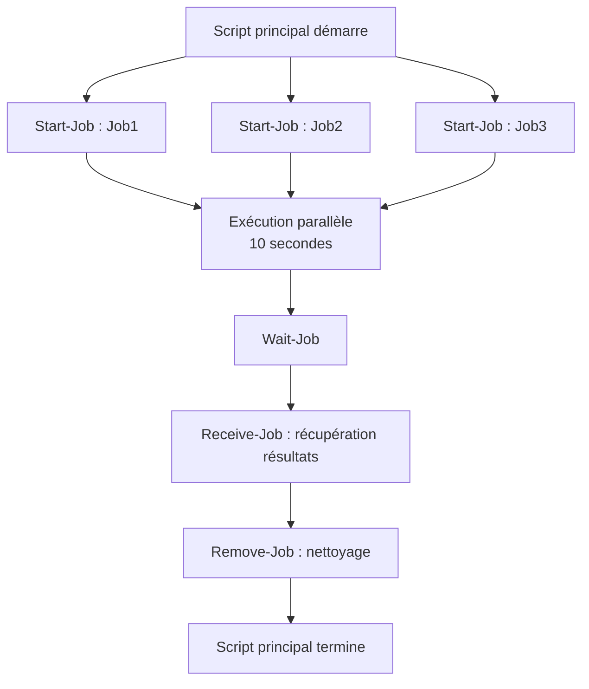

# Scripting PowerShell - Partie 3 (Windows)
## Document de révision TSSR - Titre RNCP

---

**Formation** : Technicien Supérieur Systèmes et Réseaux (TSSR)  
**Sujet** : Scripting PowerShell avancé - Fonctions, Remote et Exécution parallèle  
**Date** : Décembre 2024  
**Type** : Synthèse de cours complète

---

## 📋 Sommaire

1. [[#Introduction|Introduction]]
2. [[#Les fonctions|Les fonctions]]
   - [[#Définition et bases|Définition et bases]]
   - [[#Fonctions et paramètres|Fonctions et paramètres]]
   - [[#Fonctions avancées|Fonctions avancées]]
3. [[#Remote PowerShell|Remote PowerShell]]
   - [[#Présentation du PowerShell à distance|Présentation du PowerShell à distance]]
   - [[#Cmdlet de commandes à distance|Cmdlet de commandes à distance]]
   - [[#Session interactive à distance|Session interactive à distance]]
   - [[#Exécution de commandes à distance|Exécution de commandes à distance]]
4. [[#Exécution parallèle|Exécution parallèle]]
   - [[#Concepts et méthodes|Concepts et méthodes]]
   - [[#Les Jobs|Les Jobs]]
   - [[#Les Runspaces|Les Runspaces]]
   - [[#Les Workflows|Les Workflows]]
   - [[#Parallel ForEach|Parallel ForEach]]
   - [[#Comparaison exécution séquentielle vs parallèle|Comparaison exécution séquentielle vs parallèle]]
5. [[#Points clés à retenir|Points clés à retenir]]
6. [[#Glossaire technique|Glossaire technique]]

---

## Introduction

> [!abstract] Vue d'ensemble du module
> Ce module approfondit les concepts avancés de PowerShell essentiels pour un **TSSR**. Il couvre trois domaines critiques : la **structuration du code avec les fonctions**, l'**administration à distance via Remote PowerShell**, et l'**optimisation des performances avec l'exécution parallèle**. Ces compétences sont indispensables pour automatiser efficacement l'administration système en environnement Windows.

### Pourquoi maîtriser ces concepts en tant que TSSR ?

En tant que **Technicien Supérieur Systèmes et Réseaux**, tu dois :

- **Structurer tes scripts** pour faciliter leur maintenance et leur réutilisation
- **Administrer des machines à distance** sans intervention physique
- **Optimiser les performances** de tes scripts pour gérer des infrastructures complexes
- **Automatiser des tâches** sur plusieurs serveurs simultanément
- **Réduire les temps d'exécution** pour améliorer la productivité

> [!tip] Compétences RNCP visées
> Ces notions sont directement liées aux compétences RNCP : **automatisation des tâches d'administration**, **gestion d'infrastructures système**, et **optimisation des opérations IT**.

---

## Les fonctions

> [!quote] Définition
> Une **fonction** est un bloc de code nommé qu'on déclare pour pouvoir l'utiliser plus tard, éventuellement plusieurs fois. Les fonctions permettent de **structurer son code**, de favoriser sa **réutilisation** et sa **maintenance**.

### Définition et bases

> [!info] Rappel du cours Bash
> Le concept de fonction existe également en Bash. C'est un principe fondamental de la programmation qui permet de décomposer un problème complexe en sous-problèmes plus simples.

#### Syntaxe de base d'une fonction

```powershell
function NomDeLaFonction
{
    instructions
}
```

> [!warning] Règle importante
> Les fonctions doivent **OBLIGATOIREMENT** être déclarées **AVANT** d'être appelées dans le script. PowerShell lit le script de haut en bas de manière séquentielle.

#### Exemple : Ma première fonction

```powershell
Clear-Host

# Déclaration de la fonction
function Hello
{
   Write-Host "Hi folks !"
}

# Appel de la fonction (plusieurs fois possible)
Hello
Write-Host "and again"
Hello
```

**Résultat de l'exécution :**
```
Hi folks !
and again
Hi folks !
```

> [!example] Cas d'usage concret
> Imagine que tu doives afficher un message de bienvenue standardisé à plusieurs endroits dans ton script d'administration. Au lieu de répéter le code, tu crées une fonction `Show-Welcome` que tu appelles où tu en as besoin.

---

### Fonctions et paramètres

> [!important] Concept clé : Fonctions adaptables
> Pour rendre tes fonctions réutilisables dans différents contextes, tu dois pouvoir leur **passer des arguments** (paramètres). Cela permet de créer des fonctions génériques et flexibles.

#### Récupération des paramètres

| Élément | Description |
|---------|-------------|
| **`$args`** | Tableau contenant **tous les arguments** passés à la fonction |
| **`$args[n]`** | Accès au **n-ième argument** (indexation commence à 0) |
| **`$args.Count`** | Nombre total d'arguments passés |
| **`param()`** | Déclaration explicite des paramètres (méthode recommandée) |

#### Exemple avec `$args`

```powershell
function Hello
{
   Write-Host "Hi folks !"
}

function greet
{
   param ([Array]$ArgumentsList)
   
   If ($ArgumentsList.Count -gt 0)
   {
       Write-Host "Hi $($ArgumentsList[0])"
   }
   else
   {
       Hello
   }
}

# Appels de la fonction
greet -ArgumentsList $args
greet
```

> [!tip] Bonne pratique
> Utilise `param()` au début de ta fonction pour déclarer explicitement les paramètres attendus. Cela améliore la **lisibilité** et la **maintenabilité** du code.

---

### Fonctions avancées

> [!important] Fonctions avancées : des fonctions pour tout
> PowerShell propose des **attributs de paramètres** pour créer des fonctions robustes avec validation intégrée, gestion d'erreurs et aide utilisateur.

#### Attributs de paramètres essentiels

| Attribut | Syntaxe | Description |
|----------|---------|-------------|
| **Paramètre obligatoire** | `[Parameter(Mandatory=$True)]` | Force la saisie du paramètre |
| **Paramètre optionnel** | `[Parameter(Mandatory=$False)]` | Paramètre facultatif (par défaut) |
| **Liste de choix** | `[ValidateSet('Val1', 'Val2')]` | Limite les valeurs possibles |
| **Plage de valeurs** | `[ValidateRange(MIN, MAX)]` | Accepte uniquement un entier entre MIN et MAX |
| **Type de données** | `[Int32]`, `[String]`, `[Array]` | Spécifie le type attendu |

#### Exemple : Fonction de conversion avec validation

```powershell
function Conversion
{
   param ( 
       [Parameter(Mandatory=$True)]
       [ValidateRange(0, 255)]
       [Int32]$Number,
      
       [Parameter(Mandatory=$True)]
       [ValidateSet('Binaire', 'Octal')]
       [String]$Calcul 
   )

   Switch ($Calcul)
   {
       'Binaire' { [convert]::ToString([int]$Number, 2) }
       'Octal'   { [Convert]::ToString([int]$Number, 8) }
   }
}
```

**Utilisation :**
```powershell
# Convertit 42 en binaire
Conversion -Number 42 -Calcul Binaire
# Résultat : 101010

# Convertit 64 en octal
Conversion -Number 64 -Calcul Octal
# Résultat : 100
```

> [!example] Cas d'usage TSSR
> Tu peux créer une fonction `New-LocalUser` avec validation pour automatiser la création d'utilisateurs locaux :
> - `[ValidatePattern()]` pour valider le format du nom d'utilisateur
> - `[ValidateLength()]` pour contrôler la longueur du mot de passe
> - `[ValidateSet()]` pour limiter les groupes d'appartenance

> [!note] Autres attributs utiles
> - **`[ValidatePattern('regex')]`** : Validation par expression régulière
> - **`[ValidateLength(MIN, MAX)]`** : Longueur de chaîne entre MIN et MAX
> - **`[ValidateCount(MIN, MAX)]`** : Nombre d'éléments dans un tableau
> - **`[ValidateScript({condition})]`** : Validation par script personnalisé

> [!tip] Pour aller plus loin
> Consulte la documentation officielle Microsoft sur les **Advanced Functions** pour découvrir d'autres attributs et fonctionnalités (help about_Functions_Advanced).

---

## Remote PowerShell

> [!quote] Définition
> **Remote PowerShell** (PowerShell à distance) permet d'exécuter des commandes et des scripts PowerShell sur des ordinateurs distants sans avoir besoin de se connecter physiquement à ces machines. C'est un outil essentiel pour l'administration système centralisée.

### Présentation du PowerShell à distance

> [!info] Trois méthodes d'administration à distance
> PowerShell propose **trois approches principales** pour travailler à distance :
> 1. **Cmdlets avec paramètre `-ComputerName`** : Certaines cmdlets intègrent nativement la capacité d'agir à distance
> 2. **Sessions interactives** (`Enter-PSSession`) : Ouvre une console PowerShell interactive sur la machine distante
> 3. **Exécution de commandes/scripts** (`Invoke-Command`) : Exécute des blocs de code sur une ou plusieurs machines distantes

---

### Cmdlet de commandes à distance

> [!important] Cmdlets natifs avec support distant
> Certaines cmdlets PowerShell possèdent **nativement** le paramètre `-ComputerName` qui permet de cibler une machine distante directement.

#### Liste des cmdlets principales avec `-ComputerName`

| Cmdlet | Description |
|--------|-------------|
| **`Restart-Computer`** | Redémarre un ordinateur distant |
| **`Stop-Computer`** | Arrête un ordinateur distant |
| **`Test-Connection`** | Teste la connectivité réseau (équivalent ping) |
| **`Clear-EventLog`** | Efface un journal d'événements |
| **`Get-EventLog`** | Récupère les entrées d'un journal d'événements |
| **`Get-HotFix`** | Liste les mises à jour installées |
| **`Get-Process`** | Récupère la liste des processus |
| **`Get-Service`** | Liste les services Windows |
| **`Set-Service`** | Modifie la configuration d'un service |
| **`Get-WinEvent`** | Récupère les événements Windows |
| **`Get-WmiObject`** | Interroge WMI (Windows Management Instrumentation) |

#### Exemples pratiques

```powershell
# Arrêter un ordinateur distant
PS C:\Lab> Stop-Computer -ComputerName client1

# Tester la connectivité avec un ordinateur distant
PS C:\Lab> Test-Connection -ComputerName client2

Source      Destination  IPV4Address   IPV6Address  Bytes  Time(ms)
------      -----------  -----------   -----------  -----  --------
DC1         client2      172.16.1.101               32     0
DC1         client2      172.16.1.101               32     0
DC1         client2      172.16.1.101               32     0
DC1         client2      172.16.1.101               32     0
```

> [!tip] Astuce TSSR
> Utilise `Test-Connection` avant toute opération distante pour vérifier que la machine cible est bien accessible sur le réseau.

> [!warning] Limitation
> Toutes les cmdlets ne supportent pas le paramètre `-ComputerName`. Pour ces cmdlets, tu devras utiliser `Invoke-Command` ou `Enter-PSSession`.

---

### Session interactive à distance

> [!important] Enter-PSSession : Le "bureau à distance" PowerShell
> La cmdlet `Enter-PSSession` permet d'ouvrir une **session PowerShell interactive** sur un ordinateur distant. C'est comme si tu étais directement connecté en console sur la machine distante.

#### Prérequis technique

> [!warning] Prérequis obligatoires
> Le service **WinRM** (Windows Remote Management) doit être **démarré** sur l'ordinateur distant pour que les sessions à distance fonctionnent.

**Commande pour activer WinRM :**
```powershell
# Sur la machine distante
Enable-PSRemoting -Force
```

#### Syntaxe et utilisation

| Commande | Description |
|----------|-------------|
| **`Enter-PSSession`** | Ouvre une session interactive à distance |
| **`Exit-PSSession`** | Ferme la session distante et revient à la session locale |

#### Exemple : Session interactive sur client1

```powershell
# Connexion à client1
PS C:\Lab> Enter-PSSession -ComputerName client1

# Prompt modifié indiquant la session distante
[client1]: PS C:\Users\administrator\Documents> Set-Location -Path c:\

# Création d'un répertoire sur client1
[client1]: PS C:\> New-Item -Path C:\ -ItemType Directory -Name "00_test"

    Répertoire : C:\

Mode          LastWriteTime         Length Name
----          -------------         ------ ----
d-----        21/06/2022     00:17         00_test

# Fermeture de la session distante
[client1]: PS C:\> Exit-PSSession

# Retour à la session locale
PS C:\Lab>
```

> [!note] Observation importante
> Le **prompt** change pour indiquer que tu es en session distante : `[client1]: PS C:\>`. Toutes les commandes sont exécutées sur la machine distante.

> [!example] Cas d'usage TSSR
> Utilise `Enter-PSSession` pour :
> - **Diagnostiquer** un problème sur une machine distante
> - **Configurer** interactivement un serveur
> - **Tester** des commandes avant de les scripter

> [!tip] Bonne pratique
> Toujours fermer proprement ta session avec `Exit-PSSession` pour libérer les ressources.

---

### Exécution de commandes à distance

> [!important] Invoke-Command : L'outil ultime d'administration distante
> La cmdlet **`Invoke-Command`** est la méthode la plus puissante et flexible pour exécuter du code PowerShell sur des machines distantes. Contrairement à `Enter-PSSession`, elle permet d'exécuter des commandes sur **plusieurs machines simultanément**.

#### Syntaxe de base

```powershell
Invoke-Command -ComputerName <Machine> -ScriptBlock { <Code> }
```

| Paramètre | Description |
|-----------|-------------|
| **`-ComputerName`** | Nom(s) de la/des machine(s) cible(s) |
| **`-ScriptBlock`** | Bloc de code PowerShell à exécuter |
| **`-FilePath`** | Chemin vers un script .ps1 à exécuter |
| **`-Credential`** | Identifiants pour l'authentification |

#### Exemple : Lister le contenu d'un répertoire distant

```powershell
PS C:\Users\Administrator> Invoke-Command -ComputerName client1 -ScriptBlock {Get-ChildItem -Path C:\}

    Directory: C:\

Mode          LastWriteTime         Length Name                 PSComputerName
----          -------------         ------ ----                 --------------
d-----        21/06/2022     00:17         00_test              client1
d-----        07/12/2019     10:14         PerfLogs             client1
d-r---        07/03/2022     22:41         Program Files        client1
d-r---        06/10/2021     15:36         Program Files (x86)  client1
d-r---        08/03/2022     14:10         Users                client1
d-----        07/03/2022     22:26         Windows              client1
```

> [!note] Propriété PSComputerName
> Les résultats incluent automatiquement la propriété **`PSComputerName`** qui indique l'origine des données. Très utile lors de l'exécution sur plusieurs machines.

#### Exécution sur plusieurs machines

```powershell
# Exécution sur plusieurs ordinateurs simultanément
$Computers = "client1", "client2", "server01"
Invoke-Command -ComputerName $Computers -ScriptBlock {
    Get-Service -Name "Spooler"
}
```

#### Exécution d'un script distant

```powershell
# Exécuter un script local sur des machines distantes
Invoke-Command -ComputerName client1 -FilePath "C:\Scripts\Install-Software.ps1"
```

> [!example] Cas d'usage TSSR avancé
> **Scenario** : Déployer une configuration sur 50 serveurs
> ```powershell
> $Servers = Get-Content "C:\servers.txt"
> Invoke-Command -ComputerName $Servers -ScriptBlock {
>     # Configuration du service Windows Update
>     Set-Service -Name "wuauserv" -StartupType Automatic
>     Start-Service -Name "wuauserv"
>     
>     # Vérification
>     Get-Service -Name "wuauserv"
> }
> ```

> [!tip] Comparaison Enter-PSSession vs Invoke-Command
> - **`Enter-PSSession`** : Session interactive, **1 seule machine**, travail manuel
> - **`Invoke-Command`** : Exécution automatisée, **plusieurs machines**, idéal pour scripts

> [!warning] Gestion des erreurs
> Utilise le paramètre `-ErrorAction` et teste la connectivité avec `Test-Connection` avant d'exécuter `Invoke-Command` sur un grand nombre de machines.

---

## Exécution parallèle

> [!quote] Définition
> L'**exécution parallèle** permet l'exécution **simultanée** de multiples tâches pour améliorer les **performances** et l'**efficacité** des scripts. En PowerShell, cette fonctionnalité est indispensable pour traiter de grands volumes de données ou administrer de nombreux serveurs.

### Concepts et méthodes

> [!info] Quatre méthodes principales en PowerShell
> PowerShell propose quatre approches pour l'exécution parallèle, chacune adaptée à des cas d'usage spécifiques :
> 1. **Les Jobs** : Tâches asynchrones en arrière-plan
> 2. **Les Runspaces** : Contrôle fin des threads et ressources
> 3. **Les Workflows** : Processus complexes multi-étapes
> 4. **Parallel ForEach** : Traitement parallèle de collections

#### Tableau comparatif des méthodes

| Méthode | Complexité | Performance | Cas d'usage typique |
|---------|------------|-------------|---------------------|
| **Jobs** | Faible | Moyenne | Tâches longues en arrière-plan |
| **Runspaces** | Élevée | Très élevée | Scripts nécessitant parallélisme fin |
| **Workflows** | Moyenne | Moyenne | Processus métier structurés |
| **Parallel ForEach** | Faible | Élevée | Traitement de collections |

---

### Les Jobs

> [!quote] Définition
> Les **Jobs** permettent d'exécuter des commandes ou des scripts dans des **processus distincts** de manière **asynchrone**, sans bloquer l'exécution du script principal. Ils sont particulièrement utiles pour des tâches **longues** ou **intensives en ressources**.

> [!important] Utilité des Jobs
> - Exécution de tâches longues sans bloquer le script principal
> - Appels à des services distants
> - Traitement de fichiers volumineux
> - Opérations réseau lentes

#### Commandes de gestion des Jobs

| Cmdlet | Description |
|--------|-------------|
| **`Start-Job`** | Démarre un nouveau job en arrière-plan |
| **`Get-Job`** | Obtient la liste des jobs existants |
| **`Receive-Job`** | Récupère le résultat d'un job terminé |
| **`Wait-Job`** | Attend la fin d'exécution d'un ou plusieurs jobs |
| **`Stop-Job`** | Arrête un job en cours (statut → "Stopped") |
| **`Remove-Job`** | Supprime un job de la mémoire |
| **`Suspend-Job`** | Suspend l'exécution (statut → "Suspended") |
| **`Resume-Job`** | Reprend un job suspendu (statut → "Running") |

#### États d'un Job

| État | Description |
|------|-------------|
| **Running** | Job en cours d'exécution |
| **Completed** | Job terminé avec succès |
| **Failed** | Job terminé avec erreur |
| **Stopped** | Job arrêté manuellement |
| **Suspended** | Job mis en pause |

---

### Comparaison exécution séquentielle vs parallèle

> [!example] Scénario : 3 tâches de 10 secondes chacune

#### Exécution séquentielle (30 secondes au total)

```powershell
Write-Host "Début du script : $(Get-Date)"

$StartJobTime1 = Get-Date
Start-Sleep -Seconds 10
Write-Host "Job1 : $StartJobTime1 --> $(Get-Date)"

$StartJobTime2 = Get-Date
Start-Sleep -Seconds 10
Write-Host "Job2 : $StartJobTime2 --> $(Get-Date)"

$StartJobTime3 = Get-Date
Start-Sleep -Seconds 10
Write-Host "Job3 : $StartJobTime3 --> $(Get-Date)"

Write-Host "Fin du script : $(Get-Date)"
```

**Résultat :**
```
Début du script : 21/06/2024 10:00:00
Job1 : 21/06/2024 10:00:00 --> 21/06/2024 10:00:10
Job2 : 21/06/2024 10:00:10 --> 21/06/2024 10:00:20
Job3 : 21/06/2024 10:00:20 --> 21/06/2024 10:00:30
Fin du script : 21/06/2024 10:00:30
```

> [!warning] Problème de l'exécution séquentielle
> **Durée totale = 30 secondes** : chaque tâche attend la fin de la précédente. C'est inefficace si les tâches sont indépendantes.

---

#### Exécution parallèle avec les Jobs (10 secondes au total)

```powershell
Write-Host "Début du script : $(Get-Date)"

# Démarrage de 3 jobs en parallèle
$Job1 = Start-Job -ScriptBlock {
    $Start = Get-Date
    Start-Sleep -Seconds 10
    $End = Get-Date
    Write-Host "Job 1 : $Start --> $End"
}

$Job2 = Start-Job -ScriptBlock {
    $Start = Get-Date
    Start-Sleep -Seconds 10
    $End = Get-Date
    Write-Host "Job 2 : $Start --> $End"
}

$Job3 = Start-Job -ScriptBlock {
    $Start = Get-Date
    Start-Sleep -Seconds 10
    $End = Get-Date
    Write-Host "Job 3 : $Start --> $End"
}

# Attente de la fin de tous les jobs
Get-Job | Wait-Job

# Récupération des résultats
Receive-Job $Job1
Receive-Job $Job2
Receive-Job $Job3

# Nettoyage des jobs
Remove-Job -Id $Job1.Id
Remove-Job -Id $Job2.Id
Remove-Job -Id $Job3.Id

Write-Host "Fin du script : $(Get-Date)"
```

**Résultat :**
```
Début du script : 21/06/2024 10:00:00
Job 1 : 21/06/2024 10:00:00 --> 21/06/2024 10:00:10
Job 2 : 21/06/2024 10:00:00 --> 21/06/2024 10:00:10
Job 3 : 21/06/2024 10:00:00 --> 21/06/2024 10:00:10
Fin du script : 21/06/2024 10:00:10
```

> [!success] Gain de performance
> **Durée totale = 10 secondes** au lieu de 30 ! Les trois jobs s'exécutent **simultanément**. 
> 
> **Gain = 66% de temps économisé** (20 secondes gagnées)

#### Workflow détaillé avec les Jobs



> [!example] Cas d'usage TSSR concret
> **Scenario** : Collecter les logs de 20 serveurs
> ```powershell
> $Servers = Get-Content "servers.txt"
> $Jobs = @()
> 
> # Lancer un job par serveur
> foreach ($Server in $Servers) {
>     $Jobs += Start-Job -ScriptBlock {
>         param($ServerName)
>         Get-EventLog -ComputerName $ServerName -LogName System -Newest 100
>     } -ArgumentList $Server
> }
> 
> # Attendre tous les jobs
> $Jobs | Wait-Job
> 
> # Récupérer les résultats
> $Results = $Jobs | Receive-Job
> 
> # Nettoyer
> $Jobs | Remove-Job
> ```
> 
> Au lieu de 20 minutes en séquentiel, l'opération prend environ 1 minute en parallèle !

> [!tip] Bonnes pratiques avec les Jobs
> 1. **Toujours** utiliser `Wait-Job` avant `Receive-Job`
> 2. **Toujours** nettoyer avec `Remove-Job` après utilisation
> 3. Utiliser `Get-Job | Where-Object {$_.State -eq "Running"}` pour monitorer
> 4. Limiter le nombre de jobs simultanés (ex: 10 max) pour ne pas surcharger le système

---

### Les Runspaces

> [!quote] Définition
> Les **Runspaces** permettent un **contrôle fin** de la gestion des **threads** et des **ressources**. Ils sont plus performants que les Jobs pour les tâches légères ou pour les scripts nécessitant un parallélisme finement réglé.

> [!important] Quand utiliser les Runspaces ?
> - Besoin de **performances maximales**
> - Tâches légères répétées de nombreuses fois
> - Contrôle précis des ressources système
> - Traitement de milliers d'éléments

> [!note] Complexité vs Performance
> Les Runspaces sont **plus complexes** à coder que les Jobs, mais offrent de **meilleures performances** car ils réutilisent des threads existants au lieu de créer de nouveaux processus.

#### Comparaison Jobs vs Runspaces

| Critère | Jobs | Runspaces |
|---------|------|-----------|
| **Simplicité** | ⭐⭐⭐⭐⭐ | ⭐⭐ |
| **Performance** | ⭐⭐⭐ | ⭐⭐⭐⭐⭐ |
| **Overhead** | Élevé (nouveau processus) | Faible (thread dans le processus) |
| **Cas d'usage** | Tâches longues | Tâches légères répétées |

> [!tip] Pour aller plus loin
> Les Runspaces nécessitent l'utilisation de l'API .NET `System.Management.Automation.Runspaces`. Consulte la documentation Microsoft pour des exemples avancés.

---

### Les Workflows

> [!quote] Définition
> Les **Workflows** permettent de définir des **processus de travail structurés** impliquant des étapes qui peuvent être exécutées en **parallèle** ou **séquentiellement**. Ils sont particulièrement utiles pour l'**automatisation de processus métier complexes**.

> [!important] Quand utiliser les Workflows ?
> - Orchestration de processus multi-étapes
> - Workflows impliquant plusieurs systèmes ou services
> - Besoin de **reprendre** un workflow après interruption
> - Gestion d'états complexes

> [!warning] Limitation importante
> Les **Workflows** ont été **dépréciés** dans PowerShell Core (versions 6+). Ils sont uniquement disponibles dans **Windows PowerShell 5.1** et versions antérieures. Pour PowerShell 7+, privilégie les **Jobs** ou **Runspaces**.

#### Caractéristiques des Workflows

| Caractéristique | Description |
|-----------------|-------------|
| **Persistance** | Peut être interrompu et repris |
| **Parallélisme** | Exécution de blocs en parallèle |
| **Séquencement** | Contrôle de l'ordre d'exécution |
| **Gestion d'erreurs** | Mécanismes avancés de retry |

> [!example] Exemple conceptuel de Workflow
> ```powershell
> workflow Deploy-Application {
>     parallel {
>         InlineScript { Install-Database }
>         InlineScript { Configure-WebServer }
>     }
>     InlineScript { Test-Application }
> }
> ```

---

### Parallel ForEach

> [!quote] Définition
> **Parallel ForEach** permet de traiter des **éléments d'une collection en parallèle** de manière simple et efficace. C'est idéal pour le traitement de données dans des tableaux ou la manipulation d'objets dans des listes où chaque élément peut être traité **indépendamment**.

> [!important] Syntaxe ForEach-Object -Parallel (PowerShell 7+)
> À partir de **PowerShell 7**, la cmdlet `ForEach-Object` supporte le paramètre `-Parallel` qui simplifie grandement l'exécution parallèle.

#### Syntaxe PowerShell 7+

```powershell
$Collection | ForEach-Object -Parallel {
    # Code à exécuter pour chaque élément
    # $_ représente l'élément courant
} -ThrottleLimit 10
```

| Paramètre | Description |
|-----------|-------------|
| **`-Parallel`** | Active l'exécution parallèle |
| **`-ThrottleLimit`** | Nombre maximum de threads simultanés (défaut : 5) |
| **`$_`** | Variable représentant l'élément courant |

#### Exemple : Ping parallèle de plusieurs serveurs

```powershell
# Liste de serveurs à tester
$Servers = 1..20 | ForEach-Object { "server$_" }

# Test de connectivité en parallèle
$Results = $Servers | ForEach-Object -Parallel {
    Test-Connection -ComputerName $_ -Count 1 -Quiet
} -ThrottleLimit 10

# Affichage des résultats
$Results
```

> [!example] Cas d'usage TSSR : Inventaire matériel
> ```powershell
> $Computers = Get-Content "computers.txt"
> 
> $Inventory = $Computers | ForEach-Object -Parallel {
>     $Computer = $_
>     
>     # Récupération des infos système
>     $OS = Get-CimInstance -ComputerName $Computer -ClassName Win32_OperatingSystem
>     $CPU = Get-CimInstance -ComputerName $Computer -ClassName Win32_Processor
>     $RAM = Get-CimInstance -ComputerName $Computer -ClassName Win32_PhysicalMemory
>     
>     [PSCustomObject]@{
>         ComputerName = $Computer
>         OS = $OS.Caption
>         CPUName = $CPU.Name
>         TotalRAM_GB = ($RAM | Measure-Object Capacity -Sum).Sum / 1GB
>     }
> } -ThrottleLimit 15
> 
> # Export des résultats
> $Inventory | Export-Csv "inventory.csv" -NoTypeInformation
> ```

> [!tip] Choisir le bon ThrottleLimit
> - **Trop faible** (2-5) : Sous-utilisation des ressources
> - **Optimal** (10-20) : Bon équilibre performance/ressources
> - **Trop élevé** (50+) : Risque de surcharge système

> [!warning] Variables externes dans -Parallel
> Les variables définies en dehors du bloc `-Parallel` ne sont **pas accessibles directement**. Utilise `$using:` pour y accéder :
> ```powershell
> $Prefix = "Server"
> 1..10 | ForEach-Object -Parallel {
>     Write-Host "$using:Prefix$_"
> }
> ```

---

## Points clés à retenir

> [!success] Synthèse pour le titre RNCP TSSR

### Les fonctions PowerShell

- Les **fonctions** permettent de **structurer et réutiliser** le code
- Une fonction doit être **déclarée avant** d'être appelée
- Utilise `param()` pour déclarer explicitement les paramètres
- Les **attributs de validation** (`[ValidateSet]`, `[ValidateRange]`, etc.) rendent les fonctions robustes
- Les fonctions avancées améliorent la **maintenabilité** et la **fiabilité** des scripts

### Remote PowerShell

- **Trois méthodes** pour l'administration distante :
  1. Cmdlets avec `-ComputerName`
  2. `Enter-PSSession` pour sessions interactives
  3. `Invoke-Command` pour exécution de code
- **WinRM** doit être activé sur les machines distantes
- `Invoke-Command` permet l'exécution sur **plusieurs machines simultanément**
- Toujours tester la connectivité avec `Test-Connection` avant les opérations distantes

### Exécution parallèle

- L'exécution parallèle améliore drastiquement les **performances**
- **Quatre méthodes** : Jobs, Runspaces, Workflows, Parallel ForEach
- Les **Jobs** sont simples et adaptés aux tâches longues
- Les **Runspaces** offrent les meilleures performances mais sont plus complexes
- **Parallel ForEach** (PowerShell 7+) est idéal pour traiter des collections
- Toujours **nettoyer les Jobs** avec `Remove-Job` après utilisation
- Le gain de temps peut atteindre **60-80%** selon les cas d'usage

### Bonnes pratiques TSSR

- **Structurer** les scripts avec des fonctions réutilisables
- **Automatiser** l'administration distante avec `Invoke-Command`
- **Paralléliser** les opérations sur plusieurs machines
- **Valider** les paramètres pour éviter les erreurs
- **Documenter** les fonctions avec des commentaires explicites
- **Tester** en environnement de lab avant production

---

## Glossaire technique

> [!note] Définitions essentielles pour le TSSR

| Terme | Définition |
|-------|------------|
| **Fonction** | Bloc de code nommé et réutilisable permettant de structurer un script |
| **Paramètre** | Variable passée à une fonction ou un script pour adapter son comportement |
| **Attribut de validation** | Contrainte appliquée à un paramètre pour garantir la validité des données |
| **WinRM** | Windows Remote Management - Service permettant la gestion à distance via PowerShell |
| **PSSession** | Session PowerShell persistante établie avec un ordinateur distant |
| **ScriptBlock** | Bloc de code PowerShell délimité par des accolades `{ }` |
| **Job** | Tâche PowerShell exécutée en arrière-plan de manière asynchrone |
| **Runspace** | Environnement d'exécution PowerShell isolé pour le multithreading |
| **Workflow** | Séquence structurée d'activités PowerShell (déprécié dans PS7+) |
| **Parallel ForEach** | Boucle foreach exécutant les itérations en parallèle |
| **ThrottleLimit** | Nombre maximum de threads ou processus exécutés simultanément |
| **Invoke-Command** | Cmdlet permettant d'exécuter du code sur des machines distantes |
| **Enter-PSSession** | Cmdlet ouvrant une session interactive sur une machine distante |
| **$args** | Variable automatique contenant tous les arguments passés à une fonction |
| **param()** | Bloc de déclaration des paramètres d'une fonction ou script |
| **ValidateSet** | Attribut limitant les valeurs possibles d'un paramètre à une liste définie |
| **ValidateRange** | Attribut limitant un paramètre numérique à une plage de valeurs |
| **Mandatory** | Attribut définissant un paramètre comme obligatoire |
| **Asynchrone** | Mode d'exécution non bloquant permettant d'autres opérations en parallèle |
| **Thread** | Fil d'exécution léger au sein d'un processus |
| **Overhead** | Surcharge en ressources système liée à la gestion du parallélisme |

---

## 🔗 Liens utiles et ressources

### Documentation officielle Microsoft

- [About Functions Advanced](https://learn.microsoft.com/fr-fr/powershell/module/microsoft.powershell.core/about/about_functions_advanced)
- [About Remote](https://learn.microsoft.com/fr-fr/powershell/module/microsoft.powershell.core/about/about_remote)
- [About Jobs](https://learn.microsoft.com/fr-fr/powershell/module/microsoft.powershell.core/about/about_jobs)
- [ForEach-Object -Parallel](https://learn.microsoft.com/fr-fr/powershell/module/microsoft.powershell.core/foreach-object)
- [Invoke-Command](https://learn.microsoft.com/fr-fr/powershell/module/microsoft.powershell.core/invoke-command)
- [Enter-PSSession](https://learn.microsoft.com/fr-fr/powershell/module/microsoft.powershell.core/enter-pssession)
- [Windows Remote Management (WinRM)](https://learn.microsoft.com/fr-fr/windows/win32/winrm/portal)

### Commandes PowerShell de référence

```powershell
# Aide sur les fonctions avancées
Get-Help about_Functions_Advanced -ShowWindow

# Aide sur les paramètres
Get-Help about_Functions_Advanced_Parameters -ShowWindow

# Aide sur le remoting
Get-Help about_Remote -ShowWindow

# Aide sur les jobs
Get-Help about_Jobs -ShowWindow

# Configuration WinRM
Enable-PSRemoting -Force
Get-PSSessionConfiguration
```

### Ressources complémentaires

- **PowerShell Gallery** : [https://www.powershellgallery.com/](https://www.powershellgallery.com/)
- **PowerShell Community** : [https://powershell.org/](https://powershell.org/)
- **GitHub PowerShell** : [https://github.com/PowerShell/PowerShell](https://github.com/PowerShell/PowerShell)

---

> [!success] Document de révision complet
> Ce document couvre l'intégralité du module **Scripting PowerShell Partie 3**. Il est optimisé pour la préparation du **titre RNCP TSSR** et l'importation dans **Obsidian**.
> 
> **Prochaines étapes** :
> - Pratiquer la création de fonctions avancées
> - Configurer WinRM dans ton lab
> - Tester l'exécution parallèle avec des Jobs
> - Créer des scripts d'administration distante
> 
> **Bonne révision ! 📚✨**