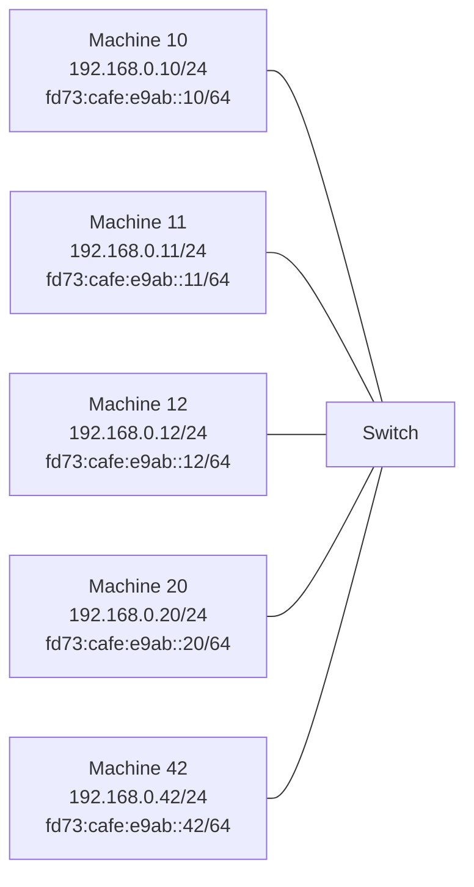
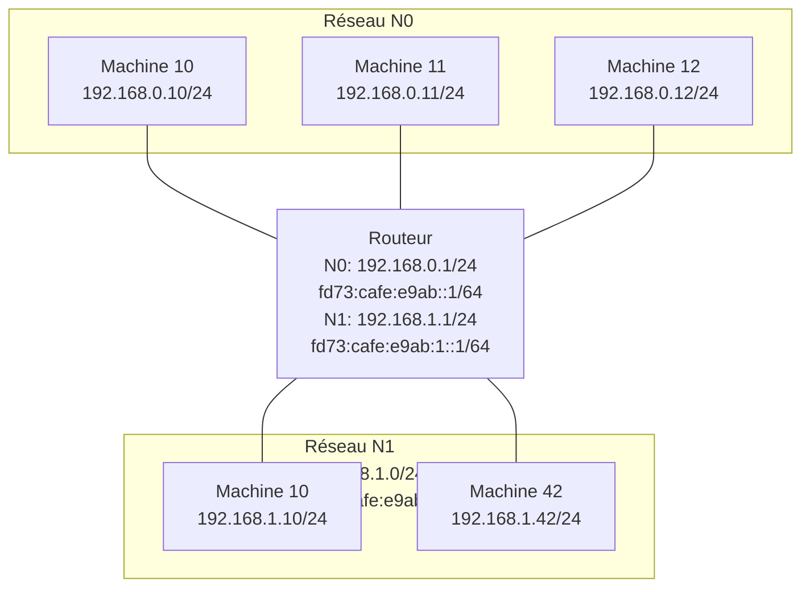
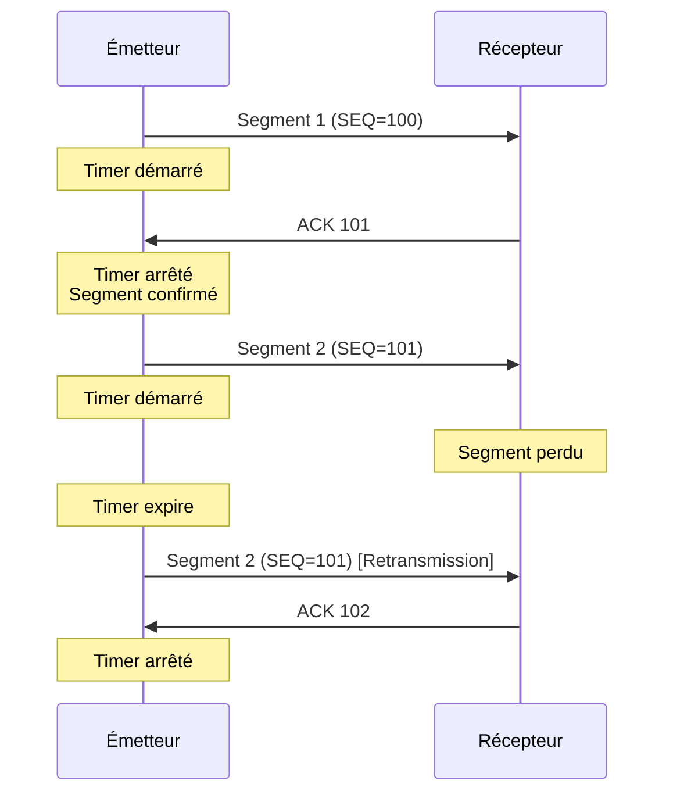
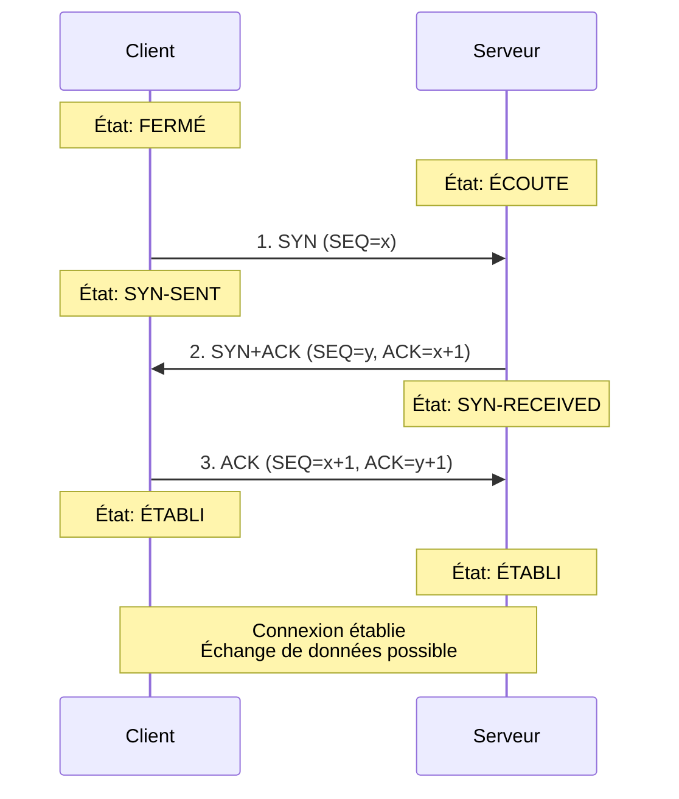
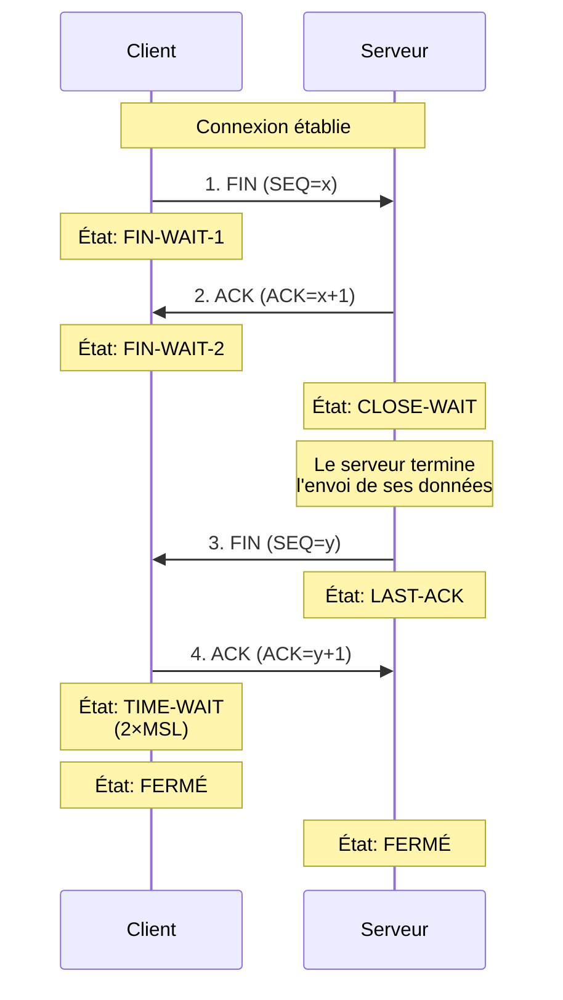

# Le routage IP

## Document de révision TSSR - Titre RNCP

---

**Formation** : Technicien Supérieur Systèmes et Réseaux (TSSR)  
**Sujet** : Le routage IP  
**Date** : Décembre 2024  
**Type** : Synthèse de cours complète

---

## 📋 Sommaire

1. [[#Introduction|Introduction]]
2. [[#Rappels fondamentaux|Rappels fondamentaux]]
   - [[#Internet Protocol (IP)|Internet Protocol]]
   - [[#Quiz de révision IP|Quiz de révision]]
3. [[#Le routage|Le routage]]
   - [[#Principe général du routage|Principe général]]
   - [[#Les routeurs|Les routeurs]]
   - [[#Les tables de routage|Les tables de routage]]
   - [[#Manipulation des tables de routage|Manipulation des tables]]
4. [[#Configuration routeur Linux|Configuration routeur Linux]]
   - [[#Activation du routage|Activation du routage]]
   - [[#Commandes essentielles|Commandes essentielles]]
5. [[#Routage dynamique|Routage dynamique]]
   - [[#Définition|Définition]]
   - [[#Protocoles de routage dynamique|Protocoles]]
6. [[#Protocoles de transport|Protocoles de transport]]
   - [[#UDP (User Datagram Protocol)|UDP]]
   - [[#TCP (Transmission Control Protocol)|TCP]]
7. [[#Points clés à retenir|Points clés à retenir]]
8. [[#Glossaire technique|Glossaire technique]]
9. [[#Références et liens utiles|Références]]

---

## Introduction

> [!abstract] Vue d'ensemble
> Le routage IP est un mécanisme fondamental permettant l'interconnexion de réseaux différents. Il permet aux paquets IP de transiter d'un réseau source vers un réseau destination en passant par des intermédiaires appelés **routeurs**. Ce document couvre les concepts essentiels du routage statique et dynamique, ainsi que les protocoles de transport TCP et UDP.

### Pourquoi étudier le routage IP ?

En tant que **TSSR**, tu dois comprendre :
- Comment les réseaux communiquent entre eux
- Le rôle et la configuration des routeurs
- La construction et la manipulation des tables de routage
- Les différents protocoles de routage dynamique
- Le fonctionnement des protocoles de transport

---

## Rappels fondamentaux

### Internet Protocol (IP)

> [!quote] Définition officielle
> **Internet Protocol (IP)** : Protocole de couche 3 (réseau) conçu pour faire de l'interconnexion de réseaux (internet). Il permet l'acheminement de paquets entre différents réseaux logiques.

> [!important] Principe clé
> Les nœuds d'un même réseau IP (logique) doivent être sur le même lien (réseau physique). Pour permettre la communication entre nœuds de réseaux différents, on utilise :
> - Des **intermédiaires** : passerelles appelées routeurs
> - Une **technique** : le routage

### Quiz de révision IP

> [!question] Questions de révision rapide
> **Q1** : Adresse réseau et broadcast de 172.67.146.155/16 ?
> - Réseau : `172.67.0.0/16`
> - Broadcast : `172.67.255.255`
> 
> **Q2** : Particularité de l'adresse 10.13.246.42 ?
> - Adresse IPv4 pour réseau privé (RFC 1918)
> - Routable sur les réseaux privés
> 
> **Q3** : Particularité de l'adresse fe80::5b5e:35fa:8c55:ba68 ?
> - Adresse IPv6 unicast **lien local** (Link-Local)
> - Communication sur le LAN uniquement (non-routable)
> 
> **Q4** : Particularité de l'adresse fd21:515e:8f6::1 ?
> - Adresse IPv6 unicast **locales uniques** (Unique Local)
> - Pour réseau privé (RFC 4193) - routable

---

## Le routage

### Principe général du routage

> [!info] Mécanisme de base
> IP sait que :
> - S'il veut envoyer un paquet à une interface sur le **même réseau** → il envoie directement via le lien (couche Ethernet)
> - S'il veut envoyer un paquet à une interface sur un **réseau différent** → il doit passer par un routeur

#### Comment déterminer si le destinataire est sur le même réseau ?

```
1. La machine prend toutes ses configurations IP de toutes ses interfaces
2. Elle calcule les réseaux correspondants
3. Si la destination fait partie du réseau d'une de ces adresses 
   → envoi sur l'interface physique correspondante
4. Sinon → consultation de la table de routage pour trouver le routeur approprié
```

#### Exemple illustré : Réseau simple



> [!example] Communication sur le même réseau
> **Scénario** : Machine 11 ping Machine 42
> 
> **Commande** : `ping 192.168.0.42` depuis 192.168.0.11
> 
> **Processus** :
> 1. Machine 11 calcule : 192.168.0.42 appartient au réseau 192.168.0.0/24
> 2. Machine 11 possède l'interface 192.168.0.11/24 sur ce réseau
> 3. Envoi direct : ARP pour obtenir l'adresse MAC de 192.168.0.42
> 4. Encapsulation du paquet IP dans une trame Ethernet
> 5. Envoi direct sur le lien

### Les routeurs

> [!quote] Définition
> Un **routeur** est un équipement réseau possédant au moins deux interfaces réseau sur des réseaux différents. Il permet de transférer des paquets IP d'un réseau vers un autre.

#### Exemple illustré : Deux réseaux interconnectés



> [!example] Communication inter-réseaux
> **Scénario** : Machine 11 (N0) ping Machine 42 (N1)
> 
> **Commande** : `ping 192.168.1.42` depuis 192.168.0.11
> 
> **Processus côté Machine 11** :
> 1. Machine 11 calcule : 192.168.1.42 n'appartient pas au réseau 192.168.0.0/24
> 2. Consultation de la table de routage
> 3. Table indique : "Pour 192.168.1.0/24, passer par 192.168.0.1"
> 4. ARP pour obtenir l'adresse MAC du routeur (192.168.0.1)
> 5. **Important** : Le paquet IP conserve l'adresse destination finale (192.168.1.42)
> 6. Mais la trame Ethernet est adressée au routeur
> 
> **Processus côté Routeur** :
> 1. Reçoit une trame avec son adresse MAC
> 2. Extrait le paquet IP
> 3. L'adresse IP destination n'est pas la sienne → routage
> 4. Consulte sa propre table de routage
> 5. Identifie que 192.168.1.42 est sur son réseau N1
> 6. Transmet le paquet vers N1

> [!tip] Passerelle par défaut (Default Gateway)
> Lorsqu'une machine n'a accès qu'à un seul routeur, on configure une **passerelle par défaut** :
> 
> **IPv4** : Route par défaut 0.0.0.0/0 via [IP routeur]
> 
> **IPv6** : Route par défaut ::/0 via [adresse link-local routeur]
> 
> Signification : "Quand tu ne sais pas où envoyer le paquet, envoie-le au routeur par défaut"

### Les tables de routage

> [!quote] Définition
> Chaque nœud d'un réseau IP (routeur ou hôte) dispose d'une **table de routage**. Elle contient les informations nécessaires pour acheminer les paquets IP vers leur destination.

#### Structure d'une entrée de table de routage

| Champ | Description | Exemple IPv4 | Exemple IPv6 |
|-------|-------------|--------------|--------------|
| **Destination** | Adresse de réseau et masque | 192.168.128.0/17 | fd73:cafe:e9ab:1::/64 |
| **Next Hop (Passerelle)** | Adresse IP de la passerelle | 10.0.0.1 | fe80::da58:d7ff:fe06:802 |
| **Interface** | Interface de sortie | enp0s3 | enp0s3 |
| **Métrique** | Qualité de la route (moins = mieux) | 100 | 100 |
| **Protocole** | Méthode d'ajout de la route | static, dhcp, kernel | static, kernel |

> [!note] Note sur IPv6
> En IPv6, on utilise les **adresses link-local** (fe80::) des routeurs comme next hop, car ces adresses sont garanties uniques sur le lien local.

> [!important] Optimisation des tables de routage
> **Problème** : Stocker une entrée pour chaque adresse IP serait impossible :
> - IPv4 : 2³² adresses possibles (≈4 milliards)
> - IPv6 : 2¹²⁸ adresses possibles (nombre astronomique)
> 
> **Solution** : Utiliser des **préfixes de routage** (sur-réseaux)
> - Une seule entrée représente un ensemble d'adresses
> - Agrégation de réseaux contigus
> - Plus les réseaux sont grands, plus la table est petite

#### Exemple d'agrégation de routes

```
Situation initiale :
- Routeur R1 accessible via 10.0.0.1 permet d'accéder à :
  • 192.168.192.0/20
  • 192.168.208.0/22
  
- Routeur R2 accessible via 10.0.0.2 permet d'accéder à :
  • 192.168.0.0/24
  • 192.168.5.0/24
  • 192.168.12.0/24

Agrégation possible :
- 192.168.128.0/17 via 10.0.0.1  (tous les réseaux avec 3ème octet >= 128)
- 192.168.0.0/17 via 10.0.0.2    (tous les réseaux avec 3ème octet < 128)

Résultat : 5 entrées réduites à 2 entrées !
```

### Manipulation des tables de routage

#### Linux : Commande `ip route`

> [!example] Exemples de commandes
> **Affichage des tables de routage** :
> ```bash
> # Table de routage IPv4
> ip route
> 
> # Table de routage IPv6
> ip -6 route
> ```
> 
> **Ajout de routes** :
> ```bash
> # Ajouter une route vers un réseau spécifique
> ip route add 192.168.128.0/17 via 10.0.0.2
> 
> # Ajouter une passerelle par défaut
> ip route add default via 10.0.0.254
> 
> # Route IPv6
> ip -6 route add fd73:cafe:e9ab:1::/64 via fe80::da58:d7ff:fe06:802 dev enp0s3
> ```
> 
> **Suppression de routes** :
> ```bash
> # Supprimer une route
> ip route del 192.168.128.0/17
> ```

> [!tip] Configuration persistante Linux
> Pour que les routes survivent au redémarrage :
> 
> **Debian/Ubuntu** : Éditer `/etc/network/interfaces`
> ```
> auto enp0s3
> iface enp0s3 inet static
>     address 10.0.0.138/24
>     gateway 10.0.0.254
>     up ip route add 192.168.128.0/17 via 10.0.0.2
> ```
> 
> **RHEL/CentOS** : Créer `/etc/sysconfig/network-scripts/route-<interface>`

**Exemple de sortie** :

```
wilder@host:~$ ip route
default via 10.0.0.254 dev enp0s3 proto dhcp metric 600
10.0.0.0/24 dev enp0s3 proto kernel scope link src 10.0.0.138 metric 600
192.168.128.0/17 via 10.0.0.2 dev enp0s3
192.168.0.0/17 via 10.0.0.1 dev enp0s3
```

**Interprétation** :
- `default via 10.0.0.254` : Passerelle par défaut
- `proto kernel` : Route ajoutée automatiquement par le noyau
- `proto dhcp` : Route obtenue par DHCP
- `scope link` : Route directement connectée
- `metric 600` : Priorité de la route (plus petit = prioritaire)

#### Windows : Commande `route`

> [!example] Exemples de commandes Windows
> **Affichage** :
> ```cmd
> # Afficher les tables IPv4 et IPv6
> route print
> ```
> 
> **Ajout de routes** :
> ```cmd
> # Ajouter une route
> route add 192.168.128.0 mask 255.255.128.0 10.0.0.2
> 
> # Ajouter une route persistante (survit au redémarrage)
> route add -p 192.168.128.0 mask 255.255.128.0 10.0.0.2
> ```
> 
> **Suppression** :
> ```cmd
> route delete 192.168.128.0
> ```

> [!note] PowerShell moderne
> **CmdLets PowerShell** (méthode recommandée) :
> ```powershell
> # Afficher les routes
> Get-NetRoute
> 
> # Ajouter une route
> New-NetRoute -DestinationPrefix "192.168.128.0/17" -NextHop "10.0.0.2"
> 
> # Supprimer une route
> Remove-NetRoute -DestinationPrefix "192.168.128.0/17"
> ```

---

## Configuration routeur Linux

### Activation du routage

> [!important] Transformation d'un Linux en routeur
> Par défaut, les systèmes Linux sont configurés comme **hôtes de réseau** :
> - Ils jettent les paquets qui ne leur sont pas destinés
> 
> Pour activer le routage, il faut modifier des paramètres système :
> - `net.ipv4.ip_forward` : 0 = hôte, 1 = routeur (IPv4)
> - `net.ipv6.conf.all.forwarding` : 0 = hôte, 1 = routeur (IPv6)

### Commande `sysctl`

> [!example] Manipulation avec sysctl
> **Consultation de l'état** :
> ```bash
> # IPv4
> sysctl net.ipv4.ip_forward
> 
> # IPv6
> sysctl net.ipv6.conf.all.forwarding
> ```
> 
> **Activation temporaire** (perdue au redémarrage) :
> ```bash
> # Activer le routage IPv4
> sysctl -w net.ipv4.ip_forward=1
> 
> # Activer le routage IPv6
> sysctl -w net.ipv6.conf.all.forwarding=1
> ```
> 
> **Activation permanente** :
> 1. Éditer `/etc/sysctl.conf` :
> ```
> net.ipv4.ip_forward = 1
> net.ipv6.conf.all.forwarding = 1
> ```
> 
> 2. Recharger la configuration :
> ```bash
> sysctl -p /etc/sysctl.conf
> ```

> [!warning] Impact de l'activation IPv6 forwarding
> L'activation de `net.ipv6.conf.all.forwarding=1` désactive automatiquement l'auto-configuration IPv6 (SLAAC) sur toutes les interfaces. Le routeur devra avoir des adresses IPv6 configurées statiquement.

---

## Routage dynamique

### Définition

> [!quote] Définition
> Le **routage dynamique** permet la mise à jour automatique des tables de routage entre les routeurs grâce à des protocoles dédiés. Il est essentiel dans les grandes architectures réseau comportant plus de 5 routeurs.

> [!info] Caractéristiques du routage dynamique
> **Dynamique** signifie :
> - Commutation automatique vers des liaisons de secours en cas de panne
> - Mise à jour automatique des tables de routage entre routeurs
> - Adaptation aux changements de topologie du réseau
> - Calcul automatique des meilleurs chemins

> [!important] Routage statique vs dynamique
> | Critère | Routage statique | Routage dynamique |
> |---------|------------------|-------------------|
> | **Configuration** | Manuelle par l'administrateur | Automatique par protocole |
> | **Maintenance** | Modification manuelle à chaque changement | Adaptation automatique |
> | **Ressources** | Faible (pas de calcul) | Plus élevées (CPU, mémoire) |
> | **Adaptation** | Aucune (routes fixes) | Automatique aux pannes |
> | **Usage** | Petits réseaux stables | Grands réseaux complexes |
> | **Complexité** | Simple | Plus complexe |

### Protocoles de routage dynamique

#### RIP (Routing Information Protocol)

> [!note] RIP - Pour petits réseaux
> **Caractéristiques** :
> - Port par défaut : **UDP 520**
> - Métrique : Nombre de sauts (hops)
> - Limitation : **Maximum 15 sauts**
> - Simplicité : Très simple à configurer
> - Convergence : Lente
> 
> **Versions** :
> - **RIPv1** : IPv4, pas de masque de sous-réseau (classful)
> - **RIPv2** : IPv4, support VLSM et CIDR
> - **RIPng** : IPv6 (RIP next generation)
> 
> **Limitation majeure** : RIP ne prend pas en compte l'état des liaisons (bande passante, latence), uniquement le nombre de sauts.

> [!warning] Limitation de RIP
> Un réseau accessible en 16 sauts ou plus est considéré comme **inaccessible** par RIP. Cette limitation le rend inadapté pour les grands réseaux.

#### EIGRP (Enhanced Interior Gateway Routing Protocol)

> [!note] EIGRP - Protocole Cisco propriétaire
> **Caractéristiques** :
> - **Constructeur** : Cisco (propriétaire)
> - **Port** : 88 (protocole IP 88)
> - **Usage** : Réseaux complexes et grands réseaux
> - **Métrique composite** : Bande passante, délai, fiabilité, charge
> - **Convergence** : Très rapide
> 
> **Avantages** :
> - Support de plusieurs protocoles de couche réseau (IPv4, IPv6, IPX, AppleTalk)
> - Mises à jour partielles (triggered updates)
> - Utilisation efficace de la bande passante

> [!warning] Piège
> EIGRP ne fonctionne que sur du matériel **Cisco**. Pour un environnement multi-constructeurs, privilégier OSPF.

#### OSPF (Open Shortest Path First)

> [!note] OSPF - Standard ouvert
> **Caractéristiques** :
> - **Port** : 89 (protocole IP 89)
> - **Type** : Protocole à état de liens (link-state)
> - **Standard** : Ouvert (RFC 2328 pour IPv4, RFC 5340 pour IPv6)
> - **Usage** : Réseaux de tailles moyenne à grande
> - **Métrique** : Coût basé sur la bande passante
> 
> **Avantages** :
> - Support VLSM et CIDR
> - Convergence rapide
> - Pas de limitation de sauts
> - Support de l'authentification
> - Organisation hiérarchique en zones (areas)
> 
> **Versions** :
> - **OSPFv2** : IPv4
> - **OSPFv3** : IPv6

> [!tip] OSPF vs RIP
> OSPF est beaucoup plus rapide que RIP car :
> - Il calcule le chemin le plus court (algorithme de Dijkstra)
> - Il tient compte de la bande passante des liens
> - Il converge rapidement après un changement de topologie

#### BGP (Border Gateway Protocol)

> [!note] BGP - Le protocole d'Internet
> **Caractéristiques** :
> - **Port** : **TCP 179**
> - **Type** : Protocole de routage externe (EGP)
> - **Usage** : Routage sur Internet entre AS (Autonomous Systems)
> - **Fonction** : Échange d'informations entre différents ISP
> 
> **Particularités** :
> - Protocole à vecteur de chemin (path vector)
> - Gère les politiques de routage
> - Essentiel pour le routage global d'Internet
> - Utilisé uniquement par les FAI et grandes organisations

> [!important] BGP n'est pas pour les réseaux d'entreprise classiques
> BGP est utilisé pour interconnecter des **systèmes autonomes** (AS) sur Internet. Dans un réseau d'entreprise, on utilise RIP, EIGRP ou OSPF.

### Tableau comparatif des protocoles

| Protocole | Type | Port/Protocole | Métrique | Max Hops | Convergence | Usage |
|-----------|------|----------------|----------|----------|-------------|-------|
| **RIP** | Distance-vector | UDP 520 | Hops | 15 | Lente | Petits réseaux |
| **EIGRP** | Advanced DV | IP 88 | Composite | 255 | Rapide | Cisco uniquement |
| **OSPF** | Link-state | IP 89 | Coût (bande passante) | Illimité | Rapide | Réseaux moyens/grands |
| **BGP** | Path-vector | TCP 179 | Attributs multiples | Illimité | Variable | Internet/ISP |

---

## Protocoles de transport

> [!abstract] Vue d'ensemble - Couches OSI et TCP/IP
> Le protocole IP (couche 3) est censé véhiculer un protocole de couche 4 (transport).
> Les deux protocoles de transport les plus courants sont :
> - **TCP** : Transmission Control Protocol
> - **UDP** : User Datagram Protocol

```
┌─────────────────────────────┐
│ 7 - Application             │
├─────────────────────────────┤
│ 5 - TLS (optionnel)         │
├─────────────────────────────┤
│ 4 - TCP, UDP                │ ← Couche Transport
├─────────────────────────────┤
│ 3 - IP                      │ ← Couche Réseau
├─────────────────────────────┤
│ 2bis - LLC (optionnel)      │
├─────────────────────────────┤
│ 2 - MAC (Ethernet)          │
├─────────────────────────────┤
│ 1 - Physique                │
└─────────────────────────────┘
```

> [!question] Problématique
> Un système reçoit un paquet IP destiné à une de ses interfaces.
> Les en-têtes IP indiquent le protocole de couche 4 (TCP ou UDP).
> 
> **Question** : À quel processus du système, à quelle application faut-il envoyer ce paquet ?
> 
> **Réponse** : C'est le rôle de la couche transport de faire basculer d'une communication entre interfaces à une communication entre processus (applications).

### UDP (User Datagram Protocol)

> [!quote] Définition - RFC 768
> **UDP - User Datagram Protocol**
> - Défini dans la RFC 768 (STD 6) en 1980 par David P. Reed
> - Protocole minimal (TCP light)
> - Permet la communication entre processus (applications)
> - Transporté par IP (v4 ou v6)
> - **Numéro de protocole : 17**

#### La notion de port

> [!info] Concept fondamental
> UDP (et TCP) utilise la notion de **port** : un port est un **identifiant de processus** au sein d'une interface.
> 
> Une communication est caractérisée par :
> - Un couple **adresse IP source / port source**
> - Un couple **adresse IP destination / port destination**
> 
> **Règle** : Il ne peut pas y avoir 2 ports identiques sur une même adresse IP.

#### Serveurs et clients

> [!note] Définitions
> **Serveur** : Processus qui attend des requêtes de la part de clients. Il est lié à (au moins) un port sur une interface.
> 
> **Client** : Processus qui envoie une requête à un serveur et attend généralement une réponse.
> 
> **Principe** : C'est toujours le **client qui initie** une communication. Il doit donc connaître l'adresse IP et le port du serveur.

#### Plages de ports

> [!important] Attribution des ports (codés sur 16 bits : 0-65535)
> 
> | Plage | Nom | Usage | Exemple |
> |-------|-----|-------|---------|
> | **0 - 1023** | Ports systèmes (Well Known Ports) | Serveurs standards | HTTP=80, HTTPS=443, DNS=53, SSH=22 |
> | **1024 - 49151** | Ports utilisateurs (Registered Ports) | Serveurs enregistrés | MySQL=3306, PostgreSQL=5432 |
> | **49152 - 65535** | Ports dynamiques (Ephemeral Ports) | Clients | Choisis automatiquement |
> 
> **Source** : Enregistrement à l'IANA (Internet Assigned Numbers Authority)

> [!tip] Utilisation des ports
> - Les ports **serveurs** utilisent généralement des ports bien connus (0-49151)
> - Les ports **clients** sont choisis dynamiquement dans la plage éphémère
> - Exemple : Navigateur web (client) utilise le port 54321 pour se connecter au serveur web sur le port 443

> [!note] Ports UDP et TCP distincts
> Ces 3 plages sont valables pour UDP **et** pour TCP, mais un port UDP est distinct d'un port TCP. Ils peuvent donc coexister sur la même machine :
> - Exemple : DNS utilise le port 53 en UDP **et** en TCP

#### Structure du datagramme UDP

> [!info] En-tête UDP (8 octets)
> Le datagramme UDP a une en-tête très simple avec 4 champs :
> 
> | Champ | Taille | Description |
> |-------|--------|-------------|
> | **Port source** | 16 bits | Port de l'émetteur |
> | **Port destination** | 16 bits | Port du récepteur |
> | **Longueur** | 16 bits | Taille totale (en-tête + données) |
> | **Somme de contrôle** | 16 bits | Checksum (en-tête + données + pseudo-en-tête IP) |

```
 0                   1                   2                   3
 0 1 2 3 4 5 6 7 8 9 0 1 2 3 4 5 6 7 8 9 0 1 2 3 4 5 6 7 8 9 0 1
+-+-+-+-+-+-+-+-+-+-+-+-+-+-+-+-+-+-+-+-+-+-+-+-+-+-+-+-+-+-+-+-+
|          Port source          |       Port destination        |
+-+-+-+-+-+-+-+-+-+-+-+-+-+-+-+-+-+-+-+-+-+-+-+-+-+-+-+-+-+-+-+-+
|            Longueur           |       Somme de contrôle       |
+-+-+-+-+-+-+-+-+-+-+-+-+-+-+-+-+-+-+-+-+-+-+-+-+-+-+-+-+-+-+-+-+
|                            Données                            |
+-+-+-+-+-+-+-+-+-+-+-+-+-+-+-+-+-+-+-+-+-+-+-+-+-+-+-+-+-+-+-+-+
```

#### Services rendus par UDP

> [!success] Avantages
> UDP est un protocole de couche 4 **particulièrement léger** :
> - Communication entre processus (ports)
> - Détection d'erreurs de transmission (somme de contrôle)
> - Vérification de la taille du datagramme
> - **Très faible overhead** (seulement 8 octets d'en-tête)

> [!warning] Limitations
> UDP **n'assure pas** :
> - La fiabilité (pas de retransmission des paquets perdus)
> - L'ordre d'arrivée des datagrammes
> - Le contrôle de flux
> - La gestion de la congestion
> 
> Si les contrôles échouent → Le datagramme est **jeté** sans prévenir l'expéditeur

> [!example] Applications utilisant UDP
> UDP est adapté pour :
> - **DNS** : Résolution de noms (requêtes courtes)
> - **DHCP** : Attribution d'adresses IP
> - **Streaming** : Audio/Vidéo en direct (perte acceptable)
> - **Jeux en ligne** : Faible latence prioritaire
> - **VoIP** : Téléphonie sur IP
> - **Diffusion** : Broadcast et multicast
> - **SNMP** : Surveillance réseau
> - **NTP** : Synchronisation d'horloge

### TCP (Transmission Control Protocol)

> [!quote] Définition - RFC 793 (obsolétée par RFC 9293)
> **TCP - Transmission Control Protocol**
> - Défini dans la RFC 793 (STD 7) en 1981, mis à jour par RFC 9293 en 2022
> - Protocole fiable en mode connecté
> - Établissement d'une connexion bidirectionnelle
> - Garantie du séquencement (ordre des données)
> - Optimisation de l'utilisation du réseau
> - Transporté par IP (v4 ou v6)
> - **Numéro de protocole : 6**

#### Principes de TCP

> [!important] Caractéristiques fondamentales
> TCP fournit :
> 1. **Connexion fiable** : Garantie de livraison des données
> 2. **Ordre garanti** : Les données arrivent dans l'ordre d'envoi
> 3. **Contrôle d'erreur** : Détection et correction des erreurs
> 4. **Contrôle de flux** : Le récepteur régule le débit de l'émetteur
> 5. **Contrôle de congestion** : Adaptation au trafic réseau

#### Mécanisme de fiabilité

> [!info] Assurer la réception
> TCP utilise un système d'**acquittement (ACK)** :
> 
> 1. **Transmission de segments** : TCP découpe les données en segments
> 2. **Numérotation** : Chaque segment est associé à un numéro de séquence
> 3. **Timer** : À l'émission → Démarrage d'un compte à rebours (timeout)
> 4. **Acquittement** : Le destinataire envoie un ACK à réception
> 5. **Validation** : À réception de l'ACK → Suppression du segment et du timer
> 6. **Retransmission** : À la fin du compte à rebours → Ré-émission du segment



#### Structure du segment TCP

> [!info] En-tête TCP (minimum 20 octets, jusqu'à 60 octets avec options)
> 
> **Champs principaux** (20 octets minimum) :
> 
> | Champ | Taille | Description |
> |-------|--------|-------------|
> | **Port source** | 16 bits | Port de l'émetteur |
> | **Port destination** | 16 bits | Port du récepteur |
> | **Numéro de séquence** | 32 bits | Position des données dans le flux |
> | **Numéro d'acquittement** | 32 bits | Prochain numéro de séquence attendu |
> | **Décalage données (Data offset)** | 4 bits | Taille de l'en-tête en mots de 32 bits |
> | **Réservé** | 6 bits | Mis à 0 |
> | **Drapeaux (Flags)** | 6 bits | URG, ACK, PSH, RST, SYN, FIN |
> | **Fenêtre** | 16 bits | Taille de la fenêtre de réception |
> | **Somme de contrôle** | 16 bits | Checksum |
> | **Pointeur urgent** | 16 bits | Si URG=1, position des données urgentes |
> | **Options** | 0-40 octets | Options TCP (MSS, Window Scale, etc.) |

```
 0                   1                   2                   3
 0 1 2 3 4 5 6 7 8 9 0 1 2 3 4 5 6 7 8 9 0 1 2 3 4 5 6 7 8 9 0 1
+-+-+-+-+-+-+-+-+-+-+-+-+-+-+-+-+-+-+-+-+-+-+-+-+-+-+-+-+-+-+-+-+
|          Port source          |       Port destination        |
+-+-+-+-+-+-+-+-+-+-+-+-+-+-+-+-+-+-+-+-+-+-+-+-+-+-+-+-+-+-+-+-+
|                      Numéro de séquence                       |
+-+-+-+-+-+-+-+-+-+-+-+-+-+-+-+-+-+-+-+-+-+-+-+-+-+-+-+-+-+-+-+-+
|                   Numéro d'acquittement                       |
+-+-+-+-+-+-+-+-+-+-+-+-+-+-+-+-+-+-+-+-+-+-+-+-+-+-+-+-+-+-+-+-+
| Offset|Réserv |U|A|P|R|S|F|            Fenêtre                |
|       |       |R|C|S|S|Y|I|                                   |
|       |       |G|K|H|T|N|N|                                   |
+-+-+-+-+-+-+-+-+-+-+-+-+-+-+-+-+-+-+-+-+-+-+-+-+-+-+-+-+-+-+-+-+
|       Somme de contrôle       |      Pointeur urgent          |
+-+-+-+-+-+-+-+-+-+-+-+-+-+-+-+-+-+-+-+-+-+-+-+-+-+-+-+-+-+-+-+-+
|                    Options (si présentes)                     |
+-+-+-+-+-+-+-+-+-+-+-+-+-+-+-+-+-+-+-+-+-+-+-+-+-+-+-+-+-+-+-+-+
|                            Données                            |
+-+-+-+-+-+-+-+-+-+-+-+-+-+-+-+-+-+-+-+-+-+-+-+-+-+-+-+-+-+-+-+-+
```

#### Drapeaux TCP (Flags)

> [!important] Les 6 bits de contrôle
> 
> | Drapeau | Nom | Description |
> |---------|-----|-------------|
> | **URG** | Urgent | Présence de données urgentes (pointeur urgent valide) |
> | **ACK** | Acknowledgment | Le segment contient un acquittement |
> | **PSH** | Push | Outrepasser le tampon, livraison immédiate à l'application |
> | **RST** | Reset | Réinitialisation de la connexion (erreur) |
> | **SYN** | Synchronize | Synchronisation des numéros de séquence (établissement connexion) |
> | **FIN** | Finish | Fin de transmission, plus de données à envoyer |

> [!example] Drapeaux PSH et URG - Cas d'usage
> 
> **PSH (Push)** :
> - Force la livraison immédiate des données à l'application
> - Utilisé pour les applications interactives (SSH, Telnet)
> - Exemple : Chaque frappe au clavier est envoyée immédiatement
> - Ne remplit pas le tampon, envoie directement
> 
> **URG (Urgent)** :
> - Indique des données prioritaires dans le segment
> - Le pointeur urgent indique la fin des données urgentes
> - Peu utilisé dans les implémentations modernes
> - Exemple : Signal d'interruption Ctrl+C dans Telnet

> [!tip] Utilisation pratique des drapeaux
> En pratique, vous verrez souvent :
> - **SYN** : Établissement de connexion
> - **SYN+ACK** : Réponse à un SYN
> - **ACK** : Accusé de réception normal
> - **PSH+ACK** : Données avec livraison immédiate
> - **FIN+ACK** : Fermeture de connexion
> - **RST** : Connexion refusée ou réinitialisée

#### Établissement de connexion - Three-Way Handshake

> [!info] La poignée de main en 3 temps
> TCP établit une connexion par un **handshake en 3 temps** :



**Détail du processus** :

> [!example] Étape 1 : SYN
> **Client → Serveur**
> - Drapeau **SYN = 1**
> - Le client choisit un numéro de séquence initial (ISN) aléatoire : `SEQ = x`
> - Options TCP : MSS (Maximum Segment Size), Window Scale, etc.

> [!example] Étape 2 : SYN+ACK
> **Serveur → Client**
> - Drapeaux **SYN = 1** et **ACK = 1**
> - Le serveur choisit son propre numéro de séquence : `SEQ = y`
> - Acquitte le SYN du client : `ACK = x+1`
> - Options TCP du serveur

> [!example] Étape 3 : ACK
> **Client → Serveur**
> - Drapeau **ACK = 1**
> - `SEQ = x+1` (numéro suivant)
> - `ACK = y+1` (acquitte le SYN du serveur)
> - **Connexion établie**, les données peuvent être transmises

> [!note] Numéros de séquence initiaux (ISN)
> Les numéros de séquence initiaux doivent être **aléatoires et imprévisibles** pour des raisons de sécurité (prévention des attaques de prédiction de séquence - sequence prediction attacks).

#### Transmission bidirectionnelle

> [!success] Full Duplex
> Une fois la connexion établie, chaque côté peut envoyer des segments à l'autre :
> - Chaque nouveau segment porte le numéro de séquence suivant
> - Les segments peuvent tous contenir des acquittements
> - Pas besoin de segments dédiés uniquement aux acquittements
> - Les données circulent dans les deux sens simultanément

#### Gestion du débit et fenêtre TCP

> [!info] Fenêtre TCP (Window)
> **Problème** : Attendre un acquittement avant d'émettre nuit au débit
> 
> **Calcul théorique du débit** :
> ```
> Débit ≈ 1 segment (MSS) / (2 × latence)
> ```
> 
> **Solution** : La **fenêtre TCP** permet d'envoyer plusieurs segments sans attendre
> - Le champ **Window** indique combien d'octets le récepteur peut encore recevoir
> - Mécanisme de **contrôle de flux** : évite la surcharge du récepteur
> - Réservation de mémoire pour stocker les segments en attente
> - Remise en ordre une fois l'ensemble reçu

> [!note] MSS (Maximum Segment Size)
> **MSS** : Taille maximale des données TCP (sans les en-têtes)
> - Négociée pendant le handshake (option TCP)
> - Typiquement : **MSS = MTU - 40 octets** (20 IP + 20 TCP)
> - Ethernet standard (MTU 1500) → MSS = 1460 octets
> - Important pour éviter la fragmentation IP
> 
> **Calcul** :
> ```
> MTU (Maximum Transmission Unit) = 1500 octets (Ethernet)
> En-tête IP = 20 octets
> En-tête TCP = 20 octets
> MSS = 1500 - 20 - 20 = 1460 octets
> ```

> [!tip] Window Scaling (RFC 7323)
> Par défaut, la fenêtre TCP est codée sur 16 bits → Maximum 65 535 octets
> 
> **Problème** : Insuffisant pour les liens à haute capacité
> 
> **Solution** : L'option **Window Scale** (RFC 7323) permet d'étendre la fenêtre
> - Facteur d'échelle de 0 à 14 (multiplié par 2^facteur)
> - Fenêtre maximum : 2³⁰ octets (environ 1 Go)
> - Négociée pendant le handshake (option TCP)
> - Essentielle pour les réseaux à longue distance et haute bande passante

#### Acquittements et détection de perte

> [!info] Mécanisme d'acquittement
> **Émission d'un segment TCP** :
> - Numéro de séquence = Numéro précédent + 1 (sauf retransmission)
> - Si **ACK = 1** : Le paquet contient un acquittement
>   - Numéro d'acquittement = Dernier numéro de séquence reçu sans coupure + 1
>   - Signification : "J'ai bien reçu tout jusqu'à X"
> 
> **Acquittement cumulatif** : Un seul ACK peut confirmer plusieurs segments

> [!example] Fast Retransmit (Retransmission rapide)
> Si le récepteur reçoit 3 ACK dupliqués (même numéro) :
> - Indication qu'un segment a été perdu
> - L'émetteur **retransmet immédiatement** sans attendre le timeout
> - Améliore les performances en évitant les délais

#### Fermeture de connexion - Four-Way Handshake

> [!info] Fermeture en 4 temps
> Chaque direction de la connexion se ferme indépendamment :



**Détail du processus** :

> [!example] Étapes de fermeture
> **Étape 1** : Le client n'a plus de données à envoyer
> - Envoi d'un segment avec **FIN = 1**
> - État : FIN-WAIT-1
> 
> **Étape 2** : Le serveur acquitte le FIN
> - Envoi **ACK = 1**
> - État serveur : CLOSE-WAIT (peut encore envoyer des données)
> - État client : FIN-WAIT-2
> 
> **Étape 3** : Le serveur termine également
> - Envoi d'un segment avec **FIN = 1**
> - État : LAST-ACK
> 
> **Étape 4** : Le client acquitte le FIN du serveur
> - Envoi **ACK = 1**
> - État client : TIME-WAIT (attente 2×MSL)
> - État serveur : FERMÉ

> [!note] Temps d'attente TIME-WAIT
> **MSL** (Maximum Segment Lifetime) : Durée de vie maximale d'un segment sur le réseau (généralement 2 minutes)
> 
> **TIME-WAIT = 2 × MSL** : Le client attend avant de fermer complètement
> - Permet de gérer les ACK perdus
> - Évite qu'un nouveau FIN arrive et soit mal interprété
> - Prévient les segments retardés d'une ancienne connexion

#### Contrôle de congestion

> [!info] Algorithmes TCP
> TCP implémente des **algorithmes de contrôle de congestion** pour optimiser l'utilisation du réseau :
> 
> **Concepts clés** :
> - **cwnd** (Congestion Window) : Fenêtre de congestion
> - **ssthresh** (Slow Start Threshold) : Seuil de démarrage lent
> - **RTT** (Round-Trip Time) : Temps aller-retour
> 
> **Phases principales** :
> 1. **Slow Start** : Croissance exponentielle de cwnd
> 2. **Congestion Avoidance** : Croissance linéaire après ssthresh
> 3. **Fast Retransmit** : Retransmission rapide sur 3 ACK dupliqués
> 4. **Fast Recovery** : Récupération rapide sans revenir en Slow Start

> [!note] Algorithmes principaux
> Évolution historique :
> - **TCP Tahoe** (1988) : Premier algorithme avec Slow Start et Congestion Avoidance
> - **TCP Reno** (1990) : Ajout de Fast Retransmit et Fast Recovery
> - **TCP NewReno** (1999) : Amélioration de Fast Recovery
> - **TCP CUBIC** (2005) : Optimisé pour les réseaux à haute capacité
> - **TCP BBR** (2016) : Basé sur la mesure de la bande passante et du RTT

> [!tip] Pour aller plus loin
> Le contrôle de congestion TCP est un sujet complexe et en constante évolution.
> Voir la page Wikipedia sur les [algorithmes TCP](https://fr.wikipedia.org/wiki/Algorithme_TCP) pour plus de détails.

#### Services rendus par TCP

> [!success] Avantages de TCP
> TCP offre un protocole de couche 4 **fiable et complet** :
> - **Connexion fiable** entre processus (ports)
> - **Gestion des retransmissions** (segments perdus)
> - **Garantie de l'ordre** des segments
> - **Optimisation de la bande passante** (fenêtre dynamique)
> - **Gestion de la congestion** (adaptation au trafic réseau)
> - **Contrôle de flux** (protection du récepteur)

> [!warning] Inconvénients de TCP
> - **Protocole lourd** : En-tête de 20 à 60 octets
> - **Coûteux en ressources** : CPU, mémoire
> - **Non disponible** sur les très petits systèmes (embarqués, IoT)
> - **Latence** : Le handshake et les retransmissions ajoutent du délai
> - **Overhead** : Mécanismes de fiabilité pas toujours nécessaires

> [!example] Applications utilisant TCP
> TCP est utilisé pour les applications nécessitant de la fiabilité :
> - **HTTP/HTTPS** : Navigateurs web (80/443)
> - **SSH** : Administration à distance sécurisée (22)
> - **FTP** : Transfert de fichiers (20/21)
> - **SMTP/POP3/IMAP** : Messagerie électronique (25/110/143)
> - **Telnet** : Terminal distant (23)
> - **Base de données** : MySQL (3306), PostgreSQL (5432)
> - **Bureautique** : Microsoft Office, applications métier

---

## Points clés à retenir

> [!success] Synthèse pour le titre RNCP

### Le routage IP

- **Le routage permet l'interconnexion de réseaux** : Les paquets IP transitent entre réseaux différents via des routeurs
- **Les routeurs sont des intermédiaires** : Équipements avec plusieurs interfaces sur des réseaux distincts
- **Chaque nœud possède une table de routage** : Contient les informations pour acheminer les paquets (destination, next hop, interface, métrique)
- **Agrégation de routes** : Utilisation de préfixes de routage pour réduire la taille des tables
- **Passerelle par défaut** : Route 0.0.0.0/0 (IPv4) ou ::/0 (IPv6) utilisée quand aucune route spécifique ne correspond

### Configuration Linux

- **Routage IPv4** : `net.ipv4.ip_forward=1` pour activer
- **Routage IPv6** : `net.ipv6.conf.all.forwarding=1` pour activer
- **Commandes essentielles** :
  - `ip route` : Manipulation table de routage IPv4
  - `ip -6 route` : Manipulation table de routage IPv6
  - `sysctl` : Modification paramètres système
- **Configuration persistante** : `/etc/sysctl.conf` pour les paramètres système, `/etc/network/interfaces` pour les routes

### Routage dynamique

- **Routage statique** : Configuration manuelle, adapté aux petits réseaux stables
- **Routage dynamique** : Mise à jour automatique des tables, essentiel pour les grands réseaux (>5 routeurs)
- **RIP** : Simple, limité à 15 sauts, UDP 520
- **EIGRP** : Cisco propriétaire, convergence rapide, IP 88
- **OSPF** : Standard ouvert, link-state, adapté aux réseaux moyens/grands, IP 89
- **BGP** : Routage Internet entre AS, TCP 179

### Protocoles de transport

- **UDP (IP 17)** :
  - Protocole léger, non fiable
  - En-tête 8 octets
  - Pas de garantie d'ordre ou de livraison
  - Utilisé pour DNS, DHCP, streaming, VoIP
- **TCP (IP 6)** :
  - Protocole fiable, orienté connexion
  - En-tête 20-60 octets
  - Garantie d'ordre et de livraison
  - Handshake 3 temps (établissement), 4 temps (fermeture)
  - Contrôle de flux et de congestion
  - Utilisé pour HTTP, SSH, FTP, messagerie

### Ports

- **0-1023** : Ports systèmes (Well Known) - Serveurs standards
- **1024-49151** : Ports enregistrés (Registered) - Serveurs enregistrés IANA
- **49152-65535** : Ports dynamiques (Ephemeral) - Clients

### TCP : Concepts avancés

- **MSS** (Maximum Segment Size) : Taille maximale des données TCP, typiquement 1460 octets
- **Window Scaling** (RFC 7323) : Extension de la fenêtre au-delà de 65535 octets
- **Drapeaux** : SYN (connexion), ACK (acquittement), FIN (fermeture), RST (reset), PSH (push), URG (urgent)
- **Acquittements cumulatifs** : Un ACK peut confirmer plusieurs segments
- **Fast Retransmit** : Retransmission immédiate après 3 ACK dupliqués
- **Contrôle de congestion** : Algorithmes (Tahoe, Reno, NewReno, CUBIC, BBR) pour optimiser l'utilisation réseau

---

## Glossaire technique

> [!note] Définitions essentielles pour le TSSR

| Terme | Définition |
|-------|------------|
| **ACK** | Acknowledgment - Drapeau TCP indiquant un acquittement |
| **AS (Autonomous System)** | Système autonome - Réseau ou ensemble de réseaux sous une même administration, identifié par un numéro AS |
| **BGP** | Border Gateway Protocol - Protocole de routage externe pour Internet (TCP 179) |
| **Broadcast** | Adresse de diffusion - Dernière adresse d'un réseau, permet d'envoyer à tous les hôtes du réseau |
| **CIDR** | Classless Inter-Domain Routing - Notation adresse/masque (ex: 192.168.1.0/24) |
| **Congestion** | Saturation du réseau causant des pertes de paquets |
| **cwnd** | Congestion Window - Fenêtre de congestion TCP |
| **Default Gateway** | Passerelle par défaut - Routeur utilisé pour les destinations inconnues |
| **DHCP** | Dynamic Host Configuration Protocol - Attribution automatique d'adresses IP (UDP 67/68) |
| **DNS** | Domain Name System - Résolution de noms de domaine en adresses IP (UDP/TCP 53) |
| **EIGRP** | Enhanced Interior Gateway Routing Protocol - Protocole Cisco propriétaire (IP 88) |
| **FIN** | Finish - Drapeau TCP indiquant la fin de transmission |
| **Hop** | Saut - Passage par un routeur |
| **IANA** | Internet Assigned Numbers Authority - Organisation gérant l'attribution des numéros (ports, AS, etc.) |
| **ICMP** | Internet Control Message Protocol - Protocole de messages de contrôle (ping, traceroute) |
| **ISN** | Initial Sequence Number - Numéro de séquence initial TCP (choisi aléatoirement) |
| **ISP** | Internet Service Provider - Fournisseur d'Accès Internet |
| **Link-Local** | Adresse lien local (fe80::/10 en IPv6) - Communication sur le lien uniquement, non routable |
| **MSL** | Maximum Segment Lifetime - Durée de vie maximale d'un segment TCP (généralement 2 minutes) |
| **MSS** | Maximum Segment Size - Taille maximale des données TCP (typiquement 1460 octets) |
| **MTU** | Maximum Transmission Unit - Taille maximale d'une trame (1500 octets pour Ethernet) |
| **Next Hop** | Saut suivant - Adresse IP du routeur pour atteindre une destination |
| **OSPF** | Open Shortest Path First - Protocole de routage link-state standard (IP 89) |
| **Paquet** | Unité de données de couche 3 (réseau) - PDU du protocole IP |
| **Port** | Identifiant de processus (16 bits : 0-65535) |
| **PSH** | Push - Drapeau TCP forçant la livraison immédiate à l'application |
| **RFC** | Request For Comments - Documents standards de l'IETF définissant les protocoles Internet |
| **RIP** | Routing Information Protocol - Protocole de routage simple (UDP 520, max 15 sauts) |
| **Routeur** | Équipement de couche 3 interconnectant des réseaux différents |
| **RST** | Reset - Drapeau TCP réinitialisant une connexion (erreur) |
| **RTT** | Round-Trip Time - Temps aller-retour d'un paquet |
| **Segment** | Unité de données de couche 4 (transport) - PDU du protocole TCP |
| **Sous-réseau** | Subdivision d'un réseau IP en réseaux plus petits |
| **ssthresh** | Slow Start Threshold - Seuil de démarrage lent TCP |
| **SYN** | Synchronize - Drapeau TCP pour l'établissement de connexion |
| **Table de routage** | Base de données contenant les routes (destination, next hop, interface, métrique) |
| **TCP** | Transmission Control Protocol - Protocole de transport fiable (IP 6) |
| **Three-Way Handshake** | Poignée de main en 3 temps - Établissement de connexion TCP (SYN, SYN-ACK, ACK) |
| **UDP** | User Datagram Protocol - Protocole de transport léger et non fiable (IP 17) |
| **Unique Local** | Adresse IPv6 privée (fd00::/8) - Équivalent des adresses privées IPv4 (RFC 4193) |
| **URG** | Urgent - Drapeau TCP indiquant des données prioritaires |
| **VLSM** | Variable Length Subnet Mask - Masques de sous-réseaux de longueur variable |
| **Window** | Fenêtre - Taille du buffer de réception TCP (en octets) |
| **Window Scale** | Extension de fenêtre TCP au-delà de 65535 octets (RFC 7323) |

---

## Références et liens utiles

> [!note] Sources consultées

### Documents officiels (RFC)

- [RFC 768](https://www.ietf.org/rfc/rfc768.txt) - User Datagram Protocol (UDP)
- [RFC 793](https://www.ietf.org/rfc/rfc793.txt) - Transmission Control Protocol (TCP) - Obsolète, voir RFC 9293
- [RFC 9293](https://www.rfc-editor.org/rfc/rfc9293.html) - Transmission Control Protocol (TCP) - Version mise à jour
- [RFC 879](https://datatracker.ietf.org/doc/html/rfc879) - The TCP Maximum Segment Size and Related Topics
- [RFC 1918](https://www.rfc-editor.org/rfc/rfc1918.html) - Address Allocation for Private Internets
- [RFC 4193](https://www.rfc-editor.org/rfc/rfc4193.html) - Unique Local IPv6 Unicast Addresses
- [RFC 6691](https://datatracker.ietf.org/doc/html/rfc6691) - TCP Options and Maximum Segment Size (MSS)
- [RFC 7323](https://www.rfc-editor.org/rfc/rfc7323.html) - TCP Extensions for High Performance (Window Scaling)

### IANA (Internet Assigned Numbers Authority)

- [Service Name and Transport Protocol Port Number Registry](https://www.iana.org/assignments/service-names-port-numbers) - Liste officielle des ports TCP/UDP
- [RFC 6335](https://www.rfc-editor.org/rfc/rfc6335.html) - IANA Procedures for Port Number Management

### Ressources pédagogiques

- [Algorithme TCP - Wikipedia FR](https://fr.wikipedia.org/wiki/Algorithme_TCP) - Explication des algorithmes de contrôle de congestion
- [TCP Flags: PSH and URG - PacketLife.net](https://packetlife.net/blog/2011/mar/2/tcp-flags-psh-and-urg/) - Explication des drapeaux TCP
- [Maximum Segment Size - Wikipedia FR](https://fr.wikipedia.org/wiki/Maximum_Segment_Size) - Détails sur le MSS
- [Transmission Control Protocol - Wikipedia FR](https://fr.wikipedia.org/wiki/Transmission_Control_Protocol) - Vue d'ensemble de TCP

---

**Document créé pour la préparation au titre RNCP TSSR**  
**Format : Markdown optimisé pour Obsidian**  
**Dernière mise à jour : Décembre 2024**
