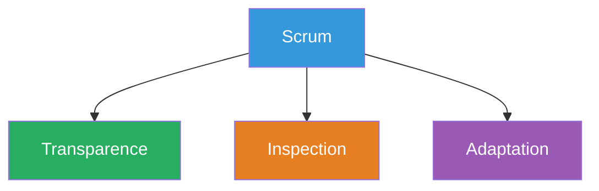
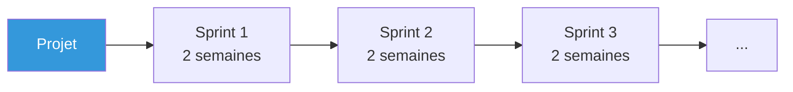
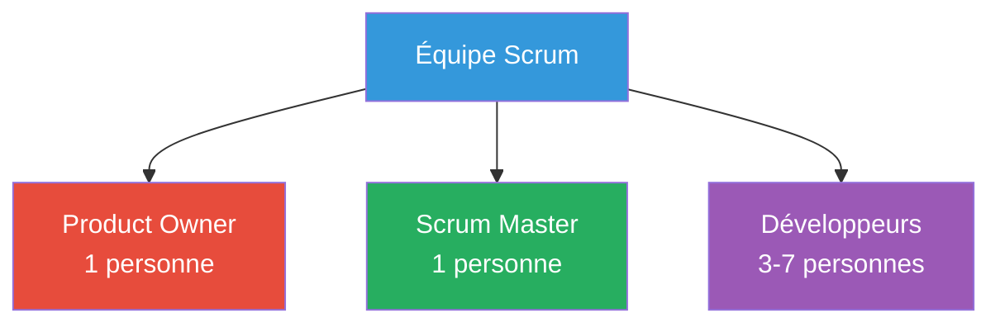
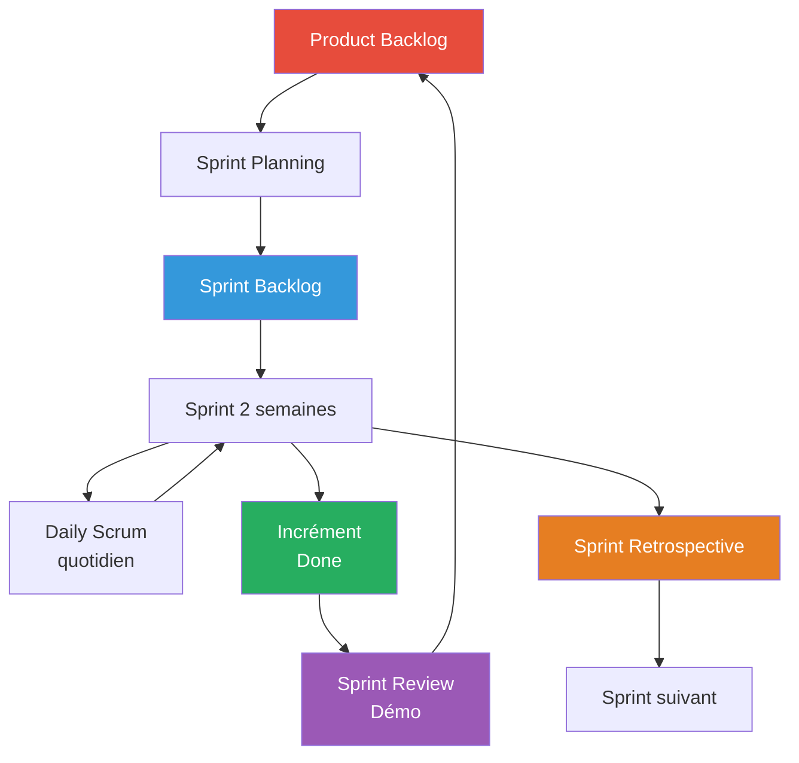

# Introduction aux méthodes agiles et Scrum
## Document de révision TSSR - Titre RNCP

---

**Formation** : Technicien Supérieur Systèmes et Réseaux (TSSR)  
**Sujet** : Introduction aux méthodes agiles - Scrum  
**Date** : Novembre 2024  
**Type** : Synthèse de cours complète

---

## 📋 Sommaire

1. [[#La gestion de projets|La gestion de projets]]
   - [[#Qu'est-ce qu'un projet|Définition]]
   - [[#Gestion de projet|Gestion]]
   - [[#Méthodes|Méthodes]]
2. [[#Les méthodes agiles|Les méthodes agiles]]
   - [[#Contexte historique|Contexte]]
   - [[#Le Manifeste Agile|Manifeste]]
   - [[#Principes|Principes]]
3. [[#Scrum|Scrum]]
   - [[#Définition Scrum|Définition]]
   - [[#Les 3 piliers de Scrum|Piliers]]
   - [[#Organisation du temps Sprint|Organisation]]
   - [[#Artefacts Scrum|Artefacts]]
   - [[#Rôles Scrum|Rôles]]
   - [[#Cérémonies événements|Cérémonies]]
   - [[#Vélocité et estimation|Vélocité]]
4. [[#Pendant la formation TSSR|Pendant la formation]]
   - [[#Projets d'équipe|Projets]]
   - [[#Journal de formation|Journal]]
   - [[#Rituels|Rituels]]
5. [[#Points clés à retenir|Points clés]]
6. [[#Glossaire technique|Glossaire]]
7. [[#Ressources complémentaires|Ressources]]

---

## La gestion de projets

> [!abstract] Fondamentaux de la gestion de projet
> Avant d'aborder les méthodes agiles, il est essentiel de comprendre ce qu'est un projet et comment le gérer.

### Qu'est-ce qu'un projet ?

> [!info] Définition

Un **projet** est une **action temporaire** menée pour atteindre un **objectif précis**, avec des **ressources limitées** (temps, budget, équipe) et un **résultat attendu unique** (produit, service, infrastructure, etc.).

#### Caractéristiques d'un projet

| Caractéristique | Description | Exemple |
|-----------------|-------------|---------|
| **Temporaire** | Début et fin définis | Projet de 6 mois |
| **Objectif précis** | But clairement défini | Créer un site web e-commerce |
| **Ressources limitées** | Contraintes de moyens | Budget 50k€, équipe de 5 personnes |
| **Résultat unique** | Livrable spécifique | Application mobile fonctionnelle |

#### Définir le contenu d'un projet

Un projet est défini par **plusieurs éléments** :

**1. Un besoin** :
- Réponse à un problème
- Amélioration d'un existant
- Nouvelle opportunité

**2. Un périmètre** :
- Livrables attendus
- Fonctionnalités incluses
- Ce qui est HORS périmètre

**3. Des contraintes** :
- **Temps** : Délais, échéances
- **Budget** : Ressources financières
- **Ressources Humaines** : Équipe, compétences
- **Matériel** : Infrastructure, outils

**4. Des personnes** :
- **Client** : Commanditaire, payeur
- **Chef de projet** : Responsable projet
- **Équipe** : Membres, contributeurs
- **Utilisateurs finaux** : Bénéficiaires

**5. Un objectif** :
- Produit final
- Service à fournir
- Infrastructure à déployer
- Procédure à établir

> [!example] Exemple de projet
> **Projet** : Refonte du site web d'une entreprise
> - **Besoin** : Site obsolète, mauvaise expérience utilisateur
> - **Périmètre** : Nouveau design, responsive, e-commerce
> - **Contraintes** : 3 mois, 30 000€, équipe de 4 personnes
> - **Personnes** : Direction (client), Chef de projet web, 2 devs, 1 designer
> - **Objectif** : Site web moderne et fonctionnel en ligne

### Gestion de projet

> [!important] Définition

La **gestion de projet** (ou **pilotage de projet**, **conduite de projet**, **management de projet**) est l'**ensemble des activités** visant à **organiser le bon déroulement d'un projet** et à en **atteindre les objectifs** selon la définition du projet (temps, budget, qualité).

#### Autres appellations

- Conduite de projet
- Pilotage de projet
- Ingénierie de projet
- Management de projet

Toutes ces expressions désignent la même chose !

### Méthodes de gestion de projet

> [!info] Principales méthodes

Il existe **plusieurs méthodes** de gestion de projet :

| Méthode | Type | Caractéristiques | Usage |
|---------|------|------------------|-------|
| **Cycle en V** | Prédictif | Séquentiel, phases fixes | Projets à exigences stables |
| **ITIL** | Processus | Gestion services IT | Infrastructure IT |
| **Agile** | Itératif | Flexible, adaptatif | Développement logiciel, innovation |
| | | (Scrum, Kanban, XP) | |

#### Ne pas confondre méthodes et outils !

> [!warning] Distinction importante

Les **outils** ne sont PAS des méthodes :

| Outil | Fonction | Type |
|-------|----------|------|
| **Diagramme de Gantt** | Planification temporelle | Outil de planification |
| **Matrice RACI** | Répartition des rôles | Outil de responsabilités |
| **Matrice Eisenhower** | Priorisation des tâches | Outil de priorisation |

**Les outils SERVENT les méthodes mais ne sont pas des méthodes en elles-mêmes.**

---

## Les méthodes agiles

> [!abstract] Une révolution dans le développement logiciel
> Les méthodes agiles représentent un changement de paradigme dans la gestion de projets, particulièrement dans le développement logiciel.

### Contexte historique

#### Méthodes traditionnelles

> [!note] Avant l'Agile

**Méthodes plus anciennes** (années 1970-1990) :
- **Modèle en cascade** (Waterfall)
- **Cycle en V**

**Problèmes** :
- ❌ Trop **rigides**
- ❌ Trop **prédictives**
- ❌ Difficulté à **s'adapter** aux changements
- ❌ Effet tunnel (pas de visibilité pendant le développement)
- ❌ Livraison tardive (découverte problèmes en fin de projet)


**Modèle en cascade** : Une fois une phase terminée, impossible de revenir en arrière !

#### Émergence des méthodes agiles

**Années 2000** : Apparition de **nouvelles approches** :
- **Scrum** (1995-1996)
- **Extreme Programming (XP)** (1999)
- **RAD** (Rapid Application Development)
- **Crystal Clear**

**2001** : 
**Manifeste pour le développement Agile de logiciels** publié par 17 experts en développement logiciel réunis dans l'Utah.

### Le Manifeste Agile

> [!important] Les 4 valeurs fondamentales

> [!quote] Manifeste Agile (2001)
> Nous découvrons comment mieux développer des logiciels par la pratique et en aidant les autres à le faire.
> 
> Ces expériences nous ont amenés à valoriser :
> 
> **Les individus et leurs interactions** plus que les processus et les outils
> 
> **Des logiciels opérationnels** plus qu'une documentation exhaustive
> 
> **La collaboration avec les clients** plus que la négociation contractuelle
> 
> **L'adaptation au changement** plus que le suivi d'un plan
> 
> Nous reconnaissons la valeur des seconds éléments, mais privilégions les premiers.

#### Explication des 4 valeurs

**1. Les individus et leurs interactions > Processus et outils**
```
Focus sur l'HUMAIN :
├─ Communication directe
├─ Collaboration d'équipe
├─ Compétences et motivation
└─ Interactions productives

Plutôt que :
└─ Processus rigides, outils complexes
```

**2. Logiciels opérationnels > Documentation exhaustive**
```
Focus sur le FONCTIONNEL :
├─ Produit qui marche
├─ Valeur livrée rapidement
└─ Feedback utilisateur

Plutôt que :
└─ Des centaines de pages de documentation
```

**3. Collaboration avec les clients > Négociation contractuelle**
```
Focus sur le PARTENARIAT :
├─ Client impliqué dans le projet
├─ Feedback régulier
├─ Ajustements continus
└─ Co-construction

Plutôt que :
└─ Contrat figé, relation conflictuelle
```

**4. Adaptation au changement > Suivi d'un plan**
```
Focus sur la FLEXIBILITÉ :
├─ Réponse au changement
├─ Ajustements possibles
└─ Amélioration continue

Plutôt que :
└─ Plan figé à respecter coûte que coûte
```

### Les 12 principes Agile

> [!info] Principes sous-jacents au Manifeste

1. **Satisfaction client** : Livraison continue de logiciels de valeur
2. **Accueil du changement** : Même tard dans le développement
3. **Livraison fréquente** : De quelques semaines à quelques mois
4. **Collaboration quotidienne** : Entre métiers et développeurs
5. **Motivation** : Bâtir projets autour d'individus motivés
6. **Communication face-à-face** : La plus efficace
7. **Logiciel fonctionnel** : Principale mesure d'avancement
8. **Rythme soutenable** : Maintenir indéfiniment
9. **Excellence technique** : Attention continue
10. **Simplicité** : Art de minimiser le travail inutile
11. **Auto-organisation** : Meilleures architectures émergent d'équipes auto-organisées
12. **Réflexion et ajustement** : À intervalles réguliers

### Les objectifs

> [!success] Enjeux du génie logiciel

**Question centrale** :
Quelle organisation pour la réussite des projets ?

**Éléments clés** :

1. **Cycle de vie** :
   - Les étapes et leur séquencement
   - Organisation temporelle du projet

2. **Organisation d'équipe** :
   - Les rôles et compétences nécessaires
   - Structure de l'équipe

3. **Livrables** :
   - Les éléments à produire
   - Résultats tangibles

4. **Critères de réussite** :
   - Objectifs de qualité
   - Contraintes à respecter

---

## Scrum

> [!abstract] La méthode agile la plus populaire
> Scrum est le framework agile le plus utilisé mondialement (~58% des projets agiles).

### Définition Scrum

> [!important] Qu'est-ce que Scrum ?

**Scrum** est un **cadre de développement** de produits complexes.

#### Origines

**Créateurs** :
- **Ken Schwaber** (1995)
- **Mike Beedle** (2002 - livre)
- **Jeff Sutherland** (2010 - Scrum Guide)

**Étymologie** :
**Scrum** = **Mêlée** (rugby) 🏉
→ Métaphore de l'équipe soudée qui avance ensemble vers l'objectif

#### Caractéristiques

- Relève des **pratiques agiles**
- **Itératif** : Constitué de cycles répétitifs (sprints)
- **Incrémental** : Livraison progressive du produit
- **Objectif** : Livrer à chaque itération le produit ayant la **plus forte valeur** pour le client

### Les 3 piliers de Scrum

> [!important] Fondations de Scrum

Scrum est une **démarche empirique** fondée sur **3 piliers** :



#### 1. Transparence

> [!success] Langage commun et visibilité

**L'avancement du projet** est **compréhensible** par **tous les acteurs** liés au produit (équipe ET client).

**Moyens** :
- Tableaux visuels (Kanban board)
- Métriques partagées
- Artefacts accessibles à tous
- Langage commun (ubiquitous language)

**Bénéfice** :
→ Tout le monde sait où en est le projet à tout moment

#### 2. Inspection

> [!success] Vérification régulière

Les **livrables** (artefacts) sont **régulièrement examinés** pour détecter les **déviations indésirables**.

**Moyens** :
- Sprint Review (démo)
- Daily Scrum (point quotidien)
- Sprint Retrospective

**Bénéfice** :
→ Détection précoce des problèmes

#### 3. Adaptation

> [!success] Ajustement continu

**Ajustement au plus vite** si une inspection révèle des déviations.

**Moyens** :
- Modification du Product Backlog
- Ajustement du Sprint Backlog
- Amélioration des processus

**Bénéfice** :
→ Réactivité face aux changements

> [!tip] Auto-organisation
> Ces 3 piliers sont rendus possibles par l'**auto-organisation de l'équipe**.

### Organisation du temps : Sprint

> [!info] Découpage temporel

#### Le Sprint

**Sprint** = Intervalle de temps de **durée fixe** pendant le projet.

**Durée** :
- Généralement : **1 à 2 semaines**
- Fixe pour toute la durée du projet
- Recommandation : 2 semaines (compromis optimal)



#### Événements d'un Sprint

**Début de Sprint** :
- 🎯 **Sprint Planning** : Planification du sprint

**Pendant le Sprint** :
- 🗣️ **Daily Scrum** : Réunion quotidienne (15 min max)

**Fin de Sprint** :
- 🎬 **Sprint Review** : Démo du travail accompli
- 🔄 **Sprint Retrospective** : Analyse et amélioration

```
┌─────────────────────────────────────────┐
│           SPRINT (2 semaines)           │
│                                          │
│  Jour 1                                 │
│  └─ Sprint Planning                     │
│                                          │
│  Jours 2-9                              │
│  ├─ Daily Scrum (chaque jour)          │
│  └─ Développement                       │
│                                          │
│  Jour 10                                │
│  ├─ Sprint Review (démo)               │
│  └─ Sprint Retrospective                │
└─────────────────────────────────────────┘
         ↓
┌─────────────────────────────────────────┐
│         SPRINT SUIVANT                   │
└─────────────────────────────────────────┘
```

### Artefacts Scrum

> [!info] Les livrables de Scrum

Les **artefacts** sont des éléments matériels de **suivi du projet**.

#### 1. Product Backlog

> [!important] Carnet de produit

**Définition** :
Le **Product Backlog** est un **document de suivi** qui existe pendant **toute la durée du projet**.

**Contenu** :
- **Liste des éléments** nécessaires à l'amélioration du produit :
  - User Stories
  - Fonctionnalités
  - Tâches techniques
  - Corrections de bugs

**Caractéristiques** :
- ✅ Classé par **ordre de priorité** pour le client
- ✅ **Évolue quotidiennement** (adaptation)
- ✅ Éléments **raffinés** (découpés) jusqu'à être réalisables en un sprint
- ✅ **Géré par le Product Owner**
- ✅ Précise l'**objectif global** (long terme) du projet

**Exemple** :
```
Product Backlog :
├─ [PRIORITÉ HAUTE]
│  ├─ User Story 1 : Authentification utilisateur
│  ├─ User Story 2 : Page d'accueil
│  └─ User Story 3 : Recherche produits
├─ [PRIORITÉ MOYENNE]
│  ├─ User Story 4 : Panier d'achat
│  └─ User Story 5 : Paiement
└─ [PRIORITÉ BASSE]
   ├─ User Story 6 : Système de notation
   └─ User Story 7 : Recommandations
```

> [!note] User Story
> Une **User Story** est une description simple d'une fonctionnalité du point de vue de l'utilisateur.
> 
> Format : "En tant que [utilisateur], je veux [action] afin de [bénéfice]"
> 
> Exemple : "En tant qu'utilisateur, je veux pouvoir me connecter avec mon email afin d'accéder à mon compte"

#### 2. Sprint Backlog

> [!important] Carnet de sprint

**Définition** :
Le **Sprint Backlog** est le **plan du sprint** (un par sprint).

**Contenu** :
- **Objectif du sprint** (Sprint Goal)
- **Liste des éléments** du Product Backlog choisis pour ce sprint
- **Plan opérationnel** pour réussir à finir cette liste

**Caractéristiques** :
- ✅ Construit pendant le **Sprint Planning**
- ✅ **Fait par les dev pour les dev**
- ✅ Peut être ajusté pendant le sprint

**Exemple** :
```
Sprint Backlog (Sprint 3) :

Objectif du Sprint : Finaliser l'authentification et créer la page d'accueil

Éléments sélectionnés :
├─ User Story 1 : Authentification (8 points)
│  ├─ Tâche 1.1 : API login (4h)
│  ├─ Tâche 1.2 : Formulaire front (3h)
│  └─ Tâche 1.3 : Tests (2h)
│
└─ User Story 2 : Page d'accueil (5 points)
   ├─ Tâche 2.1 : Design (3h)
   ├─ Tâche 2.2 : Intégration (4h)
   └─ Tâche 2.3 : Contenu (2h)

Total estimé : 18h (équipe de 3 devs sur 2 semaines = capacité OK)
```

#### 3. Incrément

> [!important] Livrable du sprint

**Définition** :
L'**Incrément** est l'**avancée vers le produit final** réalisée pendant le sprint.

**Caractéristiques** :
- ✅ **Ajouté** aux incréments précédents
- ✅ **Utilisable** (potentiellement livrable)
- ✅ **Évalué** lors de la démo (Sprint Review)
- ✅ Respecte la **Definition of Done**

```
Produit final = Incrément 1 + Incrément 2 + Incrément 3 + ...
```

**Exemple** :
```
Sprint 1 : Incrément = Structure de l'application + Login basique
Sprint 2 : Incrément = Page d'accueil + Navigation
Sprint 3 : Incrément = Recherche produits + Filtres

→ Produit actuel = Login + Accueil + Navigation + Recherche
```

#### 4. Definition of Done

> [!important] Critères de qualité

**Définition** :
La **Definition of Done** (DoD) est une **description formelle** de l'état attendu d'un incrément pour le considérer comme **terminé**.

**Objectif** :
- Garantir un **niveau de qualité**
- Savoir quand un élément est vraiment "fini"

**Exemple de DoD** :
```
Une User Story est "Done" quand :
✅ Code développé et revu (code review)
✅ Tests unitaires écrits et passants (>80% couverture)
✅ Tests d'intégration OK
✅ Documentation technique à jour
✅ Démo fonctionnelle possible
✅ Déployé sur environnement de test
✅ Validé par le Product Owner
```

### Rôles Scrum

> [!important] L'équipe Scrum

Scrum est adapté aux **petites équipes** (idéalement 5-9 personnes).

Une équipe Scrum est **auto-organisée** et composée de **3 rôles** :



#### 1. Product Owner (PO)

> [!success] Porteur de la vision

**Rôle** :
- **Porteur de la vision** de la valeur du produit
- **Représentant** du client / des utilisateurs
- **Responsable** du Product Backlog

**Responsabilités** :
- ✅ Définir et prioriser le Product Backlog
- ✅ Maximiser la **valeur** du produit
- ✅ S'assurer que le Product Backlog est **visible** et compris
- ✅ Accepter ou refuser le travail (Definition of Done)
- ✅ **Disponible** pour l'équipe

**Compétences requises** :
- Vision produit
- Connaissance métier
- Capacité de décision
- Communication

**Ce qu'il N'est PAS** :
- ❌ Pas le "chef" de l'équipe
- ❌ Pas celui qui dicte comment faire
- ❌ Pas un simple "relais" du client

#### 2. Scrum Master (SM)

> [!success] Garant de la méthode

**Rôle** :
- **Facilite** l'application de la méthode Scrum
- **Coach** de l'équipe
- **Protège** l'équipe des perturbations

**Responsabilités** :
- ✅ S'assurer que Scrum est **bien compris** et appliqué
- ✅ **Faciliter** les événements Scrum
- ✅ Aider à lever les **obstacles**
- ✅ Protéger l'équipe des **interruptions**
- ✅ Favoriser l'**amélioration continue**

**Compétences requises** :
- Connaissance approfondie de Scrum
- Facilitation et coaching
- Résolution de problèmes
- Communication

**Ce qu'il N'est PAS** :
- ❌ Pas le "chef de projet" déguisé
- ❌ Pas celui qui assigne les tâches
- ❌ Pas un simple "secrétaire" des réunions

#### 3. Développeurs (Dev Team)

> [!success] Équipe de réalisation

**Rôle** :
- Équipe **pluridisciplinaire** en charge de la **réalisation** du produit
- Transforment les éléments du Product Backlog en **incréments**

**Responsabilités** :
- ✅ S'engager sur un Sprint Backlog
- ✅ **Auto-organisation** du travail
- ✅ Livrer un **incrément** "Done" à chaque sprint
- ✅ **Collaboration** quotidienne
- ✅ S'**entraider** (pas de "silos")

**Caractéristiques** :
- Équipe **pluridisciplinaire** (toutes compétences nécessaires)
- **Auto-organisée** (décident comment faire)
- **Interfonctionnelle**
- **Pas de hiérarchie** entre membres
- Taille : **3 à 9 personnes** (idéal : 5-7)

**Profils possibles** :
- Développeurs front-end
- Développeurs back-end
- Développeurs full-stack
- Testeurs / QA
- DevOps
- UX/UI designers
- Etc.

> [!tip] T-Shaped Skills
> Les membres ont idéalement des compétences en "T" :
> - Expertise forte dans un domaine (la barre verticale du T)
> - Compétences générales dans d'autres domaines (la barre horizontale)
> 
> → Permet flexibilité et entraide

### Cérémonies (Événements) Scrum

> [!info] Les rituels Scrum

Scrum définit **4 événements** obligatoires (+ le Sprint lui-même).

#### 1. Sprint Planning

> [!important] Planification du sprint

**Objectif** :
Fixer les **objectifs du sprint** et construire le **Sprint Backlog**.

**Durée** :
- Max **8h** pour un sprint de 1 mois
- En pratique (sprint 2 semaines) : **2-4 heures**

**Participants** :
- Product Owner (présente, explique)
- Scrum Master (facilite)
- Développeurs (s'engagent)

**Déroulement** :
1. **Partie 1** : QUOI faire ?
   - Product Owner présente les éléments prioritaires du Product Backlog
   - Équipe pose des questions, clarifie
   - Définition de l'**objectif du sprint**

2. **Partie 2** : COMMENT le faire ?
   - Équipe sélectionne les éléments qu'elle peut réaliser
   - Découpage en tâches
   - Estimation
   - Création du **Sprint Backlog**

**Résultat** :
→ Sprint Backlog défini, équipe engagée

#### 2. Daily Scrum

> [!important] Mêlée quotidienne

**Objectif** :
- Inspecter l'**avancement**
- Adapter le **plan** si besoin
- Identifier les **problèmes**

**Durée** :
- **15 minutes MAX** (timeboxé)

**Participants** :
- Développeurs (obligatoire)
- Scrum Master (facilite si besoin)
- Product Owner (optionnel, écoute)

**Format classique** (3 questions par personne) :
1. Qu'ai-je fait **hier** ?
2. Que vais-je faire **aujourd'hui** ?
3. Quels sont mes **obstacles** ?

**Bonnes pratiques** :
- ✅ **Même heure, même lieu** tous les jours
- ✅ Debout (stand-up meeting)
- ✅ Concis et **synthétique**
- ✅ Focus sur l'**objectif du sprint**
- ✅ Éliminer le besoin d'autres réunions

**Ce que ce N'est PAS** :
- ❌ Pas un rapport au chef
- ❌ Pas une résolution de problèmes (on note, on traite après)
- ❌ Pas une planification détaillée

#### 3. Sprint Review

> [!important] La démo

**Objectif** :
- **Examiner** le résultat du sprint (démo)
- **Décider** des adaptations nécessaires
- Recueillir les **feedbacks**

**Durée** :
- Max **4h** pour un sprint de 1 mois
- En pratique (2 semaines) : **1-2 heures**

**Participants** :
- Équipe Scrum complète
- **Stakeholders** (parties prenantes, clients, utilisateurs)

**Déroulement** :
1. Product Owner rappelle l'objectif du sprint
2. Équipe fait la **démo** de l'incrément
3. Product Owner déclare ce qui est "Done"
4. Discussion sur le Product Backlog
5. **Feedback** des participants
6. Ajustement Product Backlog (si besoin)

**Résultat** :
→ Product Backlog mis à jour, prochaines priorités identifiées

**Exemple** :
```
Sprint Review du Sprint 3 :

Objectif : Authentification et page d'accueil

Démo :
├─ ✅ Login fonctionnel (demo live)
├─ ✅ Page d'accueil responsive
└─ ❌ Recherche (pas terminée - repoussée)

Feedback client :
├─ 👍 Login excellent
├─ 💡 Ajouter "mot de passe oublié"
└─ 📌 Nouvelle priorité : filtre avancé recherche

→ Ajustement Product Backlog pour Sprint 4
```

#### 4. Sprint Retrospective

> [!important] Amélioration continue

**Objectif** :
- **Inspecter** le sprint du point de vue de l'équipe
- Identifier ce qui **fonctionne bien**
- Identifier ce qui **pose problème**
- Définir des **actions d'amélioration**

**Durée** :
- Max **3h** pour un sprint de 1 mois
- En pratique (2 semaines) : **1-1,5 heures**

**Participants** :
- Équipe Scrum (Product Owner, Scrum Master, Développeurs)
- Personne externe : NON (sécurité psychologique)

**Déroulement** :
1. **Rappel** : règles de bienveillance
2. **Collecte** :
   - Ce qui s'est **bien passé** ✅
   - Ce qui s'est **mal passé** ❌
   - **Idées d'amélioration** 💡
3. **Priorisation** des actions
4. **Engagement** sur 1-3 actions concrètes

**Formats possibles** :
- Start / Stop / Continue
- Mad / Sad / Glad
- Starfish (Keep, More, Less, Stop, Start)
- Speed boat (vent favorable / ancres)

**Résultat** :
→ Plan d'actions concrètes pour le prochain sprint

**Exemple** :
```
Retrospective Sprint 3 :

✅ Ce qui a bien fonctionné :
├─ Bonne communication au daily
└─ Pair programming efficace

❌ Ce qui a posé problème :
├─ Tests unitaires oubliés
└─ Interruptions fréquentes

💡 Actions pour Sprint 4 :
├─ [PRIORITÉ 1] Écrire tests AVANT le code (TDD)
└─ [PRIORITÉ 2] "Quiet hours" 10h-12h (pas d'interruption)
```

> [!tip] Sécurité psychologique
> La rétrospective nécessite un climat de **confiance** et de **bienveillance**.
> - Pas de jugement
> - Pas de blâme
> - Focus sur l'amélioration, pas sur les personnes

### Vélocité et estimation

> [!info] Mesurer la capacité de l'équipe

#### Le problème

**Comment estimer** la capacité de travail de l'équipe ?
→ Combien d'éléments du Product Backlog sélectionner pour un Sprint ?

#### Solution : Points d'effort

> [!tip] Estimation relative

Au lieu d'estimer en **temps** (heures, jours), on estime en **points d'effort** (complexité relative).

**Avantages** :
- ✅ Plus stable (pas affecté par les variations individuelles)
- ✅ Estimation **relative** (plus facile)
- ✅ Prend en compte complexité, risque, incertitude

**Échelle courante** : Fibonacci
```
1, 2, 3, 5, 8, 13, 21...
```

**Exemple** :
```
User Story 1 : Login simple = 3 points
User Story 2 : Page d'accueil = 5 points
User Story 3 : Système de paiement = 13 points
```

#### Planning Poker

> [!example] Technique d'estimation collaborative

**Principe** :
- Chaque membre de l'équipe a des cartes (1, 2, 3, 5, 8, 13...)
- Product Owner présente une User Story
- Chacun choisit secrètement une carte
- Révélation simultanée
- Discussion si écarts importants
- Nouvelle estimation jusqu'à consensus

**Bénéfices** :
- ✅ Estimation **collective**
- ✅ Partage de connaissance
- ✅ Consensus d'équipe

#### Vélocité

**Définition** :
La **vélocité** est le **nombre de points d'effort** réalisés par sprint.

**Calcul** :
```
Vélocité Sprint N = Somme des points des User Stories "Done"
```

**Exemple** :
```
Sprint 1 : 18 points réalisés
Sprint 2 : 22 points réalisés
Sprint 3 : 20 points réalisés

→ Vélocité moyenne : 20 points/sprint
→ Prédiction : Sprint 4 = ~20 points
```

**Utilité** :
- ✅ **Prédire** la capacité future
- ✅ **Planifier** les releases
- ✅ **Améliorer** les estimations

#### Burndown Chart

**Définition** :
Graphique d'**avancement** montrant le travail restant au fil du temps.

```
Points
restant
   ↑
100|●
   |  ●
80 |    ●
   |      ●
60 |        ●      Ligne idéale
   |          ●
40 |            ●   
   |              ●●●● Avancement réel
20 |                  ●
   |                    ●
0  |________________________→ Temps
   J1 J2 J3 J4 J5 J6 J7 J8 J9 J10
```

**Lecture** :
- Ligne descendante idéale
- Ligne réelle peut varier
- Permet de voir si on est "sur les rails"

### Schéma récapitulatif Scrum



---

## Pendant la formation TSSR

> [!abstract] Application de Scrum en formation

### Projets d'équipe

> [!success] Mise en pratique

**Contexte** :
- Plusieurs **projets en équipe** durant la formation
- **Objectif** : Appliquer Scrum

**Particularités formation** :
- ✅ **Sprints courts** : 1 semaine (au lieu de 2)
- ✅ **Rôles tournants** :
  - Changement de Product Owner à chaque sprint
  - Changement de Scrum Master à chaque sprint
  - → Chacun expérimente tous les rôles

**Bénéfices** :
- Comprendre Scrum par la pratique
- Expérimenter chaque rôle
- Développer compétences collaboratives

### Journal de formation

> [!info] Product Backlog personnel

**Concept** :
Le **Journal de formation** est ton **Product Backlog personnel**.

**Objectif global** :
Devenir un **professionnel de choc** ! 🚀

**Fonctionnement** :
1. **Chaque semaine** : Ajouter les notions abordées
2. **Lors des bilans** : Noter les notions acquises
3. **Si besoin** : Prioriser les notions à retravailler

**Structure** :
```
Journal de Formation :

Semaine 1 : Systèmes d'exploitation
├─ ✅ Définition OS
├─ ✅ Fonctions OS
└─ ⏳ Virtualisation (à approfondir)

Semaine 2 : Réseaux
├─ ✅ Modèle OSI
├─ ✅ TCP/IP
└─ ❌ Subnetting (à revoir !)

Semaine 3 : ...
```

### Rituels hebdomadaires

#### Début de semaine : Sprint Planning

> [!info] Planification de la semaine

**Déroulement** :

1. **Formateur** :
   - Présente les **notions de la semaine**
   - Explique les objectifs

2. **Pour chacun** :
   - Ajoute les notions à son **Journal**
   - **Planifie sa semaine** (feuille de sprint)
   - Estime points d'effort (optionnel)
   - Construit son graphe d'avancement (optionnel)

3. **Partage en groupe** :
   - Chacun présente son **programme personnel**

**Objectif** :
→ Chacun sait ce qu'il doit apprendre cette semaine

#### Tous les jours : Daily Meeting

> [!info] Tour de table quotidien

**Format** :
Début de chaque journée : **Tour de table**

**Chacun énonce** :
1. Ses **réussites** de la veille ✅
2. Les **points de blocage** ❌
3. Son **plan** pour la journée 📅

**Objectifs** :
- ✅ Information de l'équipe
- ✅ Favoriser l'**entraide**

**Règles d'or** :
- ✅ Soyez **synthétique** et **précis** !
- ✅ Maximum d'**efficacité**
- ⏱️ Pas trop long (15-20 min pour le groupe)

**Exemple** :
```
"Hier, j'ai réussi à configurer mon serveur DHCP.
J'ai un blocage sur les VLANs, je ne comprends pas le trunk.
Aujourd'hui, je vais revoir la théorie des VLANs et faire le TP 3."
```

#### Fin de semaine : Bilan (Review)

> [!info] Revue de la semaine

**Déroulement** :

**Pour chacun** :
1. **Retour** sur la planification de la semaine
2. Noter les **progrès** (notions acquises) ✅
3. Notions **non maîtrisées** → Re-planifier 🔄
4. Présenter :
   - Difficultés rencontrées
   - Points de blocage
   - Pistes envisagées

**Auto-évaluation** :
- En cas de difficulté : Échange avec le formateur

**Objectif** :
→ Transparence sur l'avancement, ajustement du plan

#### Fin de semaine : Rétrospective

> [!info] Amélioration continue

**Animée par** : Le formateur

**Points abordés** :
1. Ce qui a été **efficace** ✅
2. **Pistes d'amélioration** 💡

**Objectif** :
→ Amélioration continue de la formation

**Exemple de sujets** :
```
✅ Bien fonctionné :
├─ TPs en binôme (entraide efficace)
└─ Supports de cours clairs

💡 À améliorer :
├─ Besoin de plus d'exercices pratiques
└─ Rythme un peu rapide sur les réseaux
```

---

## Points clés à retenir

> [!success] Synthèse pour le titre RNCP

### Gestion de projet

**Projet** :
- Action temporaire
- Objectif précis
- Ressources limitées
- Résultat unique

**5 éléments de définition** :
1. Besoin
2. Périmètre
3. Contraintes
4. Personnes
5. Objectif

**Méthodes ≠ Outils** :
- Méthodes : Cycle en V, ITIL, Agile
- Outils : Gantt, RACI, Eisenhower

### Méthodes Agiles

**4 valeurs du Manifeste** :
1. Individus et interactions > Processus et outils
2. Logiciels opérationnels > Documentation exhaustive
3. Collaboration client > Négociation contractuelle
4. Adaptation au changement > Suivi d'un plan

**12 principes** :
- Satisfaction client
- Accueil du changement
- Livraison fréquente
- Collaboration quotidienne
- Etc.

### Scrum

**Définition** :
- Framework agile
- Itératif et incrémental
- Métaphore rugby (mêlée)

**3 piliers** :
1. **Transparence** : Visibilité pour tous
2. **Inspection** : Vérification régulière
3. **Adaptation** : Ajustement rapide

**3 rôles** :
1. **Product Owner** : Vision produit
2. **Scrum Master** : Garant de la méthode
3. **Développeurs** : Réalisation

**3 artefacts** :
1. **Product Backlog** : Liste priorisée (tout le projet)
2. **Sprint Backlog** : Plan du sprint (2 semaines)
3. **Incrément** : Livrable "Done"

**4 événements** (+ Sprint) :
1. **Sprint Planning** : Planification (début)
2. **Daily Scrum** : Point quotidien (15 min)
3. **Sprint Review** : Démo (fin)
4. **Sprint Retrospective** : Amélioration (fin)

**Sprint** :
- Durée fixe : 1-4 semaines (recommandé : 2 semaines)
- Objectif : Incrément "Done"

**Estimation** :
- Points d'effort (pas heures)
- Planning Poker
- Vélocité (points/sprint)
- Burndown Chart

### En formation TSSR

**Projets** :
- Sprints 1 semaine
- Rôles tournants

**Journal de formation** :
- Product Backlog personnel
- Ajout notions chaque semaine
- Priorisation si besoin

**Rituels** :
- **Lundi** : Planning (présentation notions)
- **Chaque jour** : Daily (tour de table)
- **Vendredi** : Bilan (review) + Rétrospective

---

## Glossaire technique

> [!note] Définitions essentielles

| Terme | Définition |
|-------|------------|
| **Agile** | Philosophie de gestion de projet basée sur l'itératif et l'adaptation |
| **Scrum** | Framework agile le plus utilisé (mêlée en anglais) |
| **Sprint** | Itération de durée fixe (1-4 semaines) |
| **Product Owner** | Porteur de la vision produit, représente le client |
| **Scrum Master** | Garant de l'application de Scrum, coach de l'équipe |
| **Développeurs** | Équipe pluridisciplinaire qui réalise le produit |
| **Product Backlog** | Liste priorisée de tout ce qui doit être fait |
| **Sprint Backlog** | Plan du sprint, éléments sélectionnés pour le sprint |
| **Incrément** | Produit partiel fonctionnel livré à chaque sprint |
| **User Story** | Description d'une fonctionnalité du point de vue utilisateur |
| **Sprint Planning** | Réunion de planification du sprint (début) |
| **Daily Scrum** | Réunion quotidienne de 15 min |
| **Sprint Review** | Démo du travail accompli (fin de sprint) |
| **Sprint Retrospective** | Réunion d'amélioration continue (fin de sprint) |
| **Definition of Done** | Critères pour considérer un élément comme terminé |
| **Vélocité** | Nombre de points d'effort réalisés par sprint |
| **Planning Poker** | Technique d'estimation collaborative |
| **Burndown Chart** | Graphique d'avancement (travail restant) |
| **Stakeholder** | Partie prenante, personne intéressée par le projet |
| **Itératif** | Par cycles répétitifs |
| **Incrémental** | Par ajouts successifs |
| **Framework** | Cadre de travail, structure méthodologique |
| **Backlog Refinement** | Affinage du Product Backlog |
| **Sprint Goal** | Objectif du sprint |
| **Timeboxed** | Durée fixe et limitée |
| **Auto-organisation** | Équipe qui s'organise elle-même sans manager |

---

## Ressources complémentaires

### Documents officiels

**Manifeste Agile** :
- Manifeste complet : https://agilemanifesto.org/
- Version française : https://agilemanifesto.org/iso/fr/manifesto.html

**Scrum Guide** :
- Guide officiel (EN) : https://scrumguides.org/scrum-guide.html
- Scrum.org : https://www.scrum.org/
- What is Scrum : https://www.scrum.org/learning-series/what-is-scrum

**Scrum Primer** (français) :
- Guide en français : https://scrumprimer.org/primers/scrumprimer20_french.pdf

### Références Wikipedia

**Méthodes** :
- Méthode Agile : https://fr.wikipedia.org/wiki/Méthode_agile
- Scrum : https://fr.wikipedia.org/wiki/Scrum_(développement)
- Cycle en V : https://fr.wikipedia.org/wiki/Cycle_en_V
- Extreme Programming : https://fr.wikipedia.org/wiki/Extreme_programming
- Crystal Clear : https://fr.wikipedia.org/wiki/Crystal_clear
- RAD : https://fr.wikipedia.org/wiki/Développement_rapide_d'applications
- ITIL : https://fr.wikipedia.org/wiki/Information_Technology_Infrastructure_Library

**Outils** :
- Diagramme de Gantt : https://fr.wikipedia.org/wiki/Diagramme_de_Gantt
- RACI : https://fr.wikipedia.org/wiki/RACI
- Matrice Eisenhower : https://fr.wikipedia.org/wiki/Matrice_d'Eisenhower
- Planning Poker : https://fr.wikipedia.org/wiki/Planning_poker
- Burndown Chart : https://fr.wikipedia.org/wiki/Burndown_chart

**Personnes** :
- Ken Schwaber : https://fr.wikipedia.org/wiki/Ken_Schwaber
- Jeff Sutherland : https://fr.wikipedia.org/wiki/Jeff_Sutherland
- Mike Beedle : https://en.wikipedia.org/wiki/Mike_Beedle

**Concepts** :
- Génie logiciel : https://fr.wikipedia.org/wiki/Génie_logiciel
- Modèle en cascade : https://fr.wikipedia.org/wiki/Modèle_en_cascade
- User Stories : https://www.atlassian.com/fr/agile/project-management/user-stories

### Livres recommandés

**Pour débuter** :
- "Scrum : Le guide pratique de la méthode agile la plus populaire" - Claude Aubry
- "Scrum" - Jeff Sutherland (co-créateur)
- "User Stories Applied" - Mike Cohn

**Pour approfondir** :
- "The Scrum Guide" - Ken Schwaber & Jeff Sutherland
- "Agile Estimating and Planning" - Mike Cohn
- "The Professional Product Owner" - Don McGreal & Ralph Jocham

### Outils Scrum

**Outils physiques** :
- Post-it et tableaux blancs
- Planning Poker (cartes)

**Outils numériques** :
- **Jira** (Atlassian) - Le plus utilisé en entreprise
- **Trello** - Simple et visuel
- **Azure DevOps** - Écosystème Microsoft
- **Monday.com** - Collaboration
- **ClickUp** - Tout-en-un
- **Asana** - Gestion de tâches

### Certifications

**Scrum.org** :
- PSM I (Professional Scrum Master niveau 1)
- PSPO I (Professional Scrum Product Owner niveau 1)
- PSD I (Professional Scrum Developer niveau 1)

**Scrum Alliance** :
- CSM (Certified Scrum Master)
- CSPO (Certified Scrum Product Owner)

**SAFe** (Scaled Agile) :
- SAFe Agilist
- SAFe Scrum Master

### Sites web et blogs

**Communautés** :
- Scrum.org : https://www.scrum.org/
- Atlassian Agile Coach : https://www.atlassian.com/fr/agile
- L'Agiliste : https://agiliste.fr/

---

## Conclusion

> [!success] Résumé final

Ce document couvre l'essentiel de la **gestion de projet Agile** et **Scrum** pour la formation TSSR :

1. ✅ **Gestion de projet** : Définitions, méthodes, outils
2. ✅ **Méthodes Agiles** : Contexte, Manifeste, 12 principes
3. ✅ **Scrum** : Piliers, rôles, artefacts, événements, estimation
4. ✅ **Application TSSR** : Projets, journal, rituels

**Pour réussir** :
- Comprendre la **philosophie Agile** (4 valeurs)
- Maîtriser les **3 piliers** de Scrum
- Connaître les **3 rôles** (PO, SM, Dev)
- Savoir expliquer les **artefacts** et **événements**
- Appliquer au quotidien en formation

> [!quote] Citation clé
> **"Agile n'est pas ce que vous FAITES, c'est ce que vous ÊTES."**
> 
> Il ne suffit pas d'appliquer les rituels Scrum, il faut adopter l'**état d'esprit** agile : collaboration, adaptation, amélioration continue.

**En tant que TSSR** :
- Vous travaillerez en **équipe** sur des projets
- Scrum vous aide à **organiser** le travail
- Les rituels (Daily, Review, Retro) sont essentiels
- L'**auto-organisation** développe l'autonomie
- L'**amélioration continue** est clé

**Mindset Agile à adopter** :
- ✅ **Collaboration** > individualisme
- ✅ **Adaptation** > rigidité
- ✅ **Feedback** > supposition
- ✅ **Amélioration** > stagnation
- ✅ **Transparence** > opacité

---

**Document créé pour la formation TSSR - Titre RNCP**  
**Synthèse complète du cours : Introduction aux méthodes agiles - Scrum**

*Bon courage pour vos projets agiles !* 🚀
