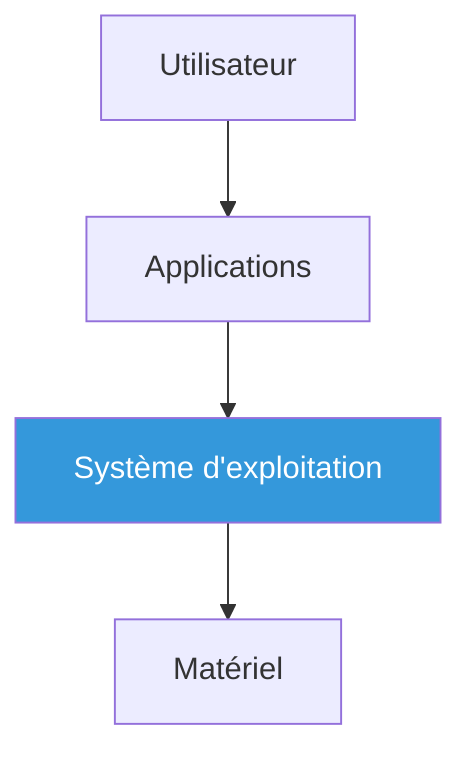
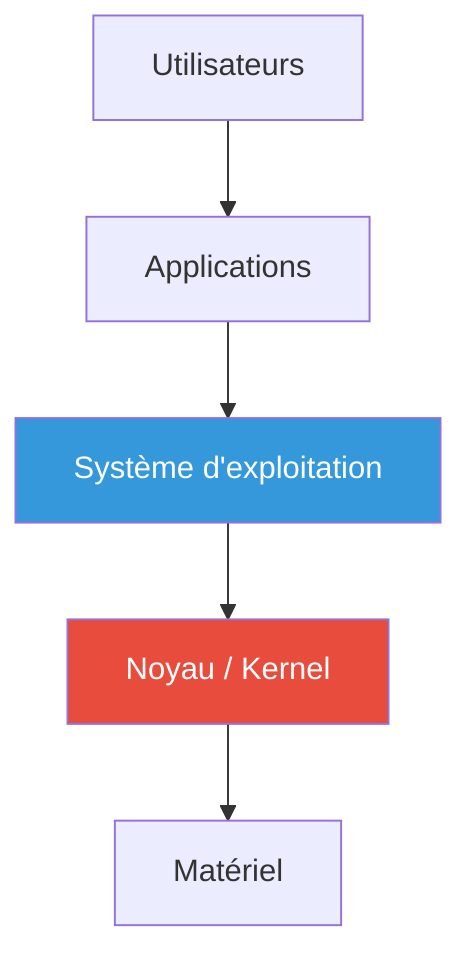
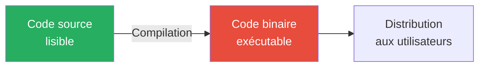
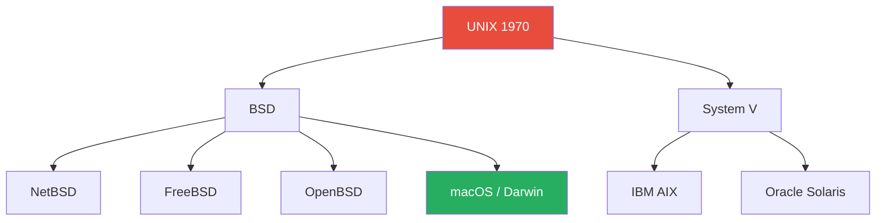
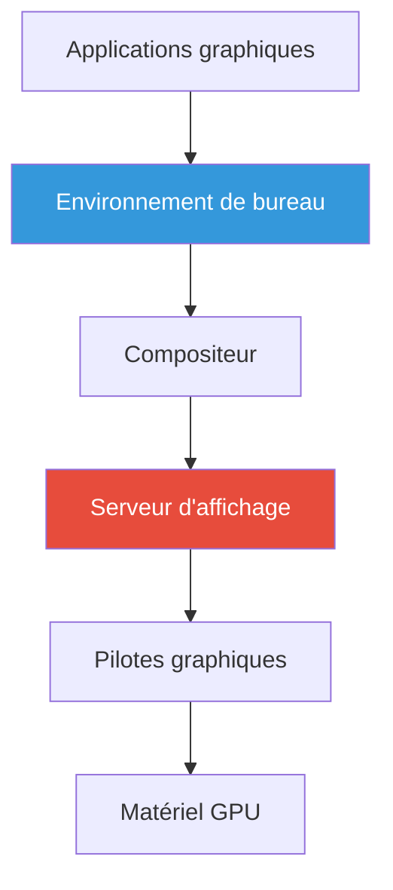

# Système d'exploitation - Découverte et définitions
## Document de révision TSSR - Titre RNCP

---

**Formation** : Technicien Supérieur Systèmes et Réseaux (TSSR)  
**Sujet** : Qu'est-ce qu'un système d'exploitation ?  
**Date** : Novembre 2024  
**Type** : Synthèse de cours complète

---

## 📋 Sommaire

1. [[#Introduction|Introduction]]
2. [[#Définition et nature d'un système d'exploitation|Définition et nature]]
   - [[#Définition encyclopédique|Définition]]
   - [[#Nature d'un OS|Nature]]
   - [[#Fonctions principales|Fonctions]]
3. [[#Les différents types de systèmes d'exploitation|Types de systèmes]]
   - [[#OS pour ordinateurs de bureau|Desktop]]
   - [[#OS pour smartphones|Mobile]]
   - [[#OS pour serveurs|Serveurs]]
   - [[#OS pour équipements réseaux|Réseau]]
   - [[#OS temps réel|Temps réel]]
4. [[#Logiciel libre et propriétaire|Libre vs Propriétaire]]
   - [[#Définition d'un logiciel|Logiciel]]
   - [[#Histoire du logiciel libre|Histoire]]
   - [[#Les 4 libertés fondamentales|Libertés]]
   - [[#Licences|Licences]]
5. [[#Systèmes Microsoft|Systèmes Microsoft]]
6. [[#UNIX et GNU Linux|UNIX et GNU/Linux]]
   - [[#UNIX historique|UNIX]]
   - [[#Projet GNU|GNU]]
   - [[#Noyau Linux|Linux]]
   - [[#Distributions|Distributions]]
7. [[#Points clés à retenir|Points clés]]
8. [[#Glossaire technique|Glossaire]]
9. [[#Ressources complémentaires|Ressources]]

---

## Introduction

> [!abstract] Vue d'ensemble
> Un **système d'exploitation** (OS - Operating System) est le logiciel fondamental qui permet à un ordinateur de fonctionner. C'est l'interface entre le matériel et les applications, sans laquelle aucun programme ne pourrait s'exécuter.

### Pourquoi étudier les systèmes d'exploitation ?

En tant que **Technicien Supérieur Systèmes et Réseaux**, comprendre les systèmes d'exploitation est **essentiel** car :

- Vous allez **installer, configurer et maintenir** des OS variés
- Vous devez **diagnostiquer et résoudre** des problèmes système
- Vous administrerez des **serveurs Windows et Linux**
- La gestion des ressources et des utilisateurs est au cœur de votre métier

---

## Définition et nature d'un système d'exploitation

### Définition encyclopédique

> [!quote] Définition Wikipédia
> En informatique, un **système d'exploitation** (souvent appelé **OS** de l'anglais *Operating System*) est un **ensemble de programmes** qui dirige l'utilisation des **ressources d'un ordinateur** par des **logiciels applicatifs**.

### Nature d'un OS

> [!info] Ce qu'est un système d'exploitation

Un système d'exploitation est :

#### 1. Un ensemble de programmes
- Collection de logiciels travaillant ensemble
- Composants interdépendants
- Noyau (kernel) au centre

#### 2. Une interface matériel-applications


#### 3. Une couche d'abstraction
- **Masque la complexité** du matériel
- Offre une **vision simplifiée** aux programmeurs
- Les applications n'ont **pas besoin de connaître** les détails du matériel

#### 4. Un gestionnaire de ressources
- **Partage** les ressources entre applications
- **Optimise** l'utilisation du matériel
- **Arbitre** les conflits d'accès

#### 5. Un fournisseur de services
- Services système pour les applications
- API (Application Programming Interface)
- Bibliothèques de fonctions

#### 6. Une interface utilisateur
- **CLI** (Command Line Interface) : Ligne de commande
- **GUI** (Graphical User Interface) : Interface graphique

### Fonctions principales

> [!important] Les 7 fonctions essentielles d'un OS

| Fonction | Description | Exemples |
|----------|-------------|----------|
| **1. Gestion des processus** | Exécution et ordonnancement des programmes | Multitâche, priorités, threads |
| **2. Gestion de la mémoire** | Allocation et libération de la RAM | Mémoire virtuelle, swap, pagination |
| **3. Gestion du stockage** | Organisation des fichiers et dossiers | Systèmes de fichiers (NTFS, ext4, FAT32) |
| **4. Gestion des périphériques** | Communication avec le matériel | Pilotes (drivers), E/S |
| **5. Gestion des utilisateurs** | Authentification, droits, permissions | Comptes, groupes, ACL |
| **6. Gestion du réseau** | Communication entre machines | TCP/IP, partage de fichiers |
| **7. Interface utilisateur** | Interaction homme-machine | Shell, bureau graphique |

#### Détail des fonctions

> [!note] 1. Gestion des processus (CPU)

**Rôle** : Faire exécuter plusieurs programmes "simultanément" sur un seul processeur

- **Ordonnancement** : Décide quel processus utilise le CPU et quand
- **Multitâche** : Illusion de parallélisme par changement rapide
- **Commutation de contexte** : Sauvegarde/restauration de l'état des processus
- **Gestion des priorités** : Processus critiques vs processus standards

**Exemple** :
```
Navigateur Web + Traitement de texte + Lecteur musique
→ OS alterne rapidement entre ces 3 processus
→ Impression de simultanéité pour l'utilisateur
```

> [!note] 2. Gestion de la mémoire (RAM)

**Rôle** : Allouer et gérer la mémoire vive entre tous les processus

- **Allocation dynamique** : Chaque programme reçoit la mémoire dont il a besoin
- **Protection** : Un processus ne peut pas accéder à la mémoire d'un autre
- **Mémoire virtuelle** : Extension de la RAM sur le disque (swap/pagefile)
- **Optimisation** : Libération de la mémoire inutilisée

**Mécanismes** :
- **Pagination** : Division de la mémoire en pages fixes
- **Segmentation** : Division logique selon les besoins
- **Swap** : Utilisation du disque dur comme extension RAM

> [!note] 3. Gestion du stockage

**Rôle** : Organiser et gérer l'accès aux données persistantes

- **Systèmes de fichiers** : Structure d'organisation (NTFS, ext4, FAT32, APFS)
- **Arborescence** : Hiérarchie de dossiers et fichiers
- **Permissions** : Contrôle d'accès lecture/écriture/exécution
- **Métadonnées** : Taille, date, propriétaire, attributs

**Opérations** :
- Création, lecture, écriture, suppression de fichiers
- Recherche et indexation
- Gestion de l'espace disque
- Journalisation (pour la fiabilité)

> [!note] 4. Gestion des périphériques

**Rôle** : Permettre aux applications d'utiliser le matériel

- **Pilotes (drivers)** : Logiciels de communication matériel-OS
- **Plug and Play** : Détection et configuration automatiques
- **Files d'attente** : Gestion des requêtes multiples (ex: impressions)
- **Abstraction** : Masquer la complexité du matériel

**Périphériques gérés** :
- Entrée : Clavier, souris, scanner, webcam
- Sortie : Écran, imprimante, haut-parleurs
- Stockage : Disques durs, SSD, clés USB
- Réseau : Cartes Ethernet, Wi-Fi, Bluetooth

> [!note] 5. Gestion des utilisateurs

**Rôle** : Sécuriser et personnaliser l'accès au système

- **Authentification** : Vérification identité (login/password)
- **Autorisation** : Droits d'accès aux ressources
- **Comptes** : Utilisateur standard vs administrateur
- **Groupes** : Gestion collective des permissions
- **Profils** : Environnement personnalisé par utilisateur

**Sécurité** :
- Mots de passe chiffrés
- Contrôle d'accès (ACL - Access Control Lists)
- Audit et journalisation
- Isolation entre utilisateurs

> [!note] 6. Gestion du réseau (ajout enrichissement)

**Rôle** : Permettre la communication entre machines

- **Protocoles** : TCP/IP, UDP, HTTP, etc.
- **Partage de ressources** : Fichiers, imprimantes
- **Sécurité réseau** : Pare-feu, VPN
- **Configuration** : IP, DNS, passerelle

> [!note] 7. Interface utilisateur

**Rôle** : Permettre l'interaction humain-machine

**Deux types principaux** :

| Type | Nom | Caractéristiques |
|------|-----|------------------|
| **CLI** | Command Line Interface | Ligne de commande, texte, scripts |
| **GUI** | Graphical User Interface | Fenêtres, icônes, souris, intuitif |

### Schéma général d'un OS

> [!example] Architecture en couches



**Schéma détaillé** :

```
┌─────────────────────────────────────────┐
│          UTILISATEURS                    │
└─────────────────────────────────────────┘
              ↓
┌─────────────────────────────────────────┐
│   APPLICATIONS UTILISATEUR               │
│   (Navigateur, Bureautique, Jeux...)    │
└─────────────────────────────────────────┘
              ↓
┌─────────────────────────────────────────┐
│    SYSTÈME D'EXPLOITATION                │
│  ┌────────────────────────────────────┐ │
│  │        Interface Utilisateur        │ │
│  │          (Shell / GUI)              │ │
│  └────────────────────────────────────┘ │
│  ┌────────────────────────────────────┐ │
│  │     Services Système / API          │ │
│  └────────────────────────────────────┘ │
│  ┌────────────────────────────────────┐ │
│  │     NOYAU (Kernel)                  │ │
│  │  • Gestion processus                │ │
│  │  • Gestion mémoire                  │ │
│  │  • Système de fichiers              │ │
│  │  • Pilotes périphériques            │ │
│  └────────────────────────────────────┘ │
└─────────────────────────────────────────┘
              ↓
┌─────────────────────────────────────────┐
│         MATÉRIEL (Hardware)              │
│   CPU, RAM, Disques, Périphériques...   │
└─────────────────────────────────────────┘
```

> [!tip] Le noyau (Kernel)
> Le **noyau** est le cœur du système d'exploitation. C'est la partie qui s'exécute en **mode privilégié** et qui a un accès direct au matériel. Tout le reste du système s'appuie sur lui.

---

## Les différents types de systèmes d'exploitation

> [!info] Diversité des OS
> Il existe des systèmes d'exploitation adaptés à chaque type d'appareil et d'usage.

### OS pour ordinateurs de bureau

> [!example] Desktop / Poste de travail

**Les classiques** :

| OS | Éditeur | Caractéristiques | Part de marché |
|-----|---------|------------------|----------------|
| **Windows 11** | Microsoft | Interface moderne, compatibilité logiciels | ~75% |
| **macOS** | Apple | Exclusif Mac, design épuré, écosystème intégré | ~15% |
| **Linux** | Communauté | Libre, personnalisable, distributions variées | ~4% |
| **Chrome OS** | Google | Basé sur Linux, centré web, Chromebooks | ~2% |

**Utilisations** :
- Bureautique (traitement de texte, tableur)
- Navigation internet
- Multimédia (photos, vidéos, musique)
- Développement
- Jeux vidéo

### OS pour smartphones

> [!example] Mobile / Tablettes

**Les principaux** :

| OS | Éditeur | Basé sur | Part de marché |
|-----|---------|----------|----------------|
| **Android** | Google | Linux | ~72% |
| **iOS** | Apple | Unix (Darwin) | ~27% |
| **HarmonyOS** | Huawei | Micro-noyau | <1% |

**Caractéristiques spécifiques** :
- Optimisation énergie (batterie)
- Interface tactile
- Applications mobiles
- Connectivité (4G/5G, GPS, NFC)
- Capteurs (accéléromètre, gyroscope)

### OS pour serveurs

> [!example] Datacenters / Infrastructure

**Dans les datacenters** :

| OS | Type | Usages |
|-----|------|--------|
| **Windows Server 2022** | Propriétaire | Active Directory, Exchange, SQL Server |
| **Linux (RHEL, Ubuntu Server, Debian)** | Libre | Web (Apache, Nginx), bases de données |
| **Unix (AIX, Solaris)** | Propriétaire | Applications critiques, mainframes |

**Caractéristiques** :
- **Stabilité** maximale (uptime 99,9%)
- **Performance** optimisée
- **Sécurité** renforcée
- **Gestion à distance** (SSH, RDP)
- **Virtualisation** (Hyper-V, KVM, VMware)
- **Haute disponibilité** (clustering, réplication)

### OS pour équipements réseaux

> [!example] Infrastructure réseau

**Dans les équipements réseau** :

| Type d'équipement | OS typiques | Exemples |
|-------------------|-------------|----------|
| **Routeurs** | Cisco IOS, IOS XR, JunOS | Routage, VPN, QoS |
| **Switches** | Cisco IOS, NX-OS | VLANs, STP, agrégation |
| **Pare-feu** | pfSense, FortiOS, ASA | Filtrage, NAT, VPN |
| **Points d'accès** | OpenWrt, UniFi OS | Wi-Fi, gestion |

**Particularités** :
- OS **embarqué** (firmware)
- Interface **CLI** dominante
- Configuration via **commandes** réseau
- **Temps réel** pour traitement paquets
- **Fiabilité** critique

### OS temps réel et dédiés

> [!example] Systèmes spécialisés

**OS temps réel (RTOS)** :
- **VxWorks** : Aéronautique, spatial
- **QNX** : Automobile (systèmes embarqués)
- **FreeRTOS** : IoT, objets connectés
- **RTLinux** : Applications industrielles

**Caractéristiques RTOS** :
- **Déterminisme** : Réponse en temps garanti
- **Préemption** : Interruption immédiate
- **Latence minimale** : Microsecondes
- **Fiabilité** : Pas d'erreur tolérée

**OS dédiés serveur** :
- **ESXi** (VMware) : Hyperviseur bare-metal
- **Proxmox** : Virtualisation/containers
- **z/OS** : Mainframes IBM

---

## Logiciel libre et propriétaire

### Définition d'un logiciel

> [!info] Qu'est-ce qu'un logiciel ?

**Logiciel** = Programme informatique + ressources annexes

#### Caractéristiques

| Aspect | Description |
|--------|-------------|
| **Fichier exécutable** | Contient les instructions machines |
| **Support de stockage** | Disque dur, SSD, ROM |
| **Code binaire** | Instructions en langage machine (0 et 1) |
| **Spécifique CPU** | Compilé pour une architecture (x86, ARM, etc.) |
| **Difficilement lisible** | Binaire ≠ code source |
| **Issu de compilation** | Code source → Compilateur → Binaire |

#### Cycle de création



**Exemple** :
```c
// Code source C (lisible)
#include <stdio.h>
int main() {
    printf("Hello World\n");
    return 0;
}

↓ Compilation

01001000 01100101 01101100 01101100  // Binaire (illisible)
```

### Histoire du logiciel libre

> [!note] Richard M. Stallman - Le père fondateur

#### Chronologie

| Année | Événement |
|-------|-----------|
| **1969** | Première utilisation d'un ordinateur (16 ans) |
| **1971** | Hacker au MIT et étudiant à Harvard |
| **1975** | Abandonne ses études pour se consacrer à la programmation |
| **1980** | 🔴 **Expérience fondatrice** : Imprimante Xerox 9700 |
| **1983** | 🚀 Lancement du **Projet GNU** (mouvement du logiciel libre) |
| **1985** | Création de la **Free Software Foundation** (FSF) |
| **1989** | Développement de la **Licence GNU GPL** |
| **1993** | Lancement du **Projet Debian** |

#### L'expérience fondatrice (1980)

> [!warning] L'imprimante Xerox - Un déclic
> Stallman voulait modifier le logiciel d'une imprimante pour être notifié des bourrages papier. Xerox **refusa de donner accès au code source**. Cette frustration l'a poussé à créer le mouvement du **logiciel libre** pour garantir que les utilisateurs gardent le **contrôle** sur leurs programmes.

### Les 4 libertés fondamentales

> [!important] Free Software Foundation - 4 Libertés

Les **4 libertés** des utilisateurs selon la **Free Software Foundation** :

#### Liberté 0 : Exécuter
```
💻 Liberté d'EXÉCUTER le programme
   quel qu'en soit l'usage
```
- Aucune restriction sur l'utilisation
- Personnel, commercial, éducatif, etc.

#### Liberté 1 : Étudier et adapter
```
🔍 Liberté d'ÉTUDIER le fonctionnement
   et l'ADAPTER à ses besoins
```
- Accès au **code source** obligatoire
- Possibilité de **comprendre** comment ça fonctionne
- Modification pour ses propres besoins

#### Liberté 2 : Redistribuer
```
📤 Liberté de REDISTRIBUER des copies
```
- Partager avec d'autres
- Copie exacte du programme original
- Gratuitement ou contre paiement

#### Liberté 3 : Améliorer et distribuer
```
🛠️ Liberté d'AMÉLIORER le programme
   et DISTRIBUER ces améliorations
```
- Modification du code source
- Partage des versions améliorées
- Contribution à la communauté

> [!tip] Condition préalable
> Pour que les libertés 1 et 3 aient un sens, l'**accès au code source** est une **condition préalable**.

### Open Source, Libre ou Gratuit ?

> [!warning] Distinction importante

#### Comparaison

| Concept | Accent sur | Code source | Gratuit ? |
|---------|-----------|-------------|-----------|
| **Logiciel Libre** | Éthique, valeurs, libertés | ✅ Accessible | Généralement |
| **Open Source** | Technique, qualité, transparence | ✅ Accessible | Généralement |
| **Freeware** | Prix | ❌ Parfois fermé | ✅ Toujours |
| **Propriétaire** | Contrôle éditeur | ❌ Fermé | ❌ Payant |

#### Nuances importantes

**Logiciel Libre (Free Software)** :
- Emphase sur les **valeurs éthiques et morales**
- Partage des connaissances
- **Liberté** des utilisateurs avant tout
- Mouvement **philosophique**

**Open Source** :
- Emphase sur les **avantages pratiques et techniques**
- Transparence du code
- Qualité, sécurité, collaboration
- Approche plus **pragmatique**

> [!quote] Citation de Richard Stallman
> "Free as in **freedom**, not as in free beer"  
> ("Libre comme dans **liberté**, pas comme dans bière gratuite")

**Logiciel gratuit (Freeware)** :
- Peut être **propriétaire** (code fermé)
- Pas forcément de libertés
- Exemple : Adobe Reader (gratuit mais propriétaire)

### Propriété intellectuelle et licences

> [!info] Questions de licences

#### Logiciel propriétaire

**Conditions d'utilisation** :
- **Encadrées légalement** (CLUF - Contrat de Licence Utilisateur Final)
- Parfois **empêchées techniquement** (DRM, activation)
- Distribution souvent **binaire uniquement**
- Parfois **open source** mais licence restrictive

**Restrictions typiques** :
- Nombre d'installations limité
- Interdiction de décompilation
- Interdiction de redistribution
- Usage personnel vs commercial

#### Principales licences libres

| Licence | Type | Caractéristiques |
|---------|------|------------------|
| **GPL** (GNU General Public License) | Copyleft fort | Modifications doivent rester libres |
| **LGPL** | Copyleft faible | Autorisation liaison propriétaire |
| **MIT** | Permissive | Très peu de restrictions |
| **BSD** | Permissive | Similaire MIT |
| **Apache 2.0** | Permissive | Protection brevets |
| **Creative Commons** | Documents/Média | Plusieurs niveaux de liberté |

**Copyleft** :
- Les modifications doivent rester sous **même licence**
- Protection contre la "privatisation"
- GPL est l'exemple type

**Permissive** :
- Autorisation utilisation dans logiciels propriétaires
- Moins restrictif
- MIT, BSD sont les plus courantes

---

## Systèmes Microsoft

### Microsoft Windows - Histoire

> [!abstract] Un peu d'histoire

**Chronologie Windows** :

| Année | Version | Caractéristiques |
|-------|---------|------------------|
| **Fin 1980s** | Windows 1.0-3.x | Interface graphique de MS-DOS, 16 bits |
| **1993** | **Windows NT** | Première version 32 bits (professionnel) |
| **1995** | **Windows 95** | Passage généralisé au 32 bits (grand public) |
| **1998** | Windows 98 | Amélioration de Windows 95 |
| **2000** | Windows 2000 | NT pour professionnels |
| **2001** | **Windows XP** | 🌟 Fusion lignées NT et 9x |
| **2003** | Windows XP 64 bits | Support architecture 64 bits |
| **2007** | Windows Vista | Interface Aero, critiqué |
| **2009** | Windows 7 | Succès, PowerShell intégré |
| **2012** | Windows 8 | Interface Modern UI controversée |
| **2015** | **Windows 10** | "Dernier Windows", mises à jour continues |
| **2021** | **Windows 11** | Design modernisé, exigences matérielles |

#### Évolution parallèle serveur

| Année | Version | Usage |
|-------|---------|-------|
| **1993** | Windows NT 3.1 | Premier serveur |
| **2003** | Windows Server 2003 | Large adoption |
| **2008-2019** | Server 2008-2019 | Améliorations continues |
| **2021** | **Windows Server 2022** | Version actuelle |

### Microsoft Windows - Aujourd'hui

> [!important] État actuel

#### Versions actuelles

**Poste de travail** :
- **Windows 11** (2021) - Grand public
- Windows 10 (encore très utilisé)

**Serveur** :
- **Windows Server 2022** - Dernière version
- Support rôles : AD, DNS, DHCP, Hyper-V, IIS

#### Caractéristiques clés

**Shell moderne** :
- **PowerShell** (depuis Windows 7)
- Successeur de `command.com` et `cmd.exe`
- Scripts avancés
- Automatisation système

**Gestion de domaine** :
- **Active Directory** (AD)
  - Annuaire centralisé
  - Authentification unique (SSO)
  - GPO (Group Policy Objects)
  - Gestion utilisateurs/groupes/ordinateurs

**Partage de ressources réseau** :
- **CIFS/SMB** (Common Internet File System / Server Message Block)
  - Partage de fichiers
  - Partage d'imprimantes
  - Protocole natif Windows

**Autres technologies** :
- **Hyper-V** : Virtualisation
- **IIS** : Serveur web
- **Exchange** : Messagerie d'entreprise
- **SQL Server** : Base de données

> [!tip] Pour le TSSR
> Windows Server est **incontournable** en entreprise. Maîtriser Active Directory, PowerShell et la gestion de domaine est **essentiel**.

---

## UNIX et GNU/Linux

### UNIX - L'ancêtre (1970s)

> [!abstract] Aux origines

#### Créateurs

**Ken Thompson & Dennis Ritchie** (Bell Labs AT&T)

| Personne | Contribution |
|----------|--------------|
| **Ken Thompson** | Co-créateur UNIX, langage B |
| **Dennis Ritchie** | Co-créateur UNIX, **créateur du langage C** |

#### Naissance du C

> [!info] UNIX et le langage C sont intimement liés
> - UNIX initialement écrit en assembleur
> - Réécriture en **C** (1973) pour la portabilité
> - C devient le langage système de référence
> - Influence encore visible aujourd'hui (Linux écrit en C)

#### Descendance UNIX



**Familles UNIX** :
- **BSD** (Berkeley Software Distribution)
  - NetBSD : Portabilité maximale
  - FreeBSD : Performance, serveurs
  - OpenBSD : Sécurité maximale
  - **macOS** : Basé sur Darwin (BSD + Mach)

- **System V**
  - AIX (IBM)
  - Solaris (Oracle)
  - HP-UX (Hewlett-Packard)

> [!note] macOS est UNIX
> macOS est certifié **UNIX** (Single UNIX Specification). Il descend de la branche BSD via Darwin.

### Projet GNU - À l'origine

> [!abstract] GNU's Not Unix

#### Lancement du projet

**Lancé par Richard Stallman en 1983**

**Objectif** :
- Créer un **OS libre** complet
- Inspiré d'**UNIX** (compatible)
- **Totalement libre** (pas de code propriétaire)

#### Le problème du noyau

**Noyau Hurd** :
- Développé pour GNU
- Architecture micro-noyau ambitieuse
- **Pas satisfaisant** techniquement
- Développement très lent
- Toujours pas stable aujourd'hui

**Mais succès crucial** :
- Développement de **logiciels libres essentiels** :
  - **GCC** (compilateur C/C++)
  - **GNU Coreutils** (ls, cp, mv, cat...)
  - **Bash** (shell)
  - **Emacs** (éditeur)
  - **Make**, **tar**, **grep**...

> [!success] Impact du projet GNU
> Même si Hurd n'a pas abouti, GNU a créé l'**écosystème logiciel** qui entoure Linux aujourd'hui. Sans GNU, pas de Linux utilisable !

### Noyau Linux - Le cœur

> [!abstract] Linux Torvalds - 1991

#### Naissance de Linux

**Créé par Linus Torvalds** :
- Étudiant finlandais (21 ans en 1991)
- **Développé pendant ses études** à Helsinki
- **Inspiré de Minix** (OS éducatif d'Andrew Tanenbaum)
- Annoncé le 25 août 1991 sur Usenet

> [!quote] Premier message de Linus Torvalds
> "I'm doing a (free) operating system (just a hobby, won't be big and professional like gnu)..."

#### Caractéristiques

**Noyau Linux** :
- Architecture **monolithique modulaire**
- Écrit en **C** (et assembleur)
- Licence **GPL v2** (libre)
- Développement **collaboratif mondial**
- Des milliers de contributeurs

**Versions** :
- Numérotation : `Majeur.Mineur.Patch` (ex: 6.1.0)
- Nouvelles versions tous les ~2-3 mois
- LTS (Long Term Support) : Support 2-6 ans

#### Linux ≠ GNU/Linux

> [!warning] Distinction importante

**Linux** :
- **Seulement le noyau**
- Gère matériel, processus, mémoire
- Ne contient pas d'outils utilisateur

**GNU/Linux** :
- **Noyau Linux** + **outils GNU**
- Système complet et utilisable
- ls, bash, gcc, etc. viennent de GNU

**Controverse terminologique** :
- Richard Stallman préfère "**GNU/Linux**"
- Usage courant : simplement "**Linux**"
- Techniquement, "GNU/Linux" est plus précis

### Environnement de bureau

> [!info] La partie graphique

#### Définition

> [!quote] Environnement de bureau
> Un **environnement de bureau** est une suite de logiciels permettant de contrôler un ordinateur via une **interface graphique** simulant un **bureau**.

#### Particularité Unix/Linux

**Contrairement à Windows/macOS** :
- Système de fenêtrage **séparé** de l'OS
- **Choix** entre plusieurs environnements
- **Modularité** maximale

#### Architecture graphique Linux



**Composants** :
1. **Système de fenêtrage** :
   - **X11** (X Window System) - Historique
   - **Wayland** - Moderne, remplaçant X11

2. **Compositeur** :
   - Gestion effets visuels
   - Exemples : Compiz, Metacity, Mutter, KWin

3. **Environnement de bureau** :
   - Suite complète applications
   - Voir tableau ci-dessous

### Quelques environnements de bureau

> [!example] Les classiques

| Environnement | Basé sur | Caractéristiques | Ressources |
|---------------|----------|------------------|------------|
| **GNOME** | GTK | Moderne, simple, épuré | Moyennes |
| **KDE Plasma** | Qt | Riche en fonctionnalités, personnalisable | Élevées |
| **XFCE** | GTK | Léger, traditionnel, rapide | Faibles |
| **MATE** | GTK | Fork de GNOME 2, classique | Faibles |
| **Cinnamon** | GTK | Fork de GNOME 3, similaire Windows | Moyennes |
| **LXDE/LXQt** | GTK/Qt | Ultra-léger | Très faibles |
| **i3/Sway** | - | Tiling, clavier uniquement | Minimales |

**Critères de choix** :
- **Ressources** disponibles (RAM, CPU)
- **Habitudes** utilisateur (Windows-like, macOS-like)
- **Personnalisation** souhaitée
- **Stabilité** vs nouveautés

> [!tip] Pour débuter
> - **Ubuntu** → GNOME (par défaut)
> - **Linux Mint** → Cinnamon (très accessible)
> - **Kubuntu** → KDE Plasma (riche)
> - **Xubuntu** → XFCE (léger, ancien PC)

### Distribution Linux

> [!abstract] Un système complet

#### Définition

> [!quote] Distribution
> Une **distribution Linux** (distrib' ou distro) est un **OS complet** fonctionnant avec le noyau Linux.
> 
> Ce noyau est entouré d'un ensemble de logiciels (beaucoup issus de GNU) et d'un environnement de bureau.

#### Composition d'une distribution

```
┌────────────────────────────────────┐
│      DISTRIBUTION LINUX            │
│                                     │
│  ┌──────────────────────────────┐ │
│  │ Environnement de bureau      │ │
│  │ (GNOME, KDE, XFCE...)        │ │
│  └──────────────────────────────┘ │
│                                     │
│  ┌──────────────────────────────┐ │
│  │ Applications utilisateur     │ │
│  │ (Firefox, LibreOffice...)    │ │
│  └──────────────────────────────┘ │
│                                     │
│  ┌──────────────────────────────┐ │
│  │ Outils système GNU           │ │
│  │ (bash, coreutils, gcc...)    │ │
│  └──────────────────────────────┘ │
│                                     │
│  ┌──────────────────────────────┐ │
│  │   Noyau Linux                │ │
│  └──────────────────────────────┘ │
└────────────────────────────────────┘
```

#### Pourquoi des centaines de distributions ?

**Raisons** :
- **Philosophies différentes** (libre pur, pragmatique)
- **Publics cibles** (débutants, experts, serveurs)
- **Gestionnaires de paquets** (apt, yum, pacman)
- **Cycles de release** (rolling, stable, LTS)
- **Pré-configurations** (desktop, serveur, embarqué)

### Quelques distributions populaires

> [!example] Principales distributions

#### Familles principales

**Famille Debian** :
- **Debian** - La mère
  - Très stable
  - Logiciels libres uniquement (par défaut)
  - Gestionnaire : `apt`
- **Ubuntu** - La populaire
  - Basée sur Debian
  - Facilité d'utilisation
  - Support LTS (5 ans)
  - Variantes : Kubuntu, Xubuntu, Ubuntu Server
- **Linux Mint** - Pour débutants
  - Basée sur Ubuntu
  - Interface familière (Cinnamon)
  - Très accessible

**Famille Red Hat** :
- **Red Hat Enterprise Linux (RHEL)** - Entreprise
  - Payant (support commercial)
  - Très stable, certifications
- **CentOS** - Clone RHEL
  - Gratuit, compatible RHEL
  - CentOS Stream (rolling)
- **Fedora** - Innovante
  - Technologies récentes
  - Labo pour RHEL
  - Gestionnaire : `dnf`

**Famille Arch** :
- **Arch Linux** - Minimaliste
  - Rolling release
  - Do It Yourself
  - Gestionnaire : `pacman`
- **Manjaro** - Arch facile
  - Arch pré-configuré
  - Plus accessible

**Autres** :
- **openSUSE** - Allemande, YaST
- **Gentoo** - Compilation depuis sources
- **Alpine** - Ultra-légère (containers)

#### Tableau comparatif

| Distribution | Base | Public | Philosophie | Difficulté |
|--------------|------|--------|-------------|------------|
| **Ubuntu** | Debian | Débutant/Tous | Accessible | ⭐ |
| **Linux Mint** | Ubuntu | Débutant | Très accessible | ⭐ |
| **Debian** | - | Intermédiaire | Stabilité | ⭐⭐ |
| **Fedora** | - | Intermédiaire | Innovation | ⭐⭐ |
| **RHEL/CentOS** | - | Entreprise | Entreprise | ⭐⭐ |
| **Arch Linux** | - | Avancé | Contrôle total | ⭐⭐⭐⭐ |
| **Gentoo** | - | Expert | Optimisation | ⭐⭐⭐⭐⭐ |

> [!tip] Pour le TSSR
> Concentrez-vous sur :
> - **Ubuntu** / **Debian** (desktop et serveur)
> - **CentOS** / **Rocky Linux** (serveur entreprise)
> - Comprendre **apt** et **yum/dnf**

---

## Points clés à retenir

> [!success] Synthèse pour le titre RNCP

### Définition système d'exploitation

1. **OS** = Ensemble de programmes gérant les ressources de l'ordinateur
2. **Rôle** = Interface entre matériel et applications
3. **Couche d'abstraction** = Masque la complexité du matériel

### 7 fonctions essentielles

```
1. Gestion des PROCESSUS (CPU)
2. Gestion de la MÉMOIRE (RAM)
3. Gestion du STOCKAGE (Disques)
4. Gestion des PÉRIPHÉRIQUES (Hardware)
5. Gestion des UTILISATEURS (Sécurité)
6. Gestion du RÉSEAU (Communication)
7. INTERFACE UTILISATEUR (CLI/GUI)
```

### Composants d'un OS

```
Utilisateur
    ↓
Interface (CLI/GUI)
    ↓
Services / API
    ↓
NOYAU (Kernel) ← Cœur du système
    ↓
Matériel
```

### Types d'OS

| Type | Exemples | Usage |
|------|----------|-------|
| **Desktop** | Windows, macOS, Linux | Bureautique, multimédia |
| **Mobile** | Android, iOS | Smartphones, tablettes |
| **Serveur** | Windows Server, Linux | Infrastructure, services |
| **Réseau** | Cisco IOS, pfSense | Routeurs, switches |
| **Temps réel** | VxWorks, FreeRTOS | Embarqué, critique |

### Logiciel libre vs propriétaire

**Les 4 libertés du logiciel libre** :
0. Exécuter
1. Étudier et adapter
2. Redistribuer
3. Améliorer et distribuer

**Libre ≠ Gratuit** :
- Libre = Liberté d'usage (free as in freedom)
- Gratuit = Prix zéro (free as in beer)

### Systèmes Microsoft

- **Windows 11** : Version actuelle desktop
- **Windows Server 2022** : Version serveur
- **PowerShell** : Shell moderne
- **Active Directory** : Gestion domaine (crucial TSSR!)
- **SMB/CIFS** : Partage fichiers Windows

### UNIX et GNU/Linux

**Historique** :
- **UNIX** (1970) → Ken Thompson & Dennis Ritchie
- **Projet GNU** (1983) → Richard Stallman → Outils libres
- **Linux** (1991) → Linus Torvalds → Noyau libre
- **GNU/Linux** = Noyau Linux + Outils GNU = OS complet

**Architecture Linux** :
- **Noyau** : Linux (GPL)
- **Outils** : GNU (bash, gcc, coreutils...)
- **Environnement** : GNOME, KDE, XFCE...
- **Distribution** : Ubuntu, Debian, CentOS...

**Avantages Linux** :
- Libre et gratuit
- Sécurité, stabilité
- Personnalisable
- Serveurs majoritaires

### Distributions importantes (TSSR)

**À connaître absolument** :
- **Ubuntu** : Desktop et serveur, accessible
- **Debian** : Stabilité légendaire
- **CentOS/Rocky** : Serveur entreprise (clone RHEL)
- **Red Hat** : Support commercial

### Différences clés

| Aspect | Windows | Linux |
|--------|---------|-------|
| **Licence** | Propriétaire | Libre (GPL) |
| **Prix** | Payant | Gratuit |
| **Code source** | Fermé | Ouvert |
| **Interface** | Imposée | Choix multiple |
| **Ligne de commande** | PowerShell | bash |
| **Système fichiers** | NTFS, FAT32 | ext4, XFS, btrfs |
| **Gestion paquets** | .exe, MSI, Store | apt, yum, pacman |

---

## Glossaire technique

> [!note] Définitions essentielles pour le TSSR

| Terme | Définition |
|-------|------------|
| **OS (Operating System)** | Système d'exploitation, logiciel de base de l'ordinateur |
| **Noyau (Kernel)** | Cœur de l'OS, gère le matériel et les ressources |
| **Processus** | Programme en cours d'exécution |
| **Mémoire virtuelle** | Extension de la RAM sur le disque (swap) |
| **Système de fichiers** | Organisation des données sur disque (NTFS, ext4) |
| **Pilote (Driver)** | Logiciel de communication OS-matériel |
| **API** | Interface de programmation d'application |
| **CLI** | Command Line Interface (ligne de commande) |
| **GUI** | Graphical User Interface (interface graphique) |
| **Shell** | Interpréteur de commandes (bash, PowerShell) |
| **Distribution** | OS complet basé sur Linux (Ubuntu, Debian...) |
| **Logiciel libre** | Logiciel respectant les 4 libertés |
| **Open Source** | Code source accessible, accent technique |
| **Propriétaire** | Logiciel à code fermé, contrôlé par éditeur |
| **GPL** | GNU General Public License, licence libre copyleft |
| **Copyleft** | Obligation de garder les modifications libres |
| **BSD** | Berkeley Software Distribution, famille Unix |
| **GNU** | GNU's Not Unix, projet de Stallman |
| **POSIX** | Standard de compatibilité Unix |
| **Root** | Compte administrateur Unix/Linux (superutilisateur) |
| **Active Directory** | Annuaire Windows pour gestion domaine |
| **SMB/CIFS** | Protocole partage fichiers Windows |
| **Environnement de bureau** | Interface graphique complète (GNOME, KDE) |
| **Gestionnaire de paquets** | Outil installation logiciels (apt, yum) |
| **LTS** | Long Term Support, version à support étendu |
| **Rolling release** | Mises à jour continues sans versions |
| **Hyperviseur** | Logiciel de virtualisation (Hyper-V, KVM) |

---

## Ressources complémentaires

### Documentation officielle

**Systèmes d'exploitation (général)** :
- Wikipédia - Système d'exploitation : https://fr.wikipedia.org/wiki/Système_d'exploitation
- IBM - OS Guide : https://www.ibm.com/fr-fr/think/topics/operating-systems

**Logiciel libre** :
- Free Software Foundation : https://fr.wikipedia.org/wiki/Free_Software_Foundation
- GNU Philosophy : https://www.gnu.org/philosophy/free-sw.fr.html
- Richard Stallman : https://fr.wikipedia.org/wiki/Richard_Stallman

**UNIX et Linux** :
- Ken Thompson : https://fr.wikipedia.org/wiki/Ken_Thompson
- Dennis Ritchie : https://fr.wikipedia.org/wiki/Dennis_Ritchie
- Langage C : https://fr.wikipedia.org/wiki/C_(langage)
- Linus Torvalds : https://fr.wikipedia.org/wiki/Linus_Torvalds
- Minix : https://fr.wikipedia.org/wiki/Minix

**BSD** :
- Berkeley Software Distribution : https://fr.wikipedia.org/wiki/Berkeley_Software_Distribution
- NetBSD : https://fr.wikipedia.org/wiki/NetBSD
- FreeBSD : https://fr.wikipedia.org/wiki/FreeBSD
- OpenBSD : https://fr.wikipedia.org/wiki/OpenBSD
- UNIX System V : https://fr.wikipedia.org/wiki/UNIX_System_V

**Open Source** :
- Open Source Initiative : https://fr.wikipedia.org/wiki/Open_source

### Livres et tutoriels recommandés

**Pour débutants** :
- "Linux pour les Nuls" - Richard Blum
- "Ubuntu - Guide de prise en main" - Documentation Ubuntu française

**Pour TSSR** :
- "Linux - Principes de base de l'utilisation du système" - ENI
- "Windows Server 2022 - Installation, gestion du stockage et des traitements" - ENI

**Avancés** :
- "How Linux Works" - Brian Ward
- "The Linux Programming Interface" - Michael Kerrisk

### Sites web utiles

**Distributions Linux** :
- Ubuntu : https://ubuntu.com/
- Debian : https://www.debian.org/
- Red Hat : https://www.redhat.com/
- Linux Mint : https://linuxmint.com/

**Apprentissage** :
- DistroWatch : https://distrowatch.com/ (suivi distributions)
- Linux Journey : https://linuxjourney.com/ (tutoriels gratuits)
- The Linux Foundation : https://www.linuxfoundation.org/

**Communautés francophones** :
- LinuxFr : https://linuxfr.org/
- Ubuntu-fr : https://ubuntu-fr.org/
- Debian-fr : https://www.debian.org/international/French/

### Pour aller plus loin

**Sujets avancés** :
- Virtualisation (KVM, Hyper-V, VMware)
- Containerisation (Docker, Kubernetes)
- Sécurité système (SELinux, AppArmor)
- Administration avancée (Ansible, Puppet)
- Noyau Linux (compilation, modules)

---

## Conclusion

> [!success] Résumé final

Ce document couvre l'essentiel des **systèmes d'exploitation** pour le titre RNCP TSSR :

1. ✅ **Définition et rôle** : Interface matériel-applications
2. ✅ **7 fonctions** : Processus, mémoire, stockage, périphériques, utilisateurs, réseau, interface
3. ✅ **Types d'OS** : Desktop, mobile, serveur, réseau, temps réel
4. ✅ **Logiciel libre** : 4 libertés, histoire, licences
5. ✅ **Windows** : Histoire, versions actuelles, Active Directory
6. ✅ **GNU/Linux** : UNIX, GNU, Linux, distributions

**Pour réussir l'examen** :
- Comprendre le **rôle** et les **fonctions** d'un OS
- Connaître les **différences** libre/propriétaire
- Maîtriser l'**histoire** : Stallman, UNIX, Linux
- Savoir expliquer **GNU/Linux** vs Windows
- Connaître les **distributions** principales

> [!quote] Citation clé
> **"Un système d'exploitation est l'ensemble de programmes qui fait le lien entre le matériel et les applications, permettant l'exploitation des ressources de l'ordinateur."**

**En tant que TSSR** :
- Vous installerez et configurerez **Windows Server** et **Linux**
- Vous gérerez des domaines **Active Directory**
- Vous administrerez des serveurs **Linux** (web, BDD)
- La compréhension profonde des OS est **fondamentale**

---

**Document créé pour la formation TSSR - Titre RNCP**  
**Synthèse complète du cours : Qu'est-ce qu'un système d'exploitation ?**

*Bon courage pour vos révisions !* 🚀
