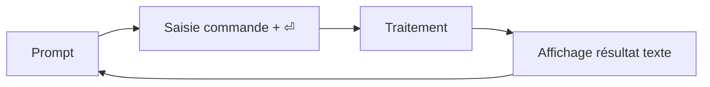

# Système d'exploitation - Interpréteurs de commandes
## Document de révision TSSR - Titre RNCP

---

**Formation** : Technicien Supérieur Systèmes et Réseaux (TSSR)  
**Sujet** : Interpréteurs de commandes (Shell & PowerShell)  
**Date** : Novembre 2024  
**Type** : Synthèse de cours complète

---

## 📋 Sommaire

1. [[#Introduction Qu'est-ce qu'un interpréteur de commandes ?|Introduction]]
2. [[#Interagir avec l'ordinateur|Interagir avec l'ordinateur]]
   - [[#Les IHM (Interface Homme Machine)|Les IHM]]
   - [[#CLI vs GUI|CLI vs GUI]]
3. [[#GNU bash|GNU bash]]
   - [[#Fonctionnalités principales|Fonctionnalités]]
   - [[#Le prompt bash|Le prompt]]
   - [[#Syntaxe et commandes|Syntaxe des commandes]]
   - [[#Redirections et pipes|Redirections]]
   - [[#Wildcards|Wildcards]]
4. [[#PowerShell|PowerShell]]
   - [[#Fonctionnalités PowerShell|Fonctionnalités]]
   - [[#Cmdlets|Cmdlets]]
5. [[#Points clés à retenir|Points clés à retenir]]
6. [[#Glossaire technique|Glossaire]]
7. [[#Ressources complémentaires|Ressources]]

---

## Introduction : Qu'est-ce qu'un interpréteur de commandes ?

> [!abstract] Définition générale
> Un **interpréteur de commandes** (shell) est un programme qui permet à l'utilisateur d'interagir avec le système d'exploitation via des commandes textuelles. C'est l'interface entre l'utilisateur et le noyau (kernel) du système d'exploitation.

### Rôle principal

L'interpréteur de commandes :
- Lit les commandes saisies par l'utilisateur
- Les interprète et les traduit en instructions pour l'OS
- Affiche les résultats de l'exécution
- Permet l'automatisation via des scripts

---

## Interagir avec l'ordinateur

### Les IHM (Interface Homme Machine)

> [!info] Définition IHM
> Les IHM (Interfaces Homme-Machine) sont les moyens par lesquels l'utilisateur communique avec l'ordinateur.

#### Les périphériques d'entrée/sortie

| Périphérique | Type | Fonction |
|--------------|------|----------|
| **Écran** | Sortie | - Séquence de texte<br>- Interface graphique |
| **Clavier** | Entrée | - Touches → codes → caractères (traduits par l'OS) |
| **Souris** | Entrée | - Déplacement et clics |

### CLI (Command Line Interface)

> [!note] Interface en ligne de commande
> CLI = Command Line Interface (Interface en Ligne de Commande)

#### Fonctionnement général



**Cycle d'exécution** :
1. **Invite de commande** (prompt) s'affiche
2. L'utilisateur **tape une commande** + touche Entrée (⏎)
3. **Affichage du résultat** (texte)
4. **Retour au prompt**

#### Shells disponibles

**MS Windows** :
- `cmd.exe` (Invite de commandes classique)
- `PowerShell` (depuis Windows 7)

**Unix/Linux** :
- `sh` - Le shell historique
- `bash` - **Le classique** (Bourne Again Shell)
- Autres : `csh`, `ksh`, `tcsh`, `zsh`, `dash`, `ash`...

### GUI (Graphical User Interface)

> [!note] Interface graphique utilisateur
> GUI = Graphical User Interface (Interface Graphique Utilisateur)

#### Caractéristiques principales

**MS Windows** :
- Basée sur clavier/souris
- Métaphore du bureau
- Icônes représentant :
  - Programmes
  - Documents (association avec programme par défaut)
- Barres de menus déroulants

#### Les environnements graphiques courants

| Système d'exploitation | Environnement graphique |
|------------------------|-------------------------|
| **MS Windows** | Interface graphique évoluée depuis MS-DOS |
| **macOS** | Aqua |
| **GNU/Linux** | Nombreux composants :<br>- Système de fenêtrage : X11 ou Wayland<br>- Compositeur : Compiz, Metacity, Mutter<br>- Environnement de bureau : Gnome, KDE, MATE, Cinnamon, Xfce... |

> [!tip] Flexibilité Linux
> Sous GNU/Linux, l'utilisateur a le **choix** entre de nombreux environnements de bureau, contrairement à Windows ou macOS qui imposent leur interface.

---

## GNU bash

> [!abstract] GNU bash
> **bash** = Bourne Again Shell
> - Shell du projet GNU et **le plus courant** sur Unix/Linux
> - Version 1 : 1988 (créateur : Brian Fox)
> - Licence : GPLv3

### Fonctionnalités principales

> [!important] Fonctionnalités clés de bash
> Ces fonctionnalités simplifient grandement l'utilisation du système :

| Fonctionnalité | Description | Utilisation |
|----------------|-------------|-------------|
| **Historique** | Rappel des commandes précédentes | ↑ ↓ pour naviguer, `history` |
| **Édition en ligne** | Modification d'une commande | Touches directionnelles, Home, End |
| **Auto-complétion** | Complétion automatique | Touche `Tab` |
| **Variables d'environnement** | Stockage de valeurs | `$PATH`, `$HOME`, `$USER` |
| **Alias** | Raccourcis de commandes | `alias ll='ls -la'` |
| **Tâches en arrière-plan** | Exécution asynchrone | Symbole `&` |

### Le prompt bash

> [!example] Invite de commande (prompt)

**Format par défaut** :
```bash
<nom_utilisateur>@<nom_hôte>:<répertoire_courant>$
```

**Exemples** :
```bash
user@host:~$           # Utilisateur normal
root@host:/#           # Utilisateur root (administrateur)
```

**Symboles** :
- `$` = utilisateur normal
- `#` = utilisateur root (superutilisateur)
- `~` = répertoire personnel de l'utilisateur

> [!tip] Personnalisation
> Le prompt est **configurable** via la variable d'environnement `PS1`

### Syntaxe des commandes

#### Structure générale

```bash
[chemin/]nom_commande [option...] [argument...]
```

> [!warning] Règles importantes
> - **Séparateur** : espace(s)
> - **Sensible à la casse** (Linux distingue majuscules/minuscules)
> - **Méta-caractères** : `|`, `>`, `<`, `&`, `;`, etc.
> - **Mots clés réservés** : `if`, `else`, `function`, `do`, `while`, etc.

#### Options des commandes

**Convention GNU** :
- Options **courtes** : précédées de `-` (ex: `-l`, `-a`)
- Options **longues** : précédées de `--` (ex: `--help`, `--version`)

**Exemples** :
```bash
ls -l                    # Option courte
ls --all                 # Option longue
ls -la                   # Options courtes combinées
ls -l --human-readable   # Combinaison options courtes et longues
```

### RTFM - Read The Fine Manual

> [!tip] La commande essentielle à connaître
> ```bash
> man <commande>
> ```
> Affiche la **page de manuel** de la commande spécifiée.

**Utilisation** :
```bash
man ls          # Manuel de la commande ls
man bash        # Manuel complet de bash
man man         # Manuel de la commande man elle-même
```

**Navigation dans man** :
- `Espace` ou `Page Down` : page suivante
- `b` ou `Page Up` : page précédente
- `/motif` : rechercher un motif
- `q` : quitter

### Commandes internes (builtin)

> [!info] Builtin commands
> Les commandes internes sont **intégrées directement dans bash** (pas de fichier externe).
> Elles s'exécutent plus rapidement que les commandes externes.

#### Principales commandes builtin

| Commande | Type | Description |
|----------|------|-------------|
| `cd` | builtin | Changer de répertoire |
| `type` | builtin | Afficher le type d'une commande |
| `echo` | builtin | Afficher du texte |
| `pwd` | builtin | Afficher le répertoire courant |
| `alias` | builtin | Créer/gérer des alias |
| `history` | builtin | Afficher l'historique des commandes |
| `exit` | builtin | Quitter le shell |
| `export` | builtin | Définir une variable d'environnement |

#### Vérifier le type d'une commande

```bash
wilder@X1:~$ type echo
echo est une primitive du shell

wilder@X1:~$ type cd
cd est une primitive du shell

wilder@X1:~$ type type
type est une primitive du shell

wilder@X1:~$ type mkdir
mkdir est /usr/bin/mkdir
```

> [!note] Liste complète des builtins
> Pour obtenir la liste de toutes les commandes builtin :
> ```bash
> help                    # Affiche toutes les commandes builtin
> compgen -b              # Liste les noms des builtins
> enable -a               # Affiche tous les builtins (actifs et désactivés)
> ```

### Exécuter des suites de commandes

#### Exécution séquentielle

> [!example] Différentes méthodes

**1. Une commande à la fois** :
```bash
commande <entrée>
```

**2. Séquence de commandes** (`;`) :
```bash
commande1 ; commande2 ; commande3
```
→ Exécute les commandes **l'une après l'autre**, peu importe si elles réussissent ou échouent

**3. Exécution conditionnelle** (`&&`) :
```bash
commande1 && commande2 && commande3
```
→ Exécute `commande2` **seulement si** `commande1` réussit

**4. Exécution en cas d'échec** (`||`) :
```bash
commande1 || commande2
```
→ Exécute `commande2` **seulement si** `commande1` échoue

#### Exemples pratiques

```bash
# Avec ";" - toutes les commandes s'exécutent
mkdir ~/dossier1; cd dossier1 ; touch file1

# Avec "&&" - arrêt si une commande échoue
mkdir ~/dossier2 && cd dossier2 && touch file2

# Avec "||" - alternative en cas d'échec
cd dossier3 || mkdir ~/dossier3 && cd dossier3 && touch file3
```

#### Arrêt d'une commande

> [!danger] Interruption
> **`Ctrl + C`** : Arrêt de la commande en cours (envoie le signal SIGTERM)

### Commandes asynchrones (arrière-plan)

> [!info] Exécution en arrière-plan
> Le symbole `&` permet d'exécuter une commande en arrière-plan (dans un sous-shell).

**Syntaxe** :
```bash
commande &
```

**Exemple** :
```bash
wilder@X1:~$ pluma &
[1] 217299                    # Numéro du job et PID
wilder@X1:~$ ps               # La commande continue en arrière-plan
    PID TTY          TIME CMD
 209697 pts/0    00:00:00 bash
 217299 pts/0    00:00:00 pluma
 217306 pts/0    00:00:00 ps
wilder@X1:~$
[1]+  Fini                pluma
```

> [!tip] Retour au prompt immédiat
> Avec `&`, le prompt revient immédiatement sans attendre la fin de la commande.

### Sortie standard et sortie d'erreur

> [!important] Deux flux de sortie distincts

| Flux | Descripteur | Nom | Destination par défaut |
|------|-------------|-----|------------------------|
| **stdin** | 0 | Entrée standard | Clavier |
| **stdout** | 1 | Sortie standard | Écran |
| **stderr** | 2 | Sortie d'erreur | Écran |

**Pourquoi deux sorties ?**
- Permet de **séparer** les résultats normaux des messages d'erreur
- Facilite la **redirection** sélective

### Redirections standards

> [!example] Redirection des entrées/sorties

#### Types de redirections

| Redirection | Syntaxe | Description |
|-------------|---------|-------------|
| **Sortie standard** | `commande > fichier` | Redirige stdout vers fichier (écrase) |
| **Sortie standard (ajout)** | `commande >> fichier` | Redirige stdout vers fichier (ajoute) |
| **Entrée standard** | `commande < fichier` | Lit l'entrée depuis un fichier |
| **Sortie d'erreur** | `commande 2> fichier` | Redirige stderr vers fichier (écrase) |
| **Sortie d'erreur (ajout)** | `commande 2>> fichier` | Redirige stderr vers fichier (ajoute) |
| **Stdout + stderr** | `commande &> fichier` | Redirige les deux flux |
| **Stderr vers stdout** | `commande 2>&1` | Redirige stderr vers le même flux que stdout |

#### Exemples de redirections

```bash
# Redirige la sortie standard vers le fichier files.txt
find /home/wilder/Documents/ -name "*.txt" > files.txt

# Redirige stdout et stderr dans 2 fichiers différents
find /home/wilder/Documents/ -name "*.txt" > files.txt 2> erreurs.txt

# Redirige stdout ET stderr vers le même fichier
find /home/wilder/Document/ -name "*.txt" > output.txt 2>&1

# Redirection avec ajout
echo "Nouvelle ligne" >> fichier.txt
```

> [!warning] Attention à l'écrasement
> L'opérateur `>` **écrase** le contenu du fichier existant !
> Utilisez `>>` pour **ajouter** à la fin.

### Pipes (interconnexion de commandes)

> [!abstract] Le pipeline
> Le symbole **`|`** (pipe) connecte la **sortie** d'une commande à l'**entrée** d'une autre.

**Syntaxe** :
```bash
commande1 | commande2
```

**Syntaxe avec stderr** :
```bash
commande1 |& commande2     # Redirige stdout ET stderr vers commande2
```

#### Exemples d'interconnexion

```bash
# Filtre le contenu d'un répertoire
ls -l | grep ".txt"

# Inclut aussi les erreurs dans le pipe
ls toto.txt |& grep "Aucun fichier"

# Filtre la liste des processus
ps aux | grep "chrome"

# Trie un fichier
cat fichier.txt | sort

# Chaîne multiple
cat fichier.log | grep "ERROR" | wc -l
```

> [!tip] Philosophie Unix
> Le pipe illustre la **philosophie Unix** : créer des petits programmes qui font une chose bien et les combiner pour des tâches complexes.

### Alias

> [!info] Renommer/raccourcir des commandes
> Les **alias** permettent de créer des raccourcis pour des commandes longues ou fréquentes.

#### Gestion des alias

**Créer un alias** :
```bash
alias nomAlias='cibleAlias'
```

**Lister les alias** :
```bash
alias
```

**Supprimer un alias** :
```bash
unalias nomAlias
```

#### Exemples pratiques

```bash
# Alias courants
alias ll='ls -la'
alias la='ls -A'
alias l='ls -CF'
alias grep='grep --color=auto'
alias update='sudo apt update && sudo apt upgrade'

# Alias avec options
alias rm='rm -i'        # Confirmation avant suppression
alias cp='cp -i'        # Confirmation avant écrasement
alias mv='mv -i'        # Confirmation avant déplacement
```

> [!warning] Persistance des alias
> Les alias créés en ligne de commande sont **temporaires** (session actuelle uniquement).
> Pour les rendre permanents, ajoutez-les dans `~/.bashrc` ou `~/.bash_aliases`

### Wildcards (caractères génériques)

> [!abstract] Patterns de correspondance
> Les **wildcards** permettent de sélectionner plusieurs fichiers/dossiers selon un motif.

#### Caractères wildcards

| Wildcard | Signification | Exemple | Correspond à |
|----------|---------------|---------|--------------|
| `*` | N'importe quel caractère (0 ou +) | `*.txt` | Tous les fichiers .txt |
| `?` | Un seul caractère quelconque | `file?.txt` | file1.txt, fileA.txt |
| `[...]` | Un caractère parmi la liste | `file[123].txt` | file1.txt, file2.txt, file3.txt |
| `[a-z]` | Un caractère dans la plage | `[a-z]*.txt` | Fichiers commençant par a à z |
| `[^...]` | Pas un caractère de la liste | `[^0-9]*.txt` | Ne commence pas par un chiffre |

#### Exemples d'utilisation

```bash
# Lister tous les fichiers .txt
ls *.txt

# Lister fichiers commençant par "aaa_"
ls aaa_*

# Lister fichiers commençant par "a"
ls a*

# Copier tous les fichiers commençant par "b"
cp b* /destination/

# Renommer avec wildcards
rename 's/^/_OK_/' *
```

#### Exemple pratique complet

```bash
wilder@X1:~$ for i in {1..5}; do mktemp aaa_XXXXXX; mktemp bbb_XXXXXX; done
wilder@X1:~$ ls
# Affiche tous les fichiers créés

wilder@X1:~$ ls aaa_*
# Affiche uniquement les fichiers commençant par aaa_

wilder@X1:~$ ls a*
# Affiche tous les fichiers commençant par a

wilder@X1:~$ mkdir rep_OLD && cp b* rep_OLD
# Copie tous les fichiers commençant par b dans rep_OLD

wilder@X1:~$ rename 's/^/_OK_/' *
# Préfixe tous les fichiers avec _OK_

wilder@X1:~$ rename 's/^(_OK_bbb)(.*)$/SAVE_$1$2/' _OK_bbb*
# Renommage complexe avec regex
```

### La commande echo

> [!info] Affichage de texte
> `echo` affiche du texte ou des variables à l'écran.

**Syntaxe** :
```bash
echo argument [argument...]
```

#### Exemples d'utilisation

```bash
wilder@X1:~$ echo bonjour
bonjour

wilder@X1:~$ echo salut tout le monde
salut tout le monde

# Les espaces multiples sont réduits à un seul
wilder@X1:~$ echo salut              tout            le  monde
salut tout le monde

# Les guillemets simples préservent les espaces
wilder@X1:~$ echo 'salut        à    tous'
salut        à    tous

# Les guillemets doubles aussi
wilder@X1:~$ echo "salut        à    tous"
salut        à    tous

# Affichage de variables
wilder@X1:~$ echo $HOME
/home/wilder

wilder@X1:~$ echo "Mon répertoire : $HOME"
Mon répertoire : /home/wilder
```

> [!tip] Guillemets
> - **Guillemets simples** `'...'` : Pas d'interprétation (tout est littéral)
> - **Guillemets doubles** `"..."` : Interprétation des variables `$VAR`
> - **Sans guillemets** : Interprétation + suppression espaces multiples

---

## PowerShell

> [!abstract] Windows PowerShell
> **PowerShell** est le nouveau shell de Microsoft depuis Windows 7.
> - Successeur de `command.com` et `cmd.exe`
> - Basé sur le framework .NET
> - Permet des scripts avancés et l'automatisation

### Fonctionnalités PowerShell

> [!important] Fonctionnalités clés

Les fonctionnalités de PowerShell sont **similaires à bash** :

| Fonctionnalité | Description |
|----------------|-------------|
| **Historique** | Rappel des commandes précédentes (↑ ↓) |
| **Édition en ligne** | Modification d'une commande |
| **Auto-complétion** | Touche `Tab` |
| **Variables d'environnement** | `$env:PATH`, `$env:USERNAME` |
| **Alias** | Raccourcis de commandes |
| **Similarité avec shell Unix** | Commandes communes (`ls`, `cd`, `pwd`) |

### Le prompt PowerShell

**Format par défaut** :
```powershell
PS <répertoire_courant> >
```

**Exemple** :
```powershell
PS C:\Users\wilder>
```

> [!note] Différence avec bash
> Pas de distinction visuelle entre utilisateur normal et administrateur dans le prompt par défaut.

> [!tip] Personnalisation
> Le prompt est configurable via la **fonction `prompt`**

### Types de commandes PowerShell

> [!info] 4 types de commandes

| Type | Description | Exemple |
|------|-------------|---------|
| **Programmes** | Applications externes | `notepad.exe` |
| **Cmdlets** | Applets de commandes PowerShell | `Get-Process` |
| **Fonctions** | Blocs de code réutilisables | `function MaFonction {...}` |
| **Scripts** | Fichiers `.ps1` | `MonScript.ps1` |

### Cmdlets

> [!abstract] Cmdlets PowerShell
> Les **cmdlets** (prononcé "command-lets") sont des commandes natives PowerShell.

#### Convention de nommage

**Format** : `Verbe-Nom`

| Verbe | Signification | Exemples |
|-------|---------------|----------|
| `Get-` | Obtenir des informations | `Get-Process`, `Get-Service` |
| `Set-` | Définir/modifier | `Set-Location`, `Set-ExecutionPolicy` |
| `New-` | Créer | `New-Item`, `New-Alias` |
| `Remove-` | Supprimer | `Remove-Item` |
| `Start-` | Démarrer | `Start-Service`, `Start-Process` |
| `Stop-` | Arrêter | `Stop-Service`, `Stop-Process` |
| `Test-` | Tester | `Test-Connection`, `Test-Path` |

#### Cmdlets essentielles

**Découverte et aide** :
```powershell
Get-Command              # Liste toutes les commandes disponibles
Get-Help Get-Process     # Affiche l'aide d'une cmdlet
Get-Member               # Affiche les propriétés et méthodes d'un objet
```

**Gestion des fichiers** :
```powershell
Get-ChildItem            # Liste le contenu (alias: ls, dir)
Set-Location             # Change de répertoire (alias: cd)
Get-Content              # Lit le contenu d'un fichier (alias: cat)
Copy-Item                # Copie (alias: cp)
Move-Item                # Déplace (alias: mv)
Remove-Item              # Supprime (alias: rm)
New-Item                 # Crée un fichier/dossier
```

**Gestion des processus et services** :
```powershell
Get-Process              # Liste les processus
Stop-Process             # Arrête un processus
Get-Service              # Liste les services
Start-Service            # Démarre un service
Stop-Service             # Arrête un service
Restart-Service          # Redémarre un service
```

**Gestion du système** :
```powershell
Get-ComputerInfo         # Infos système
Get-EventLog             # Consulte les journaux d'événements
Get-WinEvent             # Consulte les événements Windows
Get-NetAdapter           # Infos cartes réseau
Test-Connection          # Ping (Test de connectivité)
Get-Credential           # Demande identifiants
```

**Manipulation de données** :
```powershell
Select-Object            # Sélectionne des propriétés
Where-Object             # Filtre les objets
Sort-Object              # Trie les objets
Measure-Object           # Compte/calcule
Format-List              # Affichage en liste
Format-Table             # Affichage en tableau
```

#### Politique d'exécution des scripts

> [!danger] Sécurité
> Par défaut, l'exécution de scripts PowerShell est **désactivée** pour des raisons de sécurité.

**Voir la politique actuelle** :
```powershell
Get-ExecutionPolicy
```

**Modifier la politique** :
```powershell
Set-ExecutionPolicy RemoteSigned    # Permet les scripts locaux
Set-ExecutionPolicy Unrestricted    # Permet tous les scripts (non recommandé)
Set-ExecutionPolicy Restricted      # Bloque tous les scripts
```

**Valeurs possibles** :
- `Restricted` : Aucun script autorisé (défaut)
- `RemoteSigned` : Scripts locaux OK, scripts téléchargés doivent être signés
- `Unrestricted` : Tous les scripts autorisés
- `AllSigned` : Tous les scripts doivent être signés

### Pipes et redirections PowerShell

> [!info] Mécanismes similaires à bash

#### Pipeline

**Syntaxe** :
```powershell
commande1 | commande2
```

**Exemples** :
```powershell
# Filtrer les processus
Get-Process | Where-Object {$_.CPU -gt 100}

# Compter les services en cours
Get-Service | Where-Object {$_.Status -eq "Running"} | Measure-Object

# Trier par utilisation mémoire
Get-Process | Sort-Object -Property WS -Descending | Select-Object -First 10
```

> [!note] Différence avec bash
> PowerShell transmet des **objets** dans le pipeline, pas du texte brut comme bash.

#### Redirections

**Syntaxe similaire à bash** :
```powershell
commande > fichier       # Écrase le fichier
commande >> fichier      # Ajoute au fichier
```

**Exemple** :
```powershell
Get-Process > processus.txt
Get-Service >> services.txt
```

### Wildcards PowerShell

> [!info] Caractères génériques similaires
> PowerShell supporte les wildcards comme bash.

**Principaux wildcards** :
- `*` : N'importe quel caractère (0 ou +)
- `?` : Un seul caractère
- `[...]` : Liste de caractères

**Exemples** :
```powershell
Get-ChildItem *.txt
Get-ChildItem C:\Temp\file?.log
Get-ChildItem [a-z]*.ps1
```

> [!tip] Documentation complète
> Pour plus de détails, consultez la documentation Microsoft sur les wildcards PowerShell.

---

## Points clés à retenir

> [!success] Synthèse pour le titre RNCP

### Concepts fondamentaux

1. **Interpréteur de commandes** = Interface textuelle entre utilisateur et OS
2. **Deux types d'interfaces** :
   - **CLI** (Command Line Interface) : Textuelle, puissante, automatisable
   - **GUI** (Graphical User Interface) : Graphique, intuitive, limitée pour l'automatisation

### GNU bash (Linux/Unix)

> [!important] À retenir absolument

**Commandes builtin essentielles** :
```bash
cd, pwd, echo, type, alias, history, exit
```

**Syntaxe commande** :
```bash
[chemin/]nom_commande [option...] [argument...]
```

**Redirections** :
```bash
>    stdout vers fichier (écrase)
>>   stdout vers fichier (ajoute)
2>   stderr vers fichier
2>&1 stderr vers stdout
<    entrée depuis fichier
```

**Pipe** :
```bash
commande1 | commande2    # Connecte stdout de cmd1 à stdin de cmd2
```

**Exécution** :
```bash
cmd1 ; cmd2    # Séquentiel
cmd1 && cmd2   # Si cmd1 réussit
cmd1 || cmd2   # Si cmd1 échoue
cmd &          # Arrière-plan
```

**Wildcards** :
```bash
*     # N'importe quel caractère (0 ou +)
?     # Un seul caractère
[...] # Liste de caractères
```

### PowerShell (Windows)

> [!important] À retenir absolument

**Format cmdlet** :
```powershell
Verbe-Nom    # Ex: Get-Process, Set-Location
```

**Cmdlets essentielles** :
```powershell
Get-Command    # Découvrir les commandes
Get-Help       # Aide
Get-Process    # Processus
Get-Service    # Services
Set-ExecutionPolicy  # Politique d'exécution scripts
```

**Pipeline et redirections** :
```powershell
cmd1 | cmd2      # Pipeline (transmet des objets)
cmd > fichier    # Redirection stdout
```

### Différences clés bash vs PowerShell

| Aspect | bash | PowerShell |
|--------|------|------------|
| **Système** | Unix/Linux/macOS | Windows (multiplateforme depuis PS Core) |
| **Prompt** | `user@host:~$` | `PS C:\>` |
| **Admin** | `#` | Pas de distinction visuelle |
| **Pipeline** | Texte | Objets .NET |
| **Scripts** | `.sh` | `.ps1` |
| **Convention noms** | Pas de règle stricte | `Verbe-Nom` |
| **Commandes internes** | Builtins | Cmdlets |

### Bonnes pratiques

> [!tip] Conseils pour l'examen TSSR

1. **Toujours lire le manuel** : `man commande` (bash) ou `Get-Help cmdlet` (PowerShell)
2. **Utiliser la complétion** : Touche `Tab` dans les deux shells
3. **Tester avant d'exécuter** : Vérifier la syntaxe, faire des tests
4. **Documenter les scripts** : Commentaires (`#` dans les deux)
5. **Gérer les erreurs** : Redirections stderr, codes retour
6. **Automatiser** : Créer des scripts pour les tâches répétitives

---

## Glossaire technique

> [!note] Définitions importantes pour le TSSR

| Terme | Définition |
|-------|------------|
| **Shell** | Interpréteur de commandes, interface entre utilisateur et OS |
| **bash** | Bourne Again Shell, shell par défaut sur Linux |
| **CLI** | Command Line Interface, interface en ligne de commande |
| **GUI** | Graphical User Interface, interface graphique |
| **Prompt** | Invite de commande, indique que le shell attend une saisie |
| **Builtin** | Commande interne au shell (intégrée) |
| **Cmdlet** | Commande PowerShell (format Verbe-Nom) |
| **stdin** | Standard Input, entrée standard (descripteur 0) |
| **stdout** | Standard Output, sortie standard (descripteur 1) |
| **stderr** | Standard Error, sortie d'erreur standard (descripteur 2) |
| **Redirection** | Mécanisme pour rediriger les flux (entrée/sortie) |
| **Pipe** | Connecteur `\|` qui relie la sortie d'une commande à l'entrée d'une autre |
| **Wildcard** | Caractère générique pour sélection multiple (`*`, `?`, `[...]`) |
| **Alias** | Raccourci/surnom pour une commande |
| **Variable d'environnement** | Variable système accessible par les programmes |
| **Processus** | Programme en cours d'exécution |
| **Arrière-plan** | Exécution asynchrone (symbole `&` en bash) |
| **Script** | Fichier contenant une suite de commandes automatisées |
| **Exécution conditionnelle** | Exécution basée sur le succès/échec (`&&`, `\|\|`) |
| **IHM** | Interface Homme-Machine |
| **Méta-caractère** | Caractère spécial interprété par le shell (`\|`, `>`, `<`, etc.) |
| **GPLv3** | Licence libre GNU General Public License version 3 |
| **Politique d'exécution** | Paramètre de sécurité PowerShell pour les scripts |

---

## Ressources complémentaires

### Documentation officielle

**GNU bash** :
- Documentation officielle : https://www.gnu.org/software/bash/
- Manuel des builtins : https://www.gnu.org/software/bash/manual/html_node/Bash-Builtins.html

**PowerShell** :
- Documentation Microsoft : https://docs.microsoft.com/fr-fr/powershell/
- About Prompts : https://docs.microsoft.com/en-us/powershell/module/microsoft.powershell.core/about/about_prompts
- About Pipelines : https://docs.microsoft.com/en-us/powershell/module/microsoft.powershell.core/about/about_pipelines
- About Wildcards : https://docs.microsoft.com/en-us/powershell/module/microsoft.powershell.core/about/about_wildcards
- About Redirection : https://docs.microsoft.com/fr-fr/powershell/module/microsoft.powershell.core/about/about_redirection

### Communautés d'entraide

**StackExchange** :
- **Server Fault** : Q&A administration systèmes et réseaux (https://serverfault.com/)
- **Unix & Linux** : Q&A sur les Unix-like (https://unix.stackexchange.com/)
- **Ask Ubuntu** : Q&A centré sur Ubuntu et dérivées (https://askubuntu.com/)
- **Super User** : Q&A pour power users (https://superuser.com/)

> [!tip] Conseils pour chercher de l'aide
> - **Cherchez d'abord** avant de poser une question (souvent déjà répondue)
> - **Rappelez-vous** : personne ne vous doit de l'aide (soyez respectueux)
> - Fournissez un **maximum de contexte** (version OS, commande exacte, message d'erreur)
> - Formatez correctement votre code (markdown)

### Références complémentaires

**Environnements de bureau Linux** :
- Aqua (macOS) : https://fr.wikipedia.org/wiki/Aqua_(informatique)
- Système de fenêtrage : https://fr.wikipedia.org/wiki/Système_de_fenêtrage
- Compositeur : https://fr.wikipedia.org/wiki/Compositeur_(logiciel)
- Environnement de bureau : https://fr.wikipedia.org/wiki/Environnement_de_bureau

**Créateur de bash** :
- Brian Fox : https://en.wikipedia.org/wiki/Brian_Fox_(computer_programmer)

---

## Conclusion

> [!success] Résumé final

Ce document de révision couvre l'essentiel des **interpréteurs de commandes** pour le titre RNCP TSSR :

1. ✅ **Concepts fondamentaux** : IHM, CLI, GUI
2. ✅ **GNU bash** : Shell Unix/Linux avec toutes ses fonctionnalités
3. ✅ **PowerShell** : Shell Windows moderne et puissant
4. ✅ **Compétences pratiques** : Syntaxe, redirections, pipes, wildcards

**Pour réussir l'examen** :
- Maîtriser la **syntaxe** des commandes
- Comprendre les **redirections** et **pipes**
- Savoir utiliser les **wildcards**
- Connaître les **commandes essentielles** des deux shells
- Pratiquer régulièrement dans un terminal

> [!quote] Citation importante
> **"RTFM - Read The Fine Manual"**
> 
> La première commande à connaître est `man` (bash) ou `Get-Help` (PowerShell).
> La documentation est votre meilleure alliée !

---

**Document créé pour la formation TSSR - Titre RNCP**  
**Synthèse complète du cours : Interpréteurs de commandes**

*Bon courage pour vos révisions !* 🚀
