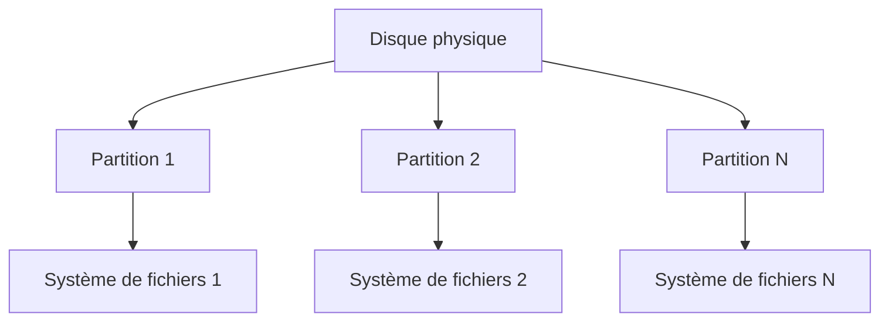

# Gestion du Stockage - Systèmes d'Exploitation
## Document de révision TSSR - Titre RNCP

---

**Formation** : Technicien Supérieur Systèmes et Réseaux (TSSR)  
**Sujet** : Gestion du stockage (Systèmes de fichiers, partitionnement et arborescence)  
**Date** : Novembre 2024  
**Type** : Synthèse de cours complète

---

## 📋 Sommaire

1. [[#Introduction|Introduction]]
2. [[#Concepts fondamentaux|Concepts fondamentaux]]
   - [[#Définitions essentielles|Définitions essentielles]]
   - [[#L'abstraction du système de fichiers|L'abstraction du système de fichiers]]
3. [[#Arborescence et navigation|Arborescence et navigation]]
   - [[#Structure hiérarchique|Structure hiérarchique]]
   - [[#Pseudo-dossiers . et ..|Pseudo-dossiers . et ..]]
   - [[#Chemins d'accès|Chemins d'accès]]
   - [[#Variable PATH|Variable PATH]]
4. [[#Les systèmes de fichiers|Les systèmes de fichiers]]
   - [[#Rôle et objectifs|Rôle et objectifs]]
   - [[#Approche classique|Approche classique]]
   - [[#Métadonnées|Métadonnées]]
   - [[#Liens physiques et symboliques|Liens physiques et symboliques]]
   - [[#FAT - File Allocation Table|FAT - File Allocation Table]]
   - [[#NTFS - New Technology File System|NTFS - New Technology File System]]
   - [[#ext4 - Extended File System|ext4 - Extended File System]]
5. [[#L'approche GNU/Linux|L'approche GNU/Linux]]
   - [[#Philosophie "Tout est fichier"|Philosophie "Tout est fichier"]]
   - [[#Arborescence standard Linux|Arborescence standard Linux]]
   - [[#Outils de partitionnement|Outils de partitionnement]]
   - [[#Nomenclature des périphériques|Nomenclature des périphériques]]
   - [[#Formatage et gestion|Formatage et gestion]]
   - [[#Montage et démontage|Montage et démontage]]
   - [[#Commandes essentielles Linux|Commandes essentielles Linux]]
6. [[#L'approche Windows|L'approche Windows]]
   - [[#Philosophie multi-racines|Philosophie multi-racines]]
   - [[#Arborescence standard Windows|Arborescence standard Windows]]
   - [[#Outils Windows|Outils Windows]]
   - [[#Commandes PowerShell|Commandes PowerShell]]
7. [[#Points clés à retenir|Points clés à retenir]]
8. [[#Glossaire technique|Glossaire technique]]

---

## Introduction

> [!abstract] Vue d'ensemble du cours
> Ce cours couvre la **gestion du stockage** dans les systèmes d'exploitation modernes. Il explique comment les OS organisent, structurent et manipulent les données sur les supports de stockage physiques à travers des **systèmes de fichiers** abstraits. Tu découvriras les différences fondamentales entre les approches GNU/Linux et Windows, ainsi que les outils et commandes essentiels pour gérer le stockage.

### Pourquoi étudier la gestion du stockage ?

En tant que **TSSR**, tu dois :
- Comprendre comment les données sont organisées sur les disques
- Savoir partitionner et formater des disques
- Maîtriser la navigation dans les arborescence Linux et Windows
- Gérer les systèmes de fichiers (création, montage, maintenance)
- Diagnostiquer les problèmes de stockage
- Optimiser l'utilisation de l'espace disque

> [!important] Compétences RNCP visées
> - **Installer et configurer** des systèmes de fichiers
> - **Administrer** les partitions et le stockage
> - **Diagnostiquer** les problèmes liés au stockage
> - **Maintenir** l'intégrité des données

---

## Concepts fondamentaux

### Définitions essentielles

> [!quote] Fichier (File)
> Un **fichier** est une unité de stockage de données sur un support de stockage. Il contient des informations et possède un **nom unique** dans son répertoire.

> [!quote] Dossier ou Répertoire (Directory)
> Un **dossier** (ou **répertoire**) est une structure qui permet d'organiser les fichiers et d'autres dossiers. Il peut contenir plusieurs fichiers et sous-dossiers, formant ainsi une hiérarchie.

> [!quote] Arborescence (Tree Structure)
> L'**arborescence** est une représentation hiérarchique des fichiers et dossiers d'un système de fichiers. Elle commence à partir d'un **dossier racine** et s'étend en branches et sous-branches.

### L'abstraction du système de fichiers

> [!info] Métaphore du bureau
> Les systèmes d'exploitation utilisent la **métaphore du bureau** pour rendre la gestion des fichiers intuitive :
> - Les **documents** sont rangés dans des **fichiers**
> - Les **fichiers** sont rangés dans des **répertoires**
> - Tout est identifié par un **emplacement** (logique, indépendant du stockage physique) et un **nom unique**

> [!important] Principe d'abstraction
> Le système de fichiers propose de manipuler une **version abstraite**, un **modèle** aux utilisateurs. Il réalise cette abstraction avec ses moyens techniques sur l'architecture physique existante. L'utilisateur n'a pas besoin de connaître l'emplacement physique exact des données sur le disque.

#### Caractéristiques de l'abstraction

Les fichiers et répertoires sont identifiés par :
- **Emplacement** : position logique, indépendante du stockage physique
- **Nom** : texte quelconque, unique dans son emplacement
- **Point de départ** : le répertoire racine (nom conventionnel selon l'OS)

---

## Arborescence et navigation

### Structure hiérarchique

> [!example] Structure branches-nœuds-feuilles
> L'arborescence des fichiers suit une structure classique :
> - **Racine** : point de départ unique de l'arborescence
> - **Branches** : les dossiers qui contiennent d'autres éléments
> - **Nœuds** : les sous-dossiers intermédiaires
> - **Feuilles** : les fichiers terminaux (qui ne contiennent pas d'autres éléments)

```
Racine
├── Dossier 1
│   ├── Fichier 1
│   ├── Fichier 2
│   └── Dossier 4
│       ├── Fichier 3
│       └── Fichier 4
├── Dossier 2
│   ├── Dossier 5
│   └── Fichier 3
├── Dossier 3
│   └── Dossier 1
└── Dossier N
    └── Fichier N
```

### Pseudo-dossiers . et ..

> [!note] Dossiers spéciaux
> Chaque dossier contient **2 pseudo-dossiers particuliers** qui facilitent la navigation :

| Pseudo-dossier | Désignation | Usage |
|----------------|-------------|-------|
| **`.`** | Le dossier lui-même | Référence explicite au répertoire courant |
| **`..`** | Le dossier parent | Permet de remonter d'un niveau dans l'arborescence |

> [!example] Exemples pratiques sous Linux
> ```bash
> # Afficher tous les fichiers (y compris . et ..)
> wilder@host:~$ ls -a
> 
> # Afficher tous les fichiers sauf . et ..
> wilder@host:~$ ls -A
> 
> # Compter le nombre de fichiers (sans . et ..)
> wilder@host:~$ ls -A | wc -l
> 
> # Créer un dossier et y créer des fichiers
> wilder@host:~$ mkdir test1 && cd test1; touch file1 file2 file3
> wilder@host:~/test1$ ls
> 
> # Supprimer tous les fichiers du dossier courant
> wilder@host:~/test1$ rm *
> wilder@host:~/test1$ ls
> 
> # Vérifier que . et .. existent toujours
> wilder@host:~/test1$ ls -a
> 
> # Remonter au dossier parent
> wilder@host:~/test1$ cd ..
> wilder@host:~$
> ```

> [!warning] Attention avec les suppressions
> La commande `rm *` ne supprime **pas** les pseudo-dossiers `.` et `..`, qui sont protégés. Cependant, elle supprime tous les fichiers et peut être **dangereuse** sans confirmation.

### Chemins d'accès

> [!info] Notion de chemin
> Un **chemin d'accès** (path) permet de localiser précisément un fichier ou un dossier dans l'arborescence. Il se compose de :
> - **Point de départ** : racine (chemin absolu) ou dossier courant (chemin relatif)
> - **Étapes** : succession de dossiers traversés
> - **Point d'arrivée** : dossier ou fichier cible
> - **Format** : séparateur d'étapes (différent selon l'OS)

#### Chemin absolu

> [!quote] Définition
> Un **chemin absolu** part toujours de la **racine** du système de fichiers. Il permet de localiser un élément de manière **unique et non ambiguë**, quel que soit le dossier courant.

**Syntaxe générale :**
```
<racine>[<séparateur><dossier> …][<séparateur>|<séparateur><fichier>]
```

> [!example] Exemples de chemins absolus
> 
> **GNU/Linux** (séparateur `/`) :
> - `/home/wilder/` : le dossier personnel de l'utilisateur wilder
> - `/var/log/auth.log` : le fichier journal des connexions
> - `/etc/passwd` : le fichier de configuration des utilisateurs
> 
> **Windows** (séparateur `\`) :
> - `C:\Users\wilder` : le dossier personnel de wilder
> - `C:\Windows\system32\notepad.exe` : l'exécutable du Bloc-notes
> - `D:\Documents\rapport.docx` : un fichier sur le disque D:

#### Chemin relatif

> [!quote] Définition
> Un **chemin relatif** part du **dossier courant** du processus. Il est plus court mais dépend du contexte d'exécution.

**Syntaxe générale :**
```
[<dossier><séparateur> …] <fichier> | <dossier> [<séparateur>]
```

> [!example] Exemples de chemins relatifs
> 
> **GNU/Linux** :
> - `local/bin/` : sous-dossier du répertoire courant
> - `.ssh/id_ed25519.pub` : fichier dans le sous-dossier caché .ssh
> - `../Documents/` : dossier Documents du dossier parent
> 
> **Windows** :
> - `Quêtes\PowerShell\` : sous-dossier du répertoire courant
> - `Pictures\Photos\me.jpg` : fichier dans une sous-arborescence
> - `..\Bureau\` : dossier Bureau du dossier parent

> [!tip] Quand utiliser un chemin relatif ou absolu ?
> - **Chemin absolu** : scripts automatisés, configurations système, référence stable
> - **Chemin relatif** : navigation interactive, scripts portables, références courtes

#### Notion de dossier courant

> [!info] Dossier de travail (Working Directory)
> Chaque **processus** est associé à un répertoire courant qui sert de :
> - **Point de départ** pour les chemins relatifs
> - **Contexte** de travail pour les opérations de fichiers
> 
> Ce dossier est **dynamique** et peut changer pendant l'exécution du processus.

> [!example] Dossier courant dans le shell
> Le **shell** (bash, zsh, PowerShell) affiche généralement le dossier courant dans son **prompt** :
> ```bash
> wilder@host:~/Documents$    # Dossier courant : ~/Documents
> wilder@host:/etc$           # Dossier courant : /etc
> ```

### Variable PATH

> [!important] La variable d'environnement PATH
> Certaines commandes shell sont des **programmes** (donc des fichiers exécutables). Comment le shell sait-il **où chercher** ces programmes ?
> 
> → Via la valeur d'une **variable d'environnement spécifique** nommée **PATH**

#### Sous GNU/Linux

> [!note] Variable PATH sous Linux
> La variable `PATH` contient une liste de chemins séparés par `:` où le shell cherche les commandes.
> 
> **Afficher le PATH :**
> ```bash
> echo $PATH
> # Exemple de sortie :
> # /usr/local/bin:/usr/bin:/bin:/usr/sbin:/sbin
> ```
> 
> **Ressource :** Article détaillé sur [linuxhint.com](https://linuxhint.com) sur la gestion du PATH

#### Sous Windows PowerShell

> [!note] Variable PATH sous PowerShell
> La variable `$env:path` contient une liste de chemins séparés par `;` où PowerShell cherche les commandes.
> 
> **Afficher le PATH :**
> ```powershell
> $env:path
> # Ou pour un affichage plus lisible :
> $env:path -split ';'
> ```
> 
> **Documentation officielle** : [Microsoft Docs - about_Environment_Variables](https://docs.microsoft.com/powershell/)

> [!tip] Ajouter un chemin au PATH
> - **Linux** : Éditer `~/.bashrc` ou `~/.profile`
> - **Windows** : Panneau de configuration → Système → Variables d'environnement

---

## Les systèmes de fichiers

### Rôle et objectifs

> [!quote] Système de gestion de fichiers (File System - FS)
> Un **système de fichiers** est une méthode d'organisation et de stockage des fichiers sur un périphérique de stockage. Il gère la façon dont les données sont stockées, récupérées et organisées.

> [!important] Objectifs d'un système de fichiers
> 1. **Fournir une arborescence abstraite** de répertoires et fichiers
> 2. **Organiser l'information** sur un périphérique de stockage physique
> 3. **Traiter les périphériques de stockage par blocs** (disques, partitions, volumes)
> 4. **Gérer l'espace disponible** et l'allocation des blocs
> 5. **Garantir l'intégrité** des données

### Approche classique

> [!info] Relation Disques - Partitions - Systèmes de fichiers
> L'approche traditionnelle suit cette hiérarchie :



**Règles de base :**
- **1 disque** peut être découpé en **1 ou plusieurs partitions**
- **1 partition** est associée à **1 système de fichiers**
- **Taille partition** ≤ **taille disque**
- **Taille FS** = **Taille partition**

> [!example] Exemple concret
> Un disque de 1 To peut être partitionné ainsi :
> - Partition 1 : 100 Go → Système de fichiers ext4 (Linux)
> - Partition 2 : 500 Go → Système de fichiers NTFS (Windows)
> - Partition 3 : 400 Go → Système de fichiers FAT32 (Données partagées)

### Métadonnées

> [!quote] Définition
> Les **métadonnées** sont des **données sur les données**. Dans un système de fichiers, elles décrivent les propriétés et l'organisation des fichiers et du système lui-même.

#### Métadonnées globales du système de fichiers

> [!info] Métadonnées globales
> Informations concernant le système de fichiers dans son ensemble :
> - **Paramétrage** du système de fichiers (type, version, options)
> - **Blocs disponibles / occupés** (gestion de l'espace)
> - **Blocs corrompus** (bad blocks)
> - **Emplacement de la racine** (point de départ de l'arborescence)
> - **Emplacement du secteur de boot** (pour les partitions bootables)
> - **UUID** (identifiant unique universel)
> - **Label** (étiquette du volume)

#### Métadonnées par fichier/dossier

> [!info] Métadonnées par fichier
> Informations spécifiques à chaque fichier ou dossier :
> - **Nom** du fichier
> - **Taille** (en octets)
> - **Identifiants de propriétaire** (UID utilisateur, GID groupe)
> - **Droits d'accès** (permissions lecture/écriture/exécution)
> - **Dates** :
>   - Date de création
>   - Date du dernier accès
>   - Date de la dernière modification
> - **Compteur de liens** (hard links)
> - **Type** (fichier régulier, dossier, lien, device, etc.)
> - **Emplacement physique** des blocs de données

### Liens physiques et symboliques

> [!abstract] Objectif des liens
> Les liens permettent de fournir l'accès au **même fichier** depuis **différents répertoires** sans dupliquer les données.

#### Lien physique (Hard Link)

> [!quote] Définition - Hard Link
> Un **lien physique** est une entrée de répertoire supplémentaire qui pointe vers les **mêmes données physiques** qu'un autre fichier. Il n'y a qu'**un seul fichier réel** sur le disque, mais plusieurs noms pour y accéder.

**Caractéristiques :**
- S'appuie directement sur le système de fichiers
- Partage le même **inode** (numéro d'identification interne)
- **Compteur de liens** : indique combien de noms pointent vers les données
- Le fichier n'est **réellement supprimé** que lorsque le compteur atteint 0
- **Limitation** : fonctionne uniquement sur le même système de fichiers

> [!example] Exemple de hard link sous Linux
> ```bash
> # Créer un fichier
> echo "Contenu original" > fichier_original.txt
> 
> # Créer un lien physique
> ln fichier_original.txt lien_physique.txt
> 
> # Les deux noms pointent vers les mêmes données
> # Modifier l'un modifie l'autre
> echo "Ajout" >> lien_physique.txt
> cat fichier_original.txt  # Affiche aussi "Ajout"
> 
> # Supprimer un nom ne supprime pas le fichier
> rm fichier_original.txt
> cat lien_physique.txt  # Le contenu existe toujours !
> ```

#### Lien symbolique (Symbolic Link ou Symlink)

> [!quote] Définition - Symlink
> Un **lien symbolique** est un **fichier spécial** qui contient un **renvoi** (chemin) vers un autre fichier ou dossier. C'est comme un "raccourci" ou une "redirection".

**Caractéristiques :**
- **Fichier indépendant** avec son propre inode
- Contient simplement le **chemin** vers la cible
- Peut pointer vers un fichier ou un dossier
- Peut pointer vers une cible sur un **autre système de fichiers**
- Peut pointer vers une cible **inexistante** → lien cassé (broken link)
- Fonctionne avec des **chemins absolus ou relatifs**

> [!example] Exemple de lien symbolique sous Linux
> ```bash
> # Créer un fichier
> echo "Données" > fichier_cible.txt
> 
> # Créer un lien symbolique
> ln -s fichier_cible.txt lien_symbolique.txt
> 
> # Le lien redirige vers la cible
> cat lien_symbolique.txt  # Affiche "Données"
> 
> # Supprimer la cible casse le lien
> rm fichier_cible.txt
> cat lien_symbolique.txt  # Erreur : fichier introuvable
> 
> # Le lien existe toujours mais est "cassé"
> ls -l lien_symbolique.txt
> # lien_symbolique.txt -> fichier_cible.txt (en rouge si colorisé)
> ```

> [!warning] Différences importantes
> | Caractéristique | Lien physique | Lien symbolique |
> |----------------|---------------|-----------------|
> | **Même inode** | Oui | Non |
> | **Survit à la suppression de l'original** | Oui | Non (lien cassé) |
> | **Fonctionne entre FS différents** | Non | Oui |
> | **Peut pointer vers un dossier** | Non (généralement) | Oui |
> | **Visible dans `ls -l`** | Non | Oui (flèche →) |

### FAT - File Allocation Table

> [!quote] Histoire
> La **FAT** (File Allocation Table) a été créée par **Microsoft** en **1977** pour MS-DOS. C'est l'un des systèmes de fichiers les plus anciens encore utilisés aujourd'hui.

#### Évolution

- **FAT12** : disquettes (jusqu'à 16 Mo)
- **FAT16** : DOS, Windows 95 (jusqu'à 2 Go)
- **FAT32** : Windows 95 OSR2 et supérieur (la version la plus courante)
- **vFAT** : extension pour supporter les noms longs (255 caractères Unicode)

#### Caractéristiques techniques

| Caractéristique | Valeur |
|----------------|--------|
| **Noms de fichiers (FAT)** | Format 8.3 ASCII (8 caractères + 3 pour l'extension) |
| **Noms de fichiers (vFAT)** | Jusqu'à 255 caractères Unicode |
| **Taille max fichier** | 4 Gio (4 294 967 296 octets) |
| **Taille max partition** | 16 Tio (FAT32) |
| **Droits d'accès** | ❌ Non supportés |
| **Journalisation** | ❌ Non |
| **Chiffrement** | ❌ Non |

> [!note] Unités de mesure : Gio vs Go
> **1 Gio** (gibioctet ou GiB - gibibyte) = 2³⁰ octets = **1 073 741 824 octets**
> **1 Go** (gigaoctet ou GB - gigabyte) = 10⁹ octets = **1 000 000 000 octets**
> 
> Autres unités binaires :
> - **Kio** → kibioctets (2¹⁰)
> - **Mio** → mébioctets (2²⁰)
> - **Gio** → gibioctets (2³⁰)
> - **Tio** → tébioctets (2⁴⁰)

#### Avantages et limitations

> [!success] Avantages de FAT32
> - **Compatibilité universelle** : supporté par tous les OS (Windows, Linux, macOS, consoles de jeux, etc.)
> - **Simplicité** : structure simple et légère
> - **Idéal pour les supports amovibles** : clés USB, cartes SD

> [!warning] Limitations de FAT32
> - **Fichiers de 4 Gio maximum** : impossible de stocker des fichiers volumineux (images ISO, vidéos HD)
> - **Pas de gestion des droits** : tous les utilisateurs ont les mêmes accès
> - **Pas de journalisation** : risque de corruption en cas de déconnexion brutale
> - **Fragmentation** : performances qui se dégradent avec le temps

> [!example] Cas d'usage typiques
> - Clés USB pour le partage de fichiers entre différents OS
> - Cartes SD pour appareils photo, smartphones
> - Supports de boot multiplateforme
> - Partitions de données accessibles depuis Windows et Linux

### NTFS - New Technology File System

> [!quote] Histoire
> Le **NTFS** (New Technology File System) est le successeur de FAT sur **Windows NT** (1993) et **Windows 2000**. C'est le système de fichiers par défaut de Windows moderne.

#### Caractéristiques techniques

| Caractéristique | Valeur |
|----------------|--------|
| **Taille max fichier** | 16 Eio (Exbioctets) théorique |
| **Taille max volume** | 256 Tio pratique |
| **Noms de fichiers** | Jusqu'à 255 caractères Unicode |
| **Droits d'accès** | ✅ ACL (Access Control List) avancées |
| **Journalisation** | ✅ Oui (journal des transactions) |
| **Compression** | ✅ Native |
| **Chiffrement** | ✅ EFS (Encrypting File System) |

#### Fonctionnalités avancées

> [!important] Points forts de NTFS
> 1. **Capacités supérieures** :
>    - Nombre quasi-illimité de fichiers
>    - Très grandes tailles de fichiers et volumes
> 
> 2. **Sécurité avancée** :
>    - ACL (Access Control List) : permissions granulaires par utilisateur/groupe
>    - Audit des accès fichiers
>    - Quotas disques par utilisateur
> 
> 3. **Fiabilité** :
>    - **Journalisation** : enregistre les opérations avant exécution
>    - Récupération automatique après crash
>    - Détection et isolation des secteurs défectueux
> 
> 4. **Fonctionnalités modernes** :
>    - Compression transparente à la volée
>    - Chiffrement natif (EFS)
>    - Liens symboliques et jonctions
>    - Flux de données alternatifs (ADS)
>    - Snapshots via VSS (Volume Shadow Copy)

> [!example] Cas d'usage
> - **Partition système Windows** (C:\)
> - **Partitions de données** sur Windows
> - **Serveurs Windows** : partages réseau avec ACL
> - **Disques nécessitant la sécurité** : environnements professionnels

> [!tip] Compatibilité avec Linux
> NTFS peut être lu et écrit sous Linux via le driver **ntfs-3g**, mais avec des performances inférieures à celles sous Windows. Les droits NTFS ne sont pas toujours correctement gérés.

### ext4 - Extended File System

> [!quote] Histoire
> **ext4** (Extended File System version 4) est le système de fichiers principal de **GNU/Linux**. C'est l'évolution de ext3, lui-même successeur de ext2 et ext.

#### Évolution de la famille ext

- **ext** (1992) : premier système de fichiers pour Linux
- **ext2** (1993) : amélioration des performances
- **ext3** (2001) : ajout de la journalisation
- **ext4** (2008) : version actuelle, améliorations majeures

#### Caractéristiques techniques

| Caractéristique | Valeur |
|----------------|--------|
| **Taille max fichier** | 16 Tio |
| **Taille max volume** | 1 Eio (Exbioctet) |
| **Nombre max fichiers** | 4 milliards |
| **Noms de fichiers** | Jusqu'à 255 octets |
| **Journalisation** | ✅ Oui |
| **Compression** | ⚠️ Supportée (mais peu utilisée) |
| **Chiffrement** | ✅ Oui (depuis Linux 4.1) |

#### Fonctionnalités avancées

> [!important] Points forts d'ext4
> 1. **Gestion de la fragmentation** :
>    - Utilisation d'**extents** : allocation de blocs contigus
>    - **Allocation retardée** : optimise le placement des données
>    - Moins de fragmentation qu'ext3
> 
> 2. **Défragmentation en ligne** :
>    - Outil `e4defrag` : défragmente sans démontage
>    - Fragmentation généralement faible, défragmentation rarement nécessaire
> 
> 3. **Fiabilité** :
>    - **Journalisation** : 3 modes (journal, ordered, writeback)
>    - Vérification rapide du système de fichiers
>    - Meilleure gestion des pannes
> 
> 4. **Performances** :
>    - Allocation rapide de gros fichiers
>    - Support des SSD (commande TRIM)
>    - Indexation des répertoires pour recherche rapide

> [!example] Cas d'usage
> - **Partition système Linux** : / (racine)
> - **Partitions de données** sous Linux
> - **Serveurs Linux** : performances et fiabilité
> - **Stations de travail** : développement, bureautique

> [!tip] Compatibilité avec Windows
> ext4 **n'est pas nativement supporté** par Windows. Il existe des outils tiers (ex: Linux File Systems for Windows) pour y accéder, mais avec des limitations.

---

## L'approche GNU/Linux

### Philosophie "Tout est fichier"

> [!quote] Principe fondamental
> Sous GNU/Linux, **"Tout est fichier"** (Everything is a file). Cette philosophie signifie que presque toutes les ressources système (périphériques, processus, sockets réseau) sont accessibles via des **fichiers** ou **pseudo-fichiers**.

> [!important] Caractéristiques de l'approche Linux
> 1. **Racine unique** : `/` (slash)
>    - Une seule arborescence pour tout le système
>    - Indépendante des périphériques de stockage physiques
> 
> 2. **Notion de montage** :
>    - Les systèmes de fichiers sont **montés** à différents points de l'arborescence
>    - Transparence totale pour l'utilisateur
> 
> 3. **Fichier = ressource** :
>    - Fichiers réguliers : données
>    - Répertoires : conteneurs
>    - Pseudo-fichiers : représentent des ressources système (CPU, mémoire, périphériques)
> 
> 4. **Unification** :
>    - Tout est accessible via la même interface (open, read, write, close)
>    - Pas de distinction pour l'utilisateur entre fichiers réels et virtuels

> [!example] Exemples de pseudo-fichiers
> - `/dev/sda` : disque dur
> - `/dev/tty` : terminal courant
> - `/proc/cpuinfo` : informations sur le CPU
> - `/sys/class/net/eth0/` : carte réseau Ethernet

### Arborescence standard Linux

> [!abstract] FHS - Filesystem Hierarchy Standard
> Linux suit le **FHS** (Filesystem Hierarchy Standard), une norme qui définit l'organisation des répertoires. Chaque dossier a un **rôle spécifique**.

#### Répertoires de premier niveau

| Répertoire | Rôle | Contenu typique |
|------------|------|-----------------|
| **`/bin`** | Binaires essentiels utilisateurs | Commandes de base : `ls`, `cp`, `cat`, `bash` |
| **`/boot`** | Fichiers de démarrage | Noyau Linux (`vmlinuz`), initramfs, GRUB |
| **`/dev`** | Périphériques (devices) | Pseudo-fichiers représentant matériel : disques, ports, etc. |
| **`/etc`** | Configuration système | Fichiers de config : `passwd`, `fstab`, `hosts` |
| **`/home`** | Répertoires personnels | Dossiers des utilisateurs : `/home/wilder`, `/home/alice` |
| **`/lib`** | Bibliothèques partagées | Librairies système (.so) pour `/bin` et `/sbin` |
| **`/media`** | Montage automatique | Points de montage pour médias amovibles (USB, CD) |
| **`/mnt`** | Montage temporaire | Points de montage manuels temporaires |
| **`/opt`** | Applications optionnelles | Logiciels tiers installés manuellement (hors dépôts) |
| **`/proc`** | Pseudo-fichiers processus | Informations sur les processus en cours d'exécution |
| **`/root`** | Répertoire personnel de root | Home de l'administrateur système |
| **`/sbin`** | Binaires système/admin | Commandes d'administration : `fdisk`, `mkfs`, `reboot` |
| **`/sys`** | Système de fichiers virtuel | Configuration actuelle du noyau et du matériel |
| **`/tmp`** | Fichiers temporaires | Données temporaires, vidé au redémarrage |
| **`/usr`** | Programmes et ressources | Logiciels installés, bibliothèques, documentation |
| **`/var`** | Données variables | Logs, mails, caches, bases de données |

> [!tip] Mnémotechnique pour retenir les principaux répertoires
> - **`/bin`** = **BIN**aries (programmes)
> - **`/boot`** = **BOOT** (démarrage)
> - **`/dev`** = **DEV**ices (périphériques)
> - **`/etc`** = **ET C**etera (et le reste → configuration)
> - **`/home`** = **HOME** (maison des utilisateurs)
> - **`/var`** = **VAR**iable (données qui changent)
> - **`/tmp`** = **T**e**MP**orary (temporaire)

#### Sous-répertoires importants

> [!note] Détails de `/usr`
> `/usr` (Unix System Resources) contient la majorité des programmes :
> - `/usr/bin` : exécutables utilisateurs (commandes principales)
> - `/usr/sbin` : exécutables administrateur
> - `/usr/lib` : bibliothèques des programmes
> - `/usr/local` : programmes installés localement (hors gestionnaire de paquets)
> - `/usr/share` : données partagées (documentation, icônes, locales)

> [!note] Détails de `/var`
> `/var` contient des données qui **varient** pendant l'exécution :
> - `/var/log` : journaux système et applications
> - `/var/cache` : caches des applications
> - `/var/mail` : boîtes mail des utilisateurs
> - `/var/www` : racine des sites web (Apache, Nginx)
> - `/var/tmp` : fichiers temporaires persistants entre redémarrages

### Outils de partitionnement

> [!info] Outils disponibles sous Linux
> Linux offre de nombreux outils pour gérer les partitions, en **ligne de commande (CLI)** et avec **interface graphique (GUI)**.

#### Outils en ligne de commande (CLI)

| Outil | Description | Niveau |
|-------|-------------|--------|
| **`fdisk`** | Outil classique, interface interactive | Intermédiaire |
| **`cfdisk`** | Version avec interface textuelle ncurses (plus conviviale) | Débutant |
| **`parted`** | Outil puissant, supporte GPT et MBR, scriptable | Avancé |
| **`gdisk`** | Version de fdisk pour tables GPT | Avancé |
| **`sgdisk`** | Version scriptable de gdisk | Expert |

> [!example] Exemple avec fdisk
> ```bash
> # Lister tous les disques et partitions
> sudo fdisk -l
> 
> # Ouvrir fdisk sur un disque spécifique
> sudo fdisk /dev/sda
> 
> # Commandes interactives :
> # m : afficher l'aide
> # p : afficher les partitions
> # n : créer une nouvelle partition
> # d : supprimer une partition
> # t : changer le type de partition
> # w : écrire les modifications (sauvegarder)
> # q : quitter sans sauvegarder
> ```

#### Outils graphiques (GUI)

| Outil | Environnement | Description |
|-------|---------------|-------------|
| **`gparted`** | GNOME/Universel | Éditeur graphique complet et intuitif |
| **`gnome-disks`** | GNOME | Utilitaire Disques de GNOME (simple) |
| **`partitionmanager`** | KDE | Gestionnaire de partitions KDE |
| **`kde-partition-manager`** | KDE | Alternative KDE avancée |

> [!tip] GParted - L'outil graphique de référence
> **GParted** (GNOME Partition Editor) est l'outil graphique le plus populaire :
> - Interface intuitive avec visualisation graphique
> - Supporte tous les types de systèmes de fichiers
> - Redimensionnement de partitions sans perte de données
> - Création, suppression, formatage, vérification
> - Disponible en Live USB pour partitionner avant installation

### Nomenclature des périphériques

> [!important] Convention de nommage Linux
> Sous Linux, les périphériques de stockage sont représentés par des **fichiers spéciaux** dans `/dev`. La nomenclature dépend du **type de disque**.

#### Disques IDE (ancienne technologie)

| Nomenclature | Description | Exemple |
|--------------|-------------|---------|
| **`/dev/hdX`** | Disque IDE (X = a, b, c...) | `/dev/hda` = 1er disque IDE |
| **`/dev/hdXP`** | Partition IDE (P = 1, 2, 3...) | `/dev/hda1` = 1ère partition du 1er disque |

> [!note] IDE (Integrated Drive Electronics)
> Ancienne interface de connexion des disques durs. Remplacée par SATA. Rarement utilisée aujourd'hui.

#### Disques SATA/SCSI/USB (technologie courante)

| Nomenclature | Description | Exemple |
|--------------|-------------|---------|
| **`/dev/sdX`** | Disque SATA/SCSI/USB (X = a, b, c...) | `/dev/sda` = 1er disque détecté |
| **`/dev/sdXP`** | Partition (P = 1, 2, 3...) | `/dev/sda1` = 1ère partition du 1er disque |

> [!example] Exemples courants
> - `/dev/sda` : disque dur principal
> - `/dev/sda1` : première partition (souvent système)
> - `/dev/sda2` : deuxième partition (souvent swap)
> - `/dev/sdb` : deuxième disque (ou clé USB)
> - `/dev/sdb1` : première partition du deuxième disque

#### Disques NVMe (SSD modernes)

| Nomenclature | Description | Exemple |
|--------------|-------------|---------|
| **`/dev/nvmeYnZ`** | Disque NVMe (Y = contrôleur, Z = namespace) | `/dev/nvme0n1` = 1er SSD NVMe |
| **`/dev/nvmeYnZpP`** | Partition NVMe (P = 1, 2, 3...) | `/dev/nvme0n1p1` = 1ère partition |

> [!note] NVMe (Non-Volatile Memory Express)
> Interface moderne pour les SSD connectés via PCIe. Beaucoup plus rapides que SATA.
> - `Y` : numéro du contrôleur (0, 1, 2...)
> - `Z` : numéro du namespace (généralement 1)
> - `P` : numéro de la partition

> [!warning] Numérotation dynamique
> La numérotation des disques (`/dev/sda`, `/dev/sdb`) se fait dans l'**ordre de détection** par le noyau Linux.
> 
> **Conséquence** : Un disque peut **changer de nom** entre deux démarrages si l'ordre de détection change !
> 
> **Solution** : Utiliser les **UUID** ou les **labels** pour identifier les partitions de manière stable.

> [!example] Visualiser les périphériques
> ```bash
> # Lister tous les périphériques de bloc
> lsblk
> 
> # Exemple de sortie :
> # NAME        MAJ:MIN RM   SIZE RO TYPE MOUNTPOINT
> # sda           8:0    0 465.8G  0 disk 
> # ├─sda1        8:1    0   512M  0 part /boot
> # ├─sda2        8:2    0     8G  0 part [SWAP]
> # └─sda3        8:3    0 457.3G  0 part /
> # nvme0n1     259:0    0   1TB   0 disk
> # └─nvme0n1p1 259:1    0   1TB   0 part /home
> ```

### Formatage et gestion

> [!abstract] Approche unifiée Linux
> Linux utilise une approche unifiée avec la commande **`mkfs`** (make filesystem) qui sert de **façade** pour différents outils de formatage spécifiques.

#### La commande mkfs

> [!info] Syntaxe de mkfs
> ```bash
> mkfs.<type> [options] <périphérique>
> ```
> 
> Où `<type>` est le système de fichiers souhaité : `ext4`, `ext3`, `xfs`, `vfat`, etc.

> [!example] Exemples de formatage
> ```bash
> # Formater en ext4 (système de fichiers Linux)
> sudo mkfs.ext4 /dev/sdb1
> 
> # Formater en FAT32 (compatible Windows/Linux)
> sudo mkfs.vfat /dev/sdb1
> 
> # Formater en NTFS (Windows)
> sudo mkfs.ntfs /dev/sdb1
> 
> # Formater en XFS (système de fichiers hautes performances)
> sudo mkfs.xfs /dev/sdb1
> ```

#### UUID et étiquettes (labels)

> [!important] Identification stable des partitions
> À la création d'un système de fichiers, Linux associe automatiquement :
> 1. **UUID** (Universally Unique IDentifier) : identifiant unique de 128 bits
> 2. **Label** (étiquette) : nom lisible par l'humain (optionnel)

**Avantages :**
- Identification stable même si le nom du périphérique change
- Facilite la configuration du fichier `/etc/fstab`
- Permet des montages automatiques fiables

> [!example] Afficher les UUID
> ```bash
> # Méthode 1 : lsblk avec UUID
> lsblk -f
> 
> # Méthode 2 : blkid (plus bas niveau)
> sudo blkid
> 
> # Méthode 3 : liens symboliques dans /dev/disk/by-uuid/
> ls -lh /dev/disk/by-uuid/
> 
> # Exemple de sortie :
> # lrwxrwxrwx 1 root root 15 avril 11 13:59 
> # 2e80388d-0014-4fe0-9328-d06296d423f7 -> ../../nvme0n1p1
> # 
> # 9e35d3c3-e1d1-484c-ad58-ba0d8e18f7c0 -> ../../nvme0n1p2
> ```

#### Outils complémentaires

| Commande | Rôle | Exemple |
|----------|------|---------|
| **`fsck`** | Vérifier et réparer un FS | `sudo fsck /dev/sda1` |
| **`resize2fs`** | Redimensionner un FS ext2/3/4 | `sudo resize2fs /dev/sda1` |
| **`e2label`** | Changer l'étiquette d'un FS ext2/3/4 | `sudo e2label /dev/sda1 "MesData"` |
| **`tune2fs`** | Paramétrer un FS ext2/3/4 | `sudo tune2fs -m 5 /dev/sda1` |
| **`badblocks`** | Rechercher les blocs défectueux | `sudo badblocks -sv /dev/sda1` |

> [!warning] Attention avant formatage !
> Le formatage **détruit toutes les données** de la partition. Toujours :
> 1. **Sauvegarder** les données importantes
> 2. **Vérifier** le périphérique cible (`lsblk`, `fdisk -l`)
> 3. **Démonter** la partition avant formatage (`umount`)

> [!example] Procédure complète de formatage
> ```bash
> # 1. Identifier le périphérique
> lsblk
> 
> # 2. Démonter la partition si montée
> sudo umount /dev/sdb1
> 
> # 3. Formater en ext4 avec label
> sudo mkfs.ext4 -L "MesDonnees" /dev/sdb1
> 
> # 4. Vérifier l'UUID et le label
> sudo blkid /dev/sdb1
> 
> # 5. Monter la partition
> sudo mount /dev/sdb1 /mnt/donnees
> 
> # 6. Vérifier le montage
> df -h | grep /mnt/donnees
> ```

### Montage et démontage

> [!quote] Notion de montage
> **Monter** un système de fichiers signifie le rendre accessible via l'arborescence Linux en l'attachant à un **point de montage** (répertoire). C'est l'opération qui intègre une partition dans l'arborescence unique de Linux.

#### La commande mount

> [!info] Syntaxe de mount
> ```bash
> mount [options] <périphérique> <point_de_montage>
> ```

**Paramètres :**
- `<périphérique>` : `/dev/sdXP`, UUID, ou label
- `<point_de_montage>` : répertoire existant où accéder aux données

> [!example] Exemples de montage manuel
> ```bash
> # Montage simple (par nom de périphérique)
> sudo mount /dev/sdb1 /mnt/usb
> 
> # Montage par UUID (recommandé)
> sudo mount UUID=9e35d3c3-e1d1-484c-ad58-ba0d8e18f7c0 /
> 
> # Montage avec options
> sudo mount -o ro,noexec /dev/sdb1 /mnt/usb
> # ro = read-only (lecture seule)
> # noexec = interdire l'exécution de programmes
> 
> # Montage d'un fichier ISO
> sudo mount -o loop image.iso /mnt/iso
> ```

> [!tip] Options de montage courantes
> - `ro` : lecture seule (read-only)
> - `rw` : lecture-écriture (read-write)
> - `noexec` : interdire l'exécution de programmes
> - `nosuid` : ignorer les bits SUID/SGID
> - `noatime` : ne pas mettre à jour les dates d'accès (performance)
> - `defaults` : options par défaut (rw, suid, dev, exec, auto, nouser, async)

#### La commande umount

> [!info] Démonter un système de fichiers
> ```bash
> umount <point_de_montage>
> # OU
> umount <périphérique>
> ```

> [!example] Exemples de démontage
> ```bash
> # Démonter par point de montage
> sudo umount /mnt/usb
> 
> # Démonter par périphérique
> sudo umount /dev/sdb1
> 
> # Forcer le démontage (si processus l'utilise)
> sudo umount -f /mnt/usb
> 
> # Démonter en mode lazy (détache immédiatement, nettoie plus tard)
> sudo umount -l /mnt/usb
> ```

> [!warning] Erreur "target is busy"
> Si vous obtenez l'erreur `umount: /mnt/usb: target is busy`, cela signifie qu'un processus utilise encore le système de fichiers.
> 
> **Solutions :**
> 1. Identifier les processus : `lsof +D /mnt/usb` ou `fuser -m /mnt/usb`
> 2. Quitter les processus ou changer de répertoire courant
> 3. Forcer le démontage avec `umount -f` (risque de perte de données)

#### Montages automatiques : /etc/fstab

> [!important] Le fichier /etc/fstab
> Le fichier **`/etc/fstab`** (file systems table) définit les **montages automatiques** qui sont effectués au **démarrage** du système.

**Structure d'une ligne :**
```
<device> <mount_point> <type> <options> <dump> <pass>
```

| Champ | Description | Exemple |
|-------|-------------|---------|
| **device** | Périphérique, UUID ou label | `UUID=9e35d3c3...` |
| **mount_point** | Point de montage | `/home` |
| **type** | Type de système de fichiers | `ext4`, `ntfs`, `vfat` |
| **options** | Options de montage | `defaults`, `ro`, `noexec` |
| **dump** | Sauvegarde (0 ou 1) | `0` (désactivé) |
| **pass** | Ordre vérification fsck (0, 1, 2) | `1` (racine), `2` (autres), `0` (pas de vérif) |

> [!example] Exemple de fichier /etc/fstab
> ```bash
> # /etc/fstab: static file system information.
> # <file system>                              <mount point> <type> <options>          <dump> <pass>
> 
> # Partition racine (/)
> UUID=9e35d3c3-e1d1-484c-ad58-ba0d8e18f7c0   /             ext4   errors=remount-ro  0      1
> 
> # Partition /boot
> UUID=df91b5ef-b165-424d-843f-b2e212fa27f5   /boot         ext4   defaults           0      2
> 
> # Partition swap
> UUID=2e80388d-0014-4fe0-9328-d06296d423f7   none          swap   sw                 0      0
> 
> # Partition de données avec label
> LABEL=MesDonnees                             /mnt/data     ext4   defaults,noatime   0      2
> 
> # Clé USB montée automatiquement
> UUID=A4B2-1F3E                               /mnt/usb      vfat   defaults,user      0      0
> ```

> [!tip] Tester la configuration fstab
> Avant de redémarrer, testez votre configuration :
> ```bash
> # Monter tous les FS listés dans fstab
> sudo mount -a
> 
> # Vérifier les montages
> df -h
> 
> # En cas d'erreur, corriger /etc/fstab
> sudo nano /etc/fstab
> ```

> [!warning] Attention avec fstab !
> Une erreur dans `/etc/fstab` peut **empêcher le système de démarrer** correctement. Toujours :
> 1. Faire une **sauvegarde** avant modification
> 2. Tester avec `mount -a` avant de redémarrer
> 3. Garder un Live USB de secours pour réparer si nécessaire

### Commandes essentielles Linux

> [!abstract] Commandes de base pour la gestion des fichiers
> Voici les commandes fondamentales que tout TSSR doit maîtriser sous Linux.

#### Navigation et affichage

| Commande | Description | Exemples |
|----------|-------------|----------|
| **`pwd`** | Affiche le répertoire courant | `pwd` → `/home/wilder` |
| **`ls`** | Liste le contenu d'un répertoire | `ls -lah /etc` |
| **`cd`** | Change de répertoire | `cd /var/log` |
| **`cat`** | Affiche le contenu d'un fichier | `cat /etc/passwd` |
| **`more`** | Affichage paginé (ancien) | `more fichier.txt` |
| **`less`** | Affichage paginé (moderne) | `less /var/log/syslog` |
| **`head`** | Affiche le début d'un fichier | `head -n 20 fichier.log` |
| **`tail`** | Affiche la fin d'un fichier | `tail -f /var/log/syslog` |

> [!tip] Options utiles de ls
> - `ls -l` : affichage détaillé (long format)
> - `ls -a` : afficher les fichiers cachés (commençant par `.`)
> - `ls -h` : tailles lisibles par l'humain (human-readable)
> - `ls -t` : trier par date de modification
> - `ls -S` : trier par taille
> - `ls -R` : récursif (sous-dossiers)

#### Manipulation de fichiers et dossiers

| Commande | Description | Exemples |
|----------|-------------|----------|
| **`cp`** | Copie fichiers/dossiers | `cp fichier.txt /tmp/` |
| **`mv`** | Déplace ou renomme | `mv ancien.txt nouveau.txt` |
| **`rm`** | Supprime fichiers/dossiers | `rm fichier.txt` |
| **`mkdir`** | Crée un dossier | `mkdir -p /tmp/test/sub` |
| **`rmdir`** | Supprime un dossier vide | `rmdir /tmp/test` |
| **`touch`** | Crée ou met à jour un fichier | `touch nouveau.txt` |

> [!example] Options importantes
> ```bash
> # Copie récursive (dossiers)
> cp -r /source /destination
> 
> # Copie avec préservation des attributs
> cp -a /source /destination
> 
> # Suppression récursive (DANGER !)
> rm -r dossier/
> 
> # Suppression forcée sans confirmation
> rm -rf dossier/
> 
> # Création de dossiers parents
> mkdir -p /chemin/vers/dossier/profond
> ```

> [!warning] Danger avec rm -rf
> La commande `rm -rf` est **extrêmement dangereuse** :
> - **`-r`** : récursif (supprime dossiers et contenu)
> - **`-f`** : force (pas de confirmation)
> 
> **JAMAIS** exécuter `rm -rf /` ou `rm -rf /*` → détruit le système !

#### Recherche et filtrage

| Commande | Description | Exemples |
|----------|-------------|----------|
| **`find`** | Recherche de fichiers | `find /home -name "*.txt"` |
| **`locate`** | Recherche rapide (base de données) | `locate passwd` |
| **`which`** | Trouve le chemin d'une commande | `which python3` |
| **`whereis`** | Trouve binaire, source et man | `whereis bash` |
| **`grep`** | Filtre le contenu (motif) | `grep "error" /var/log/syslog` |

> [!example] Exemples de find
> ```bash
> # Trouver tous les fichiers .log
> find /var/log -name "*.log"
> 
> # Trouver les fichiers modifiés dans les dernières 24h
> find /home/wilder -mtime -1
> 
> # Trouver les fichiers de plus de 100 Mo
> find / -size +100M
> 
> # Trouver et supprimer les fichiers .tmp
> find /tmp -name "*.tmp" -delete
> ```

> [!tip] Mettre à jour la base locate
> ```bash
> sudo updatedb
> ```

#### Analyse et traitement

| Commande | Description | Exemples |
|----------|-------------|----------|
| **`wc`** | Compte lignes/mots/caractères | `wc -l fichier.txt` |
| **`diff`** | Compare deux fichiers | `diff file1.txt file2.txt` |
| **`sed`** | Éditeur de flux (stream editor) | `sed 's/old/new/g' file.txt` |
| **`awk`** | Traitement par champs | `awk '{print $1}' file.txt` |
| **`sort`** | Trie les lignes | `sort fichier.txt` |
| **`uniq`** | Supprime les doublons | `sort file.txt | uniq` |

> [!example] Exemples pratiques
> ```bash
> # Compter le nombre de lignes
> wc -l /etc/passwd
> 
> # Remplacer du texte dans un fichier
> sed -i 's/ancien/nouveau/g' config.txt
> 
> # Extraire la 3ème colonne d'un fichier CSV
> awk -F',' '{print $3}' data.csv
> 
> # Compter les occurrences uniques
> sort fichier.txt | uniq -c
> ```

---

## L'approche Windows

### Philosophie multi-racines

> [!info] Spécificité Windows
> Contrairement à Linux qui a une racine unique (`/`), **Windows utilise une approche multi-racines** où chaque partition ou système de fichiers est identifié par une **lettre** (`C:`, `D:`, `E:`...).

> [!important] Caractéristiques de l'approche Windows
> 1. **Plusieurs racines** :
>    - Chaque partition = une lettre de lecteur (C:, D:, E:...)
>    - Chaque lettre a sa propre arborescence indépendante
> 
> 2. **C:\ = disque système** :
>    - Par convention, `C:\` contient Windows
>    - Les autres lettres sont pour les données ou autres OS
> 
> 3. **Séparateur de chemin** :
>    - Antislash `\` au lieu du slash `/` de Linux
>    - Exemple : `C:\Windows\System32\`
> 
> 4. **Pas de montage explicite** :
>    - Les disques sont automatiquement disponibles
>    - Attribution automatique des lettres au démarrage

> [!example] Comparaison Linux vs Windows
> | Aspect | Linux | Windows |
> |--------|-------|---------|
> | **Racines** | Une seule (`/`) | Multiples (`C:`, `D:`...) |
> | **Séparateur** | `/` | `\` |
> | **Montage** | Explicite (`mount`) | Automatique |
> | **Partition système** | `/` | `C:\` |
> | **Home utilisateurs** | `/home/user` | `C:\Users\user` |

### Arborescence standard Windows

> [!abstract] Organisation du disque C:\
> Le disque système Windows (`C:\`) suit une organisation standard avec des dossiers spéciaux.

#### Répertoires système de C:\

| Répertoire | Rôle | Contenu typique |
|------------|------|-----------------|
| **`C:\$Recycle.Bin`** | Corbeille du système de fichiers | Fichiers supprimés (récupérables) |
| **`C:\PerfLogs`** | Journaux de performance | Logs de monitoring système |
| **`C:\Program Files`** | Applications 64 bits | Logiciels installés (versions 64 bits) |
| **`C:\Program Files (x86)`** | Applications 32 bits | Logiciels 32 bits sur système 64 bits |
| **`C:\ProgramData`** | Données globales des programmes | Config partagées entre utilisateurs |
| **`C:\Recovery`** | Récupération système | Outils de restauration après crash |
| **`C:\System Volume Information`** | Métadonnées NTFS | Points de restauration, indexation |
| **`C:\Users`** | Profils utilisateurs | Dossiers personnels (`C:\Users\wilder`) |
| **`C:\Windows`** | Installation Windows | Système d'exploitation complet |

#### Structure de C:\Windows

| Sous-dossier | Rôle |
|--------------|------|
| **`C:\Windows\System32`** | Fichiers système 64 bits essentiels |
| **`C:\Windows\SysWOW64`** | Fichiers système 32 bits (sur OS 64 bits) |
| **`C:\Windows\Temp`** | Fichiers temporaires système |
| **`C:\Windows\Fonts`** | Polices de caractères |
| **`C:\Windows\Logs`** | Journaux Windows |

#### Dossiers utilisateur (C:\Users\nom_utilisateur)

| Dossier | Description |
|---------|-------------|
| **Desktop** | Bureau de l'utilisateur |
| **Documents** | Documents personnels |
| **Downloads** | Téléchargements |
| **Pictures** | Photos et images |
| **Music** | Musique |
| **Videos** | Vidéos |
| **AppData** | Données d'applications (caché) |
| **AppData\Local** | Données locales (non synchronisées) |
| **AppData\Roaming** | Données itinérantes (suivent l'utilisateur) |

> [!note] Dossiers cachés
> Par défaut, certains dossiers sont **cachés** dans l'Explorateur Windows :
> - `C:\$Recycle.Bin`
> - `C:\ProgramData`
> - `C:\Users\nom\AppData`
> 
> Pour les afficher : Explorateur → Affichage → Éléments masqués

### Outils Windows

> [!abstract] Outils de gestion des disques
> Windows propose des outils en **ligne de commande (CLI)** et **graphiques (GUI)** pour gérer les disques et partitions.

#### Outils en ligne de commande (CLI)

##### DiskPart

> [!info] DiskPart - Utilitaire de partitionnement
> **DiskPart** est l'outil en ligne de commande principal pour gérer les disques, partitions et volumes sous Windows.

**Lancer DiskPart :**
```cmd
diskpart
```

> [!example] Commandes DiskPart courantes
> ```cmd
> DISKPART> list disk          # Lister tous les disques
> DISKPART> select disk 1      # Sélectionner le disque 1
> DISKPART> list partition     # Lister les partitions du disque sélectionné
> DISKPART> select partition 1 # Sélectionner la partition 1
> DISKPART> detail partition   # Détails de la partition sélectionnée
> 
> # Créer une nouvelle partition
> DISKPART> create partition primary size=10000
> 
> # Supprimer une partition (DANGER !)
> DISKPART> delete partition
> 
> # Formater une partition
> DISKPART> format fs=ntfs quick label="MesDonnees"
> 
> # Assigner une lettre de lecteur
> DISKPART> assign letter=E
> 
> # Afficher les volumes
> DISKPART> list volume
> 
> # Quitter DiskPart
> DISKPART> exit
> ```

> [!warning] DiskPart nécessite des privilèges administrateur
> DiskPart doit être lancé en tant qu'**administrateur** pour effectuer des modifications.

##### Format

> [!info] Commande Format
> La commande **format** permet de formater une partition (créer un système de fichiers).

**Syntaxe :**
```cmd
format <lettre:> /FS:<système> /Q /V:<label>
```

> [!example] Exemples de formatage
> ```cmd
> # Formater E: en NTFS avec label
> format E: /FS:NTFS /V:MesDonnees
> 
> # Formatage rapide (quick format)
> format E: /FS:NTFS /Q /V:MesDonnees
> 
> # Formater en FAT32
> format E: /FS:FAT32 /Q
> ```

#### Outils graphiques (GUI)

##### Gestion des disques (diskmgmt.msc)

> [!important] Outil graphique principal
> **Gestion des disques** est l'outil graphique intégré à Windows pour gérer les disques et partitions.

**Lancer l'outil :**
- Appuyez sur `Win + R`, tapez `diskmgmt.msc` et validez
- Ou : Clic droit sur "Ce PC" → Gérer → Gestion des disques

**Fonctionnalités :**
- Visualisation graphique des disques et partitions
- Création, suppression, formatage de partitions
- Redimensionnement de volumes
- Attribution de lettres de lecteur
- Conversion MBR ↔ GPT
- Initialisation de nouveaux disques

> [!tip] Actions courantes dans Gestion des disques
> 1. **Créer une partition** : Clic droit sur espace non alloué → "Nouveau volume simple"
> 2. **Supprimer une partition** : Clic droit sur partition → "Supprimer le volume"
> 3. **Formater** : Clic droit sur partition → "Formater"
> 4. **Changer la lettre** : Clic droit → "Modifier la lettre de lecteur et les chemins d'accès"
> 5. **Réduire un volume** : Clic droit → "Réduire le volume"

> [!note] Montage automatique
> Sous Windows, les disques sont **automatiquement disponibles** à chaque démarrage. Pas besoin de configuration équivalente à `/etc/fstab`.

### Commandes PowerShell

> [!abstract] PowerShell pour la gestion des fichiers
> **PowerShell** est le shell moderne de Windows. Il offre des commandes puissantes avec des **alias** compatibles avec Linux/Bash.

#### Navigation et affichage

| Commande PowerShell | Alias | Description | Exemple |
|---------------------|-------|-------------|---------|
| **`Get-Location`** | `pwd`, `gl` | Affiche le répertoire courant | `Get-Location` |
| **`Set-Location`** | `cd`, `sl` | Change de répertoire | `Set-Location C:\Windows` |
| **`Get-ChildItem`** | `ls`, `dir`, `gci` | Liste le contenu | `Get-ChildItem -Recurse` |
| **`Get-Content`** | `cat`, `type`, `gc` | Affiche un fichier | `Get-Content fichier.txt` |
| **`more`** | - | Affichage paginé | `Get-Content log.txt | more` |

> [!example] Options de Get-ChildItem
> ```powershell
> # Afficher tous les fichiers (y compris cachés)
> Get-ChildItem -Force
> 
> # Afficher récursivement
> Get-ChildItem -Recurse
> 
> # Filtrer par extension
> Get-ChildItem -Filter *.txt
> 
> # Trier par taille
> Get-ChildItem | Sort-Object Length -Descending
> ```

#### Manipulation de fichiers et dossiers

| Commande PowerShell | Alias | Description | Exemple |
|---------------------|-------|-------------|---------|
| **`Copy-Item`** | `cp`, `copy`, `cpi` | Copie fichiers/dossiers | `Copy-Item file.txt C:\Backup\` |
| **`Move-Item`** | `mv`, `move`, `mi` | Déplace/renomme | `Move-Item old.txt new.txt` |
| **`Remove-Item`** | `rm`, `del`, `ri` | Supprime | `Remove-Item fichier.txt` |
| **`New-Item`** | `mkdir`, `ni` | Crée fichier/dossier | `New-Item -ItemType Directory test` |
| **`Rename-Item`** | `ren`, `rni` | Renomme | `Rename-Item old.txt new.txt` |

> [!example] Exemples pratiques
> ```powershell
> # Créer un dossier
> New-Item -ItemType Directory -Path "C:\Temp\Test"
> # Ou plus simplement :
> mkdir C:\Temp\Test
> 
> # Copier récursivement un dossier
> Copy-Item -Path "C:\Source" -Destination "D:\Backup" -Recurse
> 
> # Supprimer récursivement (avec confirmation)
> Remove-Item -Path "C:\Temp\Test" -Recurse
> 
> # Supprimer sans confirmation
> Remove-Item -Path "C:\Temp\Test" -Recurse -Force
> 
> # Créer un fichier vide
> New-Item -ItemType File -Path "test.txt"
> ```

#### Recherche et filtrage

| Commande PowerShell | Alias | Description | Exemple |
|---------------------|-------|-------------|---------|
| **`Where-Object`** | `where`, `?` | Filtre les objets | `Get-ChildItem | Where-Object {$_.Length -gt 1MB}` |
| **`Select-String`** | `sls` | Recherche de motif (comme grep) | `Select-String "error" *.log` |
| **`Compare-Object`** | `diff`, `compare` | Compare deux objets | `Compare-Object (Get-Content f1.txt) (Get-Content f2.txt)` |

> [!example] Exemples de recherche
> ```powershell
> # Trouver les fichiers de plus de 10 Mo
> Get-ChildItem -Recurse | Where-Object {$_.Length -gt 10MB}
> 
> # Rechercher "error" dans tous les logs
> Get-ChildItem -Filter *.log | Select-String "error"
> 
> # Compter les fichiers .txt
> (Get-ChildItem -Filter *.txt).Count
> 
> # Afficher les 10 plus gros fichiers
> Get-ChildItem -Recurse | Sort-Object Length -Descending | Select-Object -First 10
> ```

> [!tip] Aide PowerShell
> PowerShell dispose d'une aide intégrée complète :
> ```powershell
> # Obtenir de l'aide sur une commande
> Get-Help Get-ChildItem
> 
> # Aide détaillée avec exemples
> Get-Help Get-ChildItem -Detailed
> 
> # Exemples uniquement
> Get-Help Get-ChildItem -Examples
> 
> # Ouvrir l'aide en ligne
> Get-Help Get-ChildItem -Online
> ```

---

## Points clés à retenir

> [!success] Synthèse pour le titre RNCP

### Concepts fondamentaux

- **Fichier** = unité de stockage avec nom unique
- **Dossier** = conteneur organisationnel hiérarchique
- **Arborescence** = structure en branches depuis une racine
- **Abstraction** = séparation entre représentation logique et stockage physique
- **Pseudo-dossiers** `.` (soi-même) et `..` (parent) présents dans chaque répertoire

### Chemins et navigation

- **Chemin absolu** : part de la racine, non ambigu (`/home/user` ou `C:\Users\user`)
- **Chemin relatif** : part du dossier courant, plus court (`../Documents`)
- **Séparateurs** : `/` sous Linux, `\` sous Windows
- **Variable PATH** : liste de répertoires où chercher les commandes exécutables
- **Dossier courant** : point de départ dynamique pour chemins relatifs

### Systèmes de fichiers

- **Rôle** : organiser les données, gérer l'espace, garantir l'intégrité
- **Approche classique** : 1 disque → N partitions → 1 FS par partition
- **Métadonnées globales** : paramétrage, blocs libres/occupés, UUID, label
- **Métadonnées par fichier** : nom, taille, propriétaire, droits, dates
- **Hard link** : plusieurs noms pour mêmes données physiques (compteur de liens)
- **Symlink** : fichier pointant vers un autre chemin (peut être cassé)

### Comparaison des FS majeurs

| Critère | FAT32 | NTFS | ext4 |
|---------|-------|------|------|
| **Taille max fichier** | 4 Gio | 16 Eio | 16 Tio |
| **Taille max volume** | 16 Tio | 256 Tio | 1 Eio |
| **Droits d'accès** | ❌ | ✅ ACL | ✅ Unix |
| **Journalisation** | ❌ | ✅ | ✅ |
| **Chiffrement** | ❌ | ✅ | ✅ |
| **Compatibilité** | Universelle | Windows | Linux |
| **Usage typique** | Clés USB | Disque Windows | Disque Linux |

### Linux : approche unifiée

- **Racine unique** : `/` (tout est sous cette racine)
- **Philosophie** : "Tout est fichier" (périphériques, processus, sockets...)
- **Montage** : intégration explicite des FS dans l'arborescence
- **FHS** : standard d'organisation (`/bin`, `/etc`, `/home`, `/var`, etc.)
- **Périphériques** : 
  - IDE : `/dev/hdX`
  - SATA/USB : `/dev/sdX`
  - NVMe : `/dev/nvmeYnZpP`
- **UUID** : identification stable des partitions (indépendante du nom)
- **`/etc/fstab`** : configuration des montages automatiques

### Linux : commandes essentielles

**Navigation :**
- `pwd` : répertoire courant
- `ls` : lister (`-lah` pour détails, cachés, tailles lisibles)
- `cd` : changer de répertoire

**Manipulation :**
- `cp` : copier (`-r` récursif, `-a` avec attributs)
- `mv` : déplacer/renommer
- `rm` : supprimer (`-r` récursif, `-f` force)
- `mkdir` : créer dossier (`-p` avec parents)
- `touch` : créer/modifier fichier

**Partitionnement :**
- `fdisk`, `cfdisk`, `parted` : outils de partitionnement
- `mkfs.ext4`, `mkfs.vfat` : formatage
- `lsblk`, `blkid` : lister disques et UUID
- `mount`, `umount` : monter/démonter
- `fsck`, `resize2fs`, `tune2fs` : maintenance

### Windows : approche multi-racines

- **Racines multiples** : C:, D:, E:... (une lettre par partition)
- **C:\** : disque système par convention
- **Séparateur** : antislash `\`
- **Montage automatique** : pas de configuration manuelle nécessaire
- **Organisation standard** :
  - `C:\Windows` : système
  - `C:\Program Files` : applications 64 bits
  - `C:\Users` : profils utilisateurs
  - `C:\ProgramData` : données partagées

### Windows : outils et commandes

**Outils graphiques :**
- `diskmgmt.msc` : Gestion des disques (GUI)

**Outils CLI :**
- `diskpart` : partitionnement (interactif)
- `format` : formatage

**PowerShell (avec alias Bash) :**
- `Get-Location` (`pwd`) : répertoire courant
- `Get-ChildItem` (`ls`) : lister
- `Set-Location` (`cd`) : changer de répertoire
- `Copy-Item` (`cp`) : copier
- `Move-Item` (`mv`) : déplacer/renommer
- `Remove-Item` (`rm`) : supprimer
- `New-Item` (`mkdir`) : créer

### Pièges à éviter

> [!warning] Erreurs courantes TSSR
> 1. **Confusion chemins relatifs/absolus** : toujours vérifier le dossier courant
> 2. **Oublier de démonter avant formatage** : risque de corruption
> 3. **Ne pas vérifier le périphérique cible** : risque de perte de données
> 4. **Erreur dans `/etc/fstab`** : système peut ne pas démarrer
> 5. **`rm -rf` sans vérification** : suppression irréversible
> 6. **Changement de nom de périphérique** : utiliser UUID au lieu de `/dev/sdX`
> 7. **Oublier `sudo`** : beaucoup d'opérations nécessitent les droits root
> 8. **Montage busy** : fermer processus avant `umount`

### Bonnes pratiques TSSR

> [!tip] Recommandations professionnelles
> 1. **Toujours sauvegarder** avant partitionnement/formatage
> 2. **Utiliser les UUID** dans `/etc/fstab` pour identification stable
> 3. **Tester `/etc/fstab`** avec `mount -a` avant redémarrage
> 4. **Documenter les modifications** : commentaires dans fstab, logs
> 5. **Vérifier deux fois** avant `rm -rf` ou formatage
> 6. **Démonter proprement** avant débrancher support amovible
> 7. **Utiliser des labels** explicites pour les volumes
> 8. **Vérifier régulièrement** l'espace disque (`df -h`)
> 9. **Maintenir un Live USB** de secours pour dépannage
> 10. **Comprendre les permissions** avant modifier fstab ou formater

---

## Glossaire technique

> [!note] Définitions essentielles pour le TSSR

| Terme | Définition |
|-------|------------|
| **Fichier (File)** | Unité de stockage de données avec un nom unique dans son répertoire |
| **Répertoire (Directory)** | Structure organisationnelle contenant des fichiers et sous-répertoires |
| **Arborescence (Tree)** | Représentation hiérarchique des fichiers/dossiers depuis une racine |
| **Système de fichiers (FS)** | Méthode d'organisation des données sur un support de stockage |
| **Partition** | Division logique d'un disque physique |
| **Formatage** | Création d'un système de fichiers sur une partition (efface les données) |
| **Montage (Mount)** | Opération rendant un FS accessible via l'arborescence (Linux) |
| **Point de montage** | Répertoire où est attaché un système de fichiers monté |
| **Chemin absolu** | Chemin complet depuis la racine (`/` ou `C:\`) |
| **Chemin relatif** | Chemin depuis le répertoire courant |
| **UUID** | Identifiant unique universel d'une partition (128 bits) |
| **Label** | Étiquette lisible par l'humain attribuée à un volume |
| **Métadonnées** | Données décrivant les propriétés des fichiers et du FS |
| **Hard link** | Lien physique : plusieurs noms pour les mêmes données (même inode) |
| **Symlink** | Lien symbolique : fichier pointant vers un autre chemin |
| **Inode** | Structure de données contenant les métadonnées d'un fichier (Linux) |
| **ACL** | Access Control List : gestion avancée des permissions (NTFS) |
| **Journalisation** | Enregistrement des opérations avant exécution (récupération) |
| **Fragmentation** | Éparpillement des données d'un fichier sur le disque |
| **Extent** | Bloc contigus alloués ensemble pour réduire la fragmentation |
| **FHS** | Filesystem Hierarchy Standard : norme d'organisation Linux |
| **FAT32** | Ancien système de fichiers Microsoft, compatible tous OS |
| **NTFS** | Système de fichiers moderne de Windows (sécurité, journalisation) |
| **ext4** | Système de fichiers principal de Linux (performances, fiabilité) |
| **Secteur de boot** | Zone de démarrage contenant le chargeur (bootloader) |
| **MBR** | Master Boot Record : ancienne table de partition (limite 2 To) |
| **GPT** | GUID Partition Table : table moderne (> 2 To, plus fiable) |
| **SATA** | Serial ATA : interface moderne de connexion des disques |
| **NVMe** | Non-Volatile Memory Express : interface ultra-rapide pour SSD |
| **Block device** | Périphérique de stockage par blocs (disques, partitions) |
| **Pseudo-fichier** | Fichier virtuel représentant une ressource système (Linux) |
| **`/etc/fstab`** | Fichier de configuration des montages automatiques (Linux) |
| **DiskPart** | Outil CLI de gestion des disques sous Windows |
| **PowerShell** | Shell moderne de Windows avec cmdlets et alias |
| **Root** | Superutilisateur Linux (UID 0) ou racine d'arborescence |
| **Gio (GiB)** | Gibioctet : 2³⁰ octets = 1 073 741 824 octets |
| **Go (GB)** | Gigaoctet : 10⁹ octets = 1 000 000 000 octets |

---

> [!success] Document de révision complet
> Ce document couvre l'intégralité du cours sur la **gestion du stockage** en systèmes d'exploitation. Tu as maintenant tous les éléments théoriques et pratiques pour :
> - Comprendre l'abstraction des systèmes de fichiers
> - Naviguer efficacement dans les arborescences Linux et Windows
> - Partitionner et formater des disques
> - Gérer les montages et la configuration fstab
> - Utiliser les commandes essentielles sur les deux OS
> - Choisir le bon système de fichiers selon le contexte
> 
> **Bon courage pour la préparation de ton titre RNCP TSSR !** 🎓✨

---

**Fin du document de révision**