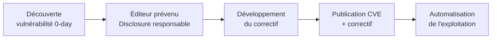

# Sécuriser les systèmes
## Document de révision TSSR - Titre RNCP

---

**Formation** : Technicien Supérieur Systèmes et Réseaux (TSSR)  
**Sujet** : Sécurisation des systèmes d'information  
**Date** : Février 2026  
**Type** : Synthèse de cours complète

---

## 📋 Sommaire

1. [[#Introduction|Introduction]]
   - [[#Le point de vue du sysadmin|Le point de vue du sysadmin]]
   - [[#Réduire la surface d'attaque|Réduire la surface d'attaque]]
   - [[#Le compromis sécurité vs confort|Le compromis sécurité vs confort]]
   - [[#Défense en profondeur|Défense en profondeur]]
2. [[#Sécurité physique|Sécurité physique]]
   - [[#Accès physique et verrouillage|Accès physique et verrouillage]]
   - [[#Minimisation physique|Minimisation physique]]
   - [[#Choix du matériel|Choix du matériel]]
3. [[#Les logiciels|Les logiciels]]
   - [[#Inventaire logiciel|Inventaire logiciel]]
   - [[#Logiciels de confiance|Logiciels de confiance]]
   - [[#Hardening et configuration|Hardening et configuration]]
   - [[#Découverte de vulnérabilités et CVE|Découverte de vulnérabilités et CVE]]
   - [[#Gestion des mises à jour|Gestion des mises à jour]]
   - [[#Gestion des versions et obsolescence|Gestion des versions et obsolescence]]
4. [[#Droits d'accès|Droits d'accès]]
   - [[#Authentification|Authentification]]
   - [[#Gestion des utilisateurs|Gestion des utilisateurs]]
5. [[#Composants et outils de sécurité|Composants et outils de sécurité]]
   - [[#Antivirus|Antivirus]]
   - [[#HIDS et HIPS|HIDS et HIPS]]
6. [[#Points clés à retenir|Points clés à retenir]]
7. [[#Glossaire technique|Glossaire technique]]
8. [[#Bibliographie et ressources|Bibliographie et ressources]]

---

## Introduction

> [!abstract] Vue d'ensemble
> La sécurisation des systèmes est une mission centrale pour tout administrateur système (sysadmin). Elle repose sur des principes fondamentaux : **minimisation**, **défense en profondeur** et **équilibre entre sécurité et usabilité**.

### Le point de vue du sysadmin

L'objectif principal d'un administrateur système est de :
- **Fournir** des serveurs et terminaux clients pour supporter les applicatifs métier
- **Maintenir** les systèmes en condition opérationnelle (MCO)

> [!important] Mission du sysadmin
> Les incidents de sécurité nuisent directement à la mission du sysadmin. Sécuriser ses systèmes est donc une composante essentielle du métier, pas une option.

### Réduire la surface d'attaque

> [!quote] Principe de minimisation
> Un serveur est un environnement complexe avec de nombreux composants. **Chacun de ces composants comporte potentiellement une vulnérabilité.**

**Objectif** : Réduire la surface d'attaque en limitant le nombre de composants au strict minimum, ce qui permet de :
- **Prévenir** : faciliter les mises à jour et le suivi
- **Détecter** : simplifier la surveillance

### Le compromis sécurité vs confort

> [!warning] Équilibre à respecter
> Les mesures de sécurité **ne doivent pas empêcher l'utilisation légitime** du SI. Chaque élément du SI est présent pour assurer une fonction, souvent en interaction avec des utilisateurs.

**Clé de succès** : Sensibilisation et formation des utilisateurs

### Défense en profondeur

> [!info] Ne pas compter uniquement sur le firewall
> Le filtrage réseau (firewall périmétrique) est **complémentaire**, mais insuffisant seul :
> - Les services ouverts peuvent être vulnérables
> - L'attaquant pourrait être **interne** ou passer par un rebond

> [!tip] Stratégie recommandée
> Mettre autant de barrières que possible pour **retarder et dissuader** un attaquant. Chaque couche de sécurité gagne du temps et complique l'attaque.

```
Modèle de défense en profondeur :
┌─────────────────────────────────────────┐
│  Sécurité physique (bâtiment, armoires) │
│  ┌───────────────────────────────────┐  │
│  │  Sécurité réseau (firewall, VLAN) │  │
│  │  ┌─────────────────────────────┐  │  │
│  │  │  Sécurité système (OS, MàJ) │  │  │
│  │  │  ┌───────────────────────┐  │  │  │
│  │  │  │  Droits d'accès, MFA  │  │  │  │
│  │  │  └───────────────────────┘  │  │  │
│  │  └─────────────────────────────┘  │  │
│  └───────────────────────────────────┘  │
└─────────────────────────────────────────┘
```

---

## Sécurité physique

> [!abstract] Vue d'ensemble
> La sécurité physique est la première ligne de défense. Sans elle, toutes les mesures logiques peuvent être contournées en accédant directement au matériel.

### Accès physique et verrouillage

> [!important] Principe fondamental
> Un système parfaitement sécurisé logiquement est inutile si quelqu'un peut accéder physiquement à la machine.

**Mesures de protection physique :**
- Restreindre au maximum l'accès physique aux machines
- Mot de passe de démarrage (**BIOS** et/ou **boot loader**)
- Démarrage via périphériques amovibles **désactivé**
- **Chiffrement des disques** (protection en cas de vol)

> [!example] Cas extrême : Autorité de Certification (CA)
> Une machine CA peut être enfermée dans une armoire à clé, isolée du réseau, et n'être allumée que pour des opérations spécifiques. C'est un exemple de sécurité physique maximale.

### Minimisation physique

> [!note] Principe de minimisation appliqué au matériel
> Ne disposer que du nécessaire physiquement :

| Catégorie | Exemples | Recommandation |
|-----------|----------|----------------|
| **Périphériques d'entrée** | Ports USB, lecteurs optiques | Désactiver ou retirer si inutile |
| **Interfaces réseau** | Ethernet, Wi-Fi, Bluetooth | Désactiver le Wi-Fi/BT si inutile |
| **Administration à distance** | IPMI, iDRAC, iLO | Isoler sur un réseau dédié |

> [!tip] Bonne pratique
> Prévoir la possibilité de **désactivation matérielle** de ces composants, avec activation au besoin uniquement.

### Choix du matériel

> [!info] Critères de sélection du matériel de confiance

- **Fournisseur de confiance** : vérifier la réputation et les pratiques de sécurité
- **Conformité précise** aux spécifications (ni plus, ni moins)
- **Engagement de maintenance** dans le temps (support matériel)

**Fonctionnalités matérielles de sécurité importantes :**

| Technologie | Description | Utilité |
|-------------|-------------|---------|
| **VT-x / AMD-V** | Virtualisation matérielle Intel/AMD | Isolation des VMs, sécurité renforcée |
| **TPM** (Trusted Platform Module) | Puce de stockage sécurisé | Stockage de clés cryptographiques, BitLocker |
| **Open Hardware** | Matériel à conception ouverte | Auditabilité du matériel |

---

## Les logiciels

> [!abstract] Vue d'ensemble
> La gestion des logiciels couvre l'inventaire, le choix de sources fiables, la configuration sécurisée (hardening), la gestion des vulnérabilités et des mises à jour.

### Inventaire logiciel

> [!info] Catégories de logiciels à inventorier

- **Systèmes d'exploitation** : nombreux composants, installés par défaut ou optionnels
- **Applications supplémentaires**
- **Dépendances** (bibliothèques, frameworks)
- **Firmware** : logiciels intégrés aux matériels (BIOS, carte réseau, etc.)

> [!important] Recommandation clé
> **Désinstaller les composants et services inutiles** → réduction de la surface d'attaque
> **Utiliser un outil de gestion de parc** pour le suivi de l'inventaire

### Logiciels de confiance

> [!quote] Principe de confiance logicielle
> La sécurité d'un logiciel dépend de sa source, de son auditabilité et de l'intégrité de son installation.

**Critères de sélection :**

| Critère | Détail |
|---------|--------|
| **Éditeur de confiance** | Assure les correctifs sur le long terme |
| **Open Source / Audité** | Code auditable, certains ont des labels (ex: ANSSI) |
| **Intégrité du téléchargement** | Vérification via empreintes (hash) et signatures numériques |
| **Source officielle** | Téléchargement uniquement via les sites officiels |

> [!tip] Bonne pratique
> Utiliser un **gestionnaire de paquets avec dépôts officiels** (apt, yum, etc.) pour garantir la traçabilité et l'intégrité des logiciels installés.

### Hardening et configuration

> [!quote] Définition - Hardening
> Le **hardening** (durcissement) consiste à appliquer une configuration sécurisée à un système pour réduire sa surface d'attaque au-delà des paramètres par défaut.

> [!warning] Piège courant
> La **configuration par défaut** n'est pas forcément sécurisée ! Exemple classique : mot de passe par défaut laissé inchangé.

**Actions de hardening :**
- Appliquer les recommandations de l'éditeur ou de référentiels tiers (ANSSI, CIS Benchmarks)
- Configurer les services en écoute **spécifiquement sur l'interface d'accès** (pas sur 0.0.0.0 si inutile)
- Désactiver les services non utilisés

> [!example] Exemple concret
> Un serveur SSH devrait écouter uniquement sur l'interface d'administration, avec l'authentification par mot de passe désactivée (clés uniquement), et le compte root bloqué.

### Découverte de vulnérabilités et CVE

> [!info] Cycle de vie d'une vulnérabilité



**Acteurs de la découverte :**
- Chercheurs en cybersécurité
- SOC (Security Operations Center)
- Auditeurs / Pentesters

> [!important] CVE - Common Vulnerabilities and Exposures
> Les vulnérabilités publiées sont référencées sous format **CVE-ANNÉE-NUMÉRO** et gérées par le **MITRE**. Elles sont consultables sur la base CVE officielle.

> [!warning] L'automatisation de l'exploitation
> Une fois une vulnérabilité publiée, elle entre dans les **boîtes à outils d'audit et de pentest**. L'exploitation devient automatisée et accessible aux **Script Kiddies** (attaquants peu qualifiés). **Le délai de mise à jour devient critique.**

### Gestion des mises à jour

> [!important] Règle d'or
> **Mettre à jour tous les logiciels au plus vite est essentiel** pour condamner les vulnérabilités connues.

> [!warning] Risque des mises à jour en production
> Une mise à jour modifie le logiciel → **risque de régression en production**. Ne jamais appliquer directement en production sans validation.

**Méthodologie recommandée :**

```
Environnement de TEST → Validation → Environnement de PRÉPRODUCTION → Validation → PRODUCTION
```

1. **Tester** la mise à jour dans un environnement dédié
2. **Valider** le bon fonctionnement des applicatifs métier
3. **Planifier** l'application en production (fenêtre de maintenance)
4. **Documenter** les changements effectués

### Gestion des versions et obsolescence

> [!info] Gestion sémantique de version (Semver)
> Format standard : `<Majeur>.<Mineur>.<Correctif>`

| Type de version | Signification | Exemple |
|-----------------|--------------|---------|
| **Majeur** | Changements non rétro-compatibles | `2.0.0` |
| **Mineur** | Ajout de fonctionnalités rétro-compatibles | `1.3.0` |
| **Patch / Correctif** | Correctifs rétro-compatibles | `1.3.2` |

> [!note] LTS - Long Term Support
> Certaines versions sont maintenues sur une **longue période** (LTS). Préférer les versions LTS pour les environnements de production pour bénéficier d'un support prolongé.

> [!warning] Obsolescence (Legacy)
> Les versions **non maintenues** (fin de vie / EOL) ne reçoivent plus de correctifs de sécurité → **danger majeur**.

**Gestion des systèmes legacy :**
- Planifier la **migration** comme un projet à part entière (avec tests et validation)
- Si migration impossible → **cloisonnement renforcé** (isolation réseau, surveillance accrue)

---

## Droits d'accès

> [!abstract] Vue d'ensemble
> La gestion des droits d'accès repose sur deux piliers : une **authentification robuste** et une **gestion rigoureuse des comptes** selon le principe de moindre privilège.

### Authentification

> [!quote] Définition
> L'authentification est le processus de vérification de l'identité d'un utilisateur avant de lui accorder l'accès à un système.

**Recommandations pour une authentification solide :**

| Mesure | Description | Importance |
|--------|-------------|-----------|
| **Mots de passe robustes** | Longueur, complexité, unicité | Obligatoire |
| **MFA / 2FA** | Authentification multi-facteurs | Très recommandé |
| **Authentification forte** | Méthode cryptographique (clés SSH, certificats) | Recommandé |

> [!tip] Mnémotechnique - Les 3 facteurs d'authentification
> - **Ce que je sais** : mot de passe, PIN, réponse secrète
> - **Ce que je possède** : token, téléphone (OTP), carte à puce
> - **Ce que je suis** : empreinte, iris (biométrie)
>
> Le **MFA** combine au moins 2 de ces facteurs.

### Gestion des utilisateurs

> [!important] Principe de moindre privilège
> Chaque utilisateur ne doit disposer que des droits **strictement nécessaires** à l'accomplissement de ses missions. Ni plus, ni moins.

**Bonnes pratiques de gestion des comptes :**

- **Désactiver/supprimer** les comptes inutiles ou obsolètes
- **Interdire les comptes partagés** (Invité, Stagiaire, Admin générique)
- **Administrateurs = plusieurs comptes** : un compte standard pour le quotidien, un compte admin pour les tâches d'administration
- Utiliser **`sudo`** pour l'élévation **temporaire** de privilèges
- Adopter une **procédure d'arrivée et de départ** (onboarding/offboarding)

> [!example] Procédure d'arrivée / départ
> **Arrivée** : Créer un compte nominatif, attribuer les droits selon le profil, former l'utilisateur
> **Départ** : Désactiver immédiatement le compte le jour du départ, supprimer après archivage, révoquer les accès VPN/SSH

> [!warning] Pièges courants
> - Oublier de désactiver un compte après le départ d'un collaborateur
> - Utiliser un compte root/admin pour les tâches quotidiennes
> - Partager des mots de passe entre plusieurs personnes

---

## Composants et outils de sécurité

> [!abstract] Vue d'ensemble
> La sécurisation manuelle et exhaustive d'un système est impossible. Les outils de sécurité permettent **d'automatiser la détection et la prévention** des incidents.

### Antivirus

> [!info] Fonctionnement d'un antivirus
> L'antivirus recherche des logiciels malveillants (malwares) via plusieurs méthodes :

| Méthode de détection | Description |
|---------------------|-------------|
| **Base de signatures** | Comparaison avec des signatures connues de malwares |
| **Comportements suspects** | Détection d'actions anormales (comportemental) |
| **Analyse heuristique** | Identification de patterns suspects sans signature connue |

> [!important] Recommandation
> Déployer un antivirus sur **tous les systèmes** : serveurs ET clients.

> [!note] Outil libre recommandé
> **ClamAV** : antivirus open source, adapté aux serveurs Linux.

### HIDS et HIPS

> [!quote] Définition
> **HIDS** (Host-based Intrusion Detection System) : système de détection d'intrusion basé sur l'hôte.
> **HIPS** (Host-based Intrusion Prevention System) : ajoute la **prévention** (action automatique) à la détection.

**Sources de détection d'un HIDS :**
- Activité de la machine (CPU, mémoire, réseau)
- Modifications sur le **système de fichiers** (intégrité)
- **Journaux d'événements** (logs)

| Outil | Type | Description |
|-------|------|-------------|
| **Samhain** | HIDS | Surveillance de l'intégrité des fichiers |
| **OSSEC** | HIDS/HIPS | Analyse de logs, détection d'intrusion |
| **fail2ban** | HIPS | Blocage automatique des IPs suspectes |
| **CrowdSec** | HIPS collaboratif | Détection comportementale + base communautaire |

> [!tip] Différence détection / prévention
> - **Détection** (IDS) = **alerte** l'administrateur
> - **Prévention** (IPS) = **action automatique** (blocage IP, isolation)

> [!note] Pour aller plus loin
> - EDR (Endpoint Detection and Response) : solution avancée combinant détection, investigation et réponse automatisée aux incidents
> - Firewall personnel : complément de défense au niveau du poste

---

## Points clés à retenir

> [!success] Synthèse pour le titre RNCP

### Principes fondamentaux

- Le **principe de minimisation** s'applique à tout : logiciels, services, ports, utilisateurs, matériel
- La **défense en profondeur** empile les couches de sécurité (physique → réseau → système → applicatif → utilisateur)
- Le **principe de moindre privilège** limite les dégâts en cas de compromission d'un compte
- La sécurité doit rester compatible avec l'**utilisation légitime** du SI

### Sécurité physique

- Restreindre l'**accès physique** aux machines (salles, armoires, verrouillage BIOS)
- Désactiver les **interfaces inutiles** (USB, Wi-Fi, Bluetooth)
- Choisir du **matériel de confiance** avec TPM pour les fonctions cryptographiques
- Le **chiffrement des disques** protège contre le vol physique

### Gestion des logiciels

- **Désinstaller** tous les services et logiciels non nécessaires
- Télécharger **uniquement depuis des sources officielles** et vérifier les signatures
- **Hardening** = appliquer une configuration sécurisée (ne pas laisser les paramètres par défaut)
- **Mettre à jour rapidement** après publication d'une CVE, en suivant une méthodologie test → prod
- Les systèmes **legacy (EOL)** doivent être migrés ou cloisonnés

### Droits d'accès

- Imposer le **MFA** sur tous les accès sensibles
- Un administrateur a **plusieurs comptes** (un standard, un admin) + `sudo` pour l'élévation
- **Procédure d'arrivée/départ** rigoureuse pour la gestion du cycle de vie des comptes
- **Jamais de comptes partagés**

### Outils de sécurité

- **Antivirus** sur tous les systèmes (ex: ClamAV sur Linux)
- **HIDS/HIPS** pour surveiller l'intégrité du système et bloquer les attaques (fail2ban, OSSEC, CrowdSec)
- **EDR** pour les environnements nécessitant une réponse avancée aux incidents

---

## Glossaire technique

> [!note] Définitions essentielles pour le TSSR

| Terme | Définition |
|-------|-----------|
| **Surface d'attaque** | Ensemble des points d'entrée potentiels qu'un attaquant peut exploiter |
| **Hardening** | Durcissement d'un système par sa configuration sécurisée |
| **CVE** | Common Vulnerabilities and Exposures – référentiel mondial des vulnérabilités (géré par MITRE) |
| **0-day** | Vulnérabilité inconnue de l'éditeur, sans correctif disponible |
| **Script Kiddie** | Attaquant peu qualifié utilisant des outils automatisés existants |
| **LTS** | Long Term Support – version d'un logiciel maintenue sur une longue durée |
| **Legacy / Hérité** | Système ou logiciel en fin de vie, non maintenu |
| **EOL** | End Of Life – fin du support officiel d'un logiciel/OS |
| **MFA / 2FA** | Multi-Factor Authentication – authentification à plusieurs facteurs |
| **Moindre privilège** | Principe accordant uniquement les droits nécessaires à une mission |
| **sudo** | Mécanisme Unix/Linux d'élévation temporaire de privilèges |
| **TPM** | Trusted Platform Module – puce matérielle de stockage sécurisé de clés |
| **VT-x / AMD-V** | Instructions matérielles de virtualisation (Intel / AMD) |
| **HIDS** | Host-based Intrusion Detection System – détection d'intrusion sur l'hôte |
| **HIPS** | Host-based Intrusion Prevention System – prévention d'intrusion sur l'hôte |
| **EDR** | Endpoint Detection and Response – détection et réponse avancée sur les postes |
| **Semver** | Semantic Versioning – convention de numérotation des versions (Majeur.Mineur.Patch) |
| **SOC** | Security Operations Center – centre de supervision de la sécurité |
| **ClamAV** | Antivirus open source multiplateforme |
| **fail2ban** | Outil de prévention qui bloque automatiquement les IPs avec trop de tentatives échouées |
| **CrowdSec** | HIPS collaboratif open source basé sur la détection comportementale |
| **OSSEC** | Framework HIDS/HIPS open source pour l'analyse de logs et la détection d'intrusion |

---

## Bibliographie et ressources

> [!info] Sources officielles à connaître pour le TSSR

**Guides ANSSI (Agence Nationale de la Sécurité des Systèmes d'Information) :**
- Guide de cybersécurité des systèmes d'information
- Recommandations de configuration d'un système GNU/Linux
- Mettre en œuvre une politique de restriction logicielle sous Windows
- Restreindre la collecte des données sous Windows 10

**Sources d'information sur les vulnérabilités :**

| Ressource | Description | URL |
|-----------|-------------|-----|
| **CVE** | Base de données des vulnérabilités connues | cve.mitre.org |
| **CERT-FR** | Centre gouvernemental de veille cybersécurité FR | cert.ssi.gouv.fr |
| **MITRE ATT&CK** | Base de connaissance des tactiques d'attaque | attack.mitre.org |

> [!tip] Conseil pour le RNCP
> Les référentiels ANSSI font autorité en France. Connaître leurs grandes recommandations (principe de minimisation, cloisonnement, gestion des mises à jour) est essentiel pour l'épreuve.

---

*Document généré pour révision TSSR - Titre RNCP | Sécuriser les systèmes*
