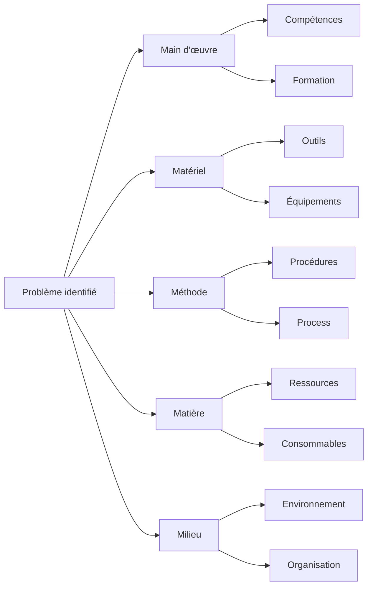
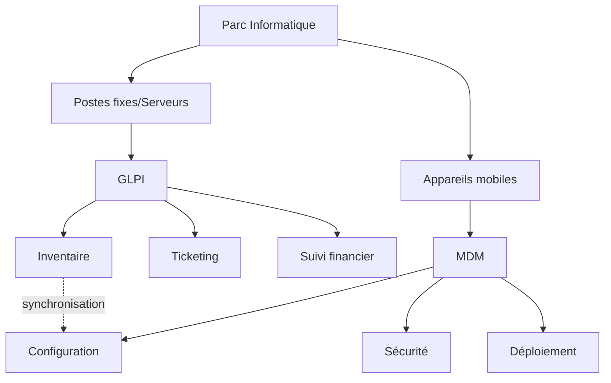

# Suivi de parc informatique

## Document de révision TSSR - Titre RNCP

---

**Formation** : Technicien Supérieur Systèmes et Réseaux (TSSR)  
**Sujet** : Gestion et suivi de parc informatique  
**Date** : Janvier 2026  
**Type** : Synthèse de cours complète

---

## 📋 Sommaire

1. [[#Introduction|Introduction]]
   - [[#Qu'est-ce qu'un parc informatique ?|Qu'est-ce qu'un parc informatique ?]]
   - [[#Définition de la gestion de parc|Définition de la gestion de parc]]
2. [[#Les trois piliers de la gestion de parc|Les trois piliers de la gestion de parc]]
   - [[#Entretenir le parc|Entretenir le parc]]
   - [[#Développer le parc|Développer le parc]]
   - [[#Optimiser le parc|Optimiser le parc]]
3. [[#Méthodes de gestion|Méthodes de gestion]]
   - [[#Uniformisation matérielle et logicielle|Uniformisation matérielle et logicielle]]
   - [[#Utilisation de logiciels de gestion|Utilisation de logiciels de gestion]]
   - [[#Procédures et process qualité|Procédures et process qualité]]
   - [[#Cycle de vie du matériel|Cycle de vie du matériel]]
4. [[#La gestion des appareils mobiles (MDM)|La gestion des appareils mobiles (MDM)]]
   - [[#Définition du MDM|Définition du MDM]]
   - [[#Fonctionnalités du MDM|Fonctionnalités du MDM]]
5. [[#GLPI - Un outil de gestion de parc|GLPI - Un outil de gestion de parc]]
   - [[#Présentation de GLPI|Présentation de GLPI]]
   - [[#Fonctionnalités de GLPI|Fonctionnalités de GLPI]]
6. [[#Points clés à retenir|Points clés à retenir]]
7. [[#Glossaire technique|Glossaire technique]]

---

## Introduction

> [!abstract] Vue d'ensemble
> La gestion de parc informatique est une compétence essentielle pour un **TSSR**. Elle englobe l'ensemble des pratiques visant à **inventorier, maintenir, développer et optimiser** les ressources informatiques d'une organisation. Ce document couvre les concepts clés, les méthodes de gestion, et les outils principaux utilisés dans le domaine.

### Pourquoi étudier la gestion de parc informatique ?

En tant que **TSSR**, tu seras amené à :
- Gérer l'inventaire matériel et logiciel d'une infrastructure
- Assurer la maintenance préventive et corrective des équipements
- Planifier le renouvellement du matériel selon des cycles de vie prédéfinis
- Utiliser des outils comme **GLPI** pour centraliser la gestion
- Gérer les appareils mobiles via des solutions **MDM**

---

## Qu'est-ce qu'un parc informatique ?

> [!quote] Définition
> Un parc informatique désigne l'**ensemble des ressources matérielles et logicielles** qui composent un système informatique.

### Composantes d'un parc informatique

Le parc informatique regroupe plusieurs catégories d'équipements :

#### 1. Les ordinateurs

- Unités centrales
- Ordinateurs portables
- Écrans
- Claviers, souris
- Périphériques d'entrée/sortie

#### 2. Les équipements réseaux

- Switchs (commutateurs)
- Bornes WiFi
- Firewalls (pare-feu)
- Câblages réseaux
- Routeurs

#### 3. Les logiciels et licences

- Systèmes d'exploitation (OS)
- Applications métiers
- Licences logicielles
- Pilotes et drivers

#### 4. Les appareils mobiles

- Smartphones
- Tablettes
- Lecteurs de code-barres
- Terminaux industriels durcis
- Ordinateurs hybrides

#### 5. Les périphériques

- Imprimantes
- Copieurs/scanners
- Tablettes graphiques
- Caméras et micros de visioconférence
- Disques durs externes

> [!important] Étendue du parc
> Le parc informatique ne se limite pas aux ordinateurs : il inclut **tous les équipements** connectés au système d'information de l'entreprise, y compris les appareils mobiles et les objets connectés (IoT).

---

## Définition de la gestion de parc

> [!quote] Définition officielle
> La gestion de parc informatique regroupe l'**ensemble des tâches et pratiques** visant à **entretenir, développer et optimiser** l'ensemble des ressources matérielles et logicielles.

### Acteurs de la gestion de parc

La gestion de parc concerne plusieurs acteurs :

- **Personnel du SI** : équipes Help-Desk, administrateurs systèmes et réseaux
- **Prestataires externes** : sociétés de maintenance, fournisseurs de services IT
- **Utilisateurs hors SI** : référents informatiques dans les services métiers

> [!tip] Conseil pratique
> La gestion de parc est une **responsabilité partagée** : même si le SI pilote, les utilisateurs et référents jouent un rôle clé dans le recensement et la remontée d'incidents.

---

## Les trois piliers de la gestion de parc

La gestion de parc informatique repose sur **trois axes principaux** :

### Entretenir le parc

> [!info] Objectif
> Maintenir l'ensemble des équipements en **état de fonctionnement optimal**.

#### Recensement et localisation des éléments

Plusieurs méthodes existent pour inventorier le parc :

**Découverte logicielle automatique** :
- `Fusion Inventory` : agent d'inventaire automatique
- `NextThink` : solution de monitoring et inventaire
- `Microsoft SCCM` : System Center Configuration Manager

**Méthode humaine** :
- Recensement manuel sur site
- Collecte des données d'achat (bons de commande, réceptions)

> [!note] CMDB
> Les inventaires sont sauvegardés dans une **CMDB** (Configuration Management Database), base de données centralisée de gestion de configuration. Exemples : GLPI, Ivanti Landesk.

#### Mise en place de procédures d'administration

- Procédures internes au SI
- Documentation des processus de maintenance
- Services dédiés : **Help-Desk** et **Infrastructures Réseaux**
- Maintenance assurée par des ressources internes ou externes (prestataires)

#### Maintenance préventive

> [!example] Exemples de maintenance préventive
> - Maintenance **mensuelle** : vérification des sauvegardes, mises à jour de sécurité
> - Maintenance **annuelle** : contrôle matériel, remplacement préventif de composants
> - Maintenance **matérielle** : nettoyage physique, vérification des ventilateurs
> - Maintenance **fonctionnelle** : optimisation logicielle, défragmentation

#### Gestion du dépannage

Classification des incidents par **niveau de criticité** :

| Niveau | Type | Délai de résolution |
|--------|------|---------------------|
| **Standard** | Incident mineur, pas d'impact métier | Sous 48-72h |
| **Bloquant** | Perte de productivité partielle | Sous 24h |
| **Urgent** | Arrêt complet de l'activité | Sous 4h |

Le service **Help-Desk** centralise les demandes et coordonne les interventions.

---

### Développer le parc

> [!info] Objectif
> Effectuer et maîtriser correctement l'**évolution et l'expansion** du parc informatique.

#### Renouvellement matériel selon le cycle de vie

> [!important] Stratégie de renouvellement
> Turn-over de matériel à l'achat tous les **4-6 ans** pour **⅓ ou ¼ du parc** chaque année.

**Options de financement** :
- **Achat direct** : propriété immédiate, amortissement sur 4-6 ans
- **Leasing** : location sous 3 ans (durée standard), renouvellement facilité

#### Établissement d'une charte informatique

La charte informatique définit :
- Les droits et devoirs des utilisateurs
- Les règles d'utilisation du matériel
- Les interdictions (usage personnel, installation logiciels non autorisés)
- Les sanctions en cas de non-respect

#### Prévision budgétaire

> [!note] Calendrier budgétaire
> - Mise en place des budgets : **septembre à novembre** de chaque année
> - Prévision sur **N+3 ans** (planification triennale)

**Composantes du budget** :
- Renouvellement matériel planifié
- Expansion (nouveaux postes, nouvelles infrastructures)
- Maintenance et support
- Licences logicielles

#### Gestion de l'expansion

Deux types d'expansion :

**Évolution interne** :
- Croissance de l'entreprise
- Nouveaux services
- Augmentation des effectifs

**Acquisition** :
- Fusion ou rachat d'entreprises
- Mise en conformité des parcs acquis
- Uniformisation des équipements

> [!warning] Piège à éviter
> Lors d'une acquisition, ne pas sous-estimer le coût et la complexité de l'**uniformisation** du parc informatique repris.

---

### Optimiser le parc

> [!info] Objectif
> Rendre plus **efficient** chaque élément du parc informatique.

#### Protection et sécurité

- Déploiement d'**outils de sécurité** : antivirus, EDR, pare-feu logiciels
- **Veille technologique** : suivi des vulnérabilités, patches de sécurité
- Mise en place de **politiques de sécurité** : GPO, restrictions d'accès

#### Formation des utilisateurs

> [!tip] Bonnes pratiques
> La formation des utilisateurs réduit considérablement les incidents et améliore la sécurité globale du SI.

**Thèmes de formation** :
- Usages et bonnes pratiques informatiques
- Sensibilisation à la sécurité du SI
- Règles **RGPD** (protection des données personnelles)
- Application de la charte informatique

#### Gestion des prestataires

Questions clés :
- Jusqu'où la connaissance technique doit-elle être fournie à un tiers ?
- Comment garantir la confidentialité des données ?
- Quels accès autoriser ?

#### Conformité matérielle et logicielle

- Audits réguliers de conformité
- Vérification des licences logicielles
- Application de méthodes qualité (ex : **méthode 5M**)

---

## Méthodes de gestion

> [!abstract] Vue d'ensemble
> Pour gérer efficacement un parc informatique, plusieurs méthodes et outils sont indispensables.

### Comment gérer un parc informatique ?

Six axes principaux :

1. **Utilisation de logiciels** de gestion de parc (CMDB)
2. Mise en place de **procédures** documentées
3. Application de **process qualité**
4. **Uniformisation** matérielle et logicielle
5. Création de **profils de postes** types
6. Gestion des **cycles de vie** matériel

---

### Uniformisation matérielle et logicielle

> [!quote] Principe
> L'uniformisation matérielle et logicielle permet de mieux gérer la répartition matérielle et ainsi d'**optimiser les process et les coûts** de maintenance et de réparation, ainsi que les budgets associés.

#### Avantages de l'uniformisation

**Avantages techniques** :
- Simplification de la maintenance
- Standardisation des procédures d'installation
- Facilitation du support Help-Desk
- Réduction des stocks de pièces détachées

**Avantages financiers** :
- Négociation de tarifs préférentiels (achat en volume)
- Optimisation des contrats de maintenance
- Réduction des coûts de formation

**Avantages organisationnels** :
- Documentation simplifiée
- Interchangeabilité des équipements
- Gestion facilitée des remplacements

> [!example] Exemple concret
> Une entreprise standardise sur deux modèles de PC (fixe et portable) du même constructeur :
> - Stock de pièces détachées limité
> - Formation technique unique pour les techniciens
> - Images système identiques
> - Procédures de déploiement uniformes

---

### Utilisation de logiciels de gestion

#### La base de données matériel (CMDB)

> [!important] Concept clé - CMDB
> **CMDB** (Configuration Management Database) : base de données centralisée qui contient toutes les informations sur les ressources informatiques.

**Fonctionnalités essentielles** :
- **Modification** des données en temps réel
- **Mise à jour** automatique ou manuelle
- **Sauvegarde** régulière
- **Suppression** des équipements hors service
- **Consultation** et export pour analyse
- **Nettoyage** régulier pour maintenir la cohérence

**Fréquences de mise à jour** :
- Temps réel (inventaire actif)
- Cycles horaires : 1h, 6h, 12h, 24h

---

### Les informations conservées dans la CMDB

#### Pour les ordinateurs

| Catégorie | Détails |
|-----------|---------|
| **Identification** | Nom d'hôte, code-barre, numéro de série (S/N) |
| **Référence matérielle** | Marque, constructeur, référence, modèle |
| **Référence réseau** | Adresse IP, adresse MAC |
| **Composants** | CPU, carte-mère, RAM, disque dur, carte graphique |
| **Logiciels** | OS, pilotes, applications installées |
| **Domaine** | Domaine Active Directory, OU (Unité Organisationnelle) |
| **Statut** | En production, en stock, en réparation, hors service |
| **Informations budgétaires** | Prix, date d'achat, date de livraison, date d'installation |
| **Utilisateurs** | Nom de l'utilisateur principal, utilisateurs secondaires |

#### Pour les périphériques

- Nom du périphérique
- Marque et modèle
- Type (imprimante, scanner, écran, etc.)
- Numéro de série
- Date d'achat
- Lieu d'installation

#### Pour les logiciels

- Nom du logiciel
- Version
- **Licence** (numéro, type, date d'expiration)
- Utilisateurs cibles
- Nombre d'installations autorisées
- Coût de la licence

> [!warning] Attention aux licences
> Le suivi des licences logicielles est crucial pour éviter les situations de **non-conformité** qui peuvent entraîner des audits coûteux et des sanctions.

---

### Les logiciels de gestion de parc connus

#### Logiciels sous licence

> [!note] Solutions propriétaires
> Ces solutions offrent généralement un support professionnel et des fonctionnalités avancées.

**Microsoft SCCM** (System Center Configuration Manager)
- Intégration native avec l'écosystème Microsoft
- Gestion centralisée du déploiement logiciel
- Gestion des mises à jour Windows
- Inventaire matériel et logiciel
- Gestion de la conformité

**Ivanti Landesk**
- Solution complète de gestion d'actifs IT
- Gestion unifiée des endpoints
- Automatisation des processus IT
- Support multiplateforme

#### Logiciels libres et Open Source

> [!success] GLPI - Solution Open Source
> **GLPI** (Logiciel Libre de gestion de Parc Informatique) est la solution open source la plus répandue pour la gestion de parc.

Avantages de GLPI :
- Gratuité (licence GPL)
- Communauté active
- Extensions disponibles (plugins)
- Personnalisable
- Intégration avec Fusion Inventory pour l'inventaire automatique

> [!tip] Choix de la solution
> Pour débuter ou pour les PME, **GLPI** est un excellent choix. Pour les grandes entreprises avec infrastructure Microsoft, **SCCM** s'impose naturellement.

---

### Procédures et process qualité

#### Les procédures documentées

> [!quote] Définition
> Les procédures sont des documents qui décrivent de manière détaillée les étapes à suivre pour accomplir une tâche spécifique.

**Cycle de vie d'une procédure** :

| Élément | Description |
|---------|-------------|
| **Date de création** | Date de rédaction initiale |
| **N° de révision** | Numéro de version (ex: v1.0, v1.1, v2.0) |
| **Cible** | Qui doit appliquer cette procédure ? |
| **Objet** | Quel est le but de la procédure ? |
| **Cycle de validation** | Qui valide la procédure ? Délai ? |
| **Cycle de révision** | Fréquence de mise à jour (annuelle, semestrielle) |

> [!important] Accessibilité des procédures
> Les procédures doivent être **accessibles aux utilisateurs authentifiés** pour leur permettre de gérer les différentes tâches et actions de manière autonome.

#### Process qualité

> [!quote] Définition
> Un process qualité est un moyen mis en œuvre pour convertir des **éléments d'entrée** en **éléments de sortie** de manière contrôlée et traçable.

**Éléments d'entrée** :
- Demandes de service
- Alertes système
- Données d'inventaire
- Rapports d'incidents
- Politiques et normes de conformité

**Éléments de sortie** :
- Réponses aux demandes de service
- Améliorations système
- Rapports mis à jour
- Résolutions d'incidents
- Conformité aux politiques validée

---

### La méthode 5M (Ishikawa)

> [!quote] Définition
> La **méthode 5M**, également appelée **diagramme d'Ishikawa** ou **diagramme en arête de poisson**, est une méthode japonaise issue de l'industrie automobile. Elle aide à analyser les **liens de cause à effet** d'un problème donné.

#### Les 5M expliqués

| M | Catégorie | Description | Exemples |
|---|-----------|-------------|----------|
| **1** | **Main d'œuvre** | Le personnel, compétences, connaissances | Personnel interne/externe, savoir-faire techniques, formation |
| **2** | **Matériel** | Les outils et équipements de travail | Outils de travail, installations, serveurs, postes de travail |
| **3** | **Méthode** | Les procédures et référentiels | Procédures, instructions, notices, référentiels qualité |
| **4** | **Matière** | Les ressources consommées | Matières premières, énergie, composants, consommables |
| **5** | **Milieu** | L'environnement de travail | Locaux, ambiance, organisation, hiérarchie |

> [!example] Application au SI
> **Problème** : Taux de satisfaction du service client en baisse
> 
> Analyse 5M :
> - **Main d'œuvre** : Manque de formation sur le nouveau logiciel de ticketing ?
> - **Matériel** : Postes Help-Desk sous-dimensionnés (lenteurs) ?
> - **Méthode** : Procédures de traitement des tickets inadaptées ?
> - **Matière** : Documentation technique insuffisante ?
> - **Milieu** : Open-space trop bruyant pour le support téléphonique ?

> [!tip] Utilisation pratique
> Le diagramme 5M est particulièrement utile lors des **analyses post-incident majeur** ou pour l'**amélioration continue** des processus IT.

---

### Cycle de vie du matériel

> [!important] Concept clé
> Le **cycle de vie** des matériels est une période au bout de laquelle le matériel doit être changé et remplacé. Au-delà des durées données, on risque une **perte de performance** et l'**augmentation du nombre de pannes**.

#### Durées de vie recommandées

| Type d'équipement | Durée de vie | Justification |
|-------------------|--------------|---------------|
| **PC fixe** | 5 ans | Évolution technologique modérée, utilisation stationnaire |
| **PC portable** | 3 ans | Usure mécanique accélérée, obsolescence rapide |
| **Serveur** | 5 ans | Fiabilité critique, garantie constructeur limitée |
| **Périphériques (écrans)** | 3-5 ans | Évolution des standards (résolution, connectique) |

> [!warning] Risques du dépassement du cycle de vie
> - **Fin de garantie constructeur** : coûts de réparation élevés
> - **Augmentation des pannes** : interruptions de service
> - **Obsolescence technologique** : incompatibilité avec nouveaux logiciels
> - **Baisse de performance** : perte de productivité
> - **Risques de sécurité** : impossibilité d'installer les dernières mises à jour

> [!tip] Planification du renouvellement
> **Méthode recommandée** : renouveler **25% du parc chaque année** pour lisser les coûts et maintenir un parc homogène et performant.

**Exemple de planification sur 4 ans** :
- Année 1 : 25% du parc (postes de 2020)
- Année 2 : 25% du parc (postes de 2021)
- Année 3 : 25% du parc (postes de 2022)
- Année 4 : 25% du parc (postes de 2023)

---

## La gestion des appareils mobiles (MDM)

> [!abstract] Introduction
> Avec la mobilité croissante et le **BYOD** (Bring Your Own Device), la gestion des appareils mobiles est devenue **cruciale** pour les entreprises.

### Quels appareils sont concernés ?

En entreprise, il est crucial d'intégrer les appareils mobiles numériques dans le parc informatique.

#### Catégories d'appareils mobiles

**Appareils personnels** :
- Smartphones (iOS, Android)
- Tablettes (iPad, Android, Windows)

**Appareils professionnels** :
- Ordinateurs portables
- Ordinateurs hybrides (2-en-1, tablettes détachables)

**Appareils industriels** :
- Matériel durci mobile (resistant aux chocs, à l'eau)
- Terminaux de point de vente (TPV)
- Scanners de code-barres
- PDA industriels

**Objets connectés (IoT)** :
- Capteurs
- Dispositifs de géolocalisation
- Équipements de monitoring

> [!important] Périmètre élargi
> La gestion des appareils mobiles ne se limite plus aux smartphones : elle englobe **tous les équipements nomades** connectés au SI de l'entreprise.

---

### Définition du MDM

> [!quote] Définition
> Le **MDM** (Mobile Device Management) est une solution technologique permettant de **gérer, sécuriser et surveiller** les appareils mobiles utilisés dans un environnement professionnel.

### Rôle du MDM

> [!info] Positionnement stratégique
> Le MDM doit s'intégrer dans la **stratégie globale de gestion de parc**. C'est un **outil de gestion active** qui complète les outils de gestion passive comme GLPI.

**Différence MDM vs GLPI** :

| Caractéristique | MDM | GLPI |
|-----------------|-----|------|
| **Nature** | Dynamique | Statique |
| **Intervention** | Directe et en temps réel | Suivi et documentation |
| **Orientation** | Gestion active des devices | Gestion de parc et support |
| **Actions** | Configuration à distance, verrouillage, effacement | Inventaire, ticketing, documentation |

---

### Fonctionnalités du MDM

#### Gestion en temps réel

> [!success] Nature dynamique
> Le MDM permet une **intervention directe et immédiate** sur les appareils mobiles, contrairement à GLPI qui est orienté vers le suivi et la documentation.

**Fonctionnalités principales** :

**1. Gestion centralisée des appareils**
- Enrôlement automatique des nouveaux devices
- Vue d'ensemble de tous les appareils
- Groupes d'appareils (par service, par type, par utilisateur)

**2. Gestion système**
- Déploiement de **mises à jour** à distance (OS, applications)
- Application de **politiques de sécurité** :
  - Code PIN obligatoire
  - Chiffrement des données
  - Restrictions d'usage
  - VPN automatique

**3. Gestion des utilisateurs**
- **Installation de logiciels/applications** à distance
- Distribution d'applications métiers
- **Suivi de localisation** (avec consentement)
- Gestion des profils utilisateurs

**4. Sécurité avancée**
- **Verrouillage à distance** (en cas de perte/vol)
- **Effacement des données** (remote wipe)
- Détection de jailbreak/root
- Séparation données pro/perso (conteneurisation)

> [!example] Cas d'usage concret
> **Scénario** : Un commercial perd son smartphone contenant des données clients sensibles.
> 
> **Action MDM** :
> 1. Localisation GPS du device (si activé)
> 2. Verrouillage immédiat du téléphone
> 3. Effacement des données professionnelles (si non retrouvé sous 24h)
> 4. Notification à l'utilisateur et au responsable SI

> [!warning] Aspect légal et RGPD
> La géolocalisation et l'effacement à distance doivent être **clairement mentionnés dans la charte informatique** et faire l'objet d'un consentement de l'utilisateur, conformément au RGPD.

---

### Quelques logiciels MDM

**Solutions professionnelles reconnues** :

**IBM MaaS360**
- Solution cloud complète
- Support multi-OS (iOS, Android, Windows, macOS)
- Intelligence artificielle pour la détection d'anomalies
- Intégration avec solutions IBM

**MobileIron** (Ivanti Neurons for MDM)
- Leader du marché
- Approche Zero Trust
- Gestion unifiée des endpoints (UEM)
- Strong en sécurité

**Autres solutions** :
- Microsoft Intune (intégré à Microsoft 365)
- VMware Workspace ONE
- Jamf (spécialisé Apple)
- Google Workspace (pour Android)

> [!tip] Choix d'une solution MDM
> Le choix dépend de :
> - L'écosystème existant (Microsoft, Apple, Google)
> - La taille du parc mobile
> - Le budget
> - Les exigences de sécurité
> - Le niveau de contrôle souhaité

---

## GLPI - Un outil de gestion de parc

> [!abstract] Vue d'ensemble
> GLPI est l'outil open source de référence pour la gestion de parc informatique et le support IT.

### Présentation de GLPI

> [!quote] Définition
> **GLPI** (Logiciel Libre de gestion de Parc Informatique) est un logiciel qui allie **CMDB** (Configuration Management Database) et gestion de **help-desk**.

#### Principales caractéristiques

**Nature du logiciel** :
- **Open Source** : licence GPL v3
- **Gratuit** : pas de coût de licence
- **Basé sur le web** : accessible depuis un navigateur
- **Multi-plateforme** : fonctionne sous Linux, Windows, macOS

**Communauté** :
- Large communauté internationale
- Documentation riche (wiki, forums)
- Nombreux plugins disponibles

---

### Rôle de GLPI

> [!info] Conception principale
> GLPI est principalement conçu pour :
> 1. La **gestion d'inventaire** de parc informatique
> 2. La **gestion des services d'assistance** (helpdesk)

**Permet de cataloguer** :
- L'ensemble des ressources informatiques
- Ordinateurs (postes de travail, serveurs)
- Logiciels et licences
- Périphériques (imprimantes, écrans, etc.)
- Équipements réseaux (switchs, routeurs)
- Câbles et connectiques
- Consommables

---

### Fonctionnalités de GLPI

#### 1. Gestion d'inventaire

> [!note] Inventaire automatique avec Fusion Inventory
> GLPI s'intègre avec **Fusion Inventory**, un agent qui remonte automatiquement l'inventaire matériel et logiciel des postes de travail.

**Informations collectées** :
- Configuration matérielle complète
- Logiciels installés avec versions
- Périphériques connectés
- Configuration réseau

#### 2. Gestion du Help-Desk

**Système de tickets** :
- Création de tickets d'incident
- Suivi des demandes de service
- Attribution aux techniciens
- Gestion des priorités et SLA
- Historique complet

**Catégorisation** :
- Par type (incident, demande, problème)
- Par criticité (basse, moyenne, haute, urgente)
- Par catégorie (matériel, logiciel, réseau, etc.)

#### 3. Gestion des actifs

- Suivi du cycle de vie
- Gestion financière (coûts, amortissements)
- Gestion des garanties
- Suivi des contrats de maintenance
- Gestion des fournisseurs

#### 4. Gestion des licences logicielles

- Inventaire des licences
- Suivi des expirations
- Vérification de la conformité
- Alertes automatiques

#### 5. Réservations

- Réservation de matériel (projecteurs, salles, etc.)
- Calendrier de disponibilité
- Gestion des périodes

#### 6. Base de connaissances

- FAQ
- Procédures de résolution
- Documentation technique
- Partage de bonnes pratiques

> [!tip] Extensions recommandées
> - **Fusion Inventory** : inventaire automatique
> - **GLPI Agent** : nouvelle génération d'agent d'inventaire
> - **FormCreator** : création de formulaires personnalisés
> - **Dashboard** : tableaux de bord visuels
> - **Téléconsultation** : support à distance intégré

---

### GLPI : Gestion passive vs MDM : Gestion active

> [!important] Différence fondamentale
> GLPI est un outil de **gestion passive** contrairement au MDM qui est un outil de **gestion active**.

#### Nature statique de GLPI

**GLPI est orienté vers** :
- Le **suivi** des ressources informatiques
- La **documentation** du parc
- L'**enregistrement** des matériels
- Le **suivi des incidents**
- La **production de rapports**

**GLPI ne fait PAS** :
- Intervention en temps réel sur les machines
- Configuration à distance
- Déploiement automatique de logiciels
- Verrouillage ou effacement à distance

> [!note] Complémentarité
> GLPI et MDM sont **complémentaires** :
> - **GLPI** : inventaire global, ticketing, suivi financier
> - **MDM** : gestion active des mobiles, sécurité, déploiement

**Architecture type en entreprise** :

---

## Points clés à retenir

> [!success] Synthèse pour le titre RNCP

### Définitions essentielles

- **Parc informatique** : ensemble des ressources matérielles et logicielles d'un SI
- **Gestion de parc** : ensemble des pratiques pour entretenir, développer et optimiser le parc
- **CMDB** : base de données centralisée de configuration
- **MDM** : outil de gestion active des appareils mobiles
- **GLPI** : outil de gestion passive de parc et help-desk

### Les trois piliers de la gestion de parc

1. **Entretenir** : maintenir en état de fonctionnement
   - Inventaire et localisation
   - Maintenance préventive et corrective
   - Procédures d'administration

2. **Développer** : faire évoluer le parc
   - Renouvellement selon cycle de vie
   - Prévision budgétaire (N+3)
   - Gestion de l'expansion

3. **Optimiser** : rendre efficient
   - Protection et sécurité
   - Formation des utilisateurs
   - Conformité (RGPD, licences)

### Méthodes de gestion

- **Uniformisation** : standardisation pour réduire les coûts
- **Logiciels CMDB** : GLPI, SCCM, Ivanti Landesk
- **Procédures** : documentation des process
- **Méthode 5M** : analyse des problèmes (Main d'œuvre, Matériel, Méthode, Matière, Milieu)
- **Cycle de vie** : PC fixe 5 ans, portable 3 ans, serveur 5 ans

### MDM (Mobile Device Management)

- **Nature** : gestion active et dynamique
- **Fonctions** : déploiement, sécurisation, géolocalisation, effacement distant
- **Cible** : smartphones, tablettes, portables, IoT
- **Outils** : IBM MaaS360, MobileIron, Intune

### GLPI

- **Nature** : gestion passive et statique
- **Fonctions** : inventaire, ticketing, suivi financier, base de connaissances
- **Intégration** : Fusion Inventory pour inventaire automatique
- **Avantages** : open source, gratuit, communauté active

### Informations à conserver dans la CMDB

**Pour chaque équipement** :
- Identification (nom, S/N, code-barre)
- Référence matérielle (marque, modèle)
- Référence réseau (IP, MAC)
- Composants (CPU, RAM, disque)
- Logiciels (OS, applications)
- Statut (production, stock, réparation)
- Budget (prix, date d'achat)
- Utilisateur affecté

### Cycles de vie matériel

| Équipement | Durée |
|------------|-------|
| PC fixe | 5 ans |
| PC portable | 3 ans |
| Serveur | 5 ans |
| Écrans/périphériques | 3-5 ans |

### Classification des incidents

| Niveau | Délai |
|--------|-------|
| Standard | 48-72h |
| Bloquant | 24h |
| Urgent | 4h |

---

## Glossaire technique

> [!note] Définitions essentielles pour le TSSR

| Terme | Définition |
|-------|------------|
| **CMDB** | Configuration Management Database - Base de données de gestion de configuration contenant tous les éléments du SI |
| **GLPI** | Gestionnaire Libre de Parc Informatique - Logiciel open source de gestion de parc et help-desk |
| **MDM** | Mobile Device Management - Système de gestion centralisée des appareils mobiles |
| **SCCM** | System Center Configuration Manager - Solution Microsoft de gestion de parc |
| **Help-Desk** | Service d'assistance technique aux utilisateurs |
| **S/N** | Serial Number - Numéro de série unique d'un équipement |
| **Cycle de vie** | Durée d'utilisation recommandée d'un matériel avant remplacement |
| **Maintenance préventive** | Maintenance planifiée pour éviter les pannes |
| **Maintenance corrective** | Réparation suite à une panne ou dysfonctionnement |
| **SLA** | Service Level Agreement - Accord de niveau de service définissant les délais d'intervention |
| **BYOD** | Bring Your Own Device - Utilisation d'équipements personnels en entreprise |
| **UEM** | Unified Endpoint Management - Gestion unifiée de tous les endpoints (postes, mobiles, IoT) |
| **Fusion Inventory** | Agent d'inventaire automatique pour GLPI |
| **Remote Wipe** | Effacement à distance des données d'un appareil mobile |
| **Leasing** | Location de matériel informatique avec option de rachat |
| **Turn-over** | Taux de remplacement du matériel |
| **GPO** | Group Policy Object - Stratégie de groupe Active Directory |
| **RGPD** | Règlement Général sur la Protection des Données |
| **IoT** | Internet of Things - Objets connectés |
| **5M** | Méthode d'analyse des causes (Main d'œuvre, Matériel, Méthode, Matière, Milieu) |
| **Ishikawa** | Diagramme en arête de poisson pour analyse de causes |
| **OU** | Organizational Unit - Unité organisationnelle dans Active Directory |
| **Uniformisation** | Standardisation du matériel et des logiciels pour simplifier la gestion |
| **Process qualité** | Ensemble de procédures formalisées pour garantir la qualité des services |
| **Charte informatique** | Document définissant les règles d'usage du système d'information |

---

> [!success] Document de révision complet
> Ce document couvre l'ensemble des concepts essentiels pour la gestion de parc informatique dans le cadre du titre RNCP TSSR. Les trois piliers (entretenir, développer, optimiser), les méthodes de gestion (uniformisation, CMDB, 5M, cycle de vie), et les outils (GLPI, MDM) sont les fondamentaux à maîtriser.

---

**Conseils pour la révision** :
- Comprendre la différence **GLPI** (passif) vs **MDM** (actif)
- Mémoriser les **cycles de vie** du matériel
- Connaître les **5M** et savoir les appliquer
- Maîtriser le concept de **CMDB** et les données à conserver
- Savoir expliquer les **trois piliers** de la gestion de parc