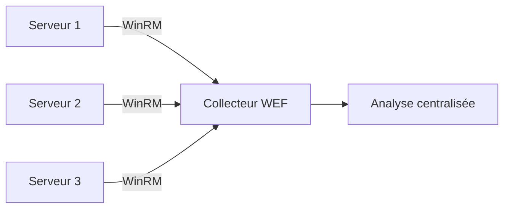

# Journalisation

## Document de révision TSSR - Titre RNCP

---

**Formation** : Technicien Supérieur Systèmes et Réseaux (TSSR)

**Sujet** : Journalisation des systèmes et applications

**Date** : Février 2026

**Type** : Synthèse de cours complète

---

## 📋 Sommaire

1. [[#Introduction|Introduction]]
   - [[#Qu'est-ce qu'un journal ?|Qu'est-ce qu'un journal ?]]
   - [[#Usage des logs|Usage des logs]]
   - [[#Historique et conservation|Historique et conservation]]
   - [[#Pertinence et niveau de journalisation|Pertinence et niveau de journalisation]]
   - [[#Obligations légales|Obligations légales]]
   - [[#Stockage et archivage|Stockage et archivage]]
   - [[#Standardisation et centralisation|Standardisation et centralisation]]

2. [[#Journalisation GNU/Linux|Journalisation GNU/Linux]]
   - [[#Syslog|Syslog]]
   - [[#Structure des messages syslog|Structure des messages syslog]]
   - [[#Catégories de messages|Catégories de messages]]
   - [[#Niveaux de gravité|Niveaux de gravité]]
   - [[#Envoyer des messages|Envoyer des messages]]
   - [[#Stockage et configuration|Stockage et configuration]]
   - [[#Rotation des logs|Rotation des logs]]
   - [[#Consultation des journaux|Consultation des journaux]]
   - [[#Systemd et journalctl|Systemd et journalctl]]
   - [[#Outils d'analyse|Outils d'analyse]]

3. [[#Journalisation Windows|Journalisation Windows]]
   - [[#Observateur d'événements|Observateur d'événements]]
   - [[#Accès à l'Event Viewer|Accès à l'Event Viewer]]
   - [[#Structure et contenu|Structure et contenu]]
   - [[#Centralisation avec WEF|Centralisation avec WEF]]
   - [[#Niveaux de criticité|Niveaux de criticité]]
   - [[#Event ID importants|Event ID importants]]
   - [[#Analyse et parsing|Analyse et parsing]]

4. [[#Points clés à retenir|Points clés à retenir]]

5. [[#Glossaire technique|Glossaire technique]]

---

## Introduction

> [!abstract] Vue d'ensemble
> La journalisation est un mécanisme essentiel permettant d'enregistrer les traces d'activité des applications et des systèmes d'exploitation. Ces journaux (ou **logs**) constituent les "yeux" des administrateurs sur l'activité du système d'information et sont indispensables pour le diagnostic, la sécurité et la conformité réglementaire.

### Pourquoi étudier la journalisation ?

En tant que **TSSR**, tu dois maîtriser la journalisation pour :
- **Diagnostiquer** les pannes et dysfonctionnements
- **Analyser** l'utilisation des systèmes
- **Détecter** les tentatives d'intrusion et anomalies de sécurité
- **Assurer** la conformité réglementaire (RGPD, LPM)
- **Optimiser** les performances du SI

---

## Qu'est-ce qu'un journal ?

> [!quote] Définition
> Les **journaux d'événements** (ou **logs**) sont des enregistrements de l'activité des applications serveurs et des systèmes d'exploitation. Ils constituent une trace horodatée des événements survenus sur un système.

### Caractéristiques des journaux

Les applications et systèmes d'exploitation enregistrent des traces de leur activité qui :
- Peuvent prendre **différentes formes** : fichiers texte, bases de données
- Peuvent avoir **différents formats** : selon les choix des développeurs
- Contiennent des **informations horodatées** sur les événements système

> [!info] Métaphore du Petit Poucet
> Comme les miettes de pain du Petit Poucet, les logs permettent de **remonter la piste** et comprendre ce qui s'est passé sur un système.

---

## Usage des logs

> [!important] Trois utilisateurs principaux des logs

### Pour les développeurs
- **Découvrir les causes d'un bug**
- Tester et valider le comportement des applications
- Déboguer le code en production

### Pour les administrateurs
- **Comprendre les dysfonctionnements**
- **Analyser l'utilisation** des ressources
- Optimiser les performances
- Planifier la capacité

### Pour la cybersécurité
- **Voir des tentatives d'intrusion**
- Détecter les comportements anormaux
- Répondre aux incidents de sécurité
- Effectuer des audits de conformité

---

## Historique et conservation

> [!note] Principe de conservation
> Idéalement, les journaux de chaque application devraient être analysés en **temps réel**, mais dans la pratique, il est nécessaire de conserver un **historique**.

### Pourquoi conserver l'historique ?

- **Permettre l'analyse d'événements passés**
- **Faire des déductions** sur une suite d'événements pas nécessairement consécutifs
- Constituer des **preuves** en cas d'incident de sécurité
- Respecter les **obligations légales** de conservation

> [!tip] Remonter dans le temps
> La conservation d'historique permet de corréler des événements espacés dans le temps pour comprendre des attaques complexes ou des problèmes intermittents.

---

## Pertinence et niveau de journalisation

> [!question] Quelles informations journaliser ?
> La réponse dépend de l'**usage** prévu des logs et du **contexte** d'exploitation.

### Exemples selon l'usage

| Contexte | Informations pertinentes |
|----------|--------------------------|
| **Analyse cybersécurité** | Échecs de connexion, requêtes invalides, tentatives d'accès non autorisés |
| **Administration système** | Anomalies de fonctionnement, pannes matérielles, erreurs applicatives |
| **Audit de conformité** | Accès aux données sensibles, modifications de configuration, suppressions |

> [!important] Catégorisation nécessaire
> Il est essentiel de **catégoriser les informations** et d'**ajuster le niveau** de journalisation selon les besoins, pour éviter la surcharge tout en capturant les événements critiques.

---

## Obligations légales

> [!warning] Cadre réglementaire strict
> La journalisation est encadrée par plusieurs textes légaux et réglementaires qu'un TSSR doit connaître.

### Principaux textes applicables

| Réglementation | Description | Implications |
|----------------|-------------|--------------|
| **RGPD** (art. 32) | Règlement Général sur la Protection des Données | Obligation de journaliser les accès aux données personnelles et de sécuriser les logs |
| **LPM** | Loi de Programmation Militaire | Conservation des logs de connexion pour les opérateurs et hébergeurs |
| **Cadres métiers** | Paiement (PCI-DSS), Hébergement Données de Santé (HDS) | Exigences spécifiques de journalisation et d'audit |

### Informations de sécurité à journaliser

> [!example] Événements d'audit obligatoires
> - Authentification réussies (**OK**)
> - Authentification échouées (**NOK**)
> - Accès aux ressources sensibles
> - Modifications de configuration
> - Élévations de privilèges

### Points d'attention légaux

> [!warning] Attention à...
> - **Durée de conservation** : respecter les durées minimales ET maximales légales
> - **Protection des logs** : les logs peuvent contenir des données personnelles à protéger
> - **Intégrité** : garantir que les logs n'ont pas été modifiés
> - **Disponibilité** : pouvoir produire les logs en cas de contrôle

---

## Stockage et archivage

> [!important] Problématique de l'espace disque
> L'enregistrement de "toute" l'activité peut **très vite prendre beaucoup de place**, surtout en cas de dysfonctionnement provoquant un emballement.

### Compromis nécessaire

La conservation de l'historique est un **compromis** entre :
- Les **besoins métier** et réglementaires
- Les **capacités de stockage** disponibles
- Le **coût** du stockage

### Solutions techniques

> [!tip] Techniques d'optimisation
> - **Rotation automatique** des logs (logrotate sur Linux)
> - **Compression** des anciens logs (gzip, bzip2)
> - **Archivage** sur stockage moins coûteux
> - **Filtrage** par niveau de criticité
> - **Centralisation** pour mutualiser le stockage

> [!example] Exemple de stratégie de rétention
> - Logs récents (7 jours) : non compressés, accès rapide
> - Logs intermédiaires (30 jours) : compressés, sur disque local
> - Logs archivés (1 an) : compressés, sur stockage distant

---

## Standardisation et centralisation

> [!note] Faciliter la lecture et l'analyse
> Analyser et comprendre des journaux peut être une tâche délicate sans standardisation ni centralisation.

### Deux points de difficulté principaux

#### 1. Emplacement des journaux

**Problème** : Les logs sont dispersés sur différents serveurs et applications

**Solution** : **Centralisation**
- Collecter tous les logs sur un serveur dédié
- Facilite la recherche et la corrélation
- Simplifie les sauvegardes

#### 2. Format des logs

**Problème** : Chaque application peut avoir son propre format

**Solution** : **Standardisation**
- Utiliser des formats normalisés (syslog, JSON)
- Facilite l'analyse automatisée
- Permet l'interopérabilité des outils

> [!success] Bénéfices de la centralisation
> - Vue d'ensemble du SI
> - Corrélation d'événements multi-sources
> - Analyse de sécurité globale
> - Simplification de l'archivage

---

## Journalisation GNU/Linux

> [!abstract] Syslog : le standard Unix/Linux
> Sous GNU/Linux, la journalisation repose principalement sur le protocole **Syslog**, un standard développé dans les années 80 qui reste la référence aujourd'hui.

---

## Syslog

> [!quote] Histoire de Syslog
> Syslog a été développé pour **Sendmail** dans les **années 80** par **Eric Allman**. C'est devenu un standard de facto pour la journalisation Unix/Linux.

### Architecture de Syslog

Syslog repose sur une **séparation des responsabilités** :


> [!info] Système client-serveur
> Syslog fonctionne selon une architecture **client-serveur** avec un protocole de communication standardisé.

### Standardisation

| Standard | Description |
|----------|-------------|
| **IETF RFC 5424** | Spécification officielle du protocole Syslog |
| **514/UDP** | Port par défaut (non-sécurisé, legacy) |
| **514/TCP** | Port TCP (garantie de livraison) |
| **6514/TCP** | Syslog over TLS (chiffrement) |

> [!warning] UDP non recommandé
> Le protocole **UDP** ne garantit pas la livraison des messages. Pour des logs critiques, **toujours privilégier TCP** ou mieux, **TLS**.

---

## Structure des messages syslog

> [!info] Anatomie d'un événement syslog
> Chaque message syslog contient plusieurs champs standardisés permettant son identification et sa classification.

### Composants d'un message

| Champ | Description | Exemple |
|-------|-------------|---------|
| **Date** | Horodatage de l'événement | `Feb 03 14:23:45` |
| **Hôte** | Machine émettrice du message | `serveur-web-01` |
| **Service/Processus** | Application source | `sshd` |
| **PID** | Identifiant de processus | `[1234]` |
| **Priorité** | Catégorie + Niveau de sévérité | `authpriv.info` |
| **Message** | Texte descriptif | `Accepted password for user from 192.168.1.10` |

> [!example] Exemple de message complet
> ```
> Feb 03 14:23:45 serveur-web-01 sshd[1234]: Accepted password for admin from 192.168.1.10 port 52341 ssh2
> ```

### Priorité = Catégorie + Sévérité

> [!important] Calcul de la priorité
> La **priorité** d'un message syslog est calculée selon la formule :
> 
> **Priorité = (Catégorie × 8) + Sévérité**
> 
> Exemple : auth (4) + warning (4) = 4×8+4 = **36**

> [!tip] Ressource complémentaire
> Pour plus d'informations : [Syslog sur Wikipedia](https://fr.wikipedia.org/wiki/Syslog)

---

## Catégories de messages

> [!note] 24 catégories définies
> Syslog définit **24 catégories** de messages, numérotées de **0 à 23**. Les 8 dernières (16 à 23) sont réservées pour un **usage local** non défini dans la norme.

### Catégories système (0-7)

| Code | Mot-clé | Description |
|------|---------|-------------|
| **0** | `kern` | Messages du **noyau** Linux |
| **1** | `user` | Messages de l'**espace utilisateur** |
| **2** | `mail` | Système de **messagerie** |
| **3** | `daemon` | **Services** système (démons) |
| **4** | `auth` | Messages d'**authentification** |
| **5** | `syslog` | Messages **internes** à syslogd |
| **6** | `lpr` | Messages d'**impression** |
| **7** | `news` | Messages d'**actualités** (NNTP) |

### Catégories additionnelles (8-15)

| Code | Mot-clé | Description |
|------|---------|-------------|
| **8** | `uucp` | Messages **UUCP** (Unix-to-Unix Copy) |
| **9** | `cron` | **Tâches planifiées** (at/cron) |
| **10** | `authpriv` | **Sécurité** / élévation de privilèges |
| **11** | `ftp` | Logiciel **FTP** |
| **12** | `ntp` | **Synchronisation** du temps (NTP) |
| **13** | `security` | **Log audit** |
| **14** | `console` | **Log alert** |
| **15** | `solaris-cron` | Tâches planifiées (variante Solaris) |

> [!important] Catégories critiques pour un TSSR
> Les catégories les plus utilisées en administration système :
> - `kern` : problèmes matériels et noyau
> - `auth` / `authpriv` : sécurité et authentification
> - `daemon` : services système
> - `cron` : tâches automatisées

### Catégories locales (16-23)

> [!tip] Local0 à Local7
> Les catégories **local0** à **local7** (codes 16-23) peuvent être utilisées librement pour :
> - Applications personnalisées
> - Filtrage spécifique par service
> - Organisation custom des logs

---

## Niveaux de gravité

> [!important] 8 niveaux de sévérité
> Syslog définit **8 niveaux de gravité** (ou sévérité), de 0 (le plus critique) à 7 (le moins critique).

### Tableau des niveaux de gravité

| Code | Gravité | Mot-clé | Description | Usage |
|------|---------|---------|-------------|-------|
| **0** | Emergency | `emerg` (panic) | **Système inutilisable** | Panne totale, kernel panic |
| **1** | Alert | `alert` | **Intervention immédiate nécessaire** | Base de données corrompue, RAID dégradé |
| **2** | Critical | `crit` | **Erreur critique pour le système** | Disque plein, composant matériel en erreur |
| **3** | Error | `err` (error) | **Erreur de fonctionnement** | Échec d'un service, erreur applicative |
| **4** | Warning | `warn` (warning) | **Avertissement** (intervention préventive) | Espace disque faible, timeout réseau |
| **5** | Notice | `notice` | **Événement normal méritant signalement** | Démarrage/arrêt de service, connexion réussie |
| **6** | Informational | `info` | **Pour information** | Événements normaux du système |
| **7** | Debugging | `debug` | **Message de débogage** | Traces détaillées pour développeurs |

> [!warning] Interprétation des niveaux
> **Attention** : un niveau de sévérité faible ne signifie pas "peu important" !
> - `notice` : événement **normal** mais **significatif**
> - `info` : événement de routine
> - `debug` : traces techniques détaillées

### Mnémotechnique pour retenir l'ordre

> [!tip] Moyen mnémotechnique
> **E**mma **A**chète **C**haque **E**té **W**isconsin **N**ew **I**talie **D**anemark
> 
> **E**mergency → **A**lert → **C**ritical → **E**rror → **W**arning → **N**otice → **I**nfo → **D**ebug

### Filtrage par niveau

> [!example] Utilisation pratique
> En configuration syslog, on peut filtrer par niveau :
> - `*.err` : tous les messages de niveau Error ou supérieur
> - `kern.warn` : avertissements du noyau et plus grave
> - `auth.info` : toutes les authentifications

---

## Envoyer des messages

> [!info] Génération de messages syslog
> Une application peut envoyer des messages syslog en se basant sur des **appels système** ou des **outils en ligne de commande**.

### Méthodes de journalisation

#### En Python : bibliothèque `syslog`

```python
import syslog

# Ouvrir la connexion syslog
syslog.openlog(ident="mon_script", facility=syslog.LOG_USER)

# Envoyer un message
syslog.syslog(syslog.LOG_INFO, "Script démarré avec succès")
syslog.syslog(syslog.LOG_WARNING, "Attention : fichier manquant")
syslog.syslog(syslog.LOG_ERR, "Erreur critique détectée")

# Fermer la connexion
syslog.closelog()
```

#### En Bash : commande `logger`

> [!example] Exemples d'utilisation de logger
> ```bash
> # Message simple
> logger "Backup completed successfully"
> 
> # Avec niveau de priorité
> logger -p user.warning "Disk space is running low"
> 
> # Avec tag personnalisé
> logger -t backup_script "Starting backup process"
> 
> # Avec catégorie et sévérité
> logger -p local0.info "Custom application event"
> 
> # Envoyer vers serveur distant
> logger -n syslog-server.local "Remote log message"
> ```

> [!tip] Voir la documentation
> Pour plus d'options : `man logger`

### Cas d'usage pratiques

> [!example] Intégration dans un script
> ```bash
> #!/bin/bash
> 
> # Script de sauvegarde avec journalisation
> SCRIPT_NAME="backup_daily"
> 
> logger -t $SCRIPT_NAME -p local0.info "Démarrage de la sauvegarde quotidienne"
> 
> if rsync -av /data /backup; then
>     logger -t $SCRIPT_NAME -p local0.notice "Sauvegarde réussie"
> else
>     logger -t $SCRIPT_NAME -p local0.err "Échec de la sauvegarde"
>     exit 1
> fi
> ```

---

## Stockage et configuration

> [!important] Daemon rsyslog
> Le **stockage** et le **routage** des messages syslog sont assurés par le daemon **rsyslog** (successeur de syslogd).

### Emplacements de stockage par défaut

Les logs sont stockés dans `/var/log/*` avec un **filtrage automatique** par catégorie :

| Catégorie | Fichier de destination |
|-----------|------------------------|
| `auth`, `authpriv` | `/var/log/auth.log` |
| `kern` | `/var/log/kern.log` |
| `mail` | `/var/log/mail.log` |
| `cron` | `/var/log/cron.log` |
| `daemon` | `/var/log/daemon.log` |
| `syslog` (tous) | `/var/log/syslog` |
| Messages système | `/var/log/messages` |

### Options de stockage

> [!note] Flexibilité de rsyslog
> rsyslog peut stocker les logs de multiples façons :
> - **Fichiers texte** : `/var/log/*` (par défaut)
> - **Base de données** : PostgreSQL, MySQL, MariaDB
> - **Serveur distant** : transmission à un serveur syslog centralisé
> - **Fichiers structurés** : JSON, CSV

### Configuration client syslog

> [!important] Bonnes pratiques de configuration
> Lors de la configuration de **rsyslog** (fichier `/etc/rsyslog.conf`) :

#### 1. Privilégier TCP sur UDP

```bash
# Mauvais : UDP (pas de garantie de livraison)
*.* @serveur-syslog.local:514

# Bon : TCP (garantie de livraison)
*.* @@serveur-syslog.local:514
```

> [!tip] Notation rsyslog
> - `@` = UDP
> - `@@` = TCP

#### 2. Utiliser TLS pour chiffrer les logs

```bash
# Configuration TLS dans rsyslog
$DefaultNetstreamDriver gtls
$ActionSendStreamDriverMode 1
$ActionSendStreamDriverAuthMode x509/name
*.* @@serveur-syslog.local:6514
```

> [!warning] Sécurité des logs
> Les logs **transitent en clair** sur le réseau avec syslog standard. **Toujours utiliser TLS** pour protéger les informations sensibles.

#### 3. Filtrer les IP sources autorisées

```bash
# Dans le pare-feu (iptables)
iptables -A INPUT -p tcp --dport 514 -s 192.168.1.0/24 -j ACCEPT
iptables -A INPUT -p tcp --dport 514 -j DROP
```

### Exemple de configuration rsyslog

> [!example] Configuration complète
> ```bash
> # /etc/rsyslog.conf
> 
> # Modules
> module(load="imuxsock")  # Support syslog local
> module(load="imklog")    # Support messages noyau
> 
> # Règles de routage
> auth,authpriv.*           /var/log/auth.log
> *.*;auth,authpriv.none    /var/log/syslog
> kern.*                    /var/log/kern.log
> mail.*                    /var/log/mail.log
> 
> # Envoi vers serveur distant (TCP + TLS)
> *.* @@serveur-syslog.local:6514
> ```

---

## Rotation des logs

> [!important] Outil logrotate
> **logrotate** est une commande installée **par défaut** sur les distributions Linux pour gérer la rotation automatique des fichiers de logs.

### Pourquoi la rotation ?

> [!warning] Problème d'espace disque
> Sans rotation, les fichiers de logs peuvent :
> - **Saturer le système de fichiers**
> - **Ralentir les performances** (fichiers très volumineux)
> - **Compliquer l'analyse** (trop de données)

### Fonctionnement de logrotate


> [!info] Caractéristiques
> - **Exécuté régulièrement** par `cron` (généralement quotidiennement)
> - **Archive et compresse** les anciens logs
> - **Supprime** les logs trop anciens
> - **Peut envoyer** les logs par mail avant suppression

### Configuration de logrotate

> [!example] Fichier de configuration `/etc/logrotate.d/rsyslog`
> ```bash
> /var/log/syslog
> /var/log/mail.log
> /var/log/kern.log
> /var/log/auth.log
> {
>     rotate 7          # Conserver 7 versions
>     daily             # Rotation quotidienne
>     missingok         # Pas d'erreur si fichier absent
>     notifempty        # Ne pas rotate si vide
>     delaycompress     # Compresser à la prochaine rotation
>     compress          # Activer la compression
>     postrotate        # Actions après rotation
>         /usr/lib/rsyslog/rsyslog-rotate
>     endscript
> }
> ```

### Options importantes

| Option | Description |
|--------|-------------|
| `daily` / `weekly` / `monthly` | Fréquence de rotation |
| `rotate N` | Nombre de fichiers à conserver |
| `size 100M` | Rotation si taille > 100M |
| `compress` | Compresser les anciens logs (gzip) |
| `delaycompress` | Ne pas compresser le dernier fichier rotaté |
| `copytruncate` | Copier puis vider (pour logs ouverts) |
| `create 640 root adm` | Permissions du nouveau fichier |
| `mail admin@example.com` | Envoyer par mail avant suppression |

> [!tip] Tester la configuration
> ```bash
> # Test de la configuration sans exécution
> logrotate -d /etc/logrotate.conf
> 
> # Forcer la rotation manuellement
> logrotate -f /etc/logrotate.conf
> ```

> [!note] Documentation
> Pour plus d'options : `man logrotate` et `man cron`

---

## Consultation des journaux

> [!info] Commandes de consultation
> Linux propose de nombreuses commandes pour consulter et analyser les fichiers de logs.

### Commandes de base

#### Consultation complète

| Commande | Description | Usage |
|----------|-------------|-------|
| `cat` | Afficher tout le fichier | `cat /var/log/syslog` |
| `more` | Afficher page par page (forward) | `more /var/log/syslog` |
| `less` | Afficher avec navigation | `less /var/log/syslog` |
| `zcat` | Cat pour fichiers compressés | `zcat /var/log/syslog.1.gz` |
| `zmore` | More pour fichiers compressés | `zmore /var/log/syslog.1.gz` |
| `zless` | Less pour fichiers compressés | `zless /var/log/syslog.1.gz` |

#### Consultation partielle

| Commande | Description | Usage |
|----------|-------------|-------|
| `head` | Afficher le début (10 lignes par défaut) | `head -n 20 /var/log/syslog` |
| `tail` | Afficher la fin (10 lignes par défaut) | `tail -n 50 /var/log/syslog` |
| `tail -f` | Suivre en temps réel | `tail -f /var/log/syslog` |

> [!tip] tail -f : indispensable !
> La commande `tail -f` est **essentielle** pour suivre les logs en temps réel lors du diagnostic d'un problème.

#### Recherche et filtrage

| Commande | Description | Usage |
|----------|-------------|-------|
| `grep` | Rechercher un motif | `grep "error" /var/log/syslog` |
| `grep -i` | Recherche insensible à la casse | `grep -i "failed" /var/log/auth.log` |
| `grep -v` | Inverser la recherche (exclure) | `grep -v "INFO" /var/log/syslog` |
| `zgrep` | Grep pour fichiers compressés | `zgrep "error" /var/log/syslog.*.gz` |

#### Surveillance périodique

| Commande | Description | Usage |
|----------|-------------|-------|
| `watch` | Exécution périodique de commande | `watch -n 2 'tail /var/log/syslog'` |

### Commandes spécialisées

#### dmesg : Logs du noyau

> [!note] Messages du noyau
> `dmesg` affiche les messages du **buffer ring** du noyau (détection matériel, drivers, etc.)

```bash
# Afficher les messages du noyau
dmesg

# Suivre en temps réel
dmesg -w

# Filtrer par niveau
dmesg -l err,warn

# Format lisible
dmesg -T
```

#### last / lastb : Historique des connexions

> [!note] Audit des connexions
> - `last` : connexions **réussies**
> - `lastb` : connexions **échouées**

```bash
# Dernières connexions réussies
last

# Connexions d'un utilisateur spécifique
last john

# Tentatives de connexion échouées (nécessite root)
sudo lastb

# Derniers redémarrages
last reboot
```

### Exemples pratiques de consultation

> [!example] Scénarios d'analyse courants

```bash
# 1. Voir les dernières authentifications
tail -n 100 /var/log/auth.log

# 2. Rechercher les échecs de connexion SSH
grep "Failed password" /var/log/auth.log

# 3. Compter les tentatives par IP
grep "Failed password" /var/log/auth.log | awk '{print $(NF-3)}' | sort | uniq -c | sort -nr

# 4. Surveiller les erreurs en temps réel
tail -f /var/log/syslog | grep -i error

# 5. Analyser les logs sur une période
grep "Feb  3" /var/log/syslog | grep -i error

# 6. Voir les services qui ont redémarré
grep "Started\|Stopped" /var/log/syslog

# 7. Trouver les erreurs disque
dmesg | grep -i "I/O error"

# 8. Logs Apache des erreurs 500
grep " 500 " /var/log/apache2/access.log
```

> [!tip] Combiner les commandes
> Les commandes peuvent être **chaînées avec des pipes** (`|`) pour des analyses complexes :
> ```bash
> cat /var/log/auth.log | grep "Failed" | awk '{print $11}' | sort | uniq -c | sort -rn | head -10
> ```
> → Top 10 des IP avec le plus d'échecs de connexion

---

## Systemd et journalctl

> [!important] Systemd journald
> **Systemd** propose son propre système de journalisation via `journald`, complémentaire ou alternatif à syslog.

### Caractéristiques de systemd-journald

> [!info] Différences avec syslog
> - **Stockage au format binaire** : `/run/systemd/journal` (ou `/var/log/journal` si persistant)
> - **Outil de consultation** : `journalctl`
> - **Mécanisme de rotation interne** : pas besoin de logrotate
> - **Peut transmettre à syslog** : compatibilité avec l'écosystème existant
> - **Métadonnées riches** : plus d'informations structurées

### Utilisation de journalctl

> [!example] Commandes essentielles journalctl

```bash
# Afficher tous les logs
journalctl

# Logs depuis le dernier démarrage
journalctl -b

# Logs du boot précédent
journalctl -b -1

# Suivre en temps réel (comme tail -f)
journalctl -f

# Logs d'un service spécifique
journalctl -u ssh.service
journalctl -u apache2.service

# Logs avec niveau de priorité
journalctl -p err       # Erreurs et plus grave
journalctl -p warning   # Warnings et plus grave

# Logs sur une période
journalctl --since "2026-02-03 10:00:00"
journalctl --since "1 hour ago"
journalctl --since yesterday --until today

# Logs d'un utilisateur
journalctl _UID=1000

# Logs du noyau
journalctl -k

# Format de sortie
journalctl -o json-pretty
journalctl -o verbose

# Voir l'espace disque utilisé
journalctl --disk-usage

# Nettoyer les anciens logs
journalctl --vacuum-time=2weeks
journalctl --vacuum-size=500M
```

### Filtrage avancé

> [!tip] Combinaison de filtres
> ```bash
> # Erreurs SSH depuis hier
> journalctl -u ssh.service -p err --since yesterday
> 
> # Logs d'un processus spécifique
> journalctl _PID=1234
> 
> # Logs d'un exécutable
> journalctl /usr/bin/mongod
> ```

### Configuration de la persistance

> [!note] Rendre les logs persistants
> Par défaut, journald stocke en RAM (`/run`). Pour persister au reboot :

```bash
# Créer le répertoire
sudo mkdir -p /var/log/journal

# Définir les permissions
sudo systemd-tmpfiles --create --prefix /var/log/journal

# Redémarrer journald
sudo systemctl restart systemd-journald
```

Configuration dans `/etc/systemd/journald.conf` :
```ini
[Journal]
Storage=persistent
SystemMaxUse=500M
SystemKeepFree=1G
MaxRetentionSec=1month
```

### Compatibilité avec syslog

> [!success] Meilleur des deux mondes
> Il est possible (et recommandé) d'utiliser **journald ET rsyslog** :
> - journald capture tous les logs système
> - rsyslog reçoit les logs de journald et les transmet/formate selon les besoins

Configuration dans `/etc/systemd/journald.conf` :
```ini
[Journal]
ForwardToSyslog=yes
```

---

## Outils d'analyse

> [!important] Automatisation de l'analyse
> Pour traiter efficacement de gros volumes de logs, des outils spécialisés sont indispensables.

### Outils d'analyse de logs Linux

#### 1. Logwatch

> [!note] Logwatch
> - **Analyse automatique** des logs système
> - **Génère des rapports** quotidiens par mail
> - **Personnalisable** par service

```bash
# Installation
sudo apt install logwatch

# Générer un rapport manuel
sudo logwatch --detail High --range today --output stdout
```

#### 2. Graylog

> [!important] Graylog - Solution centralisée
> - Plateforme **open-source** de gestion de logs
> - **Centralisation** de multiples sources
> - **Interface web** avec recherche et tableaux de bord
> - **Alerting** en temps réel
> - Basé sur **Elasticsearch** et **MongoDB**

#### 3. LogAnalyzer

> [!note] LogAnalyzer
> - **Interface web** pour visualiser les logs syslog
> - Compatible avec **rsyslog**, **syslog-ng**
> - Filtrage et recherche avancés

### Solutions avancées

> [!success] Aller plus loin

#### Outils de supervision

- **Nagios** / **Icinga** : supervision d'infrastructure
- **Zabbix** : monitoring et alerting
- **Prometheus** + **Grafana** : métriques et visualisation

#### SIEM et HIDS

> [!quote] Définitions
> - **SIEM** (Security Information and Event Management) : corrélation d'événements de sécurité multi-sources
> - **HIDS** (Host-based Intrusion Detection System) : détection d'intrusion basée sur l'analyse des logs

**Exemples de solutions** :
- **Wazuh** : SIEM open-source avec HIDS intégré
- **OSSEC** : HIDS open-source
- **ELK Stack** (Elasticsearch, Logstash, Kibana) : collecte, indexation et visualisation
- **Splunk** : plateforme commerciale puissante

### Pile ELK (Elastic Stack)

> [!example] Architecture ELK
> ```mermaid
> graph LR
>     A[Sources de logs] -->|Collecte| B[Logstash/Beats]
>     B -->|Indexation| C[Elasticsearch]
>     C -->|Visualisation| D[Kibana]
> ```

**Composants** :
- **Elasticsearch** : moteur de recherche et d'indexation
- **Logstash** : collecte, transformation et envoi de logs
- **Kibana** : interface de visualisation et tableaux de bord
- **Beats** : agents légers de collecte

---

## Journalisation Windows

> [!abstract] Event Viewer : l'observateur d'événements
> Sous Windows, la journalisation est centralisée dans l'**Observateur d'événements** (Event Viewer), un composant natif de l'OS.

---

## Observateur d'événements

> [!quote] Définition
> L'**Observateur d'événements** (Event Viewer) est le journal dans lequel toute l'activité de Windows est enregistrée, des simples informations aux erreurs critiques.

### Caractéristiques

> [!info] Propriétés de l'Event Viewer
> - **Natif** sur tous les OS Windows (serveurs et clients)
> - **Fichiers de log** : `C:\Windows\System32\winevt\Logs\`
> - **Format** : fichiers `.evtx` (binaire XML)
> - **Accès** : événements locaux **ou distants** depuis une console unique

### Types d'informations enregistrées

- **Informations simples** : démarrages de services, connexions utilisateurs
- **Avertissements** : situations anormales nécessitant attention
- **Erreurs** : dysfonctionnements, échecs d'opérations
- **Audits** : événements de sécurité (réussis ou échoués)

---

## Accès à l'Event Viewer

> [!tip] Plusieurs méthodes d'accès
> Windows offre de multiples façons d'ouvrir l'Observateur d'événements.

### Méthodes d'accès

#### 1. Touche Windows + R

```
eventvwr
```

> [!example] Raccourci rapide
> 1. `Win + R`
> 2. Taper `eventvwr`
> 3. `Entrée`

#### 2. Ligne de commande

```cmd
eventvwr
```

Ou depuis PowerShell :
```powershell
eventvwr.msc
```

#### 3. Outils d'administration

- Panneau de configuration → Outils d'administration → Observateur d'événements

#### 4. Server Manager (Serveur)

- Dans Server Manager, lien direct "**Event Viewer**" dans le menu Outils

#### 5. MMC personnalisée

```
mmc
```
Puis ajouter le composant logiciel enfichable "Observateur d'événements"

---

## Structure et contenu

> [!important] Organisation hiérarchique
> Les journaux de l'Observateur d'événements sont organisés en plusieurs catégories.

### Structure de l'arborescence

```
Observateur d'événements
├── Affichages personnalisés
│   └── Vues créées par l'utilisateur
├── Journaux Windows
│   ├── Application
│   ├── Sécurité
│   ├── Installation
│   ├── Système
│   └── Événements transférés
└── Journaux des applications et des services
    ├── Hardware Events
    ├── Internet Explorer
    ├── Key Management Service
    ├── Microsoft
    │   ├── Windows
    │   │   ├── PowerShell
    │   │   ├── TaskScheduler
    │   │   └── ...
    └── ...
```

### Catégories principales

#### 1. Affichages personnalisés

> [!tip] Vues personnalisées
> Permet de créer des **filtres personnalisés** pour afficher uniquement les événements pertinents selon des critères spécifiques (niveau, source, ID, période).

**Exemple** : Vue des échecs d'authentification des 7 derniers jours

#### 2. Journaux Windows (OS)

> [!important] Journaux système essentiels

| Journal | Description | Contenu typique |
|---------|-------------|-----------------|
| **Application** | Événements applicatifs | Erreurs logiciels, services d'application |
| **Sécurité** | Audits de sécurité | Connexions, accès fichiers, modifications privilèges |
| **Installation** | Installation/mise à jour | Windows Update, installation de composants |
| **Système** | Événements système | Démarrages, services, drivers, matériel |
| **Événements transférés** | Logs centralisés (WEF) | Événements reçus d'autres machines |

#### 3. Journaux des applications et des services

> [!note] Logs spécifiques
> Logs détaillés par application ou composant Windows :
> - **PowerShell** : exécution de scripts et commandes
> - **TaskScheduler** : tâches planifiées
> - **Windows Defender** : antivirus
> - **DNS Server** : requêtes DNS (si serveur DNS)
> - **DHCP Server** : attributions d'adresses

### Types d'événements

> [!info] Trois types principaux d'événements

| Icône | Type | Description |
|-------|------|-------------|
| ⓘ | **Information** | Événement normal, fonctionnement correct |
| ⚠️ | **Avertissement** (Warning) | Problème potentiel nécessitant attention |
| ❌ | **Erreur** | Dysfonctionnement, échec d'opération |
| 🔑 | **Audit de réussite** | Événement de sécurité réussi |
| 🔒 | **Audit d'échec** | Événement de sécurité échoué |

---

## Centralisation avec WEF

> [!important] Windows Event Forwarding
> **WEF** (Windows Event Forwarding) permet de **collecter les événements** de plusieurs machines Windows vers un **collecteur central**.

### Architecture WEF



### Caractéristiques

> [!note] Fonctionnement
> - **1 serveur collecteur** reçoit les logs de multiples machines
> - **Protocole** : **WinRM** (Windows Remote Management)
> - **Ports** :
>   - HTTP : **5985**
>   - HTTPS : **5986** (recommandé)
> - **Gestion** : Configuration possible via **GPO** (Group Policy Objects)

### Avantages de WEF

> [!success] Bénéfices
> - Vue **centralisée** de la sécurité
> - **Corrélation** d'événements multi-machines
> - **Simplification** de l'analyse
> - **Conformité** : facilite les audits

### Configuration de base

> [!example] Étapes de mise en place

**Sur le collecteur** :
```powershell
# Activer le service de collecte
wecutil qc

# Créer une souscription
wecutil cs subscription.xml
```

**Sur les sources** :
```powershell
# Configurer WinRM
winrm quickconfig

# Autoriser le collecteur
winrm set winrm/config/client @{TrustedHosts="collecteur.domain.local"}
```

---

## Événements à centraliser (minimum)

> [!warning] Événements critiques de sécurité
> Certains Event ID sont **essentiels** pour la sécurité et doivent **toujours** être centralisés et surveillés.

### Event ID critiques

| Event ID | Description | Catégorie | Importance |
|----------|-------------|-----------|------------|
| **4624** | **Authentification réussie** | Connexion | 🔑 Audit OK |
| **4625** | **Échec d'authentification** | Connexion | 🔒 Audit échec |
| **4740** | **Compte verrouillé** | Sécurité compte | ⚠️ Attaque possible |
| **4728** | **Ajout utilisateur à groupe de sécurité global** | Modification groupe | ⚠️ Élévation privilège |
| **4732** | **Ajout utilisateur à groupe de sécurité local** | Modification groupe | ⚠️ Élévation privilège |
| **4756** | **Ajout utilisateur à groupe de sécurité universel** | Modification groupe | ⚠️ Élévation privilège |
| **1102** | **Suppression du journal d'audit** | Audit | ❌ Tentative dissimulation |
| **4663** | **Accès à un objet sensible** | Accès fichiers | 🔑 Audit accès |

> [!warning] Surveillance obligatoire
> La **suppression des journaux** (1102) et les **échecs d'authentification répétés** (4625) sont des **indicateurs d'attaque** à surveiller en priorité.

### Configuration WEF recommandée

> [!example] Souscription de sécurité minimale
> ```xml
> <Subscription>
>   <Query>
>     <Select Path="Security">
>       *[System[(EventID=4624 or EventID=4625 or EventID=4740 or 
>                EventID=4728 or EventID=4732 or EventID=4756 or 
>                EventID=1102 or EventID=4663)]]
>     </Select>
>   </Query>
> </Subscription>
> ```

---

## Niveaux de criticité

> [!important] Classification des événements
> Windows utilise **3 niveaux de criticité** pour classifier les événements, en complément du type d'événement.

### Les 3 niveaux

| Niveau | Description | Exemples |
|--------|-------------|----------|
| **High** (Élevé) | Événements critiques nécessitant action immédiate | Échecs système, pannes de service, intrusions détectées |
| **Medium** (Moyen) | Événements importants à surveiller | Avertissements, erreurs récupérables, comportements anormaux |
| **Low** (Faible) | Événements informatifs | Démarrages normaux, connexions réussies, opérations de routine |

### Event ID : l'identifiant d'événement

> [!quote] Définition
> L'**Event ID** est le **code numérique unique** du type d'événement. Il permet d'identifier précisément la nature de l'événement.

> [!tip] Recherche d'Event ID
> - Microsoft documente les Event ID : [docs.microsoft.com](https://docs.microsoft.com)
> - Sites spécialisés : eventid.net, ultimatewindowssecurity.com
> - PowerShell : `Get-WinEvent -FilterHashtable @{LogName='Security'; ID=4624}`

---

## Event ID importants

> [!important] Event ID essentiels pour un TSSR
> Voici les Event ID les plus fréquemment rencontrés et leur signification.

### Tableau des Event ID critiques

| Event ID | Catégorie | Description | Action recommandée |
|----------|-----------|-------------|-------------------|
| **4624** | Authentification | **Ouverture de session réussie** (logon normal) | Audit des connexions légitimes |
| **4625** | Authentification | **Échec d'ouverture de session** (mauvais mot de passe, compte inexistant) | **Surveiller** : attaque par force brute possible |
| **4740** | Sécurité | **Compte utilisateur verrouillé** | **Alerter** : attaque en cours ou utilisateur oubliant son MDP |
| **4728** | Gestion groupes | **Membre ajouté à un groupe de sécurité global** | Audit des modifications de privilèges |
| **4732** | Gestion groupes | **Membre ajouté à un groupe de sécurité local** | **Surveiller** : élévation de privilèges |
| **4756** | Gestion groupes | **Membre ajouté à un groupe de sécurité universel** | Audit des modifications AD |
| **4663** | Accès objets | **Tentative d'accès à un objet** (fichier, dossier, registre) | Audit d'accès aux données sensibles |
| **1102** | Audit | **Journal d'audit effacé** | **ALERTE CRITIQUE** : tentative de dissimulation |

### Détails des Event ID d'authentification

#### 4624 : Connexion réussie

> [!example] Types de connexion (Logon Type)
> | Type | Description |
> |------|-------------|
> | 2 | Interactive (console locale) |
> | 3 | Network (accès réseau/partage) |
> | 4 | Batch (tâche planifiée) |
> | 5 | Service |
> | 7 | Unlock (déverrouillage session) |
> | 10 | RemoteInteractive (RDP) |
> | 11 | CachedInteractive (credentials en cache) |

#### 4625 : Échec de connexion

> [!warning] Sous-codes d'échec
> - `0xC000006D` : Nom d'utilisateur inconnu ou mot de passe incorrect
> - `0xC000006E` : Compte désactivé
> - `0xC000006F` : Connexion en dehors des horaires autorisés
> - `0xC0000071` : Mot de passe expiré
> - `0xC0000234` : Compte verrouillé

> [!tip] Détection d'attaque
> ```powershell
> # Compter les échecs par compte
> Get-WinEvent -FilterHashtable @{LogName='Security'; ID=4625} | 
>   Group-Object {$_.Properties[5].Value} | 
>   Sort-Object Count -Descending
> ```

### Event ID de gestion système

| Event ID | Description |
|----------|-------------|
| **1074** | Arrêt/redémarrage système (planifié) |
| **6005** | Démarrage de l'EventLog (après boot) |
| **6006** | Arrêt de l'EventLog (avant shutdown) |
| **6008** | Arrêt inattendu (crash) |
| **7034** | Service arrêté de manière inattendue |
| **7036** | Service démarré ou arrêté |

---

## Analyse et parsing

> [!important] Parsing de logs Windows
> L'analyse automatisée des logs Windows nécessite souvent du **parsing** (analyse syntaxique) pour extraire les informations pertinentes.

### Pourquoi le parsing ?

> [!note] Limites des outils natifs
> Bien que l'Event Viewer soit pratique pour la consultation manuelle, l'**automatisation** de l'analyse nécessite :
> - **Extraction** de champs spécifiques
> - **Corrélation** d'événements
> - **Agrégation** de données
> - **Alerting** personnalisé

### PowerShell pour l'analyse

> [!example] Exemples de scripts PowerShell

```powershell
# 1. Lister les 10 derniers échecs de connexion
Get-WinEvent -FilterHashtable @{LogName='Security'; ID=4625} -MaxEvents 10

# 2. Chercher un Event ID spécifique dans les dernières 24h
Get-WinEvent -FilterHashtable @{
    LogName='Security'
    ID=4740
    StartTime=(Get-Date).AddDays(-1)
}

# 3. Compter les événements par type
Get-WinEvent -LogName System | Group-Object LevelDisplayName

# 4. Exporter en CSV pour analyse
Get-WinEvent -FilterHashtable @{LogName='Security'; ID=4625} | 
    Select-Object TimeCreated, Message | 
    Export-Csv -Path C:\Logs\failed_logins.csv -NoTypeInformation

# 5. Surveillance en temps réel
Get-WinEvent -FilterHashtable @{LogName='Security'; ID=4625} -MaxEvents 1 -Oldest | 
    Format-List
```

### Utilisation des expressions régulières (regex)

> [!tip] Regex pour parsing de logs
> Les **expressions régulières** permettent d'extraire des informations précises des messages d'événements.

```powershell
# Extraire les adresses IP d'échecs de connexion
Get-WinEvent -FilterHashtable @{LogName='Security'; ID=4625} |
    ForEach-Object {
        if ($_.Message -match 'Source Network Address:\s+(\d+\.\d+\.\d+\.\d+)') {
            [PSCustomObject]@{
                Time = $_.TimeCreated
                IP = $Matches[1]
            }
        }
    } | Group-Object IP | Sort-Object Count -Descending
```

### Outils tiers pour Windows

> [!note] Solutions complémentaires

#### 1. Event Log Explorer
- Interface avancée pour Event Viewer
- Filtrage et recherche puissants

#### 2. NXLog
- Agent de collecte de logs Windows
- Compatible syslog, ELK, etc.
- Transformation et routing de logs

#### 3. Winlogbeat (Elastic)
- Collecteur de logs Windows pour ELK Stack
- Envoi vers Elasticsearch

#### 4. Splunk Universal Forwarder
- Agent Splunk pour Windows
- Collecte et transmission vers Splunk

### Automatisation avec tâches planifiées

> [!example] Créer une alerte automatique
> ```powershell
> # Script à exécuter par tâche planifiée
> $events = Get-WinEvent -FilterHashtable @{
>     LogName='Security'
>     ID=4740
>     StartTime=(Get-Date).AddMinutes(-5)
> }
> 
> if ($events.Count -gt 0) {
>     Send-MailMessage -To "admin@domain.local" `
>         -From "alerts@domain.local" `
>         -Subject "ALERTE : Compte(s) verrouillé(s)" `
>         -Body "Nombre de comptes verrouillés : $($events.Count)" `
>         -SmtpServer "smtp.domain.local"
> }
> ```

### Bonnes pratiques d'analyse

> [!success] Recommandations
> 1. **Centraliser** les logs avec WEF ou outil tiers
> 2. **Automatiser** la surveillance des Event ID critiques
> 3. **Créer des alertes** sur les événements de sécurité
> 4. **Conserver** les logs selon les obligations légales
> 5. **Documenter** les Event ID pertinents pour votre environnement
> 6. **Tester** régulièrement vos alertes et scripts

---

## Points clés à retenir

> [!success] Synthèse pour le titre RNCP

### Introduction à la journalisation

- Les **logs** sont les traces d'activité des applications et systèmes
- **3 utilisateurs** : développeurs, administrateurs, cybersécurité
- **Conservation d'historique** nécessaire pour analyse a posteriori
- **Obligations légales** : RGPD (art. 32), LPM, cadres métiers
- **Compromis** stockage vs. capacités (rotation, archivage, compression)
- **Standardisation** (formats) et **centralisation** (serveur unique) facilitent l'analyse

### Journalisation GNU/Linux

- **Syslog** : standard développé années 80, protocole client-serveur
- **Ports** : 514/UDP (legacy), 514/TCP, 6514/TCP (TLS recommandé)
- **Structure message** : Date, Hôte, Service, PID, Priorité (Catégorie + Sévérité), Message
- **24 catégories** (0-23) : kern, user, mail, daemon, auth, authpriv, cron, etc.
- **8 niveaux de gravité** (0-7) : emerg, alert, crit, err, warn, notice, info, debug
- **rsyslog** : daemon de stockage moderne (/var/log/*, base de données, serveur distant)
- **logger** : commande pour envoyer des messages syslog depuis bash
- **logrotate** : rotation automatique (compression, archivage, suppression)
- **Commandes** : tail -f, grep, zgrep, dmesg, last, lastb
- **systemd-journald** : alternative binaire avec **journalctl**, rotation interne
- **Outils d'analyse** : logwatch, Graylog, ELK Stack, SIEM, HIDS

### Journalisation Windows

- **Event Viewer** (Observateur d'événements) : journal centralisé natif
- **Accès** : `eventvwr`, Win+R, Outils admin, Server Manager
- **Fichiers** : `C:\Windows\System32\winevt\Logs\` (format .evtx)
- **Structure** : Journaux Windows (Application, Sécurité, Système), Journaux applicatifs
- **WEF** (Windows Event Forwarding) : centralisation via WinRM (ports 5985/5986)
- **3 niveaux** : High, Medium, Low
- **Event ID critiques** :
  - 4624 (connexion OK), 4625 (connexion échec), 4740 (compte verrouillé)
  - 4728/4732/4756 (ajout à groupe), 1102 (suppression logs), 4663 (accès objet)
- **PowerShell** : Get-WinEvent pour analyse programmée
- **Regex** : parsing des messages pour extraction d'infos

### Bonnes pratiques générales

- **Toujours** centraliser les logs sur serveur dédié
- **Privilégier TCP sur UDP**, utiliser **TLS** pour sécuriser
- **Filtrer par niveau** selon les besoins (éviter surcharge)
- **Automatiser** la rotation et l'archivage
- **Surveiller** les Event ID/catégories critiques
- **Respecter** les durées légales de conservation
- **Protéger** l'intégrité des logs (lecture seule, signature)
- **Tester** régulièrement les mécanismes de collecte

---

## Glossaire technique

> [!note] Définitions essentielles pour le TSSR

| Terme | Définition |
|-------|------------|
| **Log / Journal** | Enregistrement horodaté de l'activité d'une application ou d'un système |
| **Syslog** | Protocole standardisé de journalisation Unix/Linux (RFC 5424) |
| **rsyslog** | Daemon moderne de gestion syslog sous Linux |
| **Catégorie** | Classification du type de message syslog (kern, auth, daemon, etc.) |
| **Sévérité / Gravité** | Niveau d'importance d'un événement (0=emerg à 7=debug) |
| **Priorité** | Combinaison Catégorie × 8 + Sévérité dans syslog |
| **logrotate** | Outil Linux de rotation automatique des fichiers de logs |
| **journald** | Système de journalisation de systemd (format binaire) |
| **journalctl** | Commande de consultation des logs systemd |
| **Event Viewer** | Observateur d'événements Windows (interface graphique) |
| **Event ID** | Identifiant numérique unique d'un type d'événement Windows |
| **WEF** | Windows Event Forwarding - centralisation de logs Windows |
| **WinRM** | Windows Remote Management - protocole de gestion à distance |
| **Centralisation** | Collecte de tous les logs sur un serveur unique |
| **Rotation** | Archivage périodique et suppression des anciens logs |
| **Compression** | Réduction de la taille des logs archivés (gzip, bzip2) |
| **Parsing** | Analyse syntaxique de logs pour en extraire des informations |
| **Regex** | Expression régulière - motif de recherche dans du texte |
| **SIEM** | Security Information and Event Management - corrélation d'événements |
| **HIDS** | Host-based Intrusion Detection System - détection d'intrusion par analyse de logs |
| **ELK Stack** | Elasticsearch + Logstash + Kibana - pile d'analyse de logs |
| **RGPD** | Règlement Général sur la Protection des Données (art. 32 : sécurité) |
| **LPM** | Loi de Programmation Militaire (conservation logs de connexion) |
| **Audit** | Enregistrement systématique d'événements de sécurité |
| **Buffer ring** | Mémoire circulaire du noyau pour logs (dmesg) |
| **TLS** | Transport Layer Security - chiffrement des communications |
| **GPO** | Group Policy Object - stratégie de groupe Active Directory |

---

> [!quote] Citation de conclusion
> "Les journaux sont les yeux des administrateurs sur l'activité de leur SI. Apprendre à les lire est indispensable, organiser leur collecte et leur stockage pour ne pas les perdre est critique."

---

## Pour aller plus loin

> [!tip] Ressources complémentaires

### Sujets connexes

- **Principes, outils et protocole de supervision** (Nagios, Zabbix, Prometheus)
- **Analyse de logs avancée** :
  - **HIDS** (Wazuh, OSSEC)
  - **Outils SIEM & SOC** (Splunk, QRadar, ArcSight)
- **Corrélation d'événements** et détection d'anomalies
- **Forensics** : analyse post-incident
- **Log management** dans le Cloud (CloudWatch, Azure Monitor, Stackdriver)

### Laboratoire pratique

> [!example] Exercices recommandés
> 1. **Configurer rsyslog** avec serveur centralisé + TLS
> 2. **Mettre en place logrotate** avec rétention personnalisée
> 3. **Déployer une stack ELK** et y envoyer les logs Linux et Windows
> 4. **Configurer WEF** sur un lab Active Directory
> 5. **Créer des alertes** sur Event ID critiques (PowerShell + tâches planifiées)
> 6. **Analyser des logs** d'attaque (brute force SSH, scan de ports)
> 7. **Installer Wazuh** et détecter des comportements suspects

---

**📚 Document créé pour la préparation du titre RNCP TSSR**
**🎯 Objectif : Maîtriser la journalisation sous Linux et Windows**
**✅ Prêt pour révision et import dans Obsidian**
