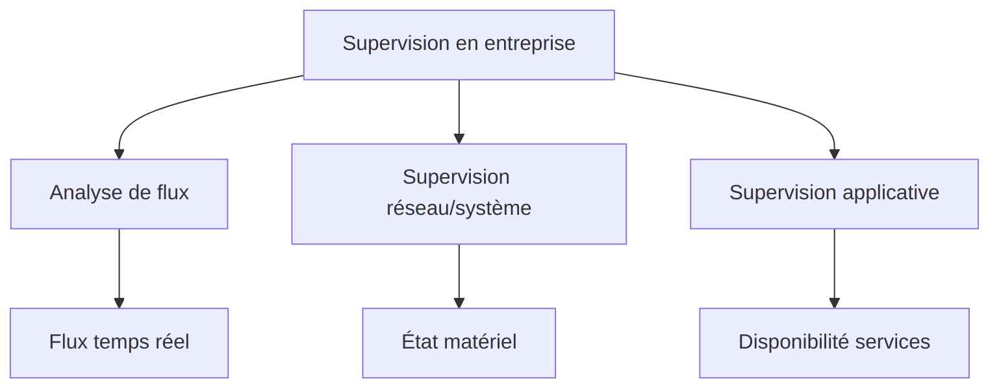

## Document de révision TSSR - Titre RNCP

---

**Formation** : Technicien Supérieur Systèmes et Réseaux (TSSR)

**Sujet** : La supervision réseau et système

**Date** : Février 2026

**Type** : Synthèse de cours complète

---

## 📋 Sommaire

1. [[#Introduction|Introduction]]
   - [[#C'est quoi donc ?|C'est quoi donc ?]]
   - [[#Pourquoi faire de la supervision ?|Pourquoi faire de la supervision ?]]
   - [[#L'utilité|L'utilité]]
   - [[#L'hypervision|L'hypervision]]
2. [[#Les protocoles|Les protocoles]]
   - [[#SNMP|SNMP]]
   - [[#MIB|MIB]]
   - [[#NetFlow|NetFlow]]
   - [[#Les autres protocoles|Les autres protocoles]]
3. [[#En entreprise|En entreprise]]
   - [[#Types de supervision|Types de supervision]]
   - [[#L'analyse de flux|L'analyse de flux]]
   - [[#Supervision réseau et système|Supervision réseau et système]]
   - [[#Supervision applicative|Supervision applicative]]
   - [[#Les logiciels|Les logiciels]]
4. [[#Points clés à retenir|Points clés à retenir]]
5. [[#Glossaire technique|Glossaire technique]]

---

## Introduction

> [!abstract] Vue d'ensemble
> La supervision est un ensemble de méthodes et d'outils permettant de surveiller à distance le bon fonctionnement d'un système, d'un réseau ou d'une activité. C'est un élément essentiel du maintien en condition opérationnelle (MCO) des infrastructures informatiques.

### C'est quoi donc ?

> [!quote] Définition générale
> D'un point de vue général, la supervision est la **surveillance du bon fonctionnement d'un système ou d'une activité**.

> [!info] Concept clé
> Dans une entité, il peut y avoir **plusieurs systèmes de supervision** qui peuvent se compléter et communiquer entre eux. Ils collectent les informations et donnent des indications sur le fonctionnement global.

### Pourquoi faire de la supervision ?

Les réseaux modernes interconnectent de multiples entités :
- Ordinateurs
- Smartphones
- Puces RFID
- Serveurs
- Équipements actifs (routeurs, switchs)

> [!important] Objectif principal
> La supervision permet, à l'aide de méthodes et d'outils, d'**observer à distance** ce qui se passe sur un réseau. Cela permet aux personnes en charge du **MCO (Maintien en Condition Opérationnelle)** d'agir à distance sur ces composants pour assurer le bon fonctionnement.

### L'utilité

> [!success] Les 5 piliers de la supervision
> La supervision est une aide à :
> 
> 1. **La détection** : pannes/incidents systèmes, services, historique
> 2. **La modification** : configuration, révision de documentation
> 3. **La disponibilité** : consommation de ressources, débit
> 4. **L'amélioration des performances** : suivi statistique
> 5. **La prévention** : activités suspectes

### L'hypervision

> [!quote] Définition
> L'**hypervision** est la centralisation des outils de supervision d'infrastructure, d'applications et de référentiels.

> [!info] Fonctionnement
> C'est un outil d'**agrégation** ou de **console unique**. Un seul système est requis, toutes les informations collectées remontent jusqu'à lui.

> [!tip] Avantage
> L'hypervision simplifie la gestion en centralisant toutes les remontées d'informations provenant de différents systèmes de supervision dans une interface unique.

---

## Les protocoles

> [!abstract] Introduction aux protocoles de supervision
> Plusieurs protocoles sont utilisés pour collecter et transmettre les informations de supervision. Chaque protocole a un rôle spécifique dans l'écosystème de la surveillance réseau.

### SNMP

> [!quote] Définition
> **SNMP** (Simple Network Management Protocol) est un protocole standard de supervision réseau.

#### Opérations de base

> [!info] Les 3 opérations principales

| Opération | Description | Usage |
|-----------|-------------|-------|
| **GET** | Demande des informations à un agent SNMP | Requête de données (état interface, CPU, etc.) |
| **SET** | Modifie la configuration ou le comportement d'un dispositif réseau | Configuration de ports, paramètres |
| **TRAP** | Signalement d'événements spéciaux | Alertes automatiques (panne, seuil dépassé) |

> [!important] Evolution sécuritaire
> **SNMPv3** offre une sécurité améliorée par rapport aux versions précédentes (authentification, chiffrement).

#### Usage principal

- Surveillance de la santé des dispositifs
- Monitoring de la performance réseau
- Collecte de statistiques en temps réel

> [!example] Exemple concret
> Un serveur de supervision interroge via SNMP (GET) un switch toutes les 5 minutes pour connaître le taux d'utilisation de ses interfaces. Si un port dépasse 90% d'utilisation, le switch peut envoyer un TRAP pour alerter l'administrateur.

### MIB

> [!quote] Définition
> **MIB** (Management Information Base) est une base de données contenue sur chaque équipement où sont stockés l'ensemble des informations que l'équipement peut envoyer.

> [!info] Fonctionnement
> La MIB est interrogée par un serveur de supervision. Elle est présentée sous forme d'une **arborescence** où chaque nœud est un identifiant appelé **OID** (Object Identifier).

> [!important] Caractéristique des OID
> L'**OID** (Object Identifier) est **unique et universel**. Il permet d'identifier précisément chaque élément interrogeable sur un équipement.

> [!example] Structure d'un OID
> Un OID est représenté sous forme de suite de nombres séparés par des points :
> - `1.3.6.1.2.1.1.1.0` : Description système
> - `1.3.6.1.2.1.2.2.1.10` : Octets entrants sur une interface
> 
> Cette structure hiérarchique permet une organisation logique des informations.

> [!note] Note technique
> Il existe des MIBs standard (définies par l'IETF) et des MIBs propriétaires (spécifiques à un constructeur comme Cisco, HP, etc.).

### NetFlow

> [!quote] Définition
> **NetFlow** est un protocole développé par **Cisco** pour collecter des informations sur le trafic IP circulant à travers les routeurs et les commutateurs.

> [!warning] Protocole propriétaire
> NetFlow est un protocole **propriétaire Cisco**, bien que des alternatives open source existent (sFlow, IPFIX).

> [!info] Utilité
> NetFlow permet de :
> - Analyser les flux réseau en détail
> - Identifier les sources de trafic
> - Détecter les anomalies de consommation de bande passante
> - Effectuer de la facturation basée sur l'utilisation

### Les autres protocoles

> [!note] Protocoles complémentaires
> Tous ces protocoles sont utilisés **conjointement** par les logiciels de supervision pour avoir le maximum d'information sur une infrastructure réseau.

| Protocole | Description | Usage en supervision |
|-----------|-------------|---------------------|
| **ICMP** | Internet Control Message Protocol | Test de disponibilité (ping), diagnostic réseau |
| **WMI** | Windows Management Instrumentation | Supervision des systèmes Windows |
| **Syslog** | Système de journalisation | Collecte centralisée des logs |

> [!tip] Approche multi-protocole
> Une supervision efficace utilise plusieurs protocoles en parallèle pour avoir une vision complète : SNMP pour les métriques, Syslog pour les événements, ICMP pour la disponibilité, etc.

---

## En entreprise

> [!abstract] La supervision en environnement professionnel
> En entreprise, la supervision se décline en plusieurs types complémentaires, chacun apportant une vue spécifique sur l'infrastructure.

### Types de supervision

> [!important] Les 3 types principaux

1. **Analyse de flux** : Connaissance de l'activité en temps réel
2. **Supervision réseau** : Surveillance du fonctionnement des matériels
3. **Supervision applicative** : Surveillance des services et applications

### L'analyse de flux

> [!quote] Définition
> L'analyse de flux consiste à connaître l'**activité en temps réel** sur un réseau.

#### Objectifs

> [!important] Objectifs principaux
> - **Identifier les liaisons saturées** : Détecter les goulets d'étranglement
> - **Identifier l'origine** de la sur-utilisation des ressources

#### Outils

> [!info] Les sondes et sniffeurs
> Les outils utilisés sont appelés des **sondes** ou **sniffeurs** (Wireshark, tcpdump, etc.).

#### Résultats

> [!note] Format des résultats
> Le résultat peut être sous forme de :
> - **Statistiques** : Nombre de paquets, volume de données
> - **Pourcentages** : Taux d'utilisation de la bande passante
> 
> Ces données aident les gestionnaires de réseaux à prendre des décisions (upgrade de liens, QoS, etc.).

> [!example] Cas d'usage
> Un sniffeur détecte que 80% du trafic sur un lien provient de flux vidéo non professionnels. Le gestionnaire peut alors mettre en place une politique de QoS pour prioriser le trafic métier.

### Supervision réseau et système

> [!quote] Définition
> C'est la surveillance du fonctionnement des **matériels**, des **débits**, etc.

#### Méthodes

> [!info] Méthodes de collecte
> Elle est effectuée à l'aide de :
> - **Protocole SNMP** (Simple Network Management Protocol)
> - **Agents installés** sur les clients

#### Fonctionnement

> [!important] Architecture de supervision

**Principe de base :**

1. Un **serveur central** communique avec tous les équipements et serveurs
2. Les **paramètres remontés** sont multiples :
   - Température des équipements
   - État des interfaces réseau
   - État des ports
   - Taux d'utilisation CPU
   - Utilisation mémoire
   - Espace disque
3. Toutes les **remontées SNMP** émises par les éléments actifs ou serveurs supervisés sont collectées
4. L'environnement est très souvent **graphique** et en **temps réel**

| Élément supervisé | Métriques courantes |
|-------------------|---------------------|
| **Switch/Routeur** | État ports, taux d'utilisation, température, ventilateurs |
| **Serveur** | CPU, RAM, disques, services, température |
| **Firewall** | Connexions actives, règles déclenchées, CPU |
| **Lien réseau** | Bande passante utilisée, latence, perte de paquets |

> [!tip] Visualisation
> Les tableaux de bord (dashboards) affichent généralement des graphiques en temps réel avec des courbes de tendance, permettant d'anticiper les problèmes avant qu'ils ne surviennent.

### Supervision applicative

> [!quote] Définition
> La supervision applicative permet de remonter les informations sur la **disponibilité de services** en complément de l'état du réseau.

#### Différence fondamentale

> [!important] Point de vue utilisateur
> À la différence des autres types de supervision, on se place du **point de vue de l'utilisateur final**.

#### Principe

> [!info] Au-delà du réseau
> Cette supervision permet de voir l'**état d'un service**. En effet, même si tous les liens réseau sont en bon état de fonctionnement, le programme responsable d'un service peut en revanche être interrompu ou perturbé.

> [!warning] Limitation de SNMP
> **SNMP ne permet pas de savoir**, par exemple :
> - Si le service FTP est ouvert et fonctionnel
> - Si le serveur web renvoie bien la page attendue
> - Si la base de données répond correctement aux requêtes
> - Si l'application métier est accessible

> [!example] Exemple concret
> Un serveur web est en ligne, le réseau fonctionne, mais le service Apache est crashé. SNMP verra le serveur "UP", mais la supervision applicative détectera que le port 80/443 ne répond pas et que la page web n'est pas accessible.

> [!note] Complémentarité
> La supervision applicative est un **doublon des logs** et vient compléter la supervision réseau pour avoir une vision complète de la disponibilité des services.

### Les logiciels

> [!abstract] Panorama des solutions de supervision

#### Solutions propriétaires

> [!info] Logiciels commerciaux

| Logiciel | Caractéristiques |
|----------|------------------|
| **SolarWinds** | Suite complète, très utilisée en entreprise, riche en fonctionnalités |
| **PRTG** | Solution tout-en-un, interface intuitive, modèle de licence par capteur |
| **NextThink** | Focus sur l'expérience utilisateur et l'analyse comportementale |

> [!tip] Avantages du propriétaire
> - Support professionnel
> - Interfaces polies et intuitives
> - Fonctionnalités avancées prêtes à l'emploi
> - Documentation complète

#### Solutions libres

> [!info] Logiciels open source

| Logiciel | Caractéristiques |
|----------|------------------|
| **Nagios** | Historique et robuste, très personnalisable, large communauté |
| **Zabbix** | Moderne, interface web complète, très scalable |

> [!success] Avantages du libre
> - Coût : gratuit (hors support et formation)
> - Personnalisable à l'infini
> - Communauté active
> - Pas de limitation de licences

> [!note] Autres solutions libres populaires
> - **Centreon** : Basé sur Nagios, interface française
> - **Prometheus + Grafana** : Monitoring moderne orienté DevOps
> - **Icinga** : Fork de Nagios
> - **LibreNMS** : Spécialisé SNMP

> [!warning] Choix de la solution
> Le choix entre propriétaire et libre dépend de :
> - Budget disponible
> - Compétences de l'équipe
> - Taille de l'infrastructure
> - Besoins spécifiques (SLA, support, etc.)

---

## Points clés à retenir

> [!success] Synthèse pour le titre RNCP

### Concepts fondamentaux

- **Supervision** = Surveillance à distance du bon fonctionnement d'un système/réseau
- **MCO** (Maintien en Condition Opérationnelle) : objectif principal de la supervision
- **Hypervision** = Centralisation de plusieurs systèmes de supervision en une console unique
- La supervision aide à : détection, modification, disponibilité, amélioration, prévention

### Protocoles essentiels

- **SNMP** : Protocole standard avec 3 opérations (GET, SET, TRAP)
- **SNMPv3** : Version sécurisée du protocole
- **MIB** : Base de données d'informations sur chaque équipement
- **OID** : Identifiant unique et universel dans la MIB
- **NetFlow** : Protocole Cisco pour l'analyse de flux IP
- **Complémentaires** : ICMP (ping), WMI (Windows), Syslog (logs)

### Types de supervision

- **Analyse de flux** : Activité temps réel, identification saturations
- **Supervision réseau/système** : État matériel, métriques (CPU, RAM, température)
- **Supervision applicative** : Disponibilité services du point de vue utilisateur

### Architecture technique

- **Serveur central** communique avec tous les équipements
- **Agents** installés sur les clients
- Remontées via **SNMP**, **agents**, **sondes**
- Interface **graphique temps réel**

### Solutions logicielles

- **Propriétaires** : SolarWinds, PRTG, NextThink
- **Libres** : Nagios, Zabbix, Centreon, Prometheus

### Mnémotechnique

**SNMP = 3 actions GST** :
- **G**ET : je demande
- **S**ET : je modifie
- **T**RAP : j'alerte

**Les 5 D de la supervision** :
- **D**étection
- **D**ocumentation (modification)
- **D**isponibilité
- **D**éveloppement (amélioration)
- **D**éfense (prévention)

---

## Glossaire technique

> [!note] Définitions essentielles pour le TSSR

| Terme | Définition |
|-------|------------|
| **Supervision** | Surveillance à distance du bon fonctionnement d'un système ou réseau |
| **Hypervision** | Centralisation de plusieurs outils de supervision en une console unique |
| **MCO** | Maintien en Condition Opérationnelle - ensemble des actions pour garantir la disponibilité |
| **SNMP** | Simple Network Management Protocol - protocole standard de supervision |
| **MIB** | Management Information Base - base de données d'informations sur un équipement |
| **OID** | Object Identifier - identifiant unique dans une MIB |
| **GET** | Opération SNMP pour demander des informations |
| **SET** | Opération SNMP pour modifier une configuration |
| **TRAP** | Opération SNMP pour signaler un événement (alerte) |
| **NetFlow** | Protocole Cisco pour la collecte d'informations sur les flux IP |
| **Agent** | Logiciel installé sur un équipement pour collecter et transmettre des informations |
| **Sonde** | Outil d'analyse de flux réseau (sniffer) |
| **Sniffeur** | Logiciel de capture et d'analyse de paquets réseau |
| **Dashboard** | Tableau de bord graphique affichant les métriques de supervision |
| **Syslog** | Protocole standard de journalisation des événements système |
| **ICMP** | Internet Control Message Protocol - utilisé pour ping et diagnostics |
| **WMI** | Windows Management Instrumentation - technologie Microsoft de supervision |
| **Métriques** | Mesures collectées (CPU, RAM, bande passante, température, etc.) |
| **Disponibilité** | Pourcentage de temps où un service/système est opérationnel |
| **SLA** | Service Level Agreement - accord sur le niveau de service garanti |

---

> [!success] Document de révision complet
> Ce document couvre l'intégralité du cours sur la supervision. Utilisez les liens internes pour naviguer rapidement entre les sections et les callouts pour identifier les informations critiques pour votre titre RNCP TSSR.

> [!tip] Conseil de révision
> 1. Commencez par lire l'introduction pour comprendre les concepts
> 2. Approfondissez les protocoles (SNMP/MIB sont essentiels)
> 3. Étudiez les différents types de supervision et leurs différences
> 4. Mémorisez le glossaire technique
> 5. Révisez régulièrement les "Points clés à retenir"

---

**Fin du document de révision** - Bonne préparation pour le titre RNCP ! 🎯📚
